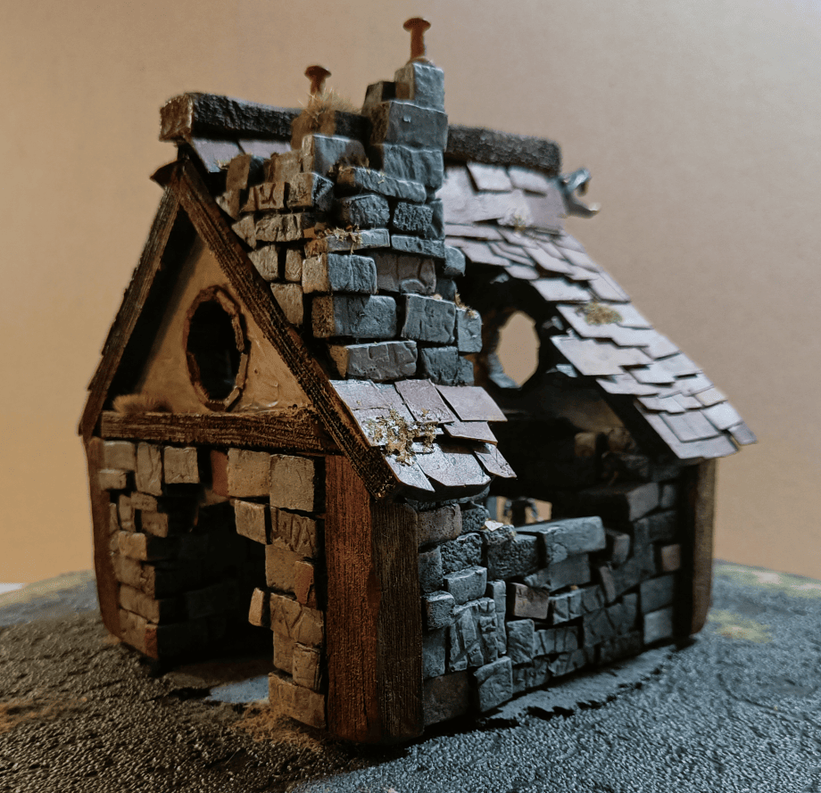
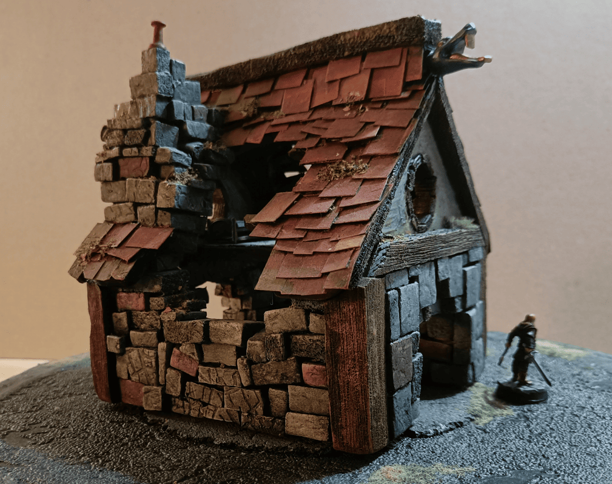
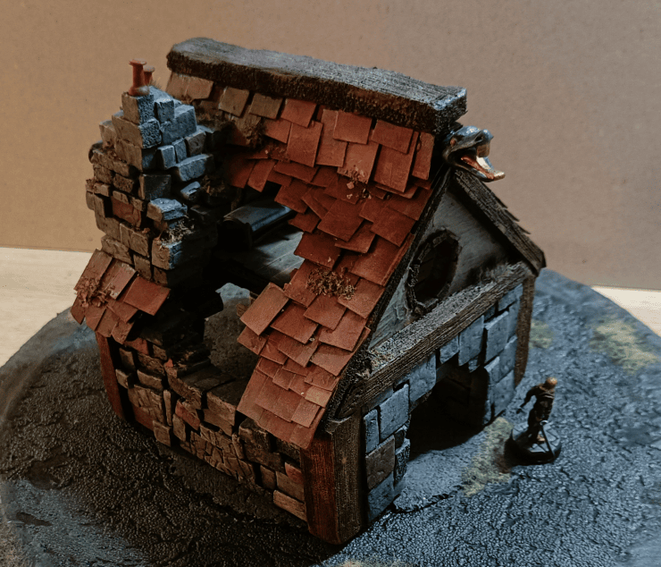
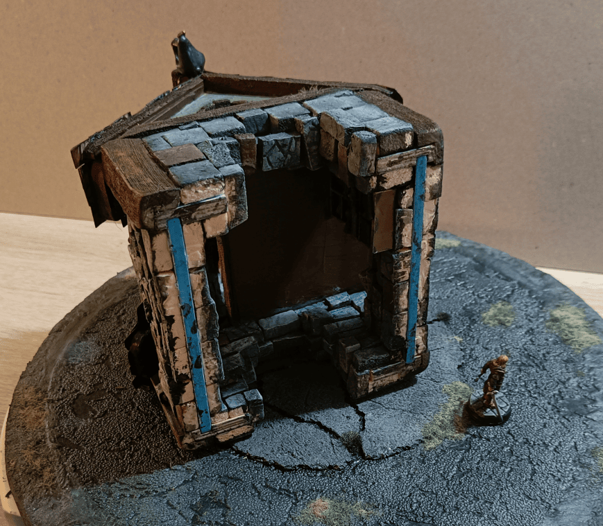
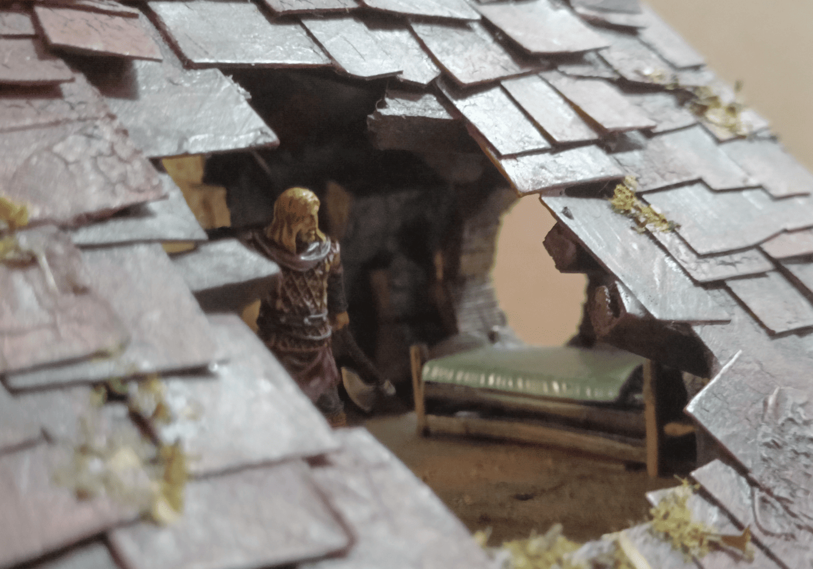
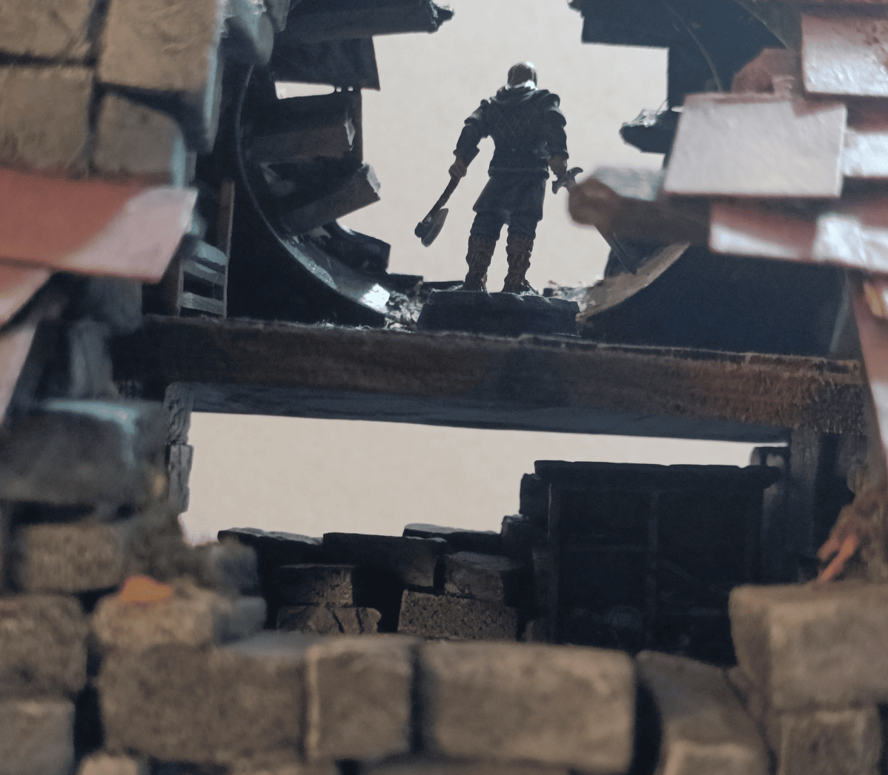
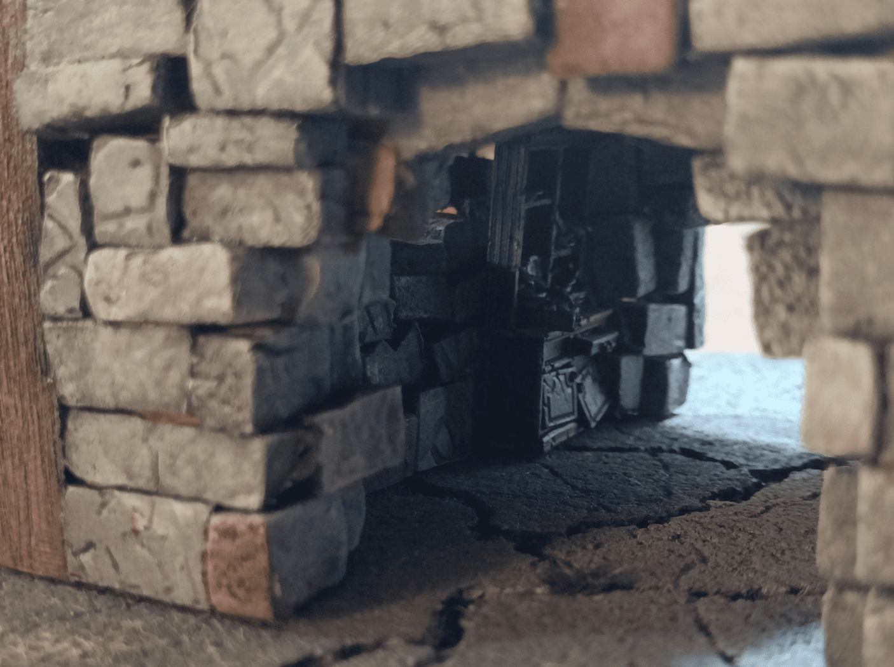

I think I already posted an article on this blog explaining how I made this house. It's one of the very first projects I did. That post has quite a few beauty shot photos of the house itself.

So if you look at the underside, the main structure is actually a wooden toy my daughter used to play with when she was little. Instead of throwing it away when she outgrew it, I just glued bricks all around it - both on the ground floor and upstairs. Then I added wood pieces made of foam in different spots, and put tiles on the roof.

It was a great way to practice all the basic techniques I learned from watching Black Magic Craft and other YouTube creators. Really helped me nail down the fundamentals by starting with an existing frame instead of building from scratch.

The original building has that hole in the roof which makes it easy for children to catch the toy. I found that it was perfect for Mordheim to symbolize a house that was destroyed, potentially by a meteorite impact.