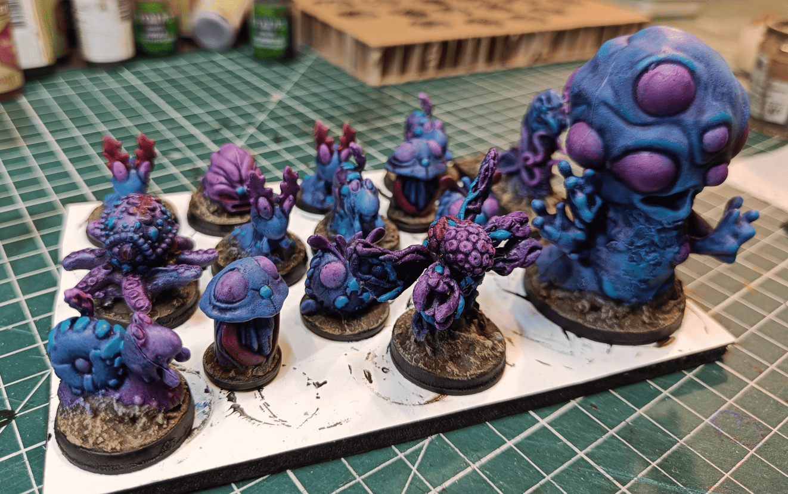
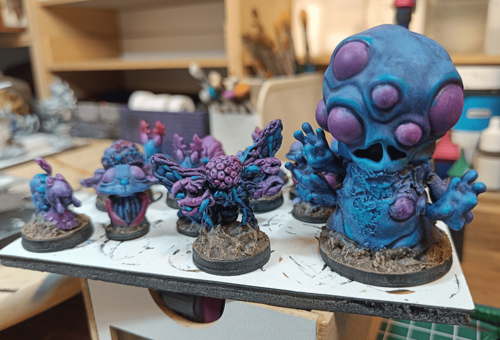

Quick update on a monster painting project I finished last year. 

I like to paint my monsters in batches of 10-12 at a time so they look cohesive with matching color schemes. For this group, I grabbed a bunch of really weird and bizarre miniature and painted them as otherworldly creatures. Think creatures from The Great Beyond in Pathfinder - that kind of vibe.

I went with blue and purple as the main colors, with a little touch of red here and there.

The big creature on the right is a plastic toy. Normally those pustules are eyes - I think it's from a movie or cartoon but I'm not sure exactly what. I thought it would look pretty cool once repainted like this.

The figurine in the middle that looks like some kind of butterfly is actually metal. No idea where it's from, but honestly it looks really poorly sculpted. Doesn't seem like it was made by a professional - more like what someone without great sculpting skills would create.

Behind those, there are quite a few little Pokémon figurines that I repainted in different colors to make them look like creatures from the Great Beyond. I have absolutely no experience with Pokémon though, so I have no clue what they're normally supposed to represent.

