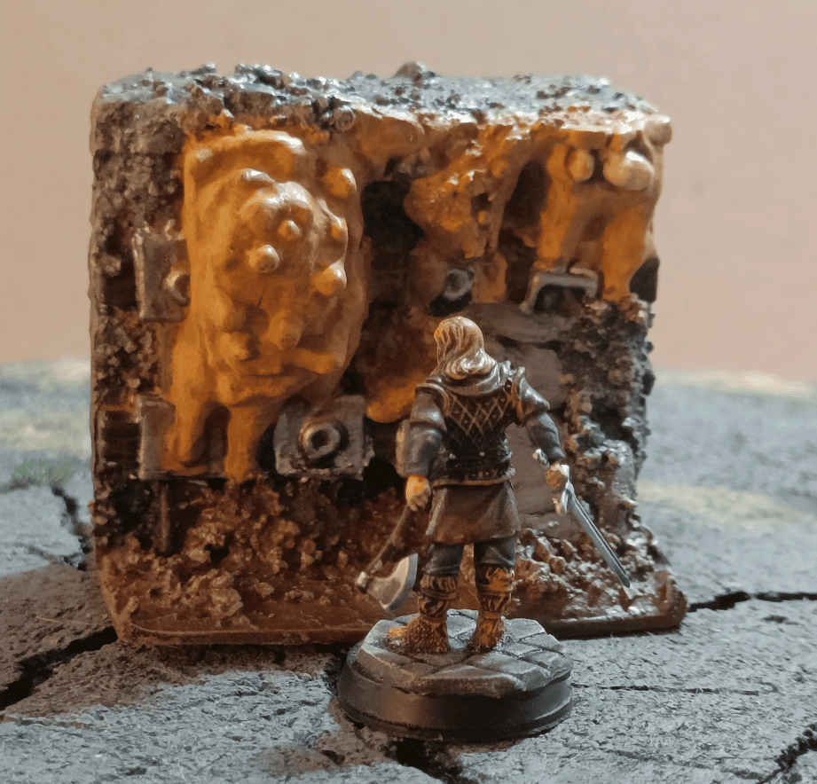
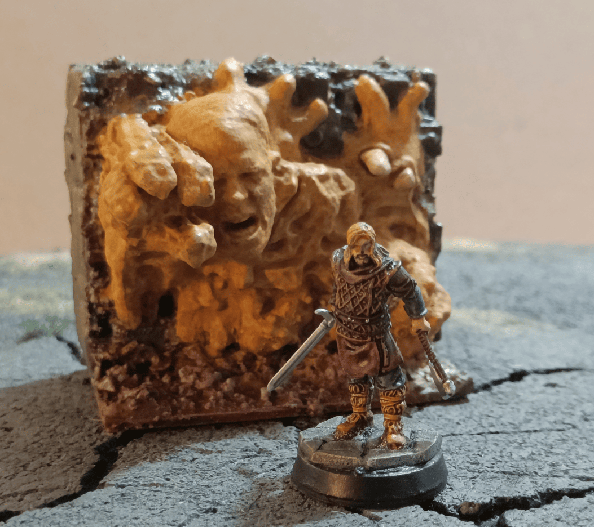
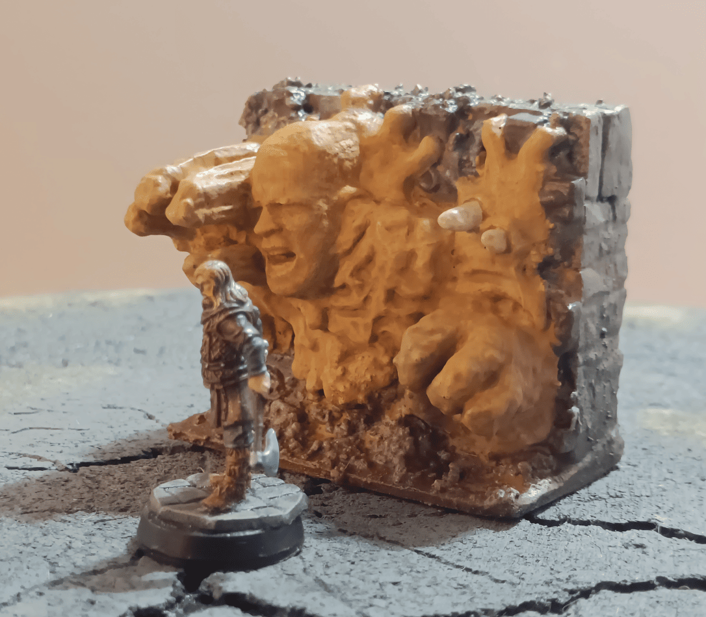
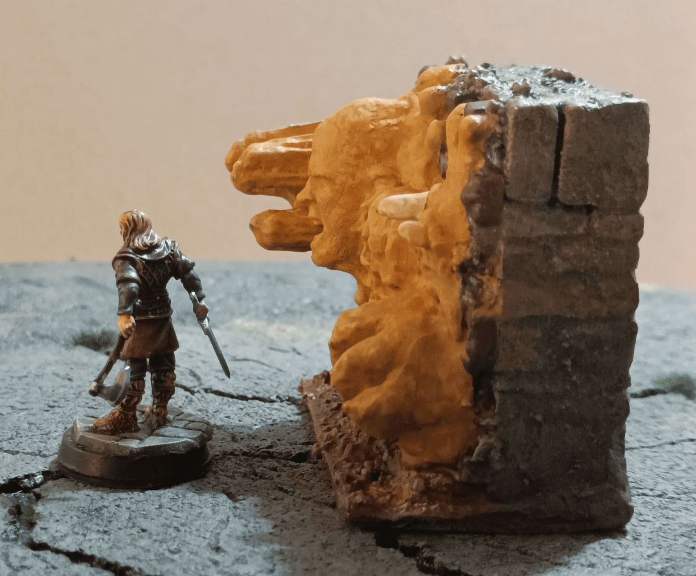
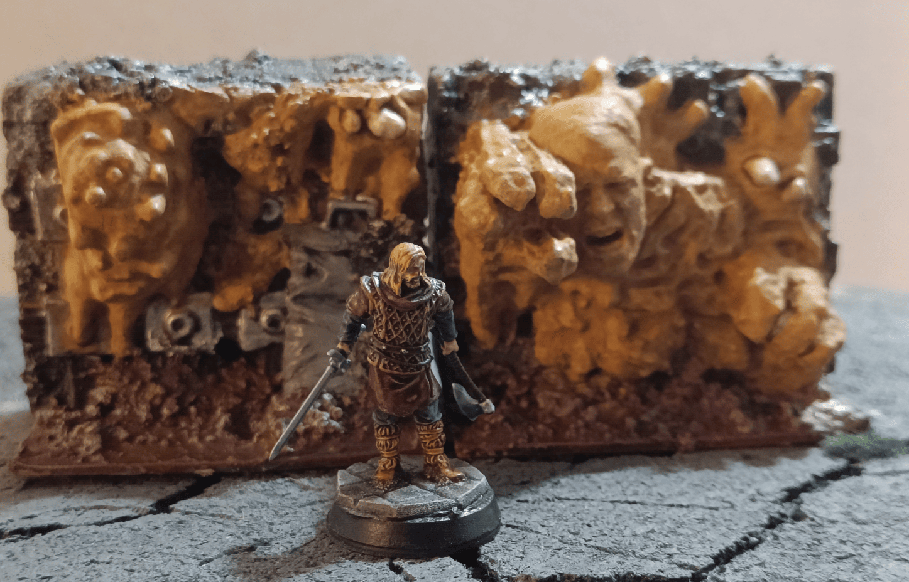

In my asylum scenario, at one point the players find a closed door. They're told not to go to the other side because there's this weird sludge on the door itself. There's even an eye in the middle that's crying. This turns into an encounter against this door that they have to break through to get to the other side.

At first I didn't think to make a specific terrain for that, but I actually had this piece in my bits box that ended up being perfect for it. So I mounted it on a wall and painted it.

There's a second version with this face and this big hand that comes out of it. When the door starts to animate, the wall progressively advances and is ready to completely engulf the players.

Here are a few additional photos so you can really see it from all angles. It gives the impression that the wall is advancing to try to catch the characters.

Here's a picture showing the two versions of the wall. They normally stack on top of each other with the head at the top. At the bottom, the protrusion is supposed to be a knee sticking out, I think. I'm not sure which game or toy this figure originally came from.

