This is the second post documenting how I made the different tiles for my asylum terrain. The technique is similar to [the first batch](../asylumFloorTiles/), but more refined since I'm now working on the larger rooms rather than the small corridors.

<!-- 1 -->

I love this intro shot: looks like I just pulled a cake out of the oven!

<!-- 2 -->

Here I cut the room dimensions out of cardboard first.

<!-- 3 -->
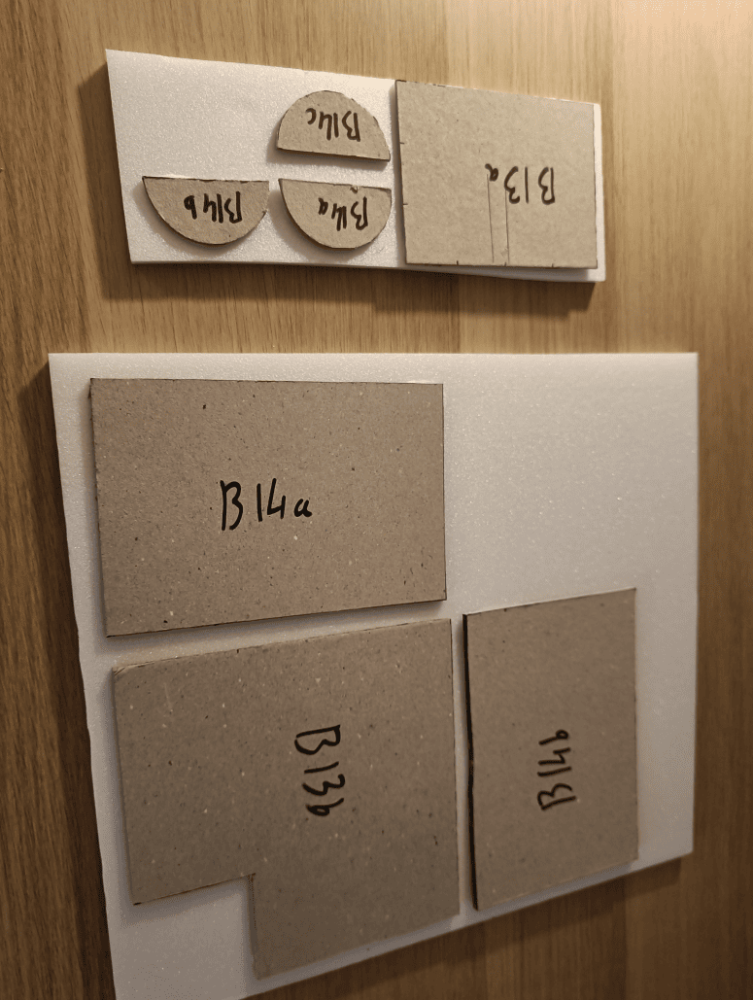

Then I glue the cardboard templates onto foam boards. This way I just need to cut around the cardboard and the foam is already perfectly attached. No need to measure twice.

<!-- 4 -->
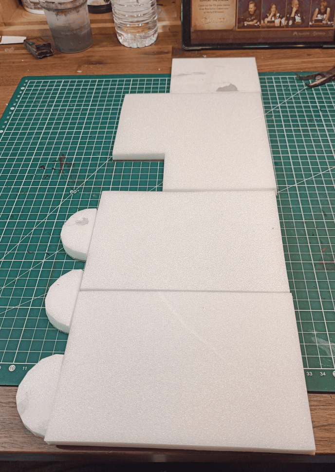

Test fitting everything together to see what I get.

<!-- 5 -->

I started tracing lines for the individual tiles, then tilted my cutter slightly to emboss between each tile.

<!-- 6 -->
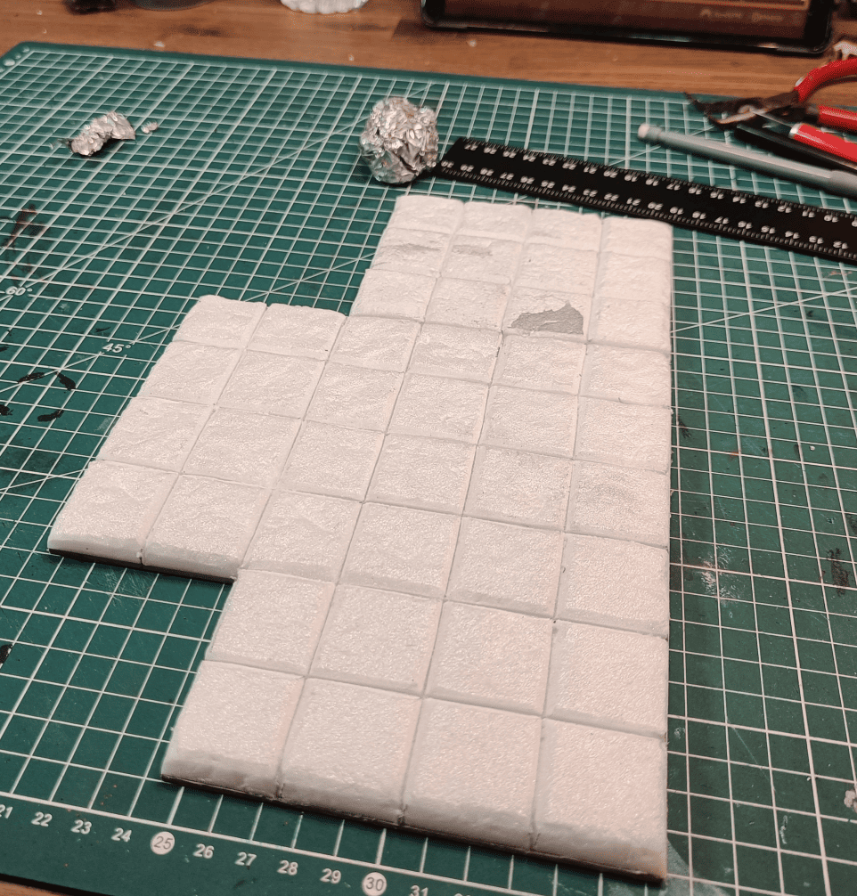

Rolling an aluminum foil ball over the surface to create a stone texture.

<!-- 7 -->
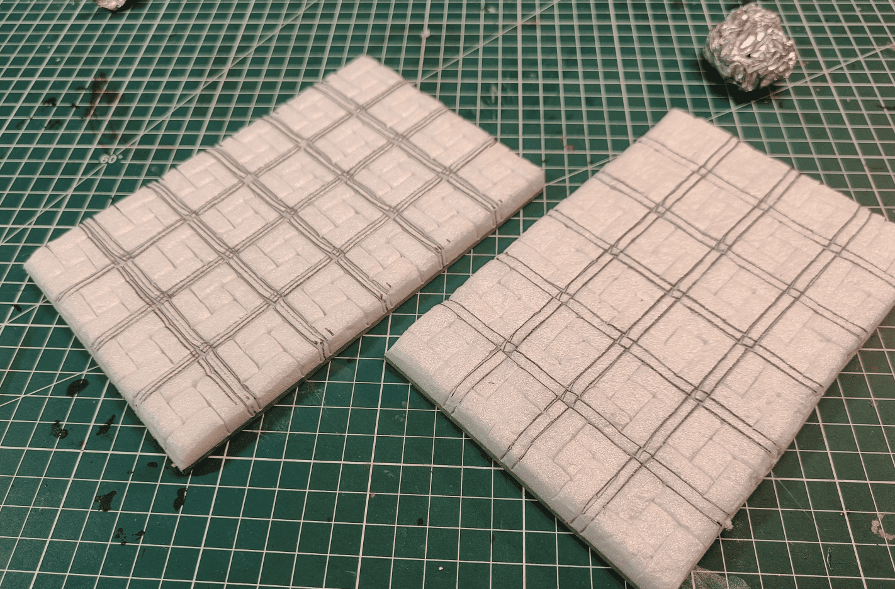

For these tiles I wanted something different, so I tried making complicated patterns. Spent a lot of time on this for not much payoff since it doesn't show well in the end.

<!-- 8 -->

Continuing the pattern. I like the idea of interlocking bricks with this offset, might reuse that elsewhere, but the crossing lines are too complex and don't add much.

<!-- 9 -->

The chapel is their safe zone where they can sleep properly and meet all the NPCs. Making sure everything fits correctly.

<!-- 10 -->

Started making the floor tiles. My lines weren't always straight but I tried to correct that later.

<!-- 11 -->

These are the two small sections for the sides. I decided not to glue them directly to the main structure so I can reuse the middle 6x6 tile in other encounters.

<!-- 12 -->

Rolled the aluminum foil ball all over.

<!-- 13 -->

Painted black. Now I can start adding colors. I took photos of the paint tubes I wanted to use so I'd remember my plan if I had to stop mid-session.

<!-- 14 -->
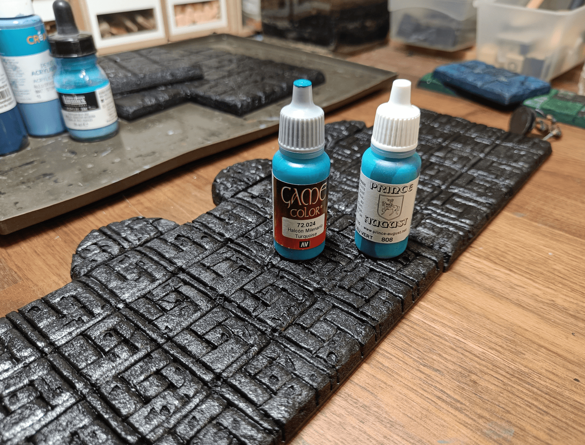

For the other room I wanted to go with blue tones.

<!-- 16 -->
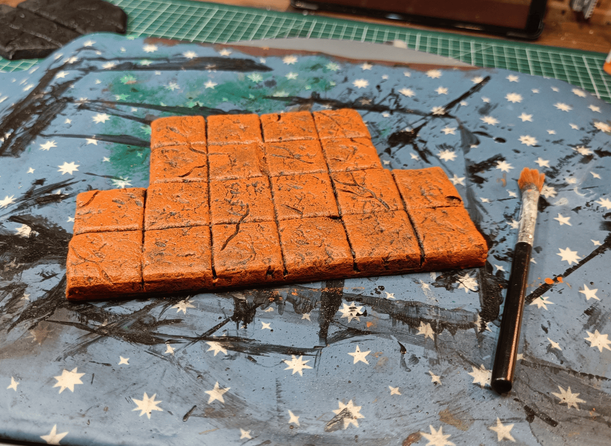

First overbrush layer with bright orange. This is where you really need to trust the process because it looks too weird.

<!-- 17 -->
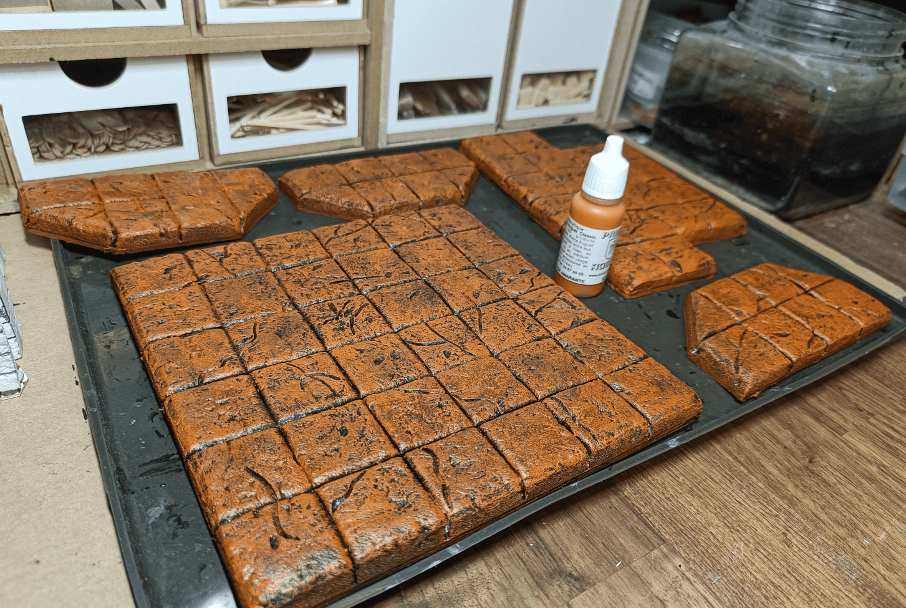

After an additional drybrush on top, it's starting to look like something. I'm happy with this.

<!-- 19 -->

Same principle but on the blue room. Started with very bright turquoise.

<!-- 21 -->
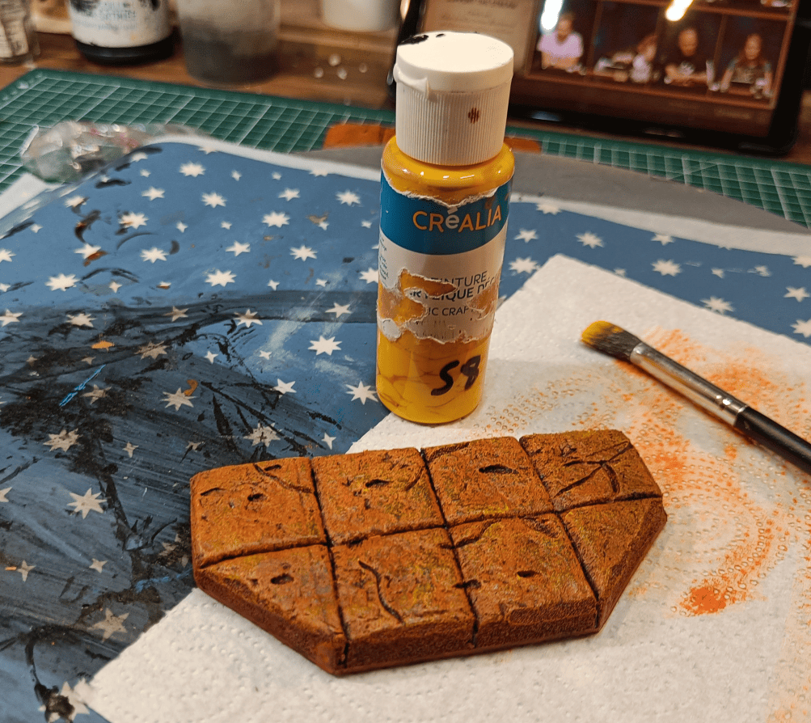

Another lighter drybrush to create multiple levels of relief, this time with yellow directly.

<!-- 22 -->

Where I'm at now. Each room really has its own color and I'm quite happy with the result at this stage.

<!-- 23 -->

I don't remember exactly how I did this, but I managed to give slightly different tints to each tile. Possibly did a huge cream-colored drybrush over everything to soften the colors, then maybe added slightly diluted oils on certain tiles to give them different colors.

<!-- 24 -->

I think I did another drybrush on top to reunify everything.

<!-- 25 -->

My other room - you can really see I overdid it. It's way too busy. The pattern is complicated, the crossing lines are complicated, and the way I tried to damage the tiles by removing chunks looks ugly. This didn't work at all.

<!-- 26 -->

Still my favorite "cake" shot. It really makes you want to eat it. Very happy with how this turned out. I think I could reuse this for pharaoh or Sahara themes. I can see this in a tomb.

<!-- 27 -->

Giving an idea of scale. Checking that the miniature fits properly.

<!-- 28 -->

Another angle with better lighting. Yes, I'm happy with how this turned out. Looks really good.

<!-- 29 -->
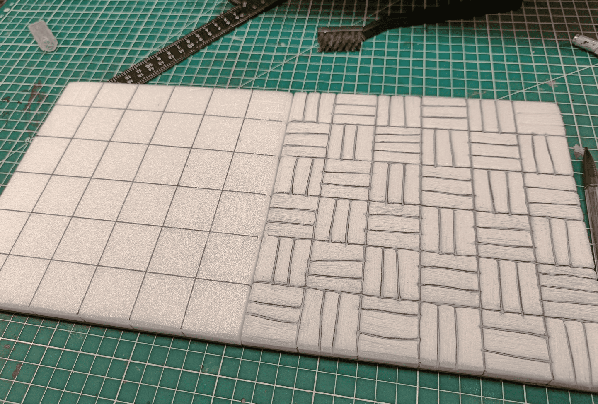

Starting on the large tiles that are more like floorboards.

<!-- 30 -->

Showing the different versions. Far left, I just did an overbrush of dark brown. Middle, I added a light brown drybrush on top. Far right, another even lighter brown drybrush.

<!-- 31 -->
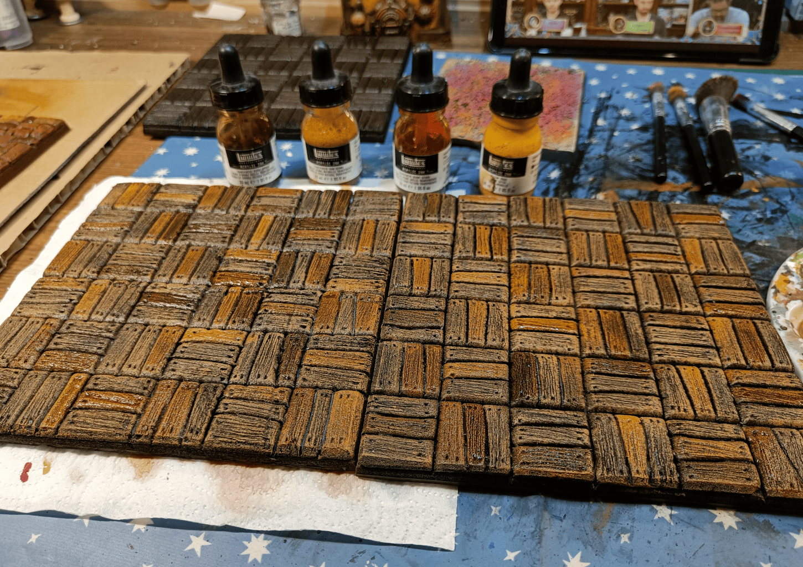

Added different acrylic inks to color and give slightly different tints to each board. On each square, I selected one or two boards max to give a slightly different color so it's not too uniform.

<!-- 32 -->

After applying an oil wash on top to unify everything and give a slightly weathered look.

<!-- 33 -->
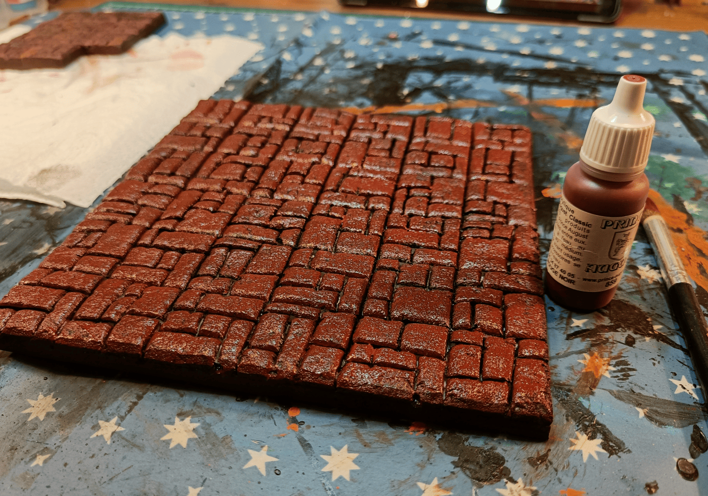

Moving to another room, the red side with quite strong red.

<!-- 34 -->

For these pieces I wanted to go a bit purple.

<!-- 35 -->
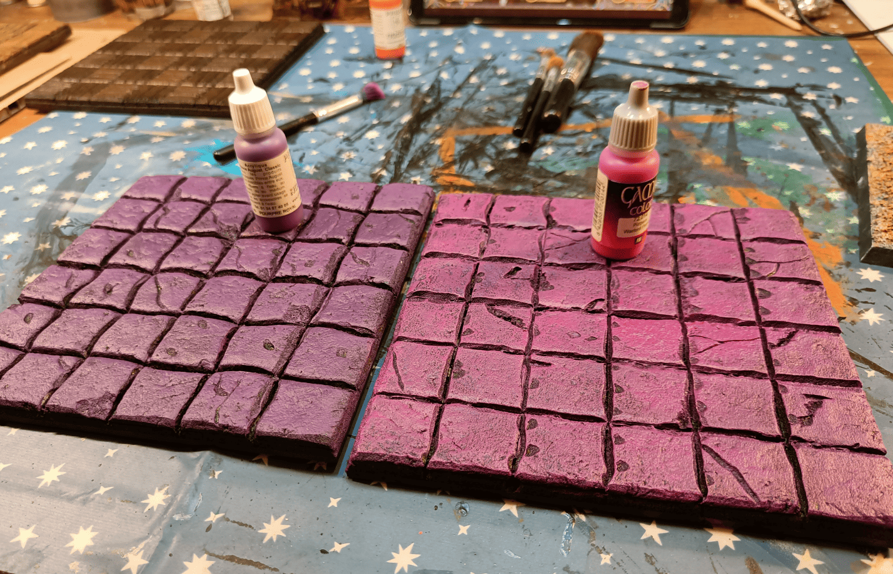

Adding an additional pink drybrush. I'm starting to use really vivid colors because I know they'll be toned down by the wash later.

<!-- 36 -->

Same thing - I reused different inks, purple and blue, to slightly change the color of some tiles compared to others.

<!-- 37 -->

Applying a wash on top, a bit brown to darken it slightly.

<!-- 38 -->

Orange drybrush on my tile that was initially very red.

<!-- 39 -->

Again using acrylic inks to slightly modify the tint of some stones on the tiles to make it less uniform.

<!-- 40 -->
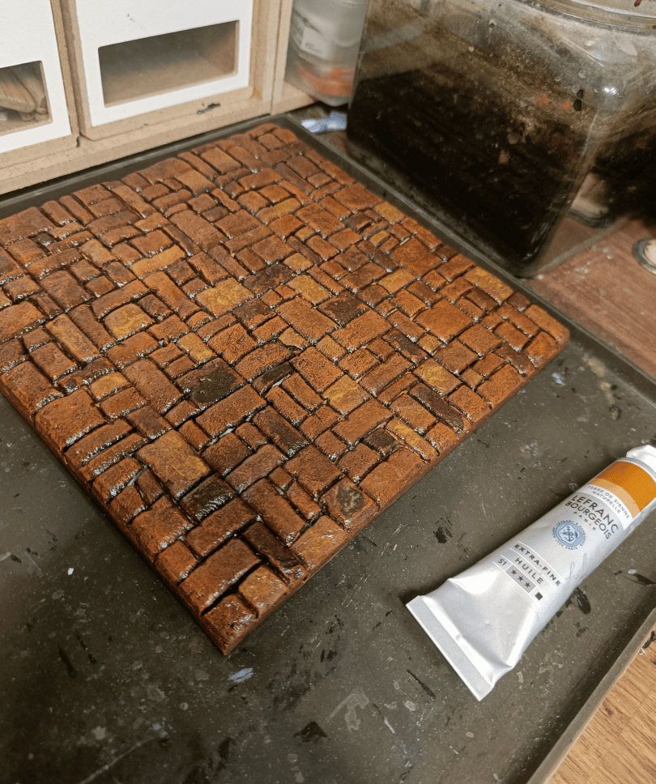

After the oil wash has been applied on top.

<!-- 41 -->
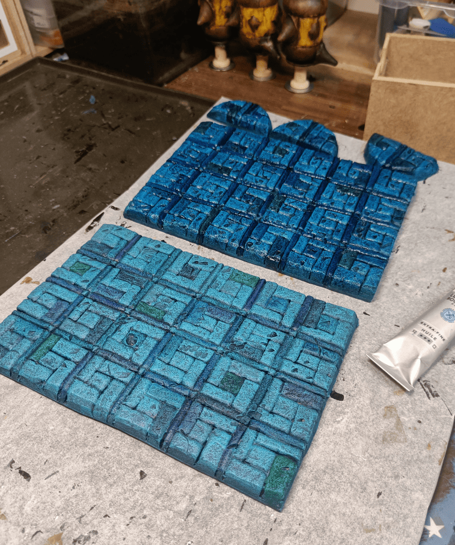

Still the one I like least.

<!-- 42 -->

Trying to salvage this with a drybrush, but it masks everything and you can't really tell what it is. Don't think I'll be able to save these tiles. They look like the bottom of a swimming pool. Definitely not what I was aiming for.

The takeaway from all this: keep it simple. Most tiles turned out well, but the lesson is don't make patterns too complicated. Bold color choices can be enough on their own.

I'm glad I documented the different steps because it's really full of very simple small steps, lots of layers that we add but which ultimately allow for a very good result.

Really don't hesitate to properly sculpt the foam and add the stone effects with the aluminum ball. What I generally do is I start by tracing with a pencil where the cuts should be. Then with a cutter I go over it and with the tip of my mechanical pencil I widen the borders. I go in one direction then in the other.

Then I roll the aluminum ball to give texture but it tends to bring the pieces of foam closer together, the ones that I had previously separated. So I go over again with the mechanical pencil. I tried skipping the step before, or after, but really best results are obtained when you do the aluminium ball before and after widening the gaps.

Once this texture is done we put the layer of black paint and glue and then we do an overbrush with the main color. Then we do a dry brush with the secondary color. Then we're going to give a slightly different tint to certain elements with colors that are close to the main color. So if we do something in red we're going to tint certain areas a little bit in orange or a little bit in yellow, a little bit in brown, things that are similar.

Then we're going to do a wash with oil paint over it with the color that will unify all that. And then only then we're going to do a dry brush again with the same color as initially. And all that allows to bind everything while making a little bit of difference.

