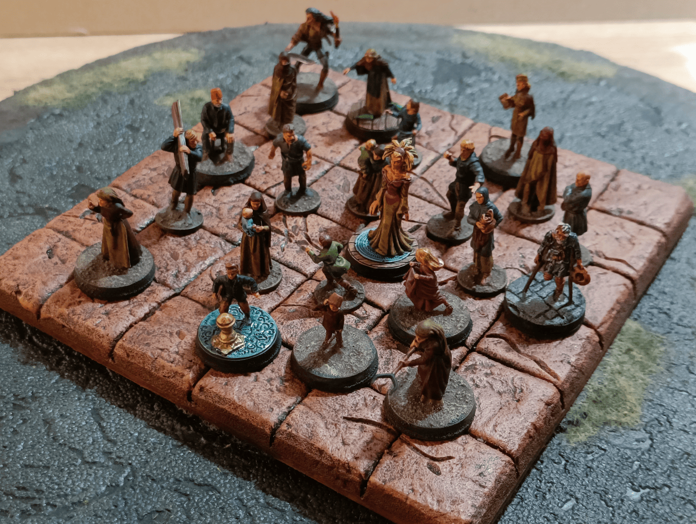
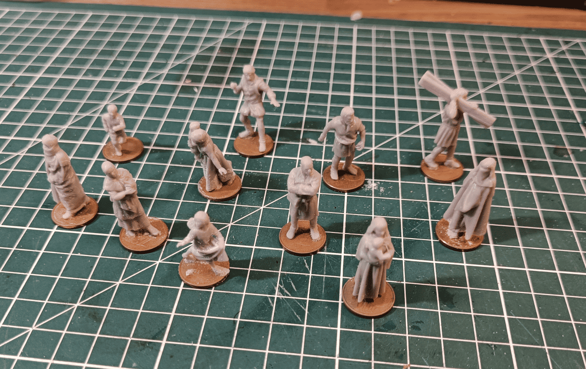
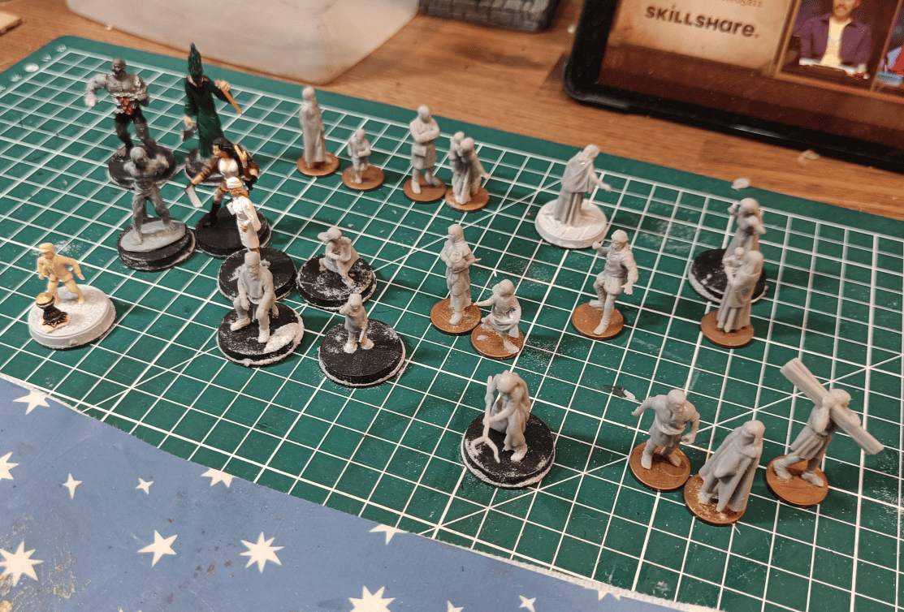
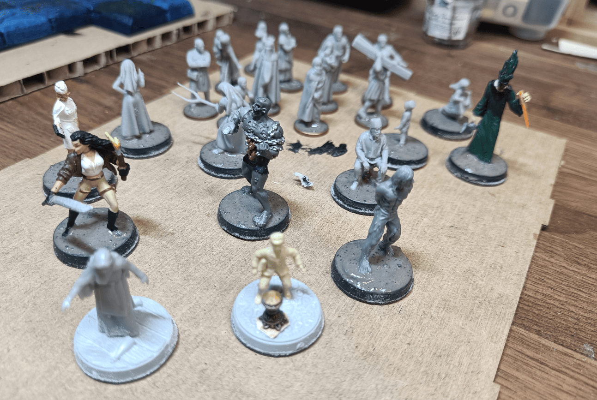
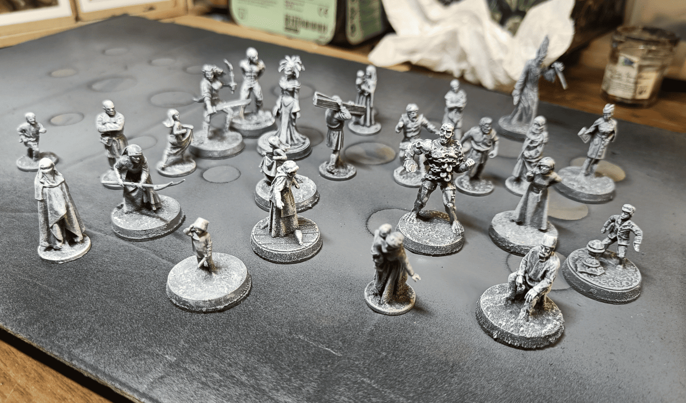
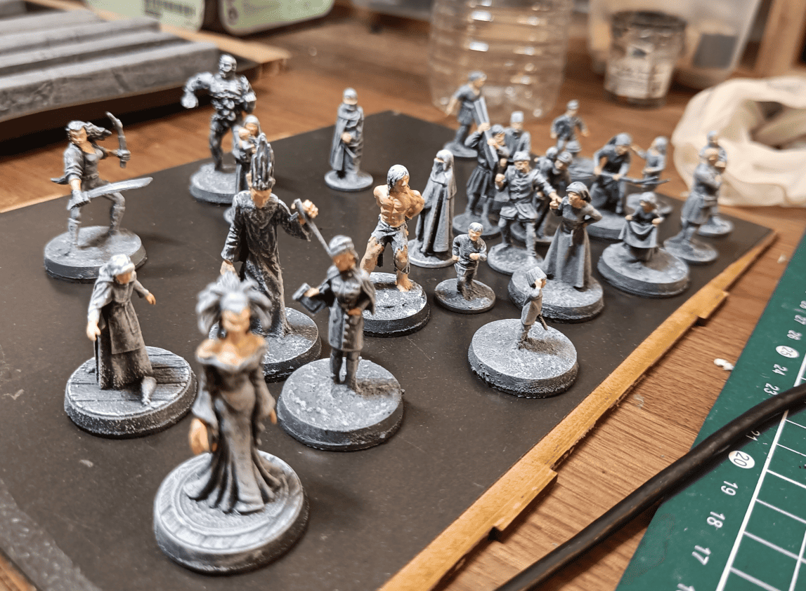
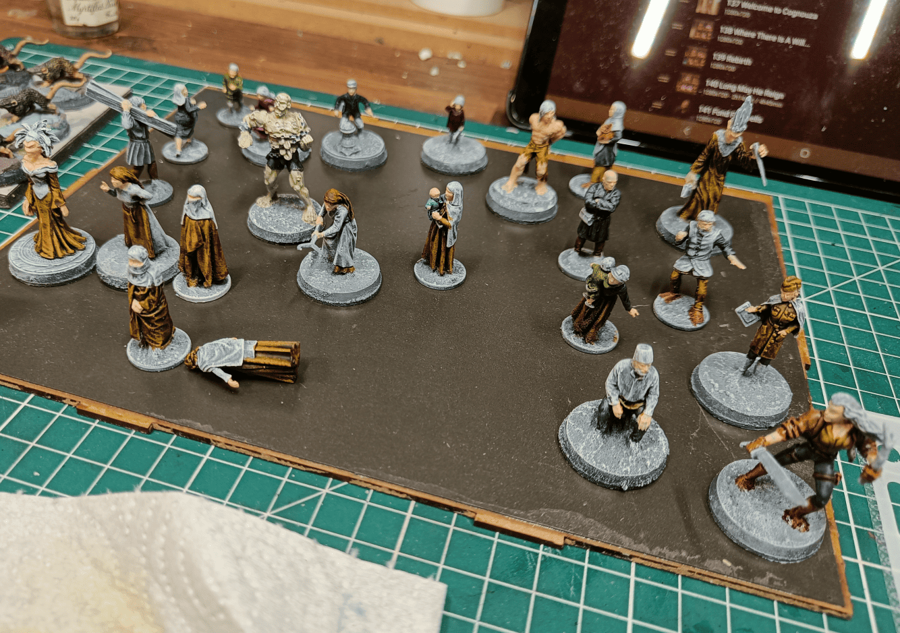
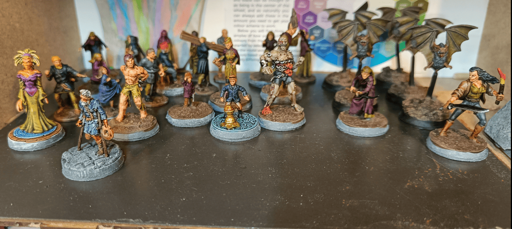
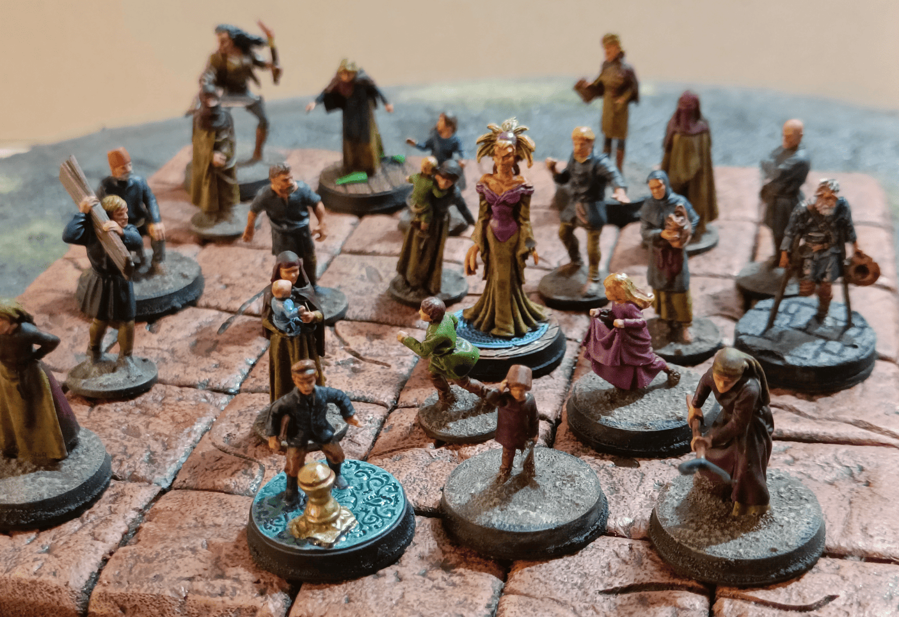

For the first Strange Aeons scenario, there's a whole area with lots of survivors from the psychiatric asylum who are sequestered. I needed quite a few miniature to represent all these NPCs that the players will have to protect and save.

There are some named NPCs that they can interact with who have an impact on the story, and there are others who are more there for local color. So I tried to make different types of small bases made with 1 cent coins for those who are just there for local color, and slightly larger ones for those with whom the NPCs can interact.

In hindsight, I realize that wasn't necessarily needed. I often use these characters more in scenes, they're almost like scenery elements. So the small base in the form of a 1 cent coin is pretty good. It allows to differentiate them from the others who are really potential threats.

Most of the base miniature, I bought them on Etsy. Someone 3D printed them and I got them. The printing is a bit smooth at times. I think some of the details were lost, but at least there are no molding marks from the 3D printing, so it does the job for what I wanted to do.

The other miniature come from a bit of everywhere honestly. I think there are some Heroclix, and there's that little boy you can see at the bottom left. I don't know exactly where he comes from, I found him at a flea market. Not sure what he's supposed to represent, it's a small plastic figurine, maybe from plastic war soldiers or something.

For all my minis on round bases, I added some texture. It's a mix of filler, spackling paste, small stones, glue, and a bit of ink so I can identify it later. I glue it on, and if it spills over the edges, I just wipe it off with my finger.

Now some photos of the different painting stages.

I started with an initial layer in black and white, which I find super practical because it lets me see all the details clearly. Then I moved on to doing the skin tones on all the models first.

After that, I grabbed some relatively neutral and dark Speed Paint colors to work on the different outfits. I gradually added touches of color to each mini to finish up all the elements.

The only slightly more involved work I did was on the metallic parts. For those, I laid down a base layer of black first, then added the metallic paint on top. I didn't do any highlighting or additional dry brushing at all, just the Speed Paint.