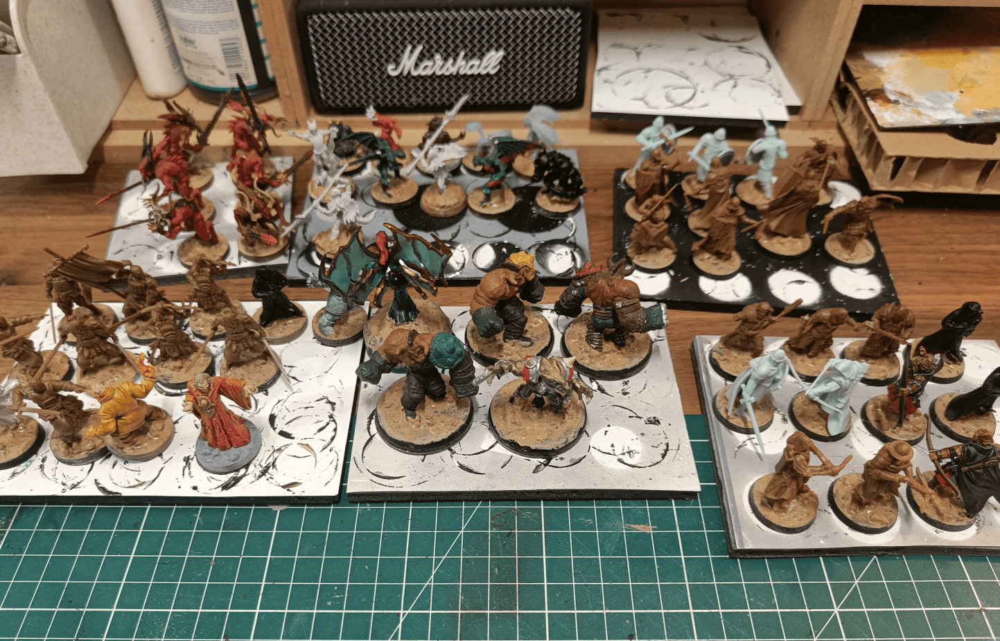
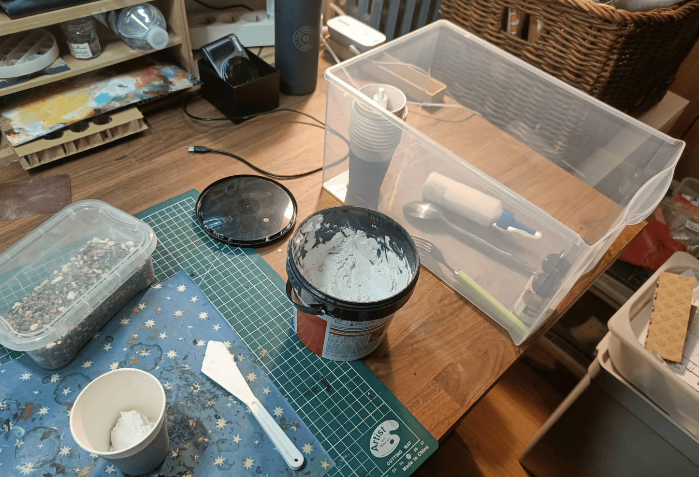
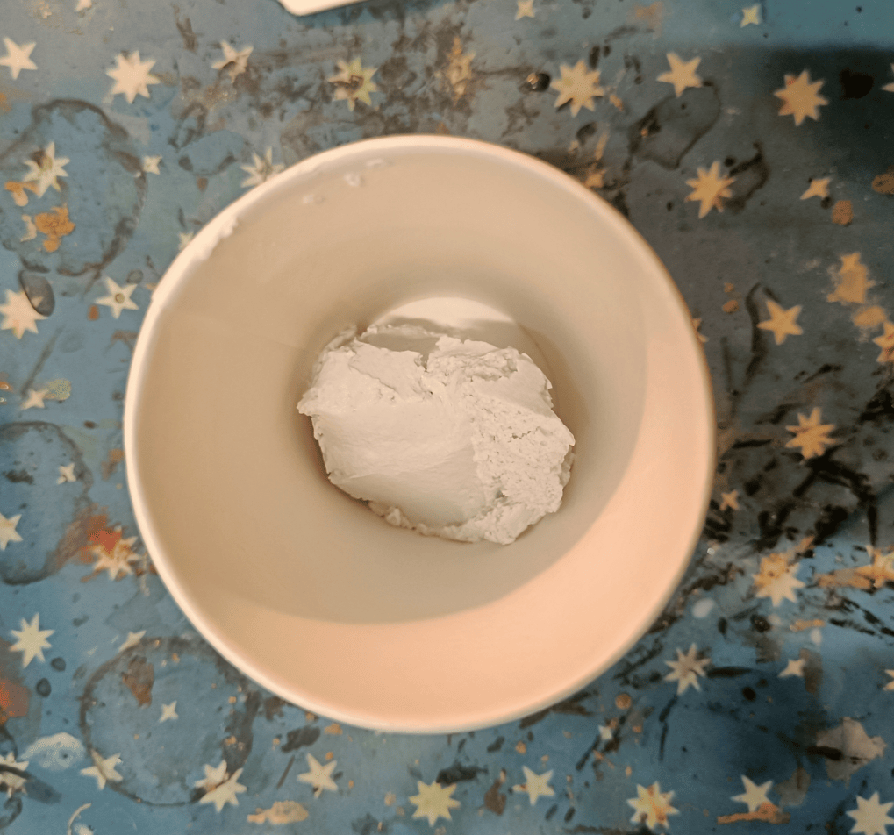
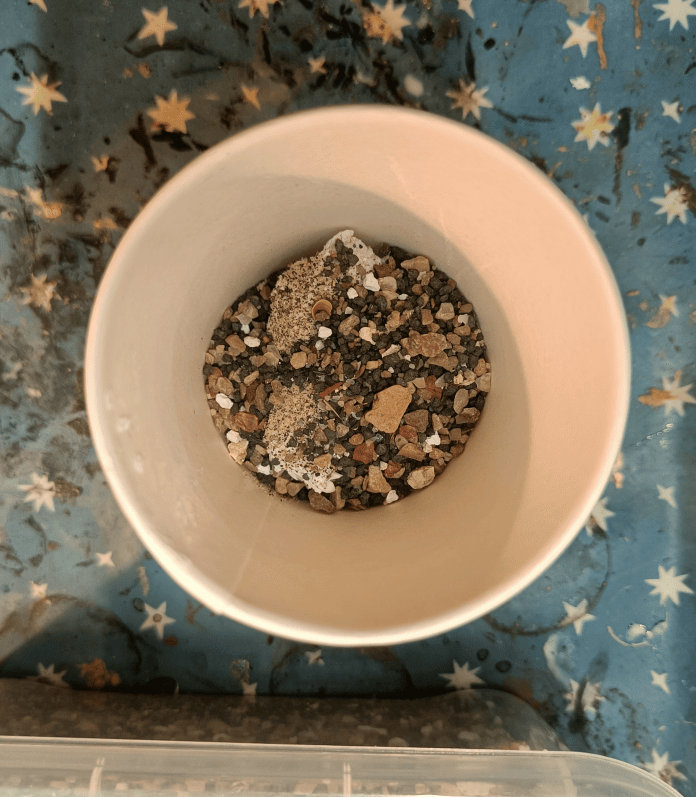
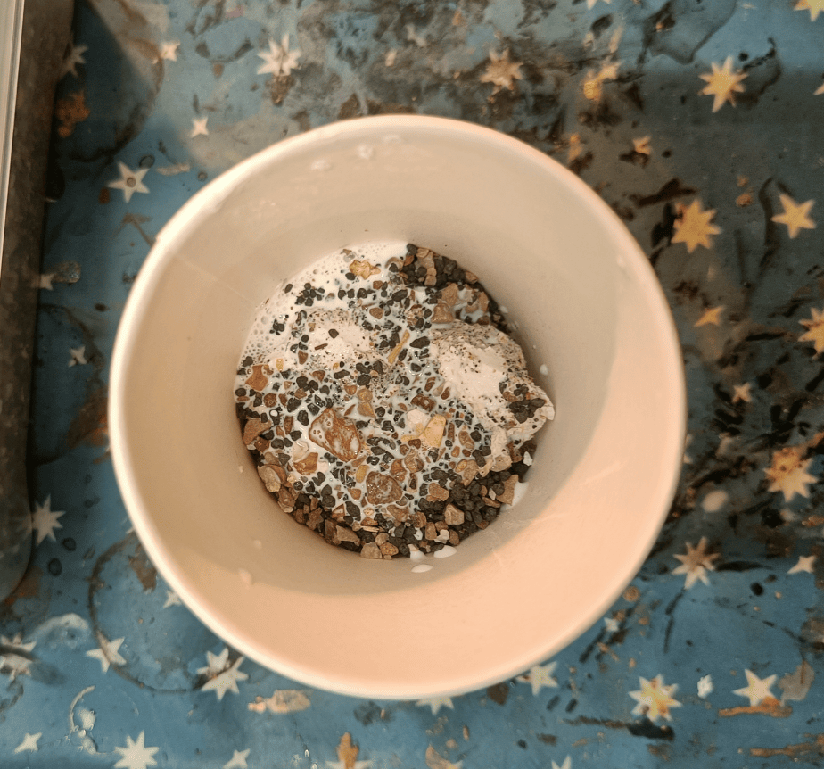
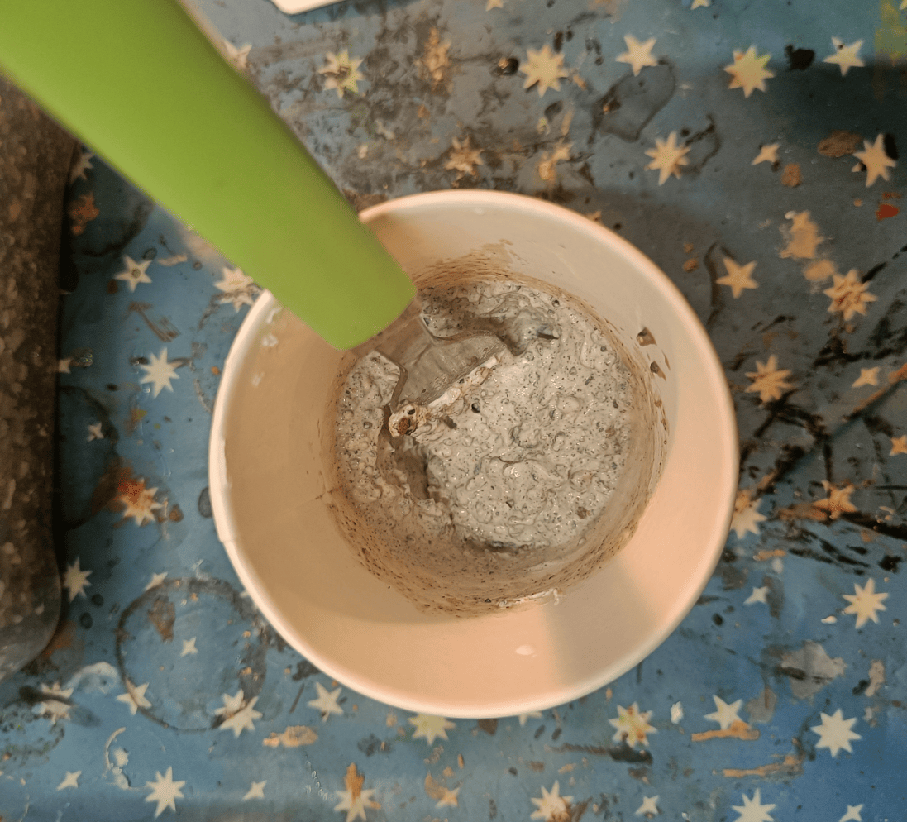
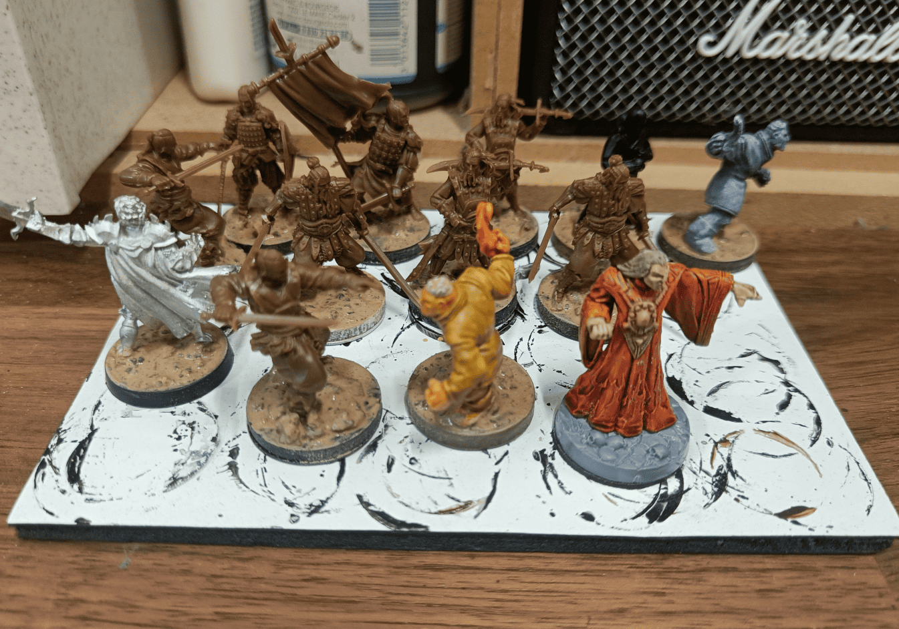
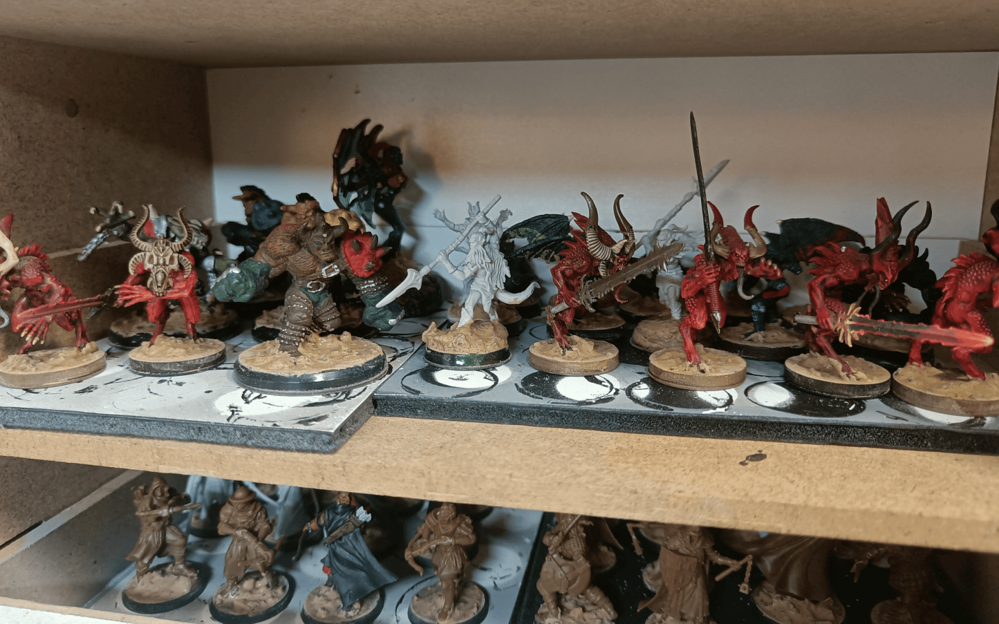

<!-- Image 1 -->

This is documentation for how I do the texture on my bases. It's a technique that works well, I really like it, and I do it all the time now. Generally, I do the same texture on all my miniatures, with very few exceptions. And I do it before priming, in batches of many at once.

<!-- Image 2 -->

I do this so often that I dedicated a drawer just to it with all the ingredients I need. When I need to do bases, I just grab this drawer instead of hunting for ingredients everywhere. 

In the center, there's spackle, which I only need for this. I have cardboard cups for making mixes and a small box with lots of gravel ranging from very fine sand to slightly larger pieces. There's a spoon in the box to grab it easily and a fork for mixing. There's a container that's 50% PVA glue and 50% water so I don't have to make the mix every time. There are inks, mainly so I can see where I put my mixture. Sometimes I use black, sometimes brown, doesn't really matter.

<!-- Image 3 -->

Here's the order in which it works. I start by putting in spackle, and I always put way too much. Every time, I end up throwing out the cup when there's still about half left. Don't follow the quantities I use, you should use less.

<!-- Image 4 -->

I took a spoonful of my sand and gravel mix and I put that on the spackle.

<!-- Image 5 -->

I add a bit of my water and PVA glue mixture. This makes it easier to mix.

<!-- Image 6 -->

I start mixing all of this so it begins to form a paste. This is where I add drops of black or brown ink so the paste isn't white and I can actually see where I put it. I make it brown because I figure that way, if pieces break off, at least you won't see the white of the spackle but you'll see brown, which is roughly the same color I'm going to paint it in the end.

<!-- Image 7 -->

Here you see I've applied it to the bases. What I generally do is take a brush I don't care about at all, slightly wet it, dip it into my mixture, place it on the base, and spread it around. I wet the brush well so it's easy to spread. Once I've finished a base, I run my finger around the edge on the black lateral part to remove what overflowed, keeping the texture centered on the top. Since it's a bit annoying to do after each miniature, sometimes I do it every 3 or 4. You need paper towels nearby to wipe your finger.

<!-- Image 8 -->

This is roughly the state of my shelves once I've done many many bases. You have to wait a bit for it to dry. Usually, I do this in the evening and the next day it's dry and ready for priming. 

What I like about this technique is that it creates something consistent across everything. Since I paint the base a bit brown afterward, it goes somewhat unnoticed but it gives uniformity to all my miniatures. And I put plenty around the characters' feet. Even if it goes a bit on their feet, it doesn't bother me. The advantage of this mixture made of wood glue, spackle, and gravel going on my miniatures' feet is that it ensures they bond very well to the base. Sometimes just a dot of superglue isn't enough. This allows me to secure them really well to the bases.

