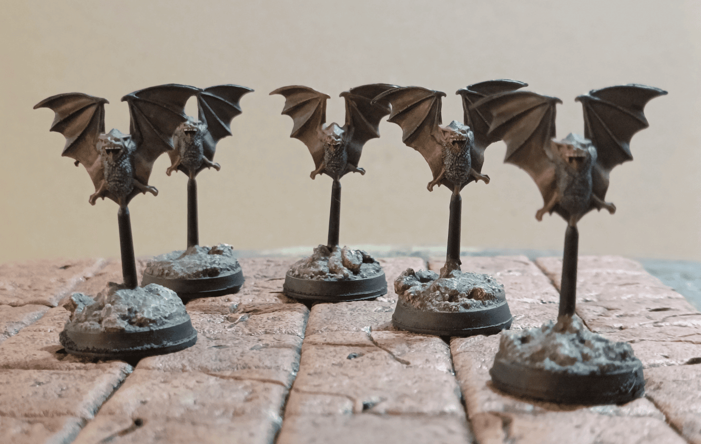
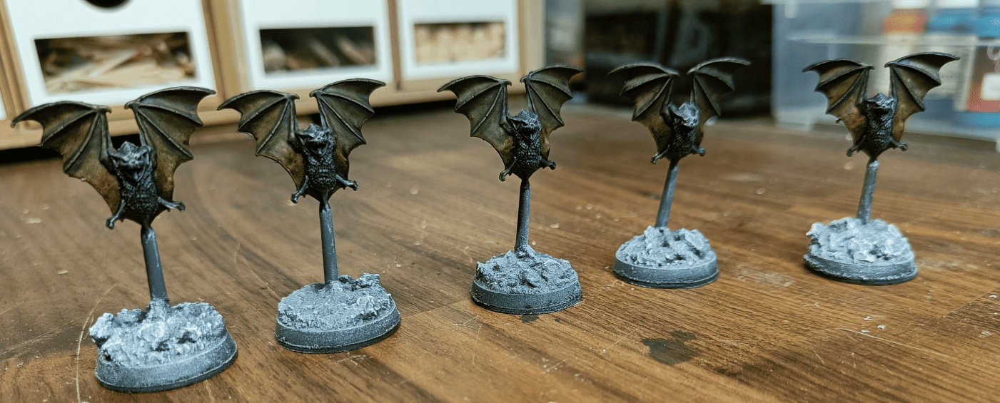
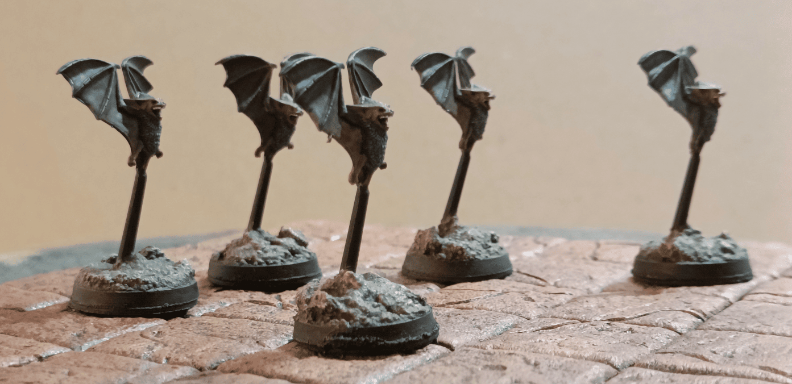
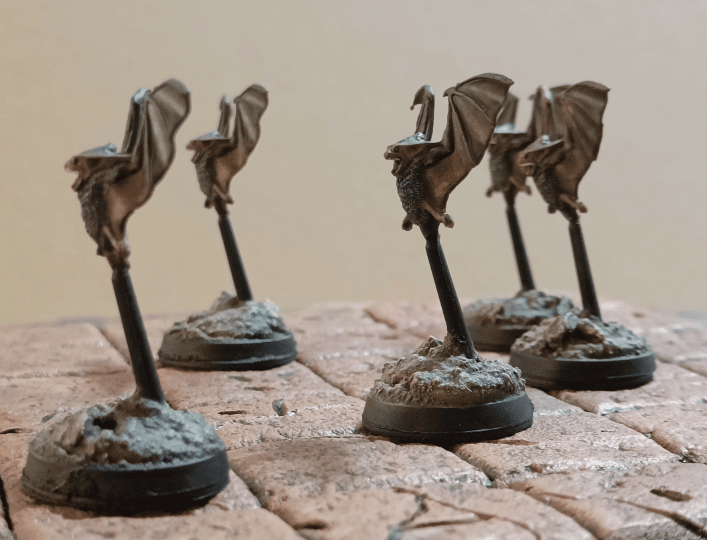

They're the bats from the Warhammer Quest base box.

I've had these for decades. Got them when I was a teenager in the original Warhammer Quest box. Never painted them properly back then (or if I did, it was pretty terrible).

Looking at the photos now, I realize they look a little goofy, but that's always been how giant bats were depicted in Warhammer Quest, and thus, in my mind. I'm happy to have finally painted them 20-30 years later!

The classic photo of the work in progress.

And a few photos taken from the sides.