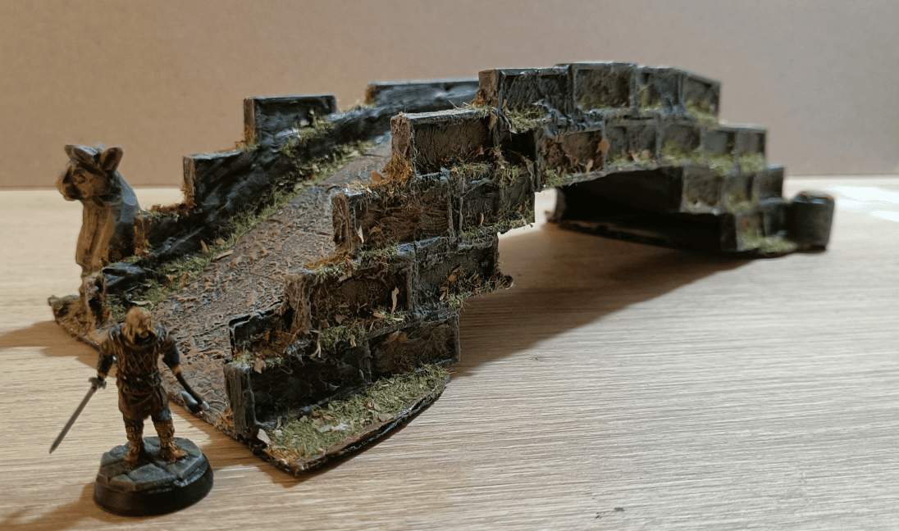
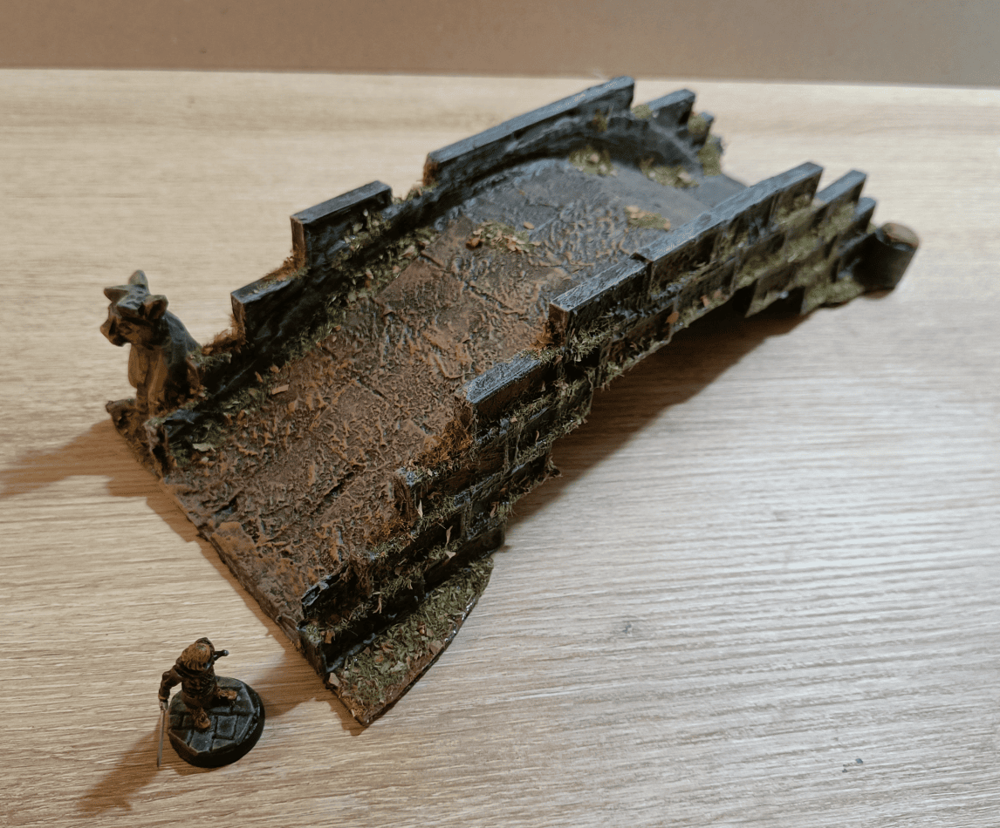
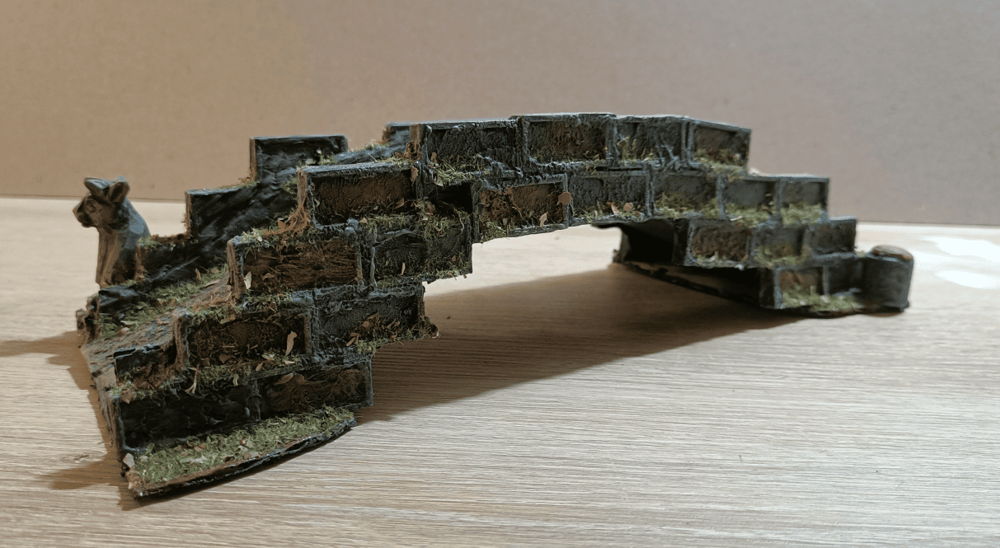

Here are some photos to document the only bridge I have in my collection. It's something I made super quickly without really knowing where I was going, which isn't the most beautiful thing I ever made, but it has roughly the right proportions and works well when I need to have a bridge. It's sturdy and didn't cost me much.

The main structure is made from standard cardboard packaging, the kind you receive parcels in. The bricks on the sides are made with plastic dominoes that I glued together. The surface of the bridge itself is small square tiles that I recovered from a pseudo Scrabble game. I glued them to make it look a bit like paving stones.

Then I covered everything with filler, pushing it well into all the holes in the dominoes and spreading it roughly on top. Next I painted everything, and all the areas that were particularly ugly (meaning a lot of them) I covered with flocking to hide the mess.