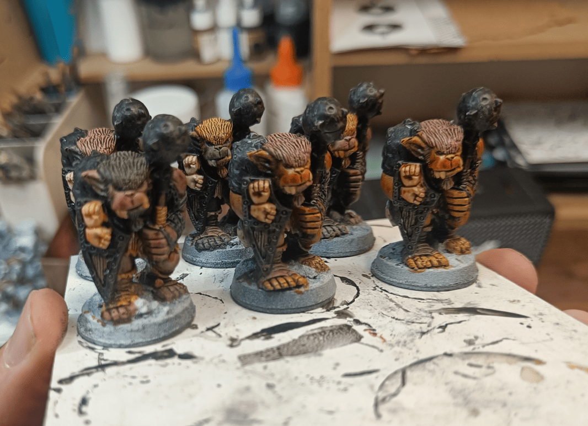

<!-- Image 1 -->

A short post that will evolve over time showing how I paint these miniature today. I'd already painted them years ago, and eventually I'll do a before/after comparison. These come from the Dungeons & Dragons board game.

I used three colors for skin and fur, alternating which color goes where on different bugbears. Some combinations work better than others. The two in front on the right turned out well because the color resembles the original bugbear illustration in the D&D manual, that brownish tone.

For metal parts, I start by painting them black. Metallic paint looks much better over black, avoids needing full coverage, and gives a worn look. It also helps me see which parts to paint. I generally start with light colors like skin, then do the black, since it's easier to cover light with black than vice versa.

The hands hanging on the shields are painted with three different skin colors, each with a different wash. Same colors used throughout, but in different combinations. Creates uniformity and variety at once.
