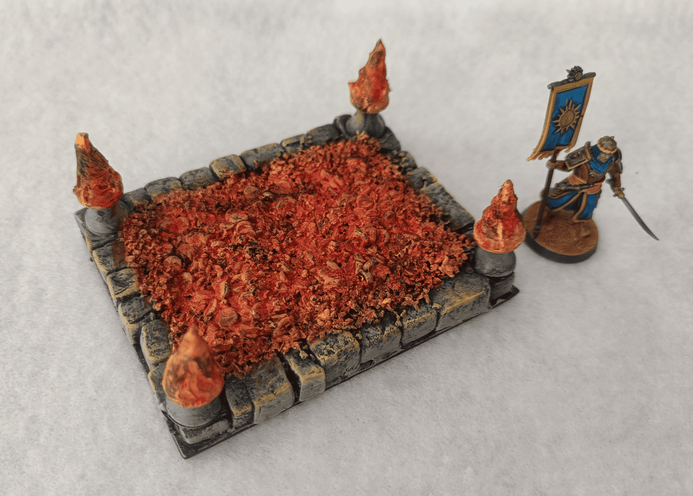
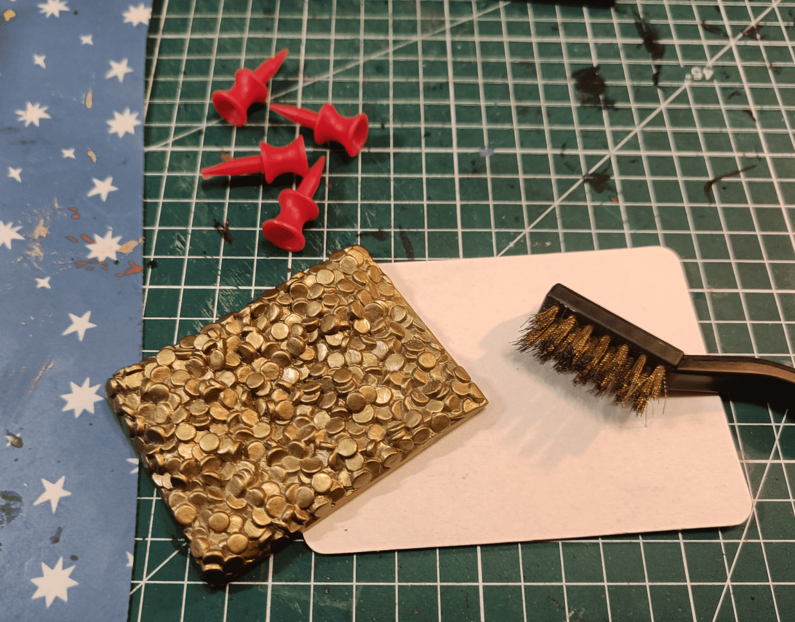
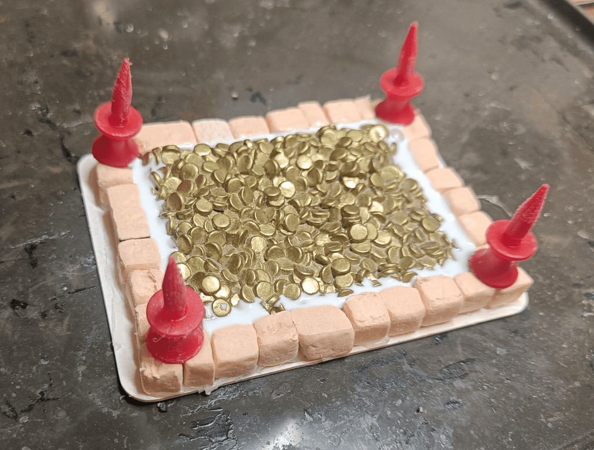
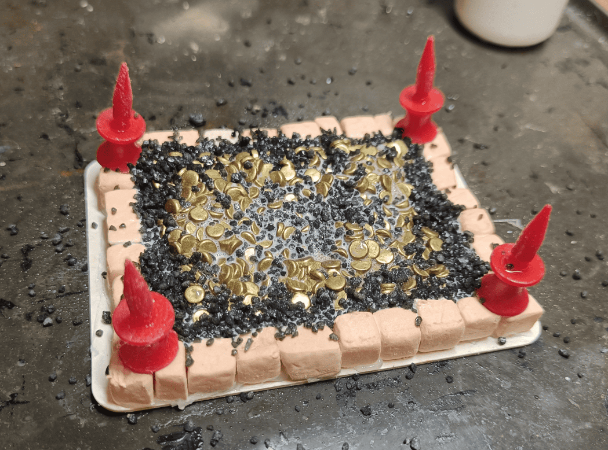
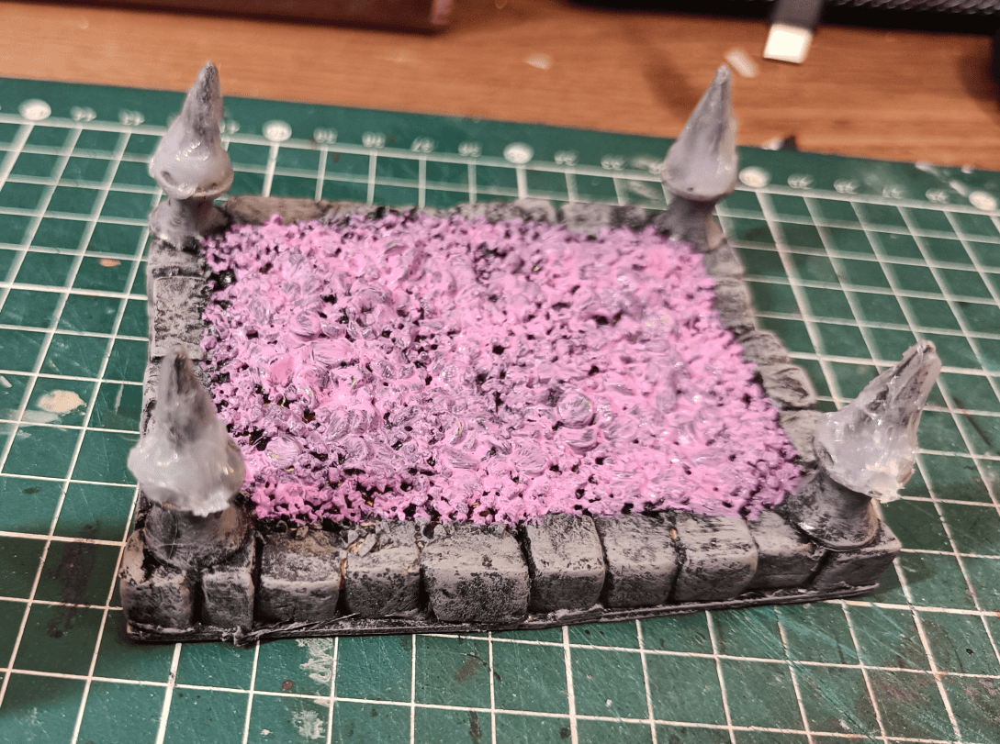
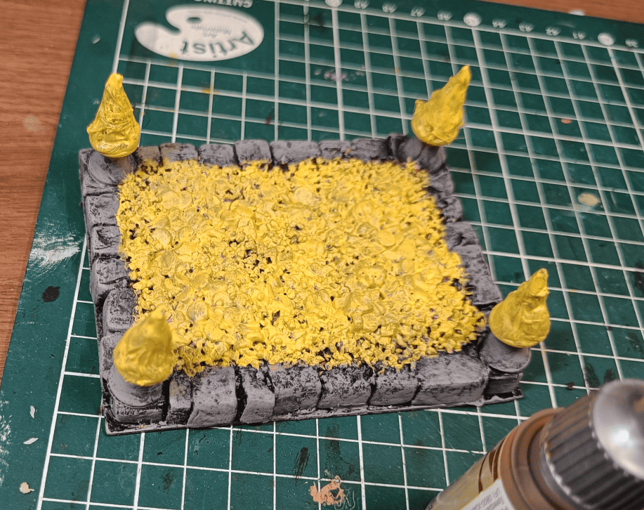
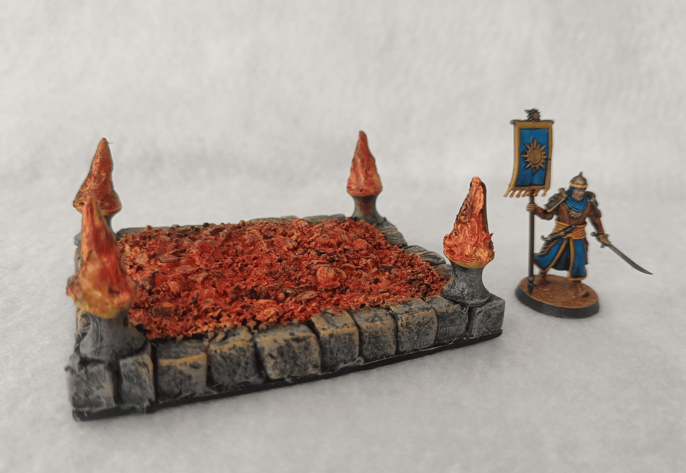
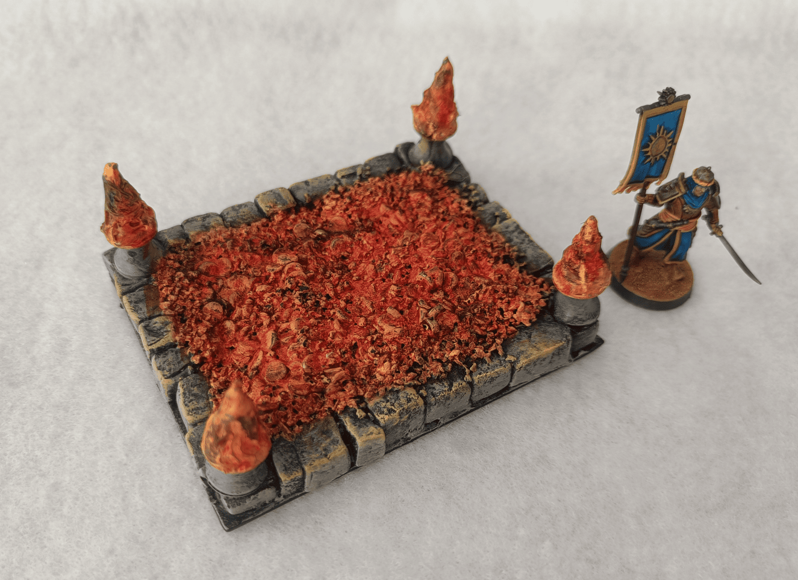
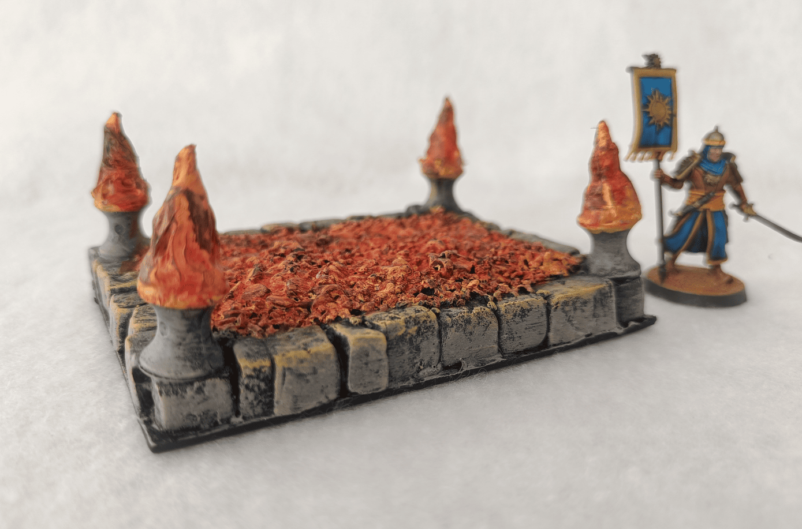

<!-- Image 1 -->

This is a terrain piece I made to create a bed of burning coals, embers, or lava. It could work in a fire temple or as a carnival attraction where participants walk across burning coals, and it was actually used in a scenario at a desert wedding where characters had to walk through flames.

<!-- Image 2 -->

The base materials. The main piece is this plastic treasure I picked up at a flea market. At first I thought I could turn it into an end-of-dungeon treasure, but as I played around with it I realized it would be much more useful as a bed of burning coals.

<!-- Image 3 -->

I added some embellishment. I had foam bricks [from a previous project](../qadiraDesertHouses/) that I glued all around to frame it, and I glued these things that look a bit like torches but are actually markers you stick in the ground for kids' golf. They're normally planted the other way with the pointy end down, but I put them upside down thinking they could make nice little flames, and I added quite a bit of glue all around.

<!-- Image 4 -->

I used the glue to add gravel pretty much everywhere. At that point I figured it didn't matter if you couldn't see the coins anymore, it would look enough like burning coals.

<!-- Image 5 -->

I started painting it, and here I followed a tip I saw in [a video by Trent Holbrook](https://www.youtube.com/@TrentHolbrook) on YouTube where someone advised him that to paint yellow, rather than doing multiple coats of yellow because it has very poor pigmentation, it's better to paint yellow over pink. It's much easier so I tried it, I put down pink.

<!-- Image 6 -->

I applied yellow and indeed it holds and covers very well. It's Daemonic Yellow from Fanatic Warpaint, which already has good coverage, but I only needed one coat. I also added some volume to the flames with a glue gun and painted them yellow as well.

<!-- Image 7 -->

Getting close to the end because I forgot to take photos along the way, but it's finished. The way I painted the coals is similar to how I paint flames: I start by putting yellow absolutely everywhere, then do an overbrush of orange, a drybrush of red, and a very light drybrush of black on the edges. To give the sense that it's really glowing, I drybrushed orange around the edge of the base.

<!-- Image 8 -->

Top view. I tried to take nice photos with my makeshift photo box placed on a sheet of white paper to make it look good.

<!-- Image 9 -->

I realize I probably set the focus distance wrong on my camera because it's very blurry. But it works, you immediately understand what it is, and I like it because it wasn't very complicated to make, neither to paint nor to build, and it's solid.

