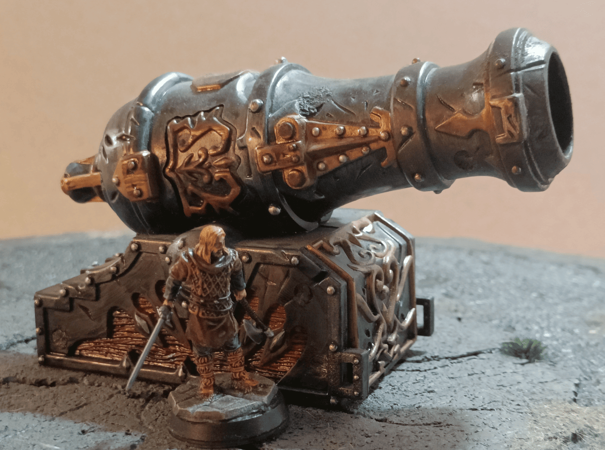
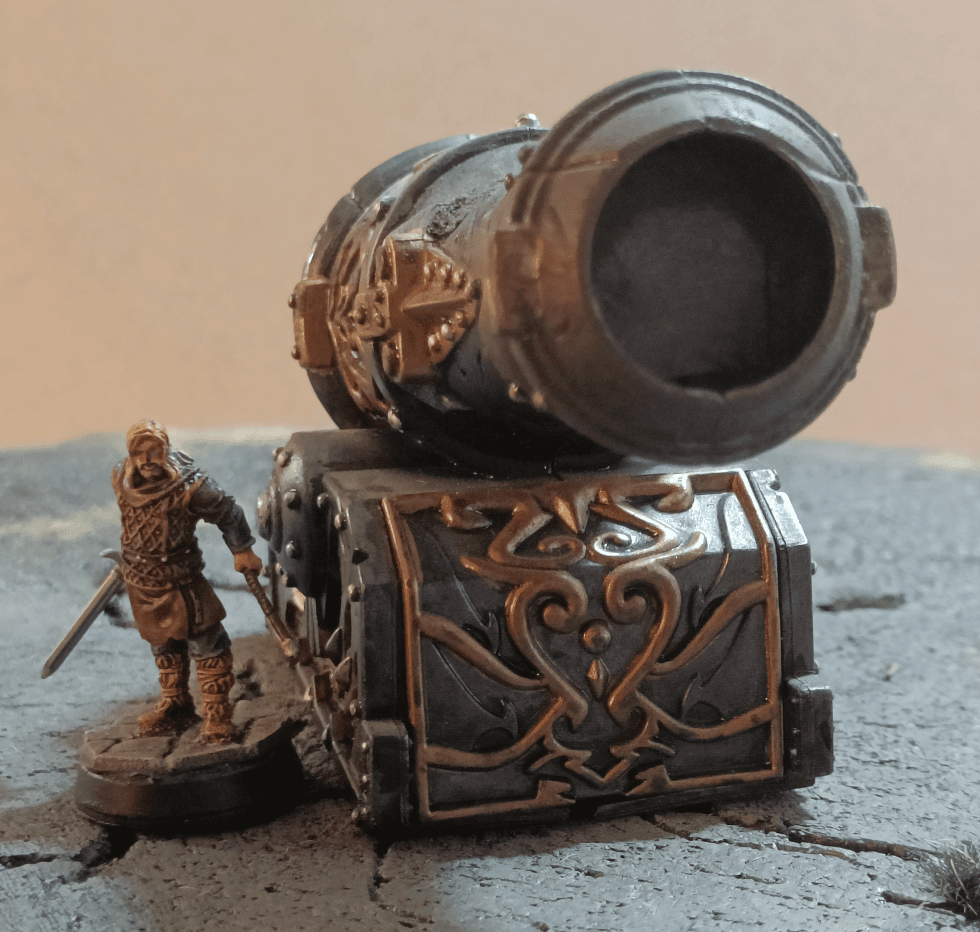
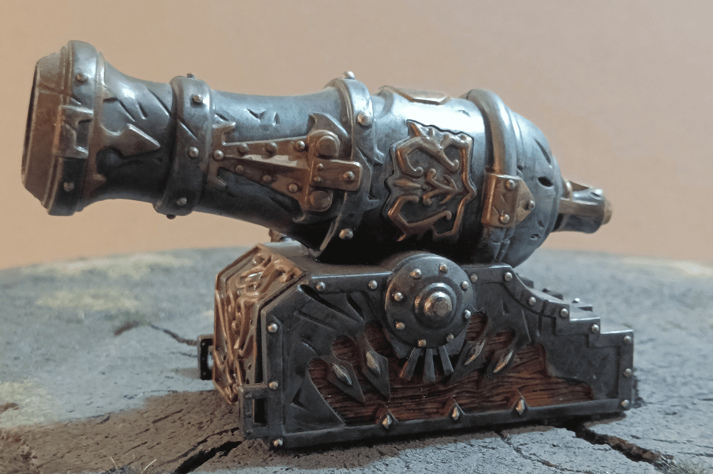
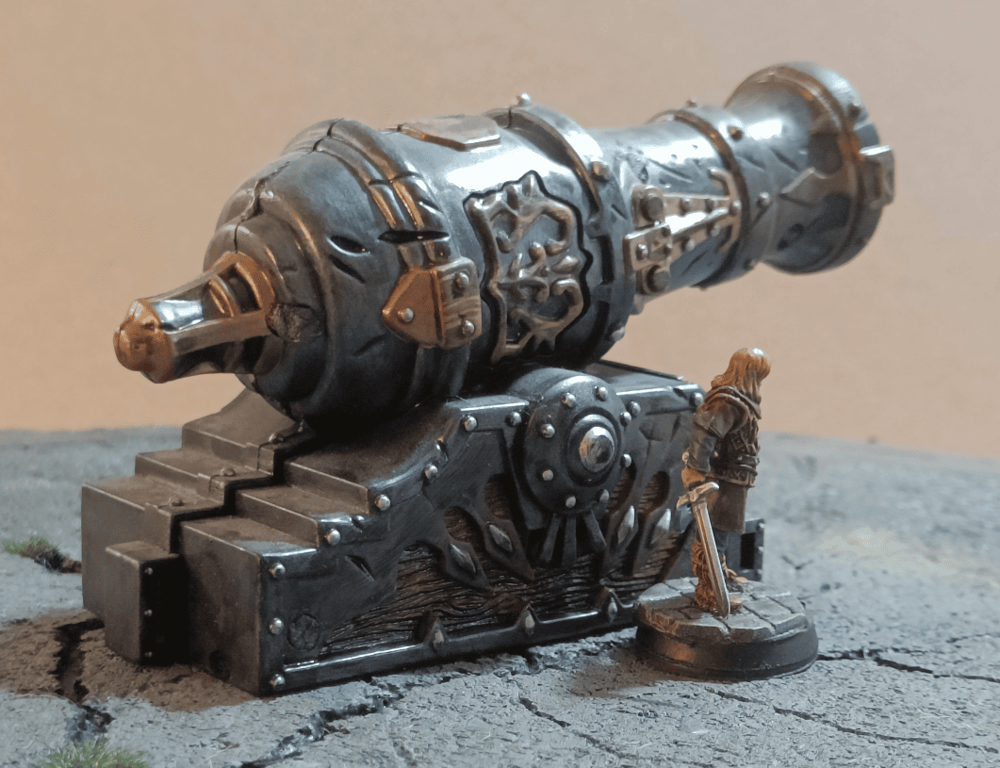

Here are some beauty shots of a terrain piece I made when I first started painting. The cannon itself I recovered from some children's game I found at a yard sale, though I can't remember which game anymore.

I didn't do anything special to it. The piece was already like that with a pretty decent sculpture. I just painted it. This was really at my very beginning when I was discovering dry brushing and learning how to paint metal. It was practice for me to figure out what worked well with metallic paints, which parts needed silver, which could be gold, and how to apply washes.

I think I ended up giving this piece away because it was way too specific. None of my role playing game sessions ever needed a huge cannon like that, so it was just taking up space.

