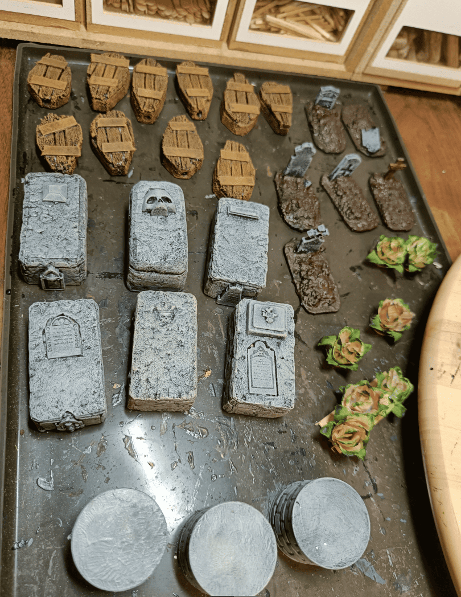
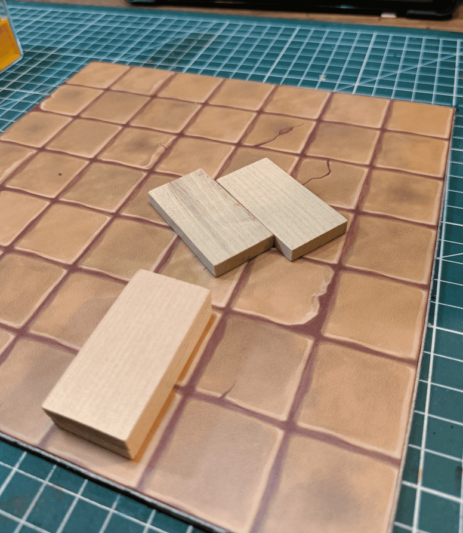
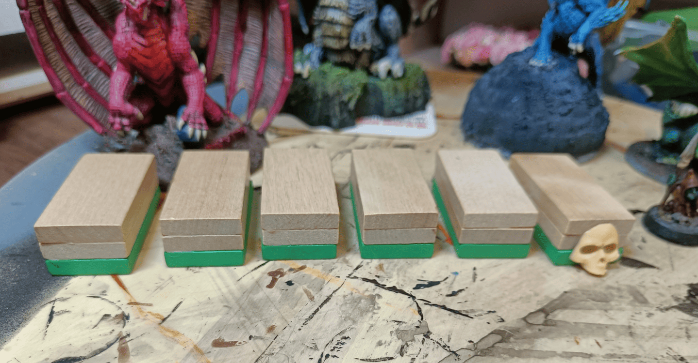
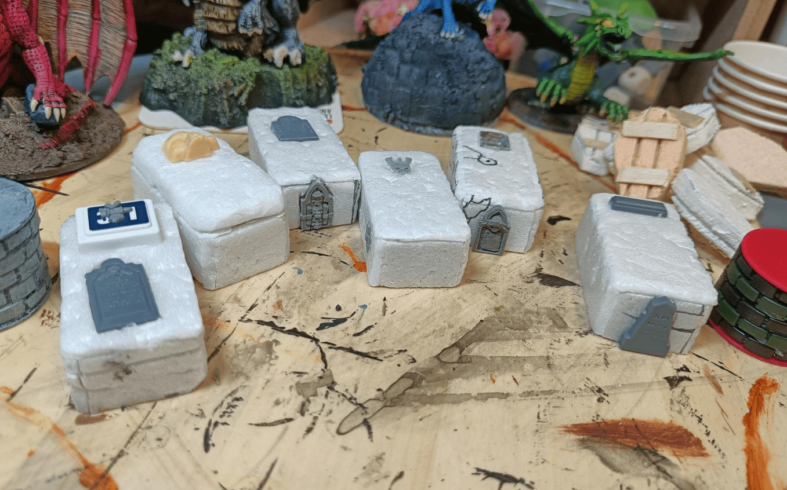
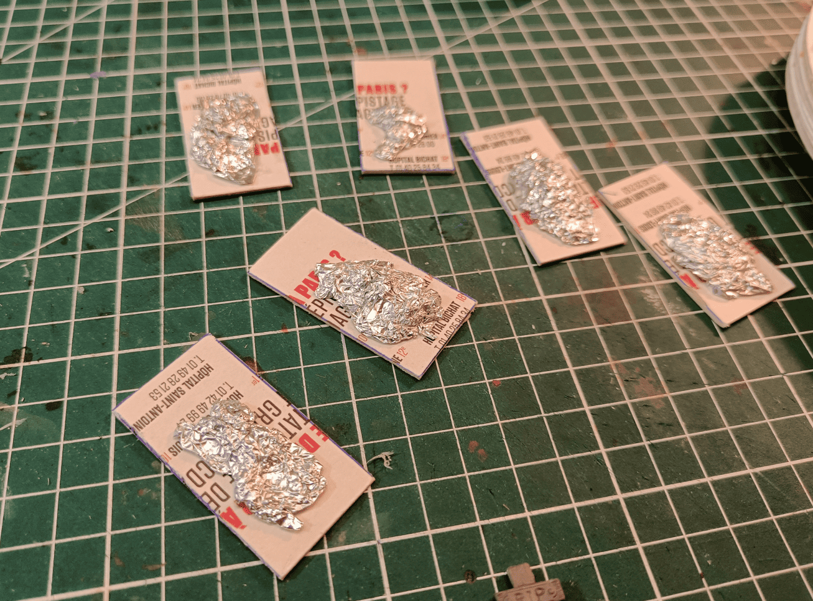
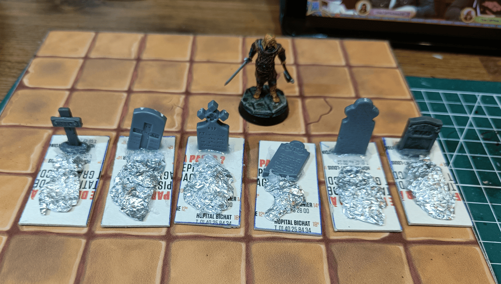
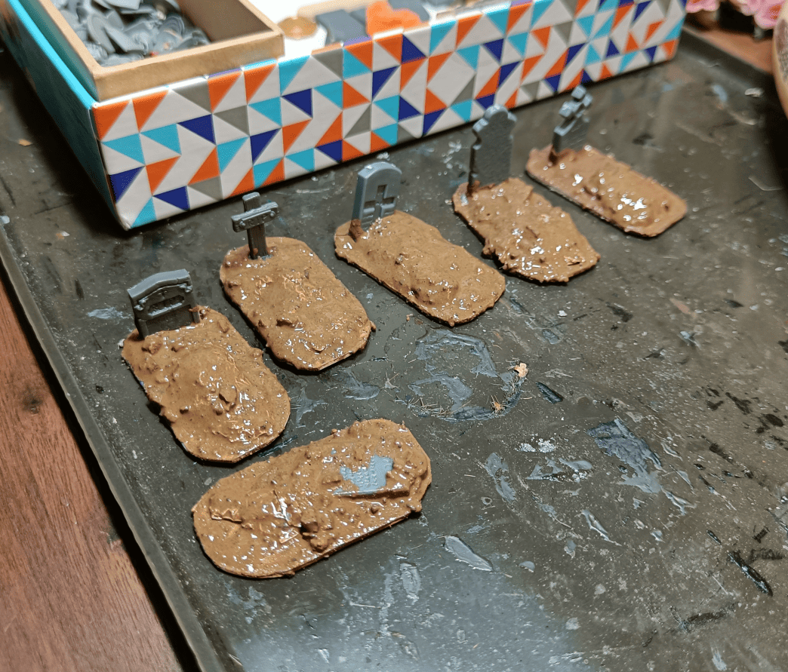
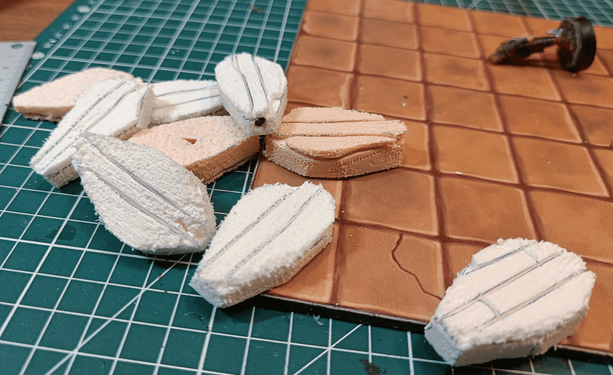
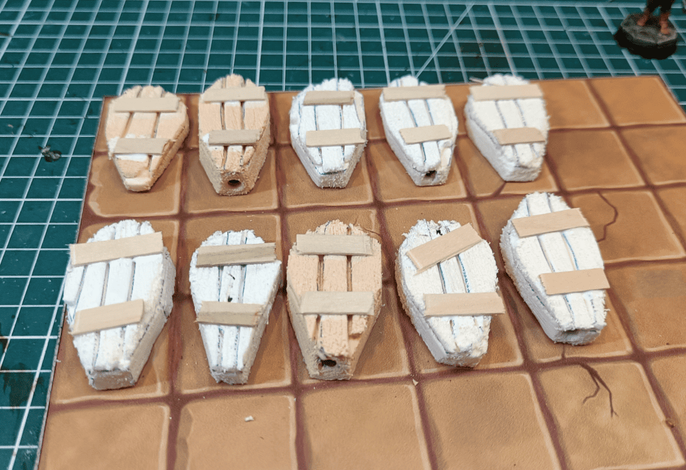
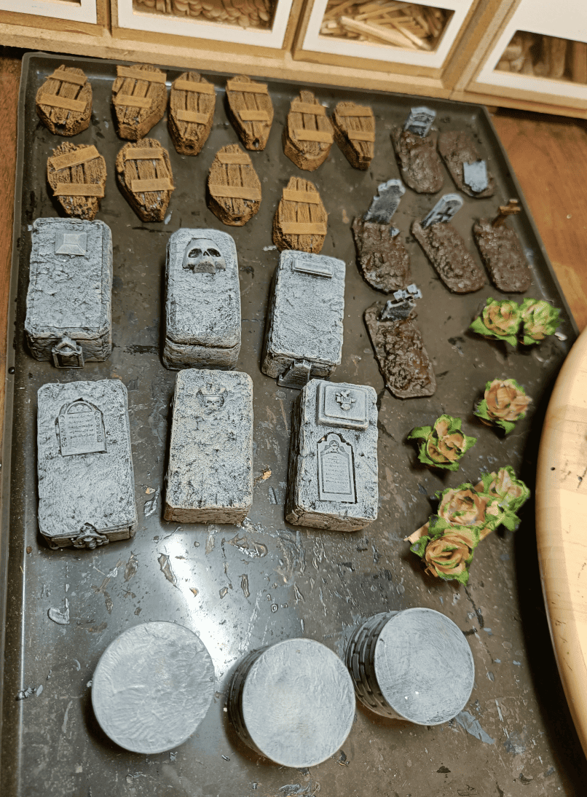

<!-- Image 1 -->

This post documents a set of cemetery props I wanted to make: coffins, graves, and sarcophagi. I made them all at the same time because they're the kind of things that are always useful. You often visit crypts, so these pieces get plenty of use.

<!-- Image 2 -->

I'll start by explaining how I made the sarcophagi. I had these wooden rectangles I salvaged from somewhere, I can't remember exactly where, maybe a children's construction toy. They're the right size to fit on two squares by one. I make game boards where the squares are 3 cm on each side so there's room to actually place the miniature, and I always keep this board next to me to test dimensions. These rectangles work well because they take up two squares by one.

<!-- Image 3 -->

I stacked them on top of each other to create a massive sarcophagus effect. What I like about using wood is that it adds some weight.

<!-- Image 4 -->

I covered them with foam that I glued on the different faces, then textured it with an aluminum foil ball. I tried to add some texture and detail by attaching various small plastic elements I had lying around.

<!-- Image 5 -->

Moving on to building the graves, I just took cardboard rectangles and to make the earth mound effect, I simply made a shapeless bump with aluminum foil.

<!-- Image 6 -->

I added a tombstone. I had salvaged a bunch of them from some set, I don't remember which one, so it was a good opportunity to use them.

<!-- Image 7 -->

I covered everything with a mix of spackle, gravel, glue, and brown paint. I didn't hesitate to apply some directly on the tombstones.

<!-- Image 8 -->

For the coffins, I cut them directly from foam and engraved the top. I put a nail inside to give them some weight. That's the hole you see on their base, it was for driving in the nail.

<!-- Image 9 -->

I gave them a more coffin-like appearance by gluing popsicle sticks to make planks.

<!-- Image 10 -->

Here's everything once it started getting painted.

Very simple to make but quite versatile. I often use the sarcophagi as terrain elements when we fight in tombs. Players can climb on them for an advantage or hide behind them. The graves are nice for outdoor scenery, and we used the coffins in a scenario where the players had to transport a coffin through the desert, so it made it easy to represent.
