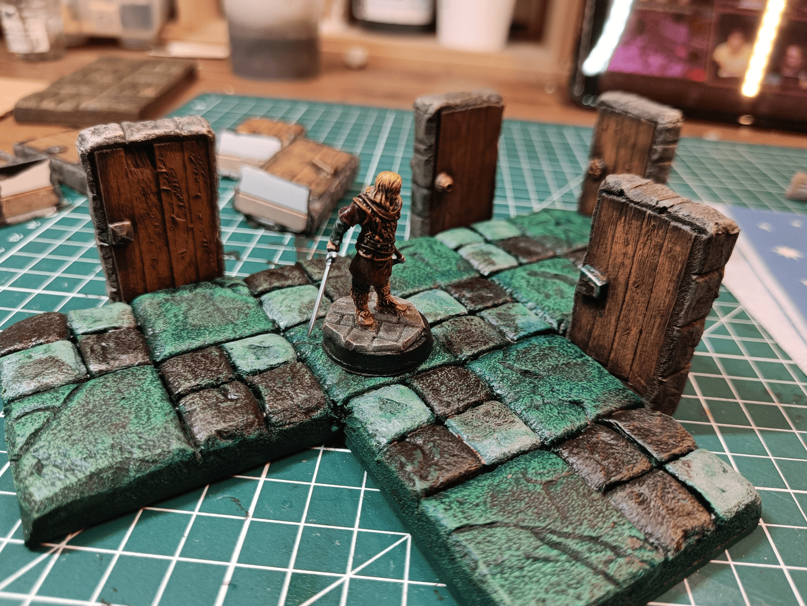
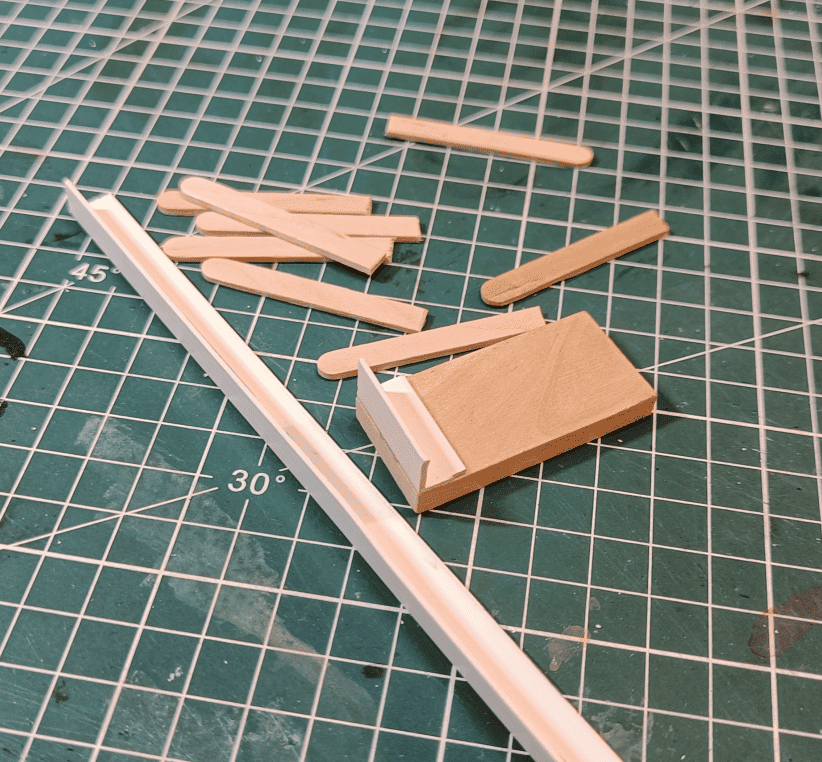
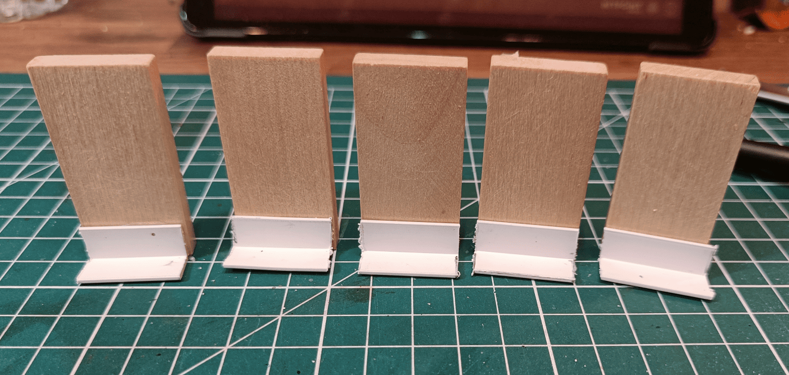
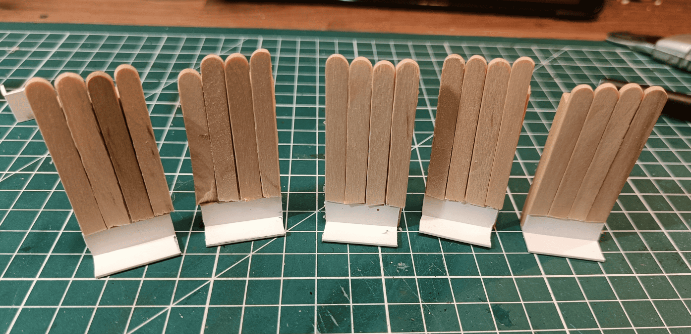
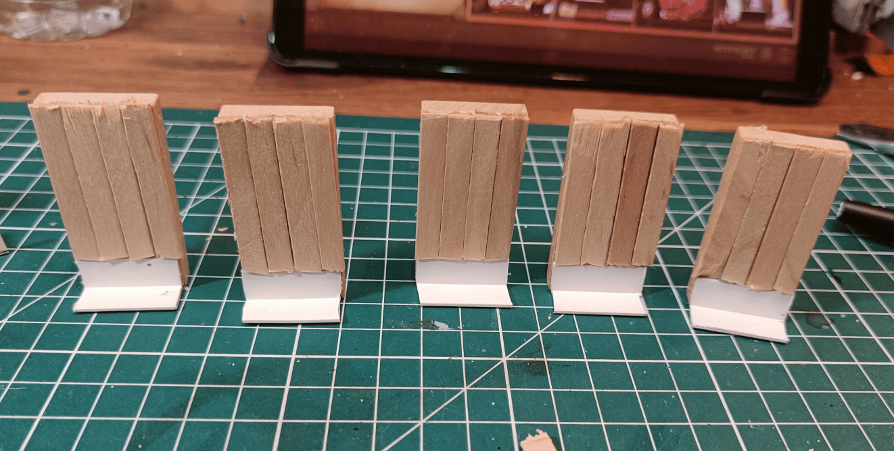
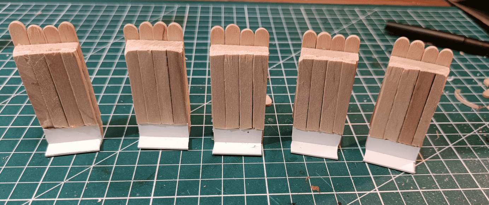
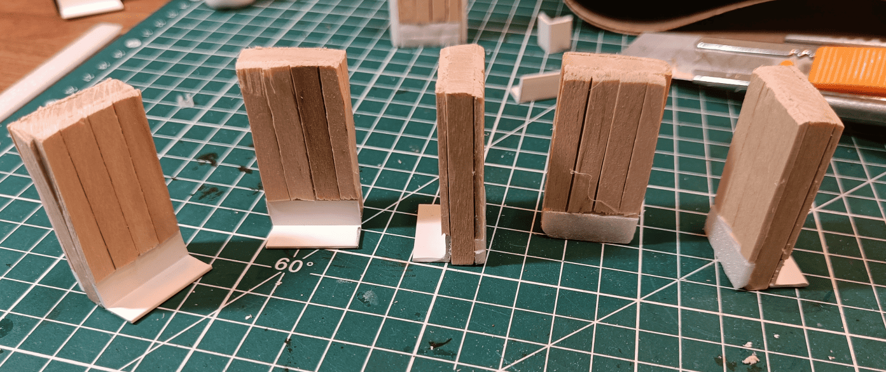
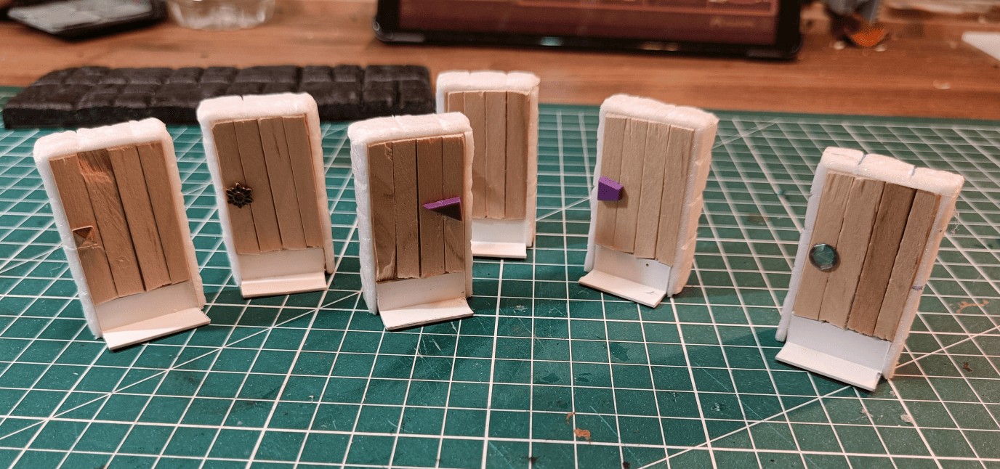
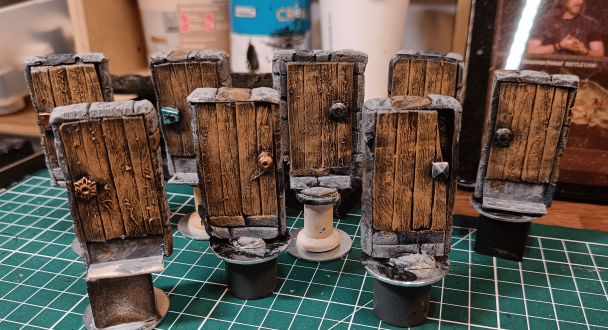
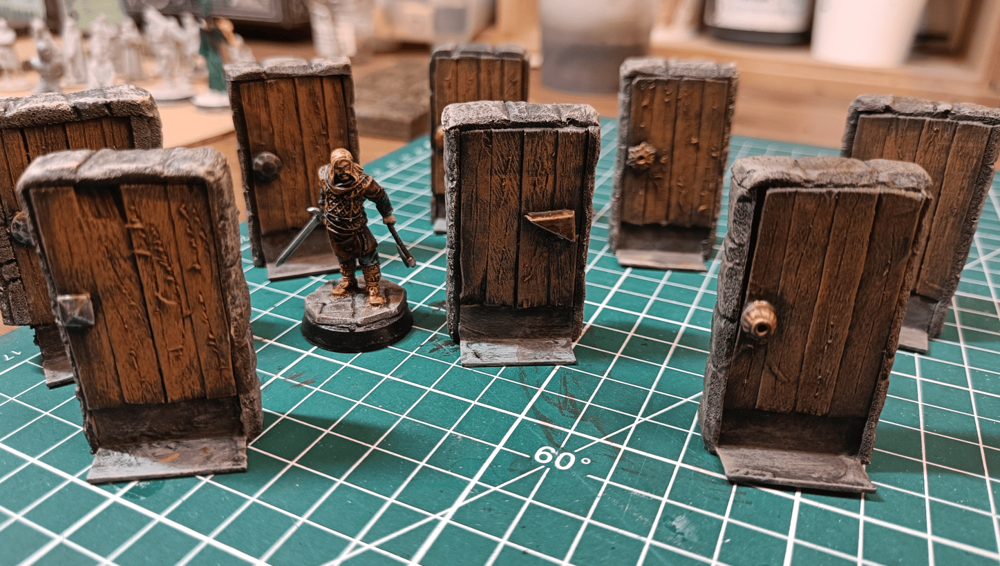

I'm going to document a set of doors I made.  

I had started making foam tiles like you can see in this first image, but they're a bit thick. To be able to indicate that there's a door on the right or on the left, it was difficult for me to position the doors I already had. Either they clipped onto walls (but I stopped putting walls on the edges of my tiles), or they lay flat to separate two rooms, which works well on a flip mat but doesn't work very well here. 

So I needed something I could put on the sides to indicate a door that can be opened. I needed those doors to be sturdy and not fall easily. I thought a bit about the right design to manage to do that and that's what I'm going to document here.

Here's the heart of what I'm making. I have this base piece, which is a wooden plank. I don't remember where I got it from, but I recovered a big bag of them from a wooden construction toy set for kids. They're all exactly the same size, about 3cm wide, which is perfect size for my tiles.

What I did was glue a small piece of right-angled plastic at the bottom. I found it at a hardware store. Not even sure what it's meant for, maybe molding or electrical wires. The advantage is that the right angle is already built into the material, so I don't have to make it myself. That's important because if I made it, it might not be perfectly straight, but with this I know it is, and it's going to be solid too.

I set up my little assembly line so I could make them all together. I start by gluing this small piece at a right angle at the bottom, which serves two purposes: it helps make sure the door stays flat on the ground, and it's a little thing I can slide underneath the tile to make sure it holds well.

Next up, I glued the wooden pieces directly on top. I searched through my collection of coffee stirrers and popsicle sticks. My idea was to be able to glue a certain number of them side by side without having to cut them lengthwise. 

If I used popsicle sticks, they would stick out a little bit, so I took other wooden sticks that were a bit smaller. That way, it allows me to place them side by side. I'm really trying to simplify everything I can in my assembly line as much as possible, so the less I have to cut, the better off I am. 

That's why I glued them all on top, and you can see that I made them stick out above. That way, it allows me to cut them flush once they're glued, rather than having to measure in advance.

And there you have it, with the top cut off.

I'm doing the same operation on the other side, but I also took the opportunity to sand the top a bit where I cut to make it a little smoother.

And there you have it, all the planks are glued! As you can see, I added a little piece of foam at the bottom to compensate for the width added by the small pieces of wood. The next step will be to cover all of this with foam that will be used to represent stone.

I covered everything with foam boards that I carved to look like stone, and glued different things for the handle.

And there you have it! This is what it looks like once painted. I just did the dry brush on the stone and on the wood. I'll go over it again with a black wash afterwards, which will help to even it all out a little bit better.

