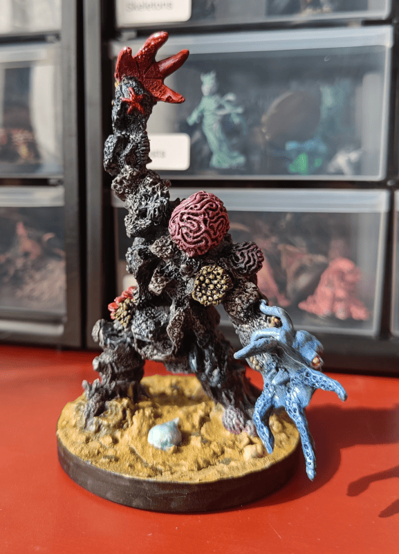

<!-- 1 -->

I really enjoy painting Reaper Bones miniatures like this Coral Golem. These sculpts are pretty different from what I usually paint, and they make interesting monsters to throw at players during game sessions. This one is a kind of monster made of stones, starfish, and shells.

<!-- 2 -->

For the base, I used an Häagen-Dazs lid because this is quite an imposing creature. At that time, I wasn't paying much attention to base uniformity. Nowadays I try to make sure my bases follow logical patterns - either one square, two-by-two, or the equivalent of three-by-three. Back then I was still in "use whatever I could find" mode.

I filled it with a mix of spackle and pebbles, and even added real small shells inside to match the theme.

<!-- 3 -->

After priming in black then grey, you can see the spackle started to crack at the bottom, which doesn't make much sense - sand isn't supposed to crack. I didn't really know how to fix it, so I just left it.

<!-- 4 -->

The fully painted golem seen from behind. For the stone parts of his body, I had just gotten some speedpaints, so I used different grey speedpaints that I mixed. Some sections I painted with one grey, then adjacent areas with another, trying to blend them together for some uniformity. The result is decent but nothing extraordinary. The special elements like the anemones, octopus, and starfish I painted with brighter colors. In photos it looks good, but honestly when you look up close it's not that impressive - I could have put in more effort. But again, speedpaints really allow you to get a passable result without much effort.

Overall, this was a fun project that let me experiment with speedpaints. Not my finest work up close, but it makes a good monster for the table.
