<!-- Image 1 -->
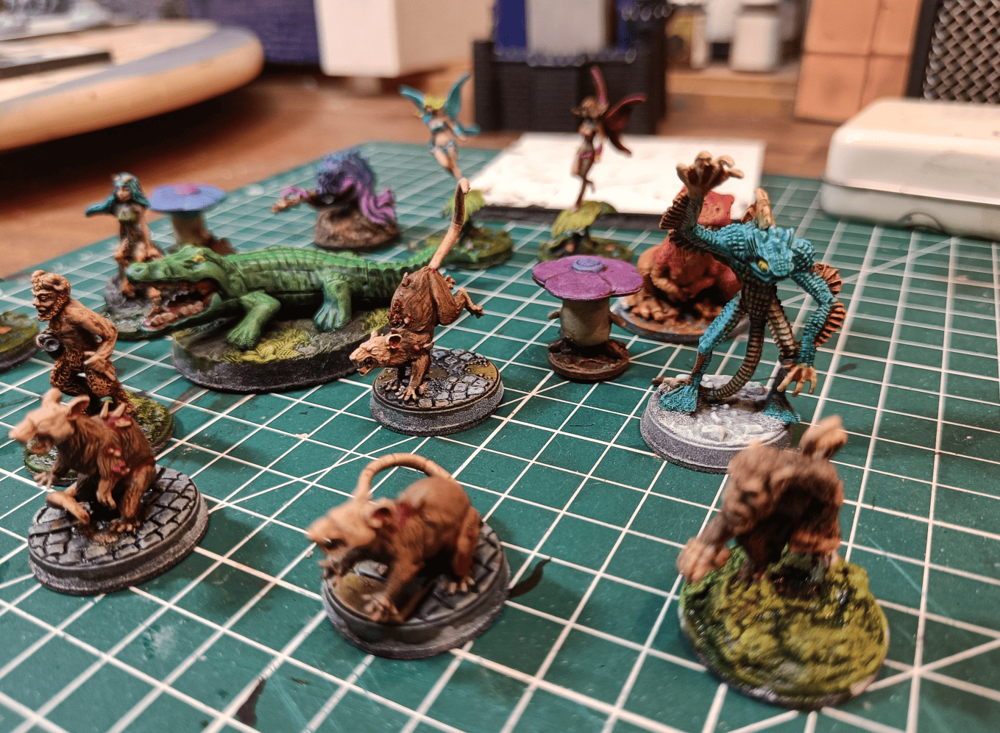

This is a photo of many miniature I painted at one point, covering a wide variety of subjects. I loaded up my painting pipeline with all sorts of miniature and just worked through them in batches of 10-12, even when there was no real connection between them. [Similar to my other bulk speedpaint test](../speedpaintTestBulkPainting/), this let me learn which Speedpaints I liked, which colors worked for me, and which ones I didn't care for. I sorted them into a drawer with only my favorite Speedpaints, the ones I actually use. The rest went into a side box. When there are too many similar options I can't decide, so I simplified my palette. If I need something specific I can always pull from the reserve box, but this makes choosing colors easier.

<!-- Image 2 -->
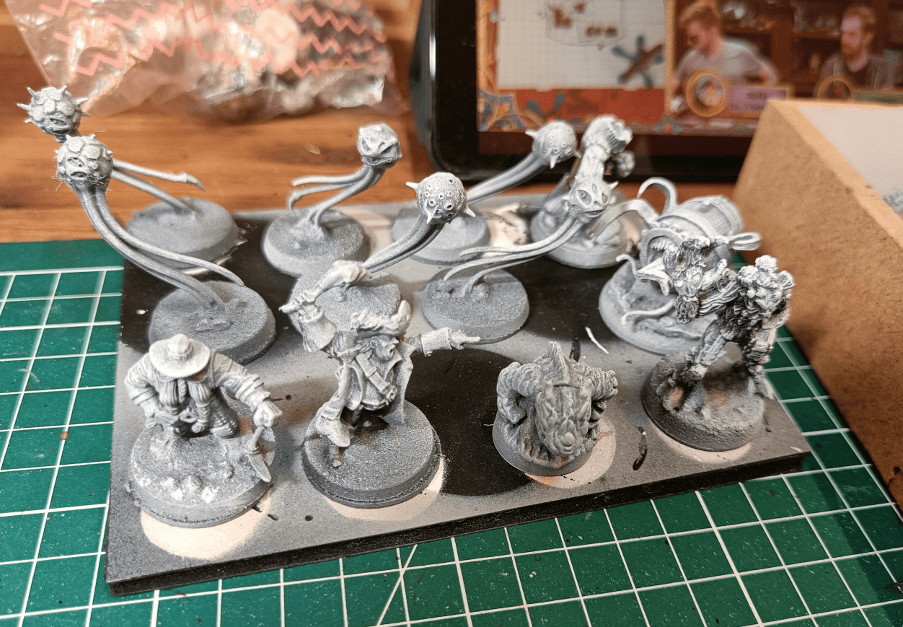

Here's everything after priming. The flying creatures in the back are Nurgle-themed miniature I bought secondhand. They're wonderfully disgusting, and I used them in a Pathfinder scenario when my players went through Feast of Ravenmoor, perfect for the horrible things happening in that village. Bottom right is an old Games Workshop Dryad from over 20 years ago when I was building a Wood Elf army. Behind it is a Barrel Mimic, which I love. In front is a small Fire Elemental from a Dungeons & Dragons miniature set. It's become the mascot for our Shadowmancer in Nimble. He took the fire pact and can summon it as a pet. The two dwarves in front, I can't remember where they're from.

<!-- Image 3 -->
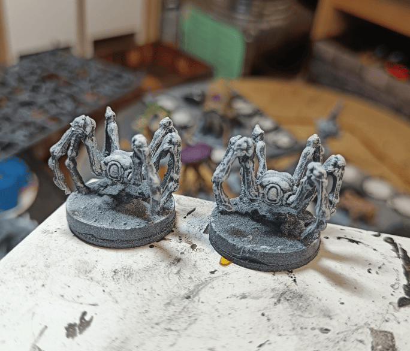

These are disgusting Alien-style spider creatures. I can't remember where I got them, but spiders are a monster type I rarely use because some of my players hate spiders in real life. These ones are particularly horrible.

<!-- Image 4 -->
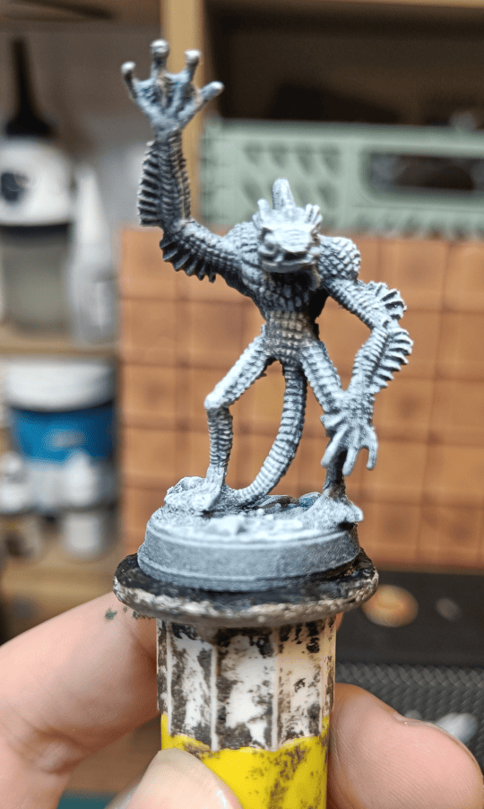

This is a Heroclix miniature that looks completely ridiculous, but I figured by painting it with very bright, strange, flashy colors I could turn it into some kind of alien from another world, something Lovecraftian. I didn't limit myself in this batch. I painted everything I had.

<!-- Image 5 -->
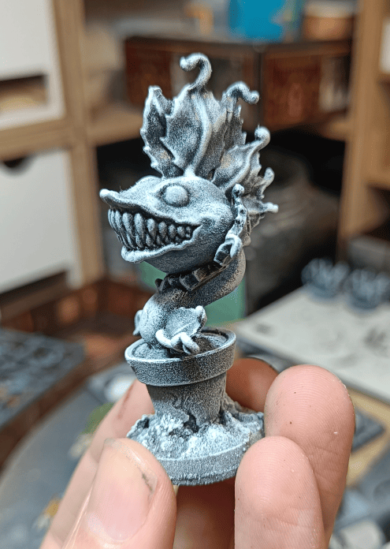

This is a small plastic toy, I can't remember exactly where it came from, but once painted it works really well as a carnivorous plant. It has a bit of a cartoon look, but there's enough detail that it reads well.

<!-- Image 6 -->
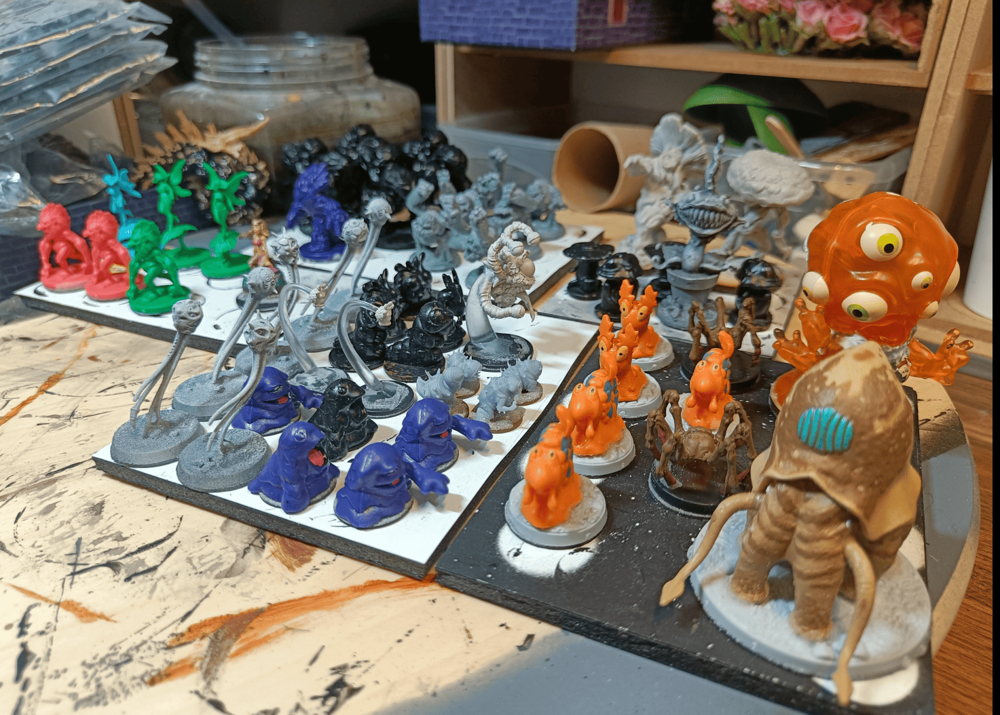

A quick shot of everything on my workspace just before I did their bases. They're all glued to their bases with magnets underneath. All that's left is to add some texture to the bases to secure them properly. I really wanted to use all the miniature I'd accumulated over the years. This was the moment to paint them. You can see lots of miniature that are normally Pokémon figures. I find that Grimer Pokemons [makes excellent ooze creatures](../oozes/). The horrible creature with all the eyes that I featured in another post makes a great alien-type monster.

<!-- Image 7 -->
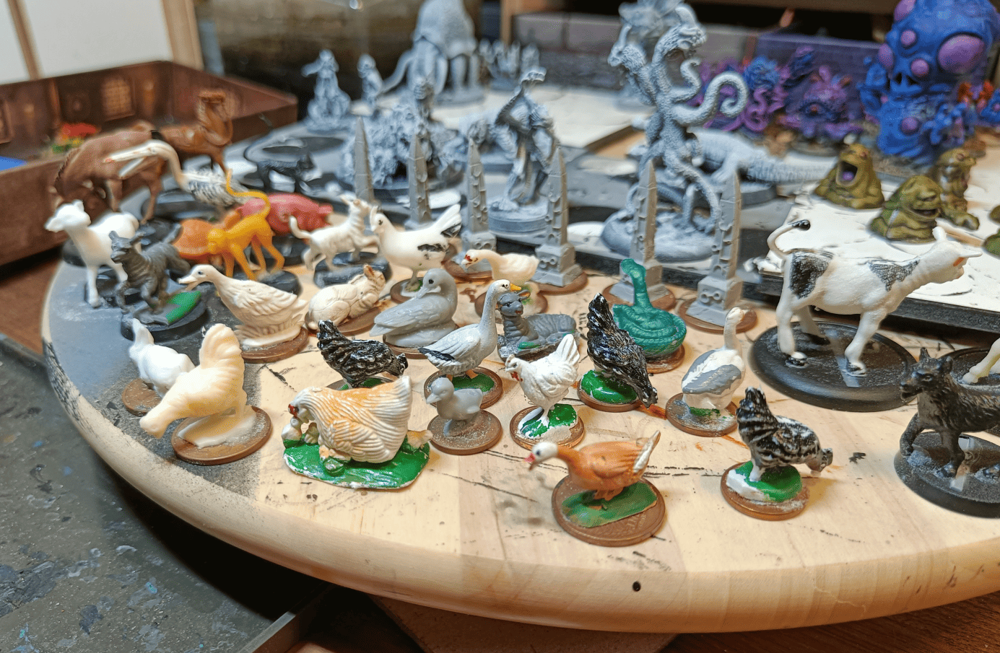

In the foreground are lots of small plastic farm toy animals. I glued them onto small coins to make bases, and they're incredibly useful for adding life and atmosphere to a scene. They make it feel like things are happening in a small village. They're very simple to paint, cost almost nothing, and add a lot of ambiance. You can also see behind them the creature with all the eyes, now painted in blue and purple, and the Grimer painted as well. These were in the Feast of Ravenmoor scenario as well, which had a very Nurgle atmosphere, so they fit perfectly.

<!-- Image 8 -->
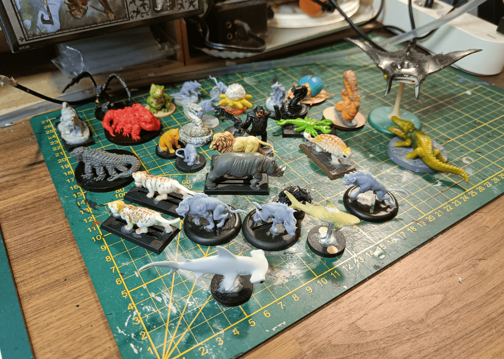

Here are lots of other creatures. Not farm animals, but a mix of snakes, wild beasts, lions, hyenas. I also have fish, two sharks that are plastic toys. I drilled a small hole inside and glued a nail so they look like they're swimming. The manta ray on the side is actually a manta ray I mounted on a golf tee planted upside down to make it look like it's flying. I quickly sculpted it with the tip of my glue gun. Nothing fancy, just making marks in the plastic so the surface is less smooth, has more bumps, and hopefully helps the paint stick better. I cut the back of the wings a bit to make it look more like it's flying rather than swimming.

<!-- Image 9 -->
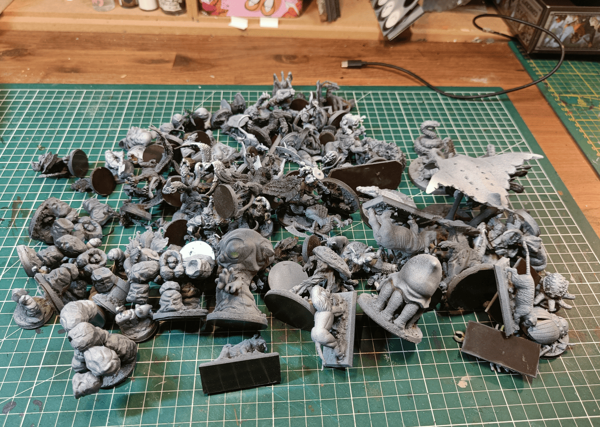

Everything's a bit chaotic here before I started painting it all.

<!-- Image 10 -->
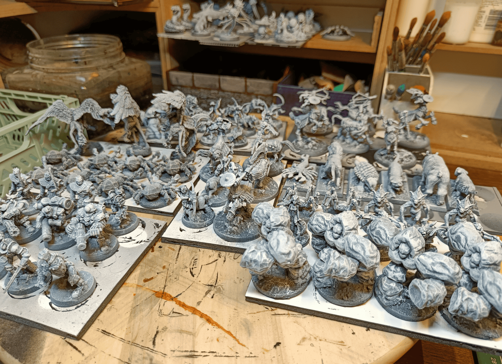

I set them all upright on small boards. These are foamboard planks with magnetic sheets glued on, so I can place my miniature on them and transport them fairly easily. I work board by board with a maximum of about ten miniature, paint all of those, then move to the next one. You can see in the back there are centaurs, griffons, more spiders. This was a really huge batch.

<!-- Image 11 -->
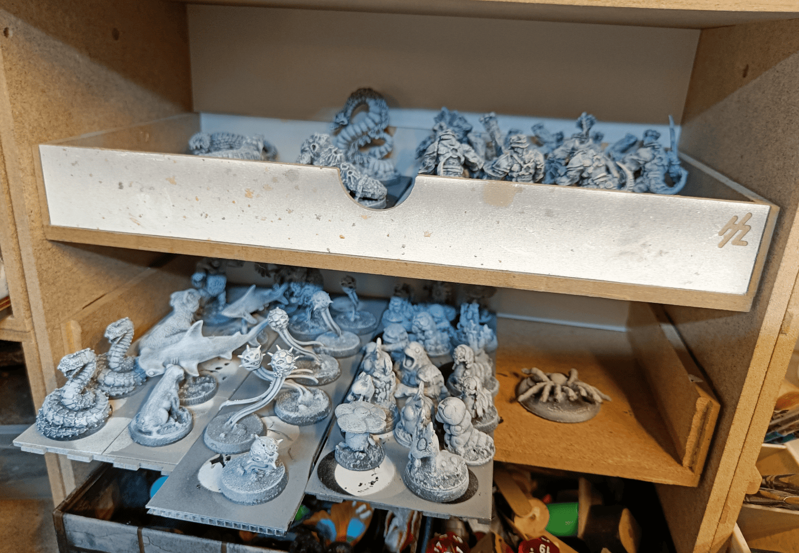

I have different shelves for what I'm currently painting. This was really full.

<!-- Image 12 -->
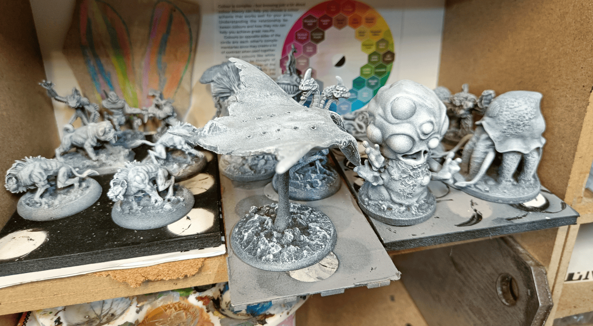

Here's a closer view of the manta ray in the foreground and next to it the big monster with all the eyes.

<!-- Image 13 -->
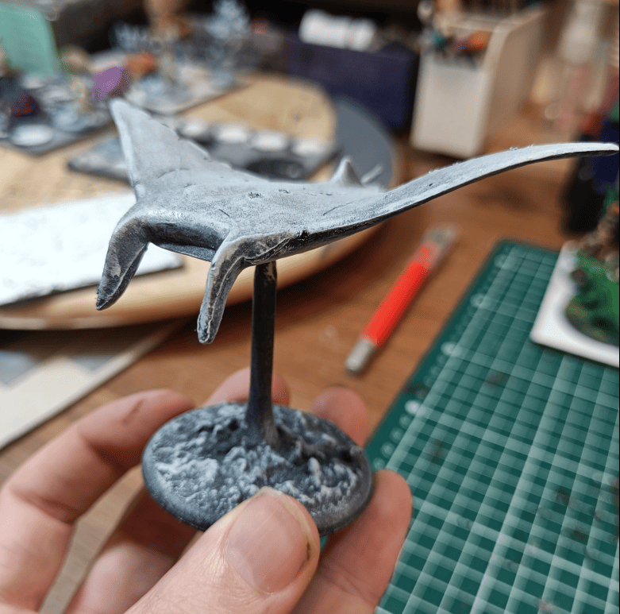

This is a closer shot of the manta ray. You can really see it's a classic plastic children's toy with mold lines still on it that I didn't bother removing, but once painted it works well enough. I wanted to paint it as a cloaker.

<!-- Image 14 -->
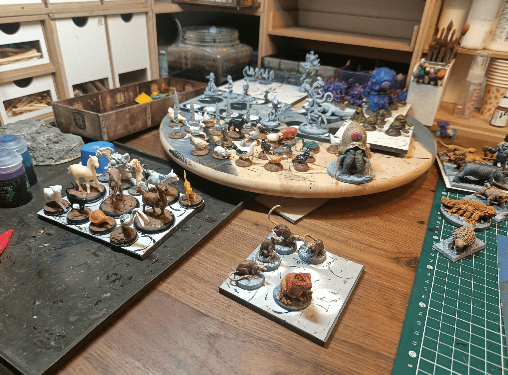

Things are progressing. I did the bases for my little farm animal miniature.

<!-- Image 15 -->
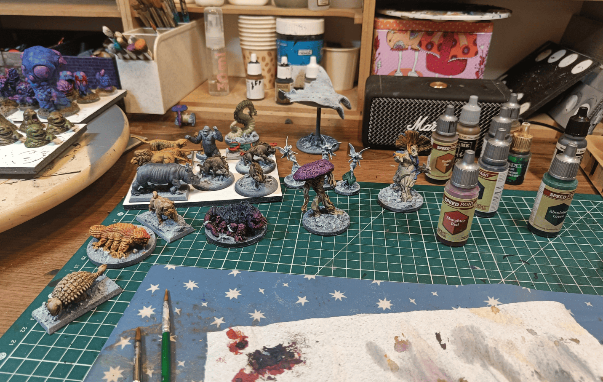

I'm starting to put base colors on the different creatures. For animals like the gorilla, rhinoceros, or lion, I really simplified things. I used two colors for each. For the gorilla and rhinoceros I used two grays. For the gorilla I put light gray on top, dark gray on the bottom, and blended one into the other while the paint was still wet. For the rhinoceros it's the reverse, but the Speedpaints do most of the work. For the lion I just painted the lion's coat one color and its mane another. 

The yellow monster in the foreground is a basilisk, so I did it in the same color as the basilisks I used to fight in Baldur's Gate, sort of yellow-orange. The other monster I didn't really know what it was. I wasn't very inspired to paint it, so I mixed colors to come up with something. 

But it was one of those miniature that I wasn't inspired painting. Same with the two mushroom men. I found them really beautiful unpainted, but when painting them they didn't inspire me at all. In the end I'm not super happy with how they turned out.

<!-- Image 16 -->
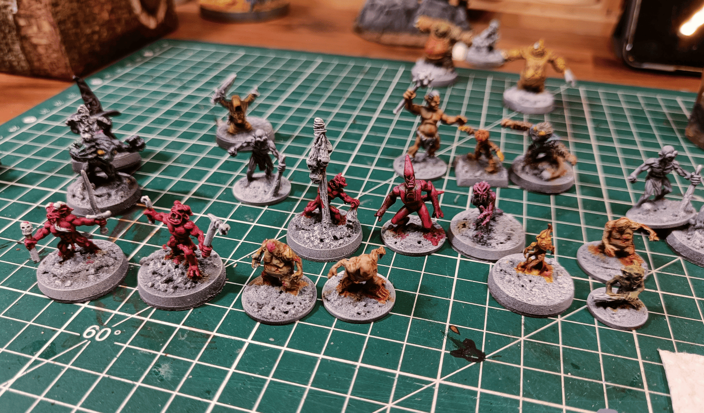

Here I tried to group together lots of little imps or small creatures, evil familiars, because in a scenario we played at one point they arrive in an old forgotten library where magical spells had been cast and all the books on the ground level were found open and scattered because the magic permeating the place had animated all the little creatures from children's storybooks on the bottom shelves. The players were attacked by dozens of small creatures from children's tales. I illustrated them with these. It was fun. Each creature could cast a different cantrip at the players, so it was a pretty creepy and funny moment.

<!-- Image 17 -->
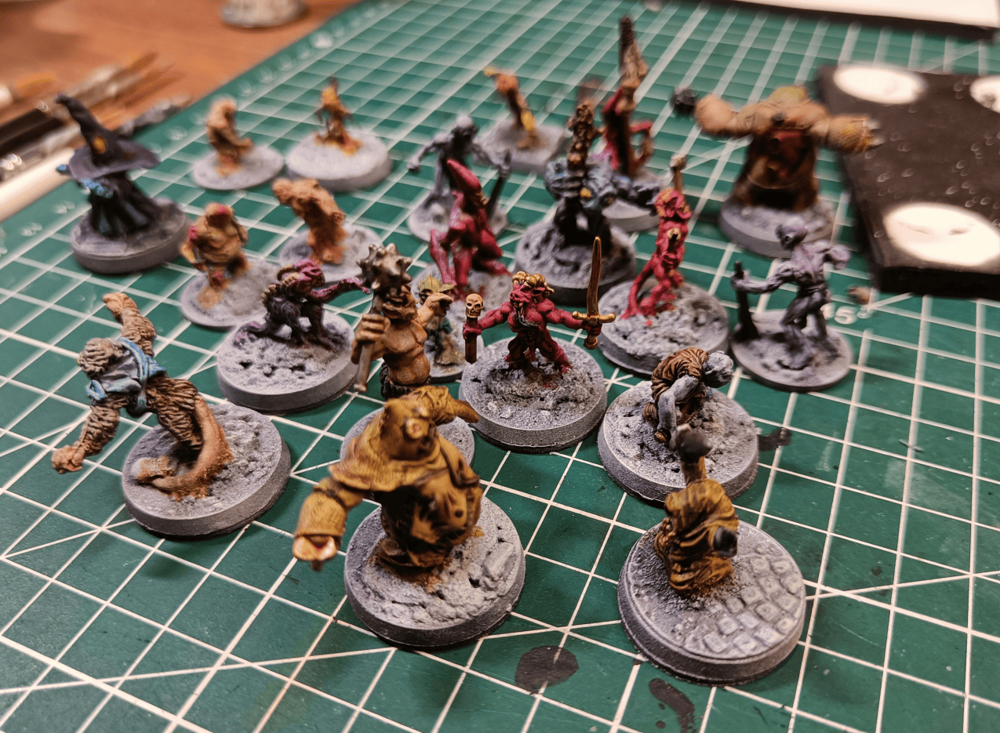

A closer view of them.

<!-- Image 18 -->
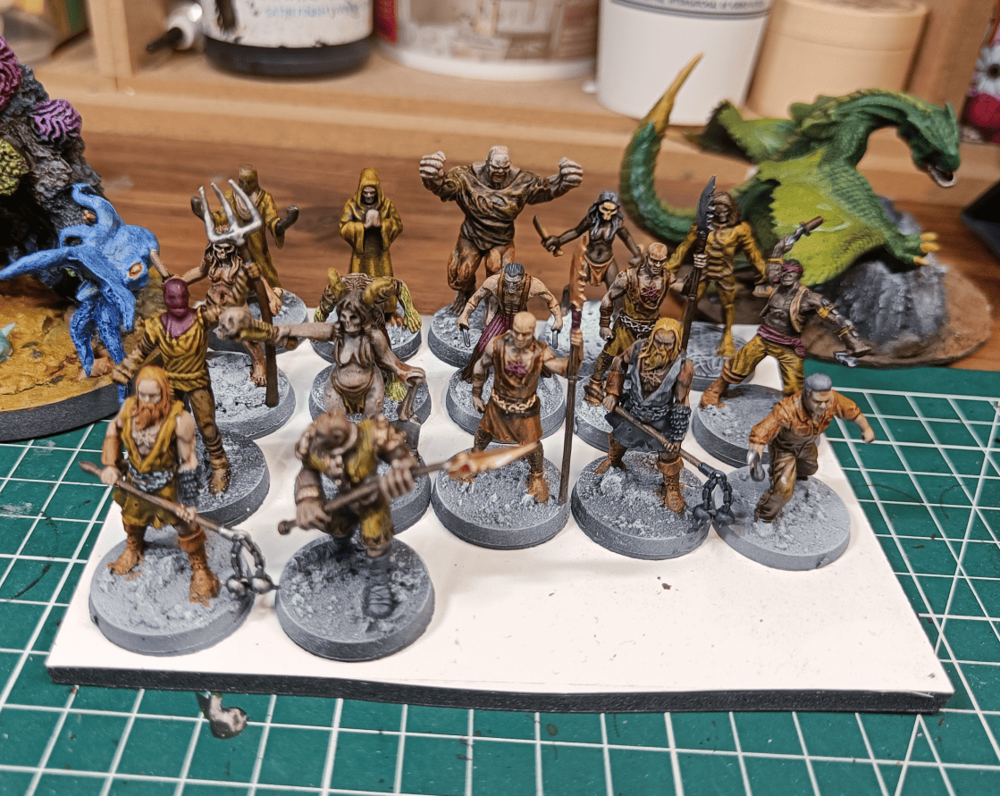

I needed cultists. I always need cultists in my scenarios. It's something that comes up regularly since I've been playing Warhammer. I wanted to make these people dressed in simple things. They are either in robes for their evil ritual in the middle of the night, or are peasants. 

The best-sculpted ones come from the Game of Thrones miniature game. Some come from Heroclix, some from other games, but they all share the same disheveled and self-scarification look. I painted them in this ochre color because it served two purposes. In one of my campaigns the players were fighting cultists of a sea god whose color was this ochre. In the other game we were playing, Strange Aeons, they're in Briarstone Asylum where there's a yellow fog surrounding it. This ochre worked well for that too.

<!-- Image 19 -->
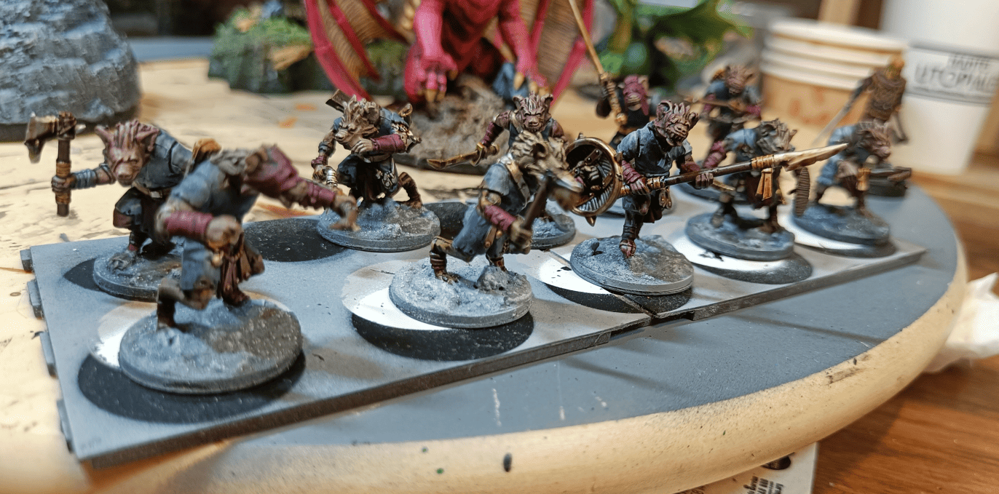

This is a group of gnolls. I found the miniature really nice, very well done for gnolls, much better than the ones I had. Either the ones I got from the World of Warcraft board game that are completely cartoon, or the ones I got from the Dungeons & Dragons board game that are way too stiff. These were good gnolls and I didn't use them right away, but about a year later in another game we played, when crossing the desert, my players were attacked by gnolls and I was able to use them.

<!-- Image 20 -->
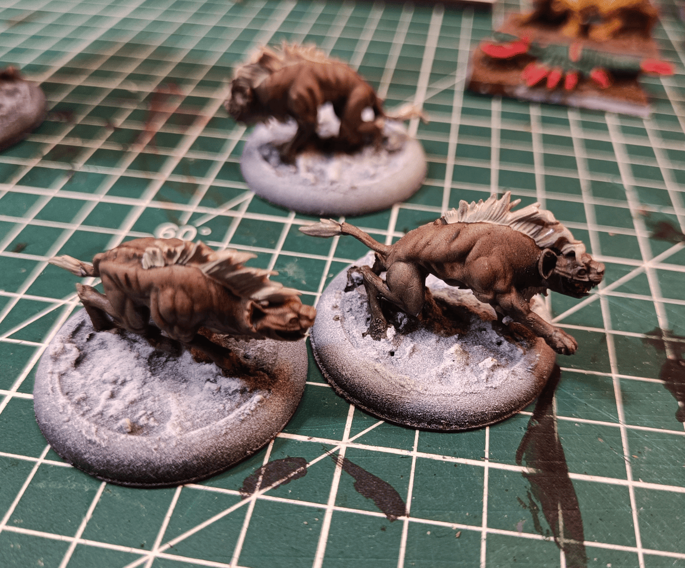

These are the hyenas that go with the gnolls. I think I bought them secondhand. They're 3D printed miniature. I don't have a picture of them fully painted, but I ended with a red wash finish and it gave them a nice bloodied look.

<!-- Image 21 -->
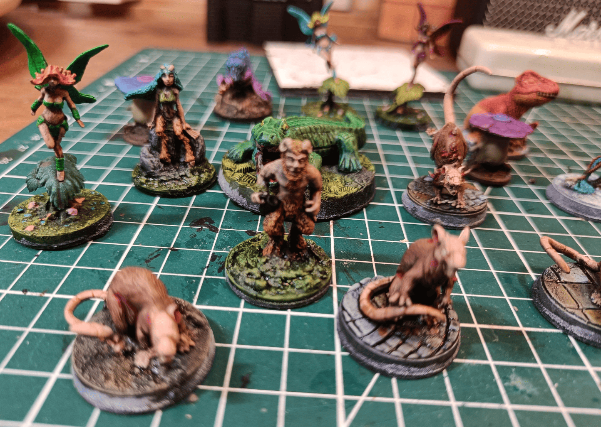

This is a mix of Feywild creatures and dire rats. For the Feywild creatures I changed how I did my bases a bit and made green bases with little flowers. The fey miniature come from a board game, I can't remember which one. They're pretty nice because it's hard to find pixie/sprite miniature. Usually they're tiny and break very easily. These are a bit bigger so they work well.

<!-- Image 22 -->
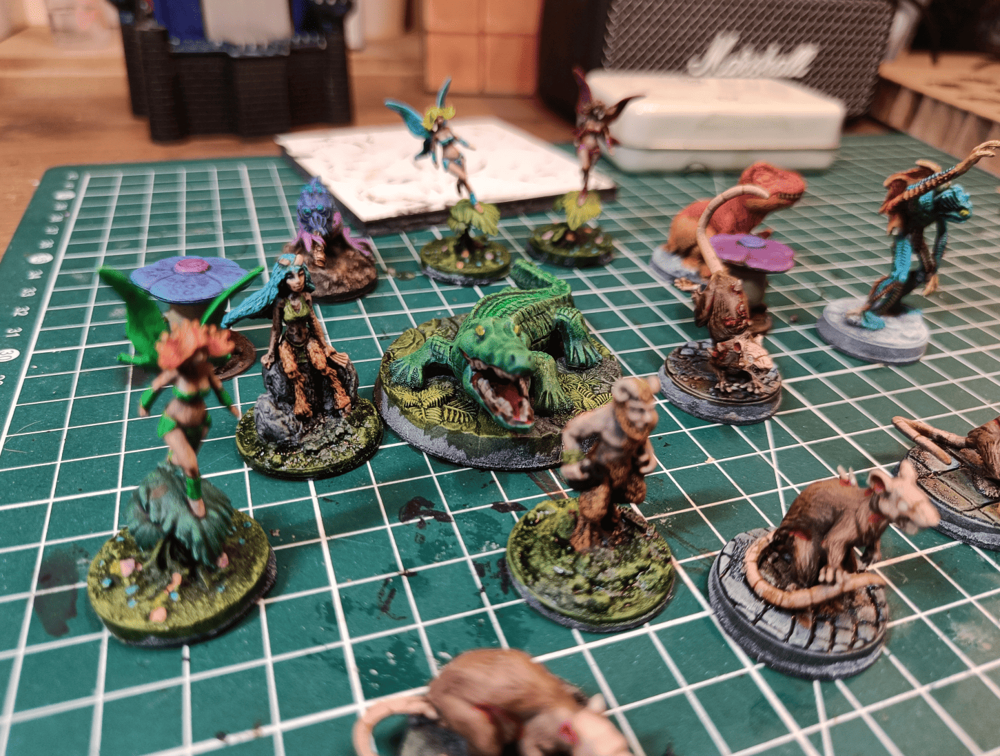

Same thing from another angle.

<!-- Image 23 -->
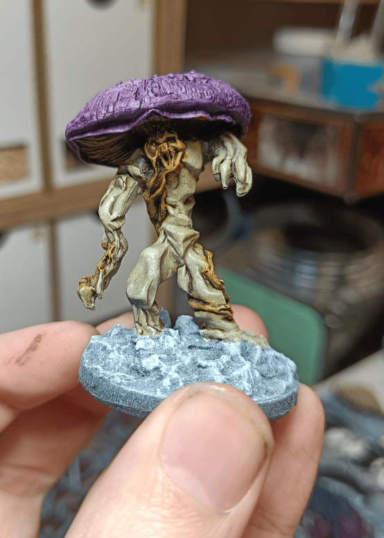

This is the mushroom I mentioned earlier. I'm not super happy with the color scheme I ended up with. The sculpt seemed interesting but once painted it really didn't inspire me.

<!-- Image 24 -->
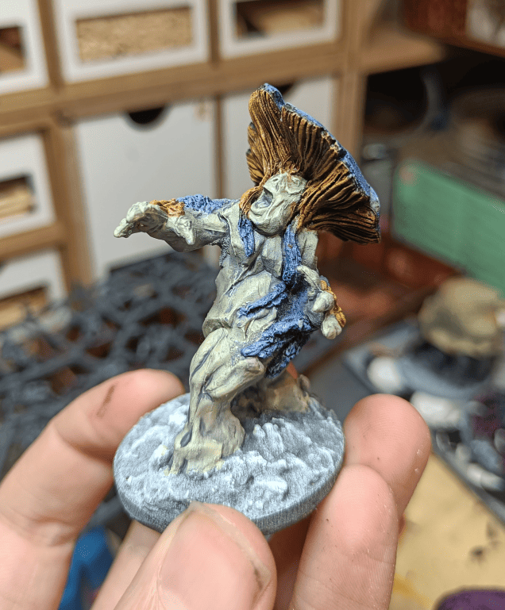

Same thing. I find its posture is too stiff. It's a shame but these miniature didn't inspire me at all.

<!-- Image 25 -->
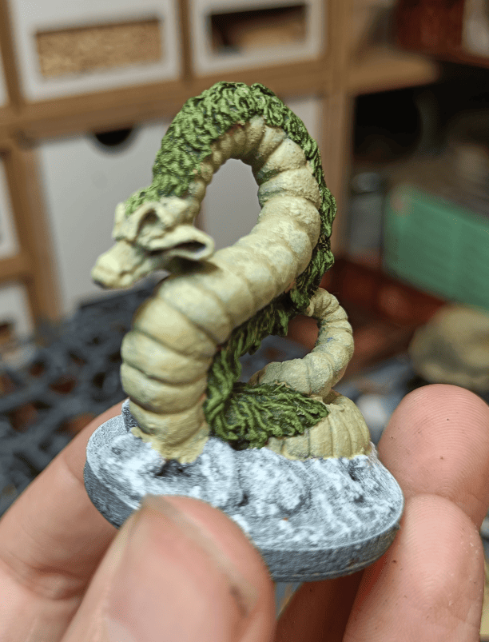

This is a kind of snake with hair. It's a metal miniature from ages ago, maybe Ral Partha, I don't know exactly where it's from. The miniature is nice and we used it in a game at one point. I think when my players were being chased through a pipe in the sewers, they were pursued by this.

<!-- Image 26 -->
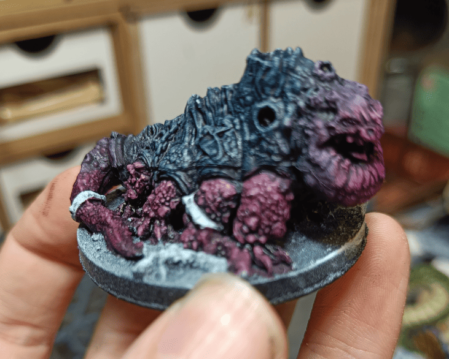

This is that strange creature I mentioned earlier. Same thing, it didn't inspire me much to paint it. I don't know if it's because I was painting so many in a row or because I had no exact ideas in mind of what it would be used for, but I wasn't inspired to paint it at all.

<!-- Image 27 -->
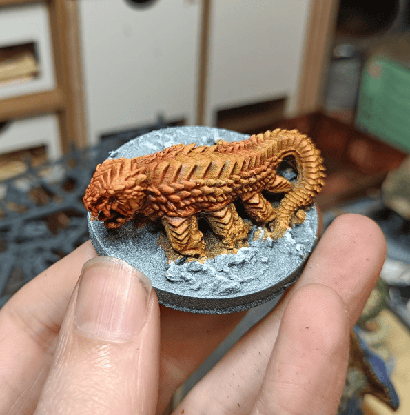

This is a basilisk. We used this one well. It was interesting. We had a scene with my players where they were in a room separated by a pit and the basilisk was on the far shore and they were fighting skeletons on their side while risking being petrified at the same time. It was pretty intense.

<!-- Image 28 -->
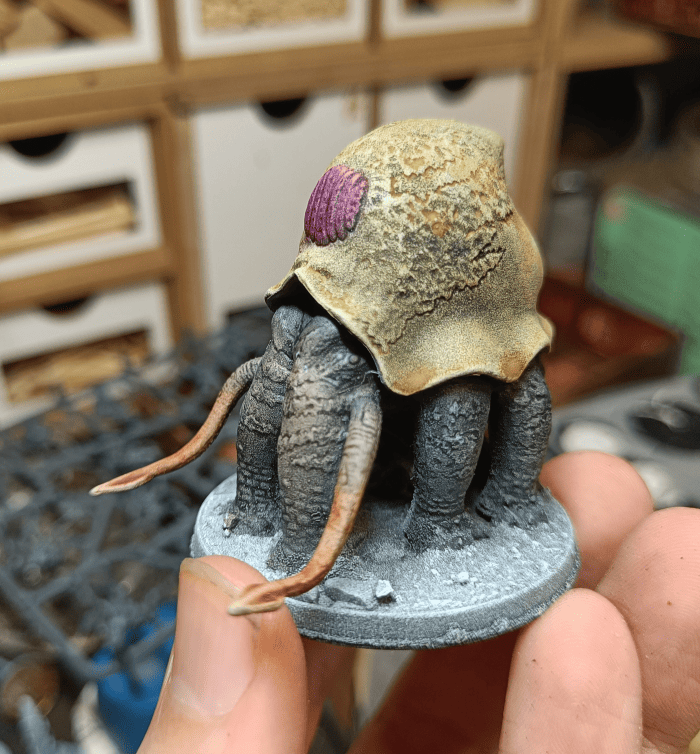

I can't remember where I got this. Maybe from a board game, I don't know. Same thing, not inspired at all to paint this thing, so I put colors on it but I have no idea exactly where I'm going and I think it's been sitting half-painted on my workspace for over a year and I still haven't finished it.

<!-- Image 29 -->
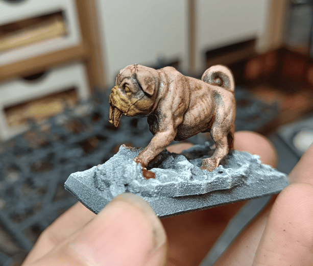

This is some kind of pug with teeth. The miniature has really heavy mold lines - I didn't find it super interesting, it's too kitsch and cartoon, but in the end I still managed to paint it all. 

Painting this many miniature in a batch taught me a lot about Speedpaints, color choices, and which miniature inspire me most. Some didn't work out as planned, but most turned out well. It also helped me streamline my paint collection to just the colors I actually use.

<!-- Image 30 -->
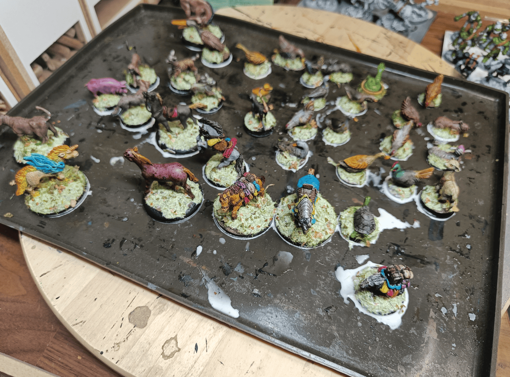

I found some photos from when I was doing the bases for all the farm animals. 

For realistic grass, I spread wood glue on the base with a damp brush. Without water it's too gel-like, but a wet brush makes it smooth. Then I apply a mix of fake grass, dried kitchen herbs, and modeling grass. It looks more natural than perfect lawn grass. After pressing it down firmly with my finger, I spray it with water and flow aid, then use a pipette to apply diluted glue on top. The flow aid makes everything spread by capillary action. Once dry, all the grass bits are glued into a hard surface where you don't see the glue.

<!-- Image 31 -->
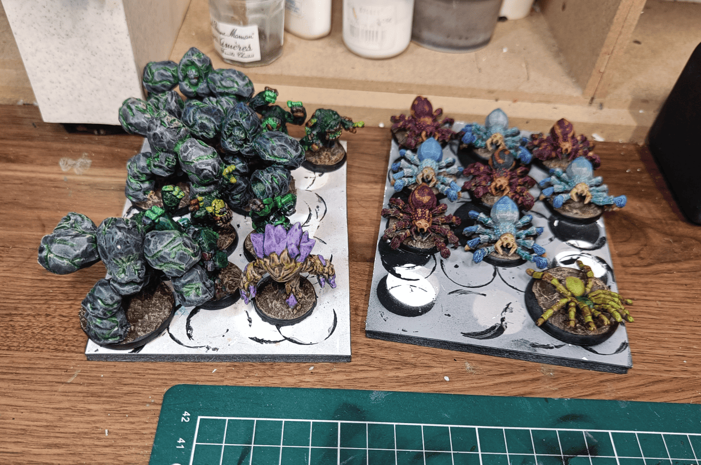

Here are other miniature you haven't seen before. On the left are stone elementals from the World of Warcraft board game. Good miniature where you immediately understand what they are and that they're tough. The purple one turned out really well with just two Speedpaint colors. The [green ones I made a whole post about](../stoneElementalsColorTests/) to test green colors, but I find them pretty ugly.

On the right are spiders, also from World of Warcraft. I didn't want natural tones since I already have too many spider miniature. I gave them special colors to make them more interesting in games. The blue ones work as phase spiders that can disappear and reappear. The others look more venomous. I did stripes on the green one to evoke danger, and painted symbols on the spiders' backs for that dangerous look. [I painted a much larger spider](../spiderMatriarch/) with similar techniques later.

<!-- Image 32 -->
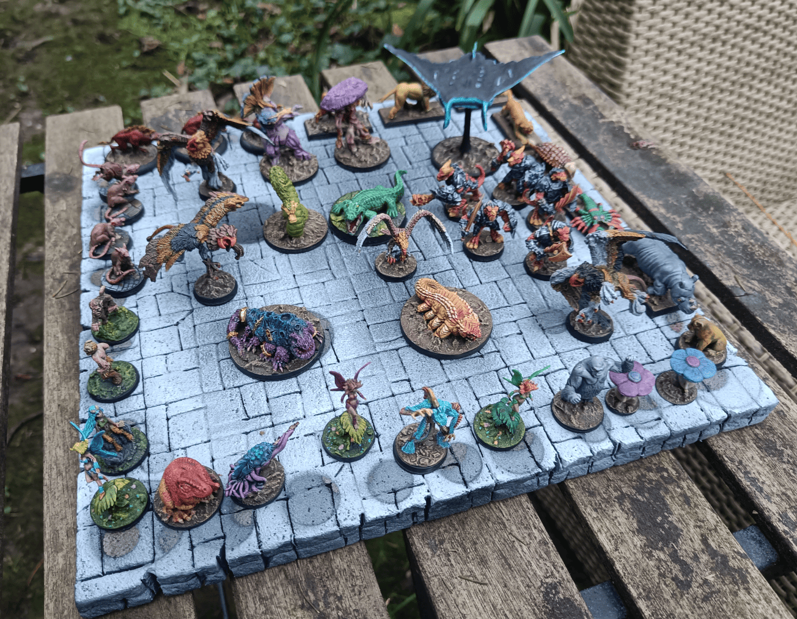

A big family photo of everything I painted. It's satisfying to see it all together like this. I spent very little time on each one, but displayed together it looks really good. Many are Kinder toys, plastic farm and zoo animals. Cheap stuff that costs almost nothing, not expensive miniature. The perfect example is the cloaker at the top. It's just a manta ray toy mounted to look like it's flying and painted with bright colors, but it really looks like a cloaker.

