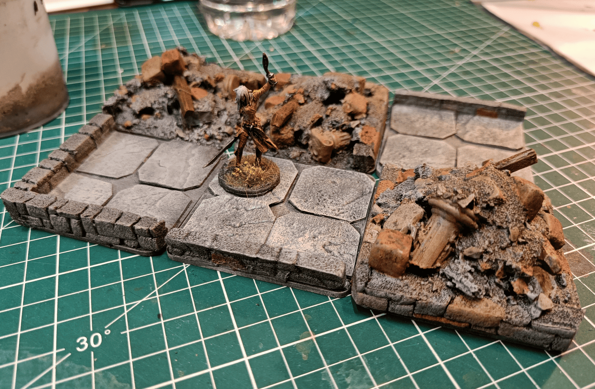

I don't really have photos of the build process for these debris pieces. I made a batch of 2x2 tiles like you see, following the Wyloch technique (at least in terms of shape with small walls, not using the same materials). 

I needed to make tiles to indicate that the path was blocked, so I made big debris pieces like that. The majority of the space is filled with crumpled aluminium foil, on top of which I glued some foam bricks, pieces of stuff that came from here and there, a little bit of wood for collapsed beams, and then a mixture of dirt and spackle to cover it all.

It works well, but if I had to do it again, I wouldn't put it directly on tiles. I'd make it as a scatter terrain element that I can place wherever I want to indicate that something is blocked. Because in the end it turned out really well, but I can only use it when I'm using tiles of that specific size. I can much more difficultly use it on a battle map for example.