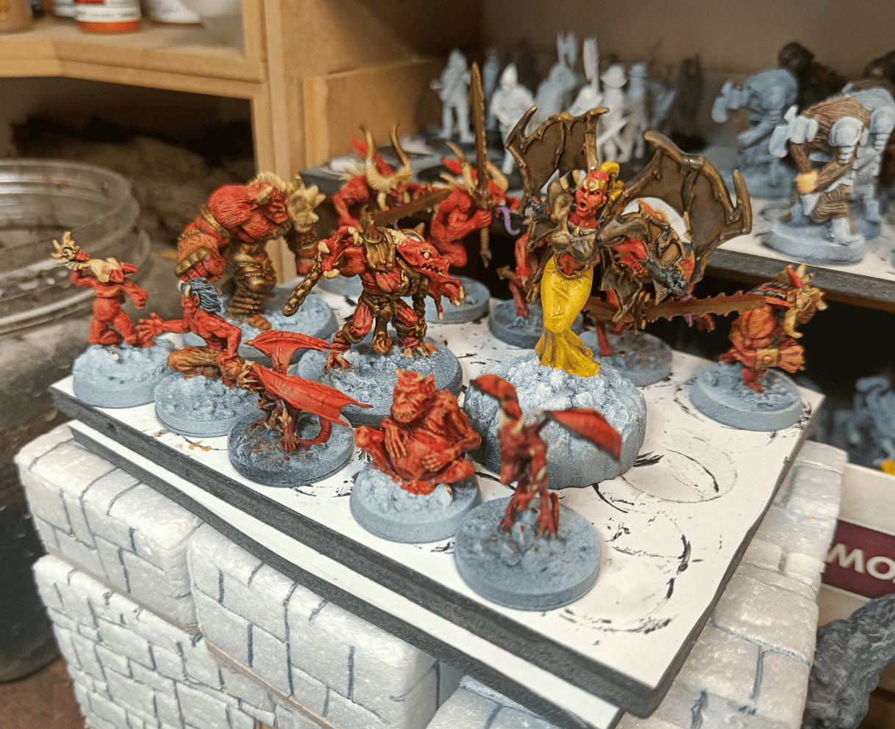
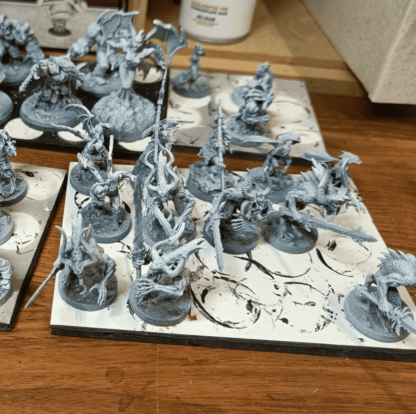
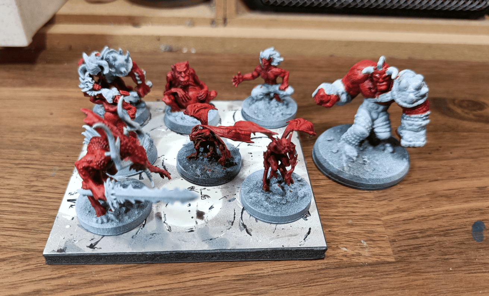
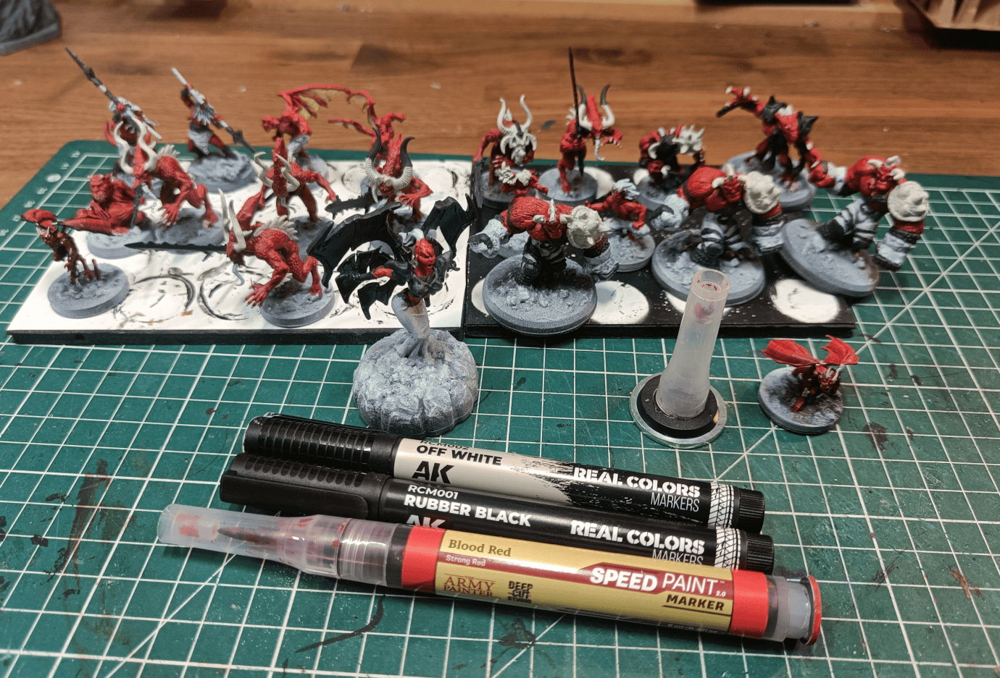
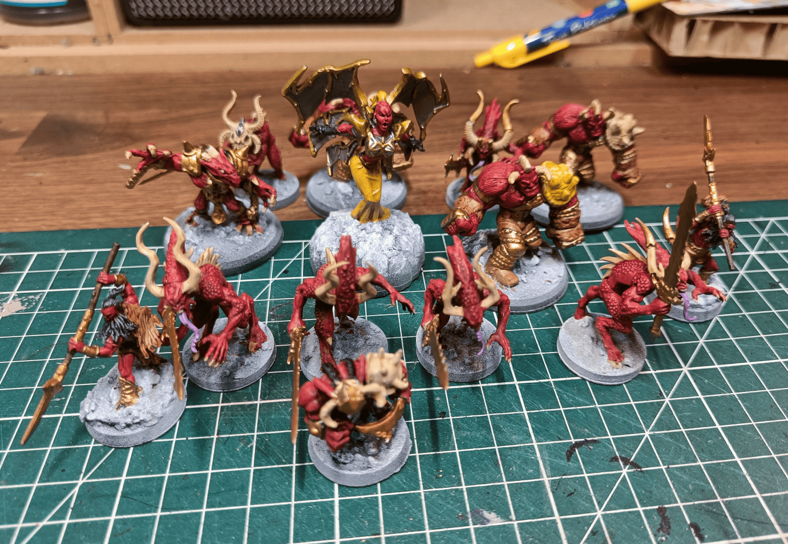
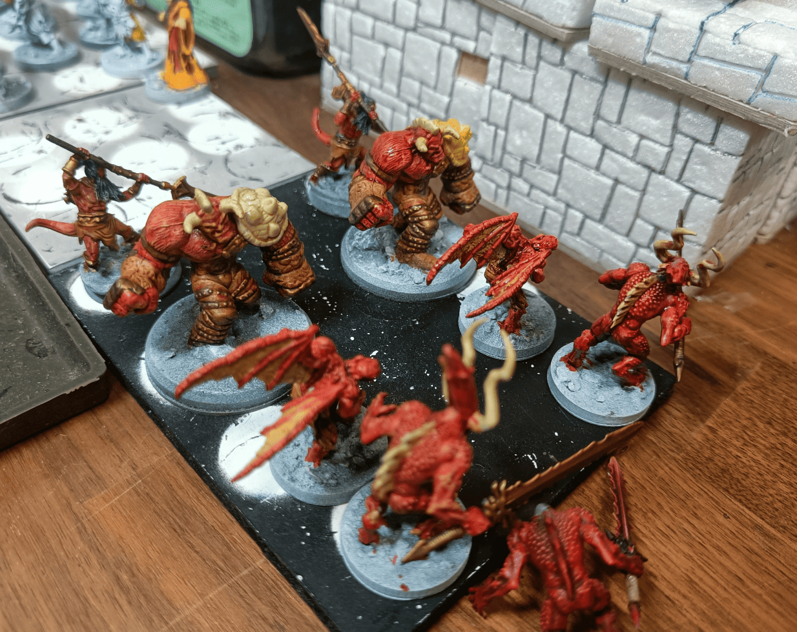

<!-- Image 1 -->

This documents how I recently painted a whole unit of devils. We used them in a game and I think today in 2026, this represents well where I am in my painting comfort zone. The miniatures aren't completely finished yet. I still need to add a few small details like more variation in the armor colors with some bronze or gold elements, and of course I need to paint the bases, but I'll have a dedicated post on how to paint lava bases.

<!-- Image 2 -->

Here they are at the priming stage. What's interesting is that I gathered miniatures from all over the place: horned demons I found at a garage sale already painted (very well painted actually, but I wanted my miniatures painted by me, so I redid them), Heroclix miniatures, official Dungeons & Dragons miniatures like the Bearded Devils, and 3D prints I got from somewhere I can't quite remember. Basically a mix of everything. As long as it looked potentially a bit demonic or reptilian with horns, I figured it could make a good devil.

<!-- Image 3 -->

Here I started applying the first coat, Blood Red Speedpaint. I have the Speedpaint Markers, which are like pens, and I just did that. My goal with this unit was to check if these Speedpaint Markers were really practical, [similar to my creature batch experiments](../creatureBatch/). So I tried to limit myself to the colors I have in Speedpaint Markers and see how far I can go with that. I painted their skin with that color, and even though they come from different manufacturers, it unifies them all together into a somewhat cohesive unit.

<!-- Image 4 -->

Here you see a bit more progress. I used the Blood Red Speedpaint Marker and also markers from the AK brand, the Real Color Markers. Those are real markers with a tip like a felt pen, whereas the Speedpaint Marker has a tip a bit like a felt pen but you can tell there's paint inside. 

I found that painting with markers for certain elements was really practical because I can do it pretty much anywhere. For example, painting all the armor elements in black is really like 3D coloring, quite simple to define where things are. Similarly, I used Off-White for all the parts that are supposed to be bone: all the horns on their heads, on their backs, their claws. I haven't done it on all of them yet, but that's what I'll do at this stage.

<!-- Image 5 -->

We've progressed a bit. What I did additionally here is that I applied a Pallid Bone Speedpaint over all the horns and bones once I had put the Off-White marker. I added gold or bronze, from another AK product, they make other pens with metallic colors and I think that's how I did all the metal parts. 

For the beard or hair, I used a black Speedpaint directly on top. Sometimes I used gold and silver pens, particularly for the armor details of the large demon with wings in the middle. Bad idea, because it's water-based paint, so when I applied Nuln Oil over it afterward, it started to run a bit. It created a somewhat rusty metal effect that wasn't what I was going for, but could be interesting if that's what you're looking for.

<!-- Image 6 -->

I wanted to test if adding a Games Workshop red wash on top would improve things. You can see on the right column I put a red wash on all the body parts, and on the left column I didn't. It might not show up in the photo, but comparing the two, the wash gives a slightly shiny finish that I don't really like. I found it looked better without the wash, just with the Speedpaint. 

I was pretty happy to have managed to paint all this with just markers and Speedpaint markers. After that, I bought a bunch more AK markers and the entire collection of Speedpaint markers from Army Painter. I have tons now. I have my little mobile painting box, so I don't need to be at my workshop to paint. I can just take my box, sit down at my table, and color. It's very enjoyable.
