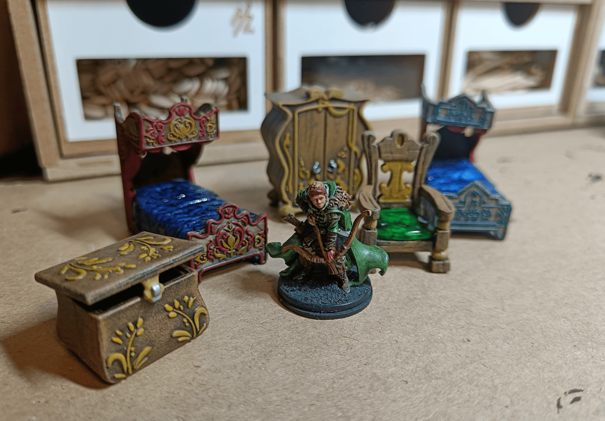

Quick share about some furniture pieces in my collection that are actually from Disney toys. The two beds are Elsa and Anna's beds from a Frozen castle toy set. I think the chest, wardrobe and chair come from a Tangled toy.

The little figurines are completely the wrong size, but the small furniture elements are perfect scale and super practical to reuse. They're made in one solid piece of plastic, the chest actually opens so you can put things inside, there's nothing to assemble, it's super solid and works right out of the box.

It's obviously very expensive if you buy it new just for that, but if you get the chance to find some, they're perfect.