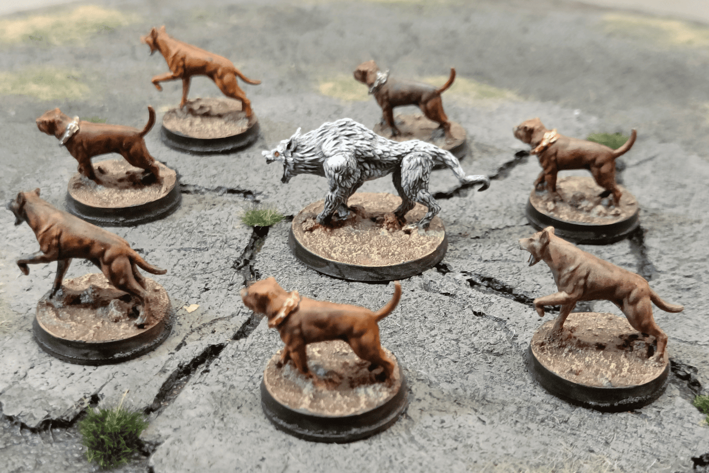
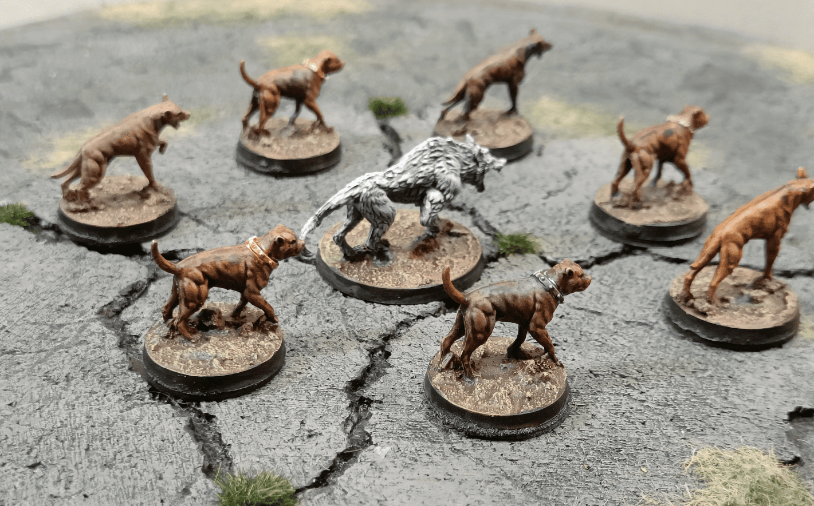

Just sharing a few photos of some dogs I painted with my speedpaints. Speedpaints are really quite magical because even on miniature like these that are relatively smooth (at least the brown dogs), just a single coat of speedpaint gives a relatively acceptable effect. A more experienced painter could have done something much better, but I'm fine with that quality level.

Similarly on the wolf in the middle, it's also a single layer of speedpaint, and since there are lots of details, it looks even better. Speedpaints have really been a revolutionary discovery for me in the way I paint. I go 3 to 4 times faster and I enjoy it much more because I can put painted stuff of very good quality on the table much more quickly and easily.

