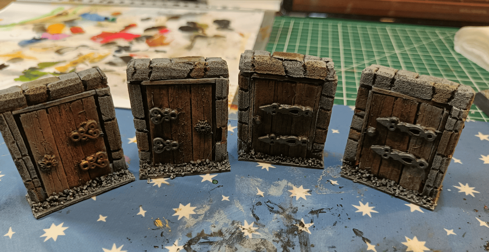
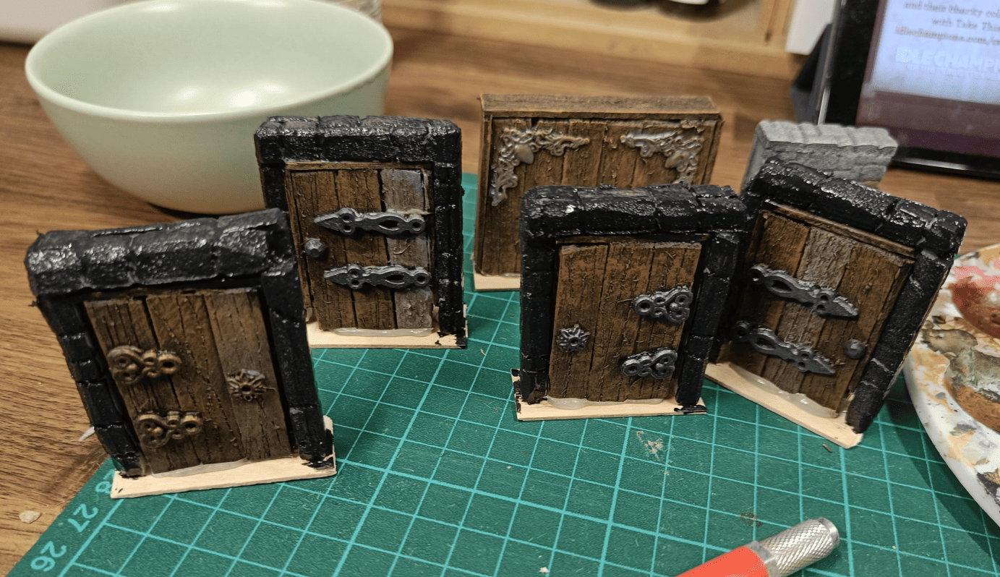

Quick post about my DIY doors that I still use today! They're not the prettiest and they don't actually open, but they're solid and you can tell immediately what they are.

For the main frame, I used some wood pieces I found (I think they were Kapla or something similar) and glued them vertically. That adds some nice weight to the structure.

Then I took popsicle sticks and engraved wood grain grooves into them using a Swiss Army knife. I glued three of these planks vertically on the front, back, top and sides.

Added some small steampunk beads for hinges and a lock detail. Painted everything brown with dry brushing - did a lighter brown layer and then beige on top. The metal pieces got silver paint.

I also made a frame around the whole thing using polystyrene. I engraved it with a pen and mechanical pencil to create brick shapes, then glued it onto another popsicle stick for a solid base.

They're definitely not perfect but they've held up really well over the years. The photo I'm sharing was taken before I finished painting the stone frame, but I'm still using these doors to this day.