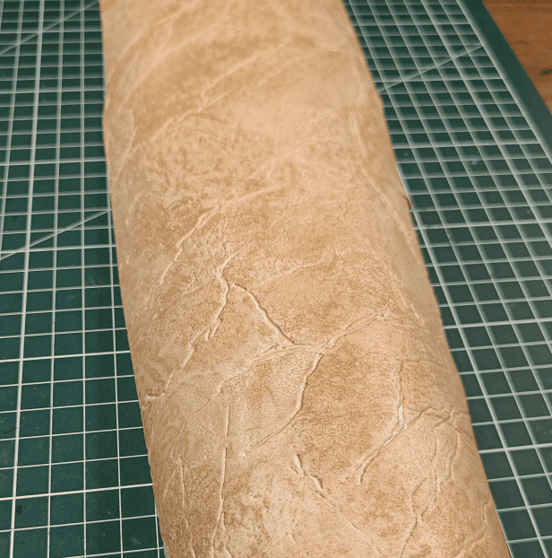
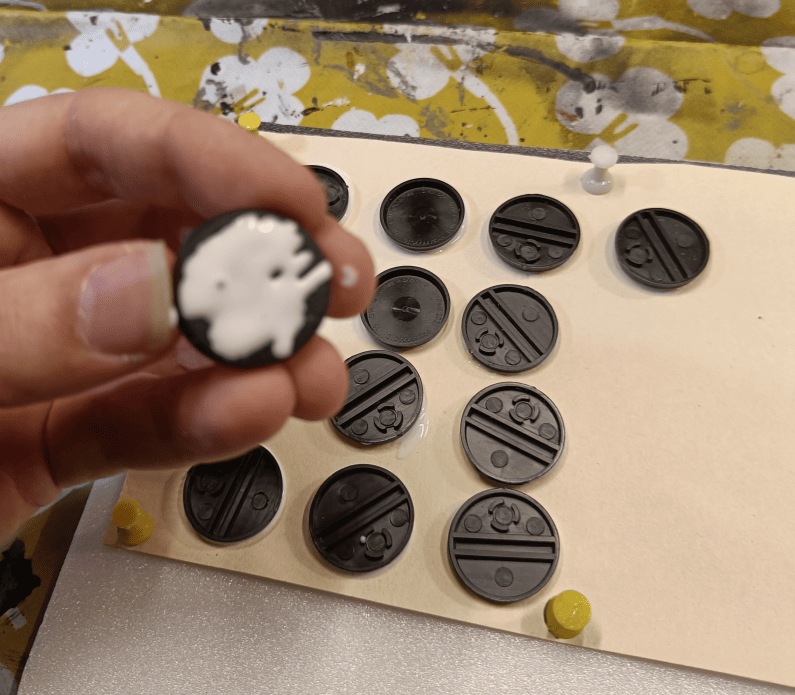
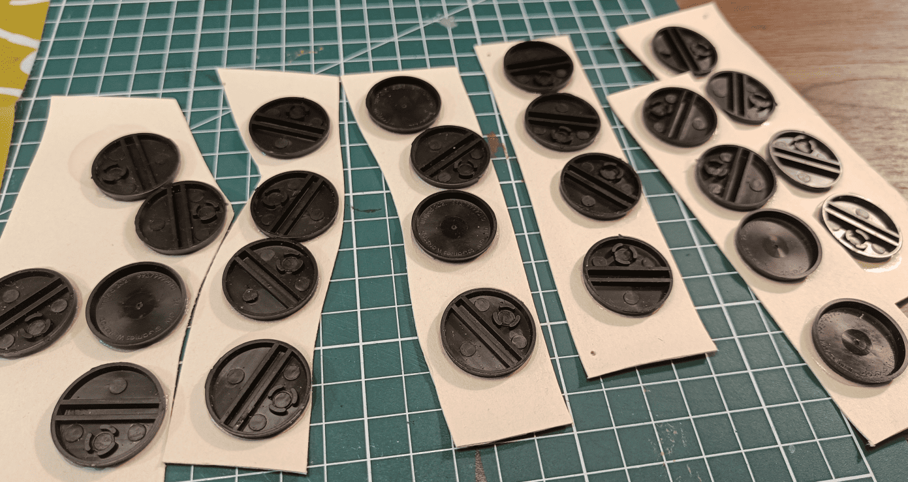
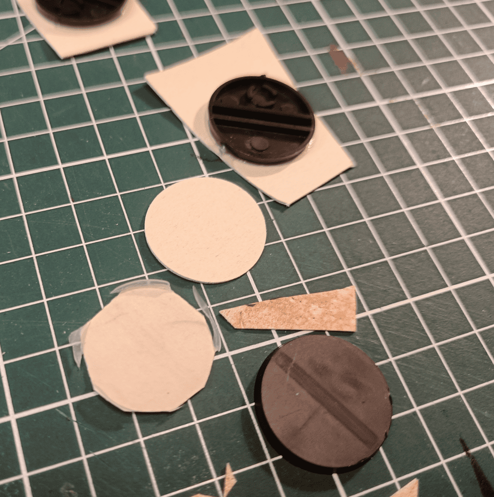
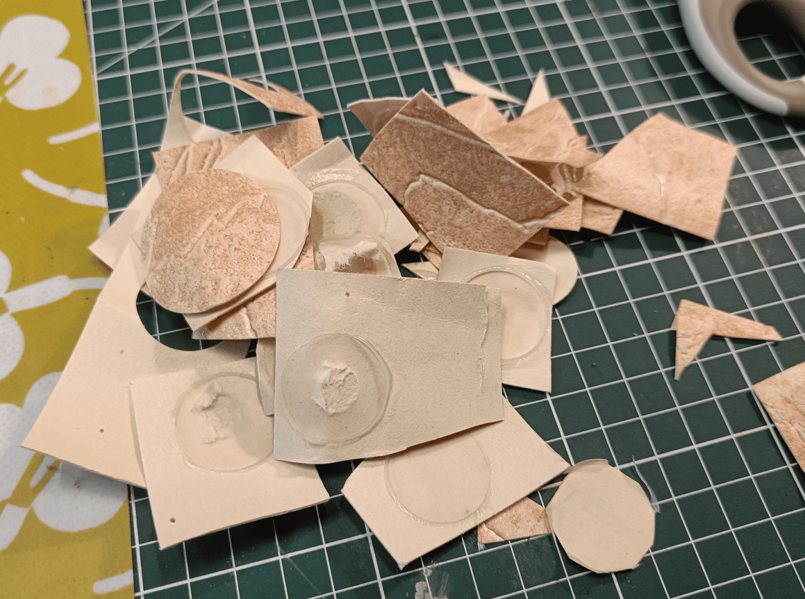
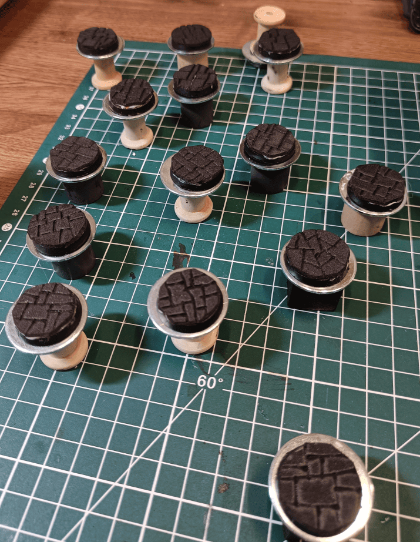
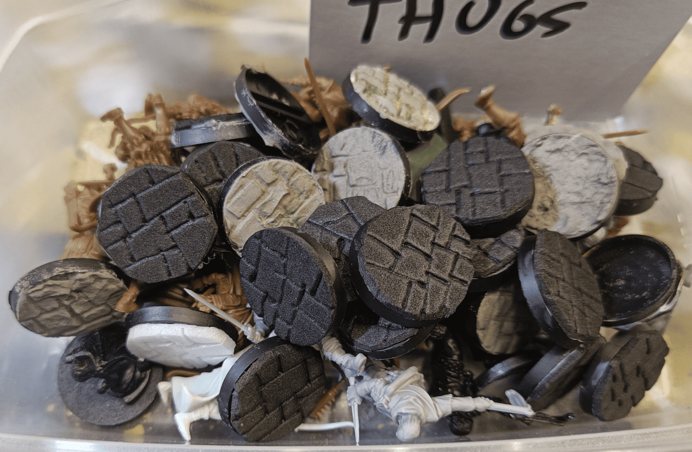

I've been looking for a technique to texture miniature bases really quickly and keep them consistent across all my minis. Did some experiments recently, that I'm documenting here.

First one was with linoleum wallpaper - the kind I've used before for scenery. What's great about it is the texture is actually raised, about 1-2mm thick, with these nice cracks in relief. Thought it might work well for bases.

Unfortunately, the material comes into rolls, and so doesn't stay flat on large pieces. What I did was to put the texture upside down on a foam board and pin it there. The foam is key because it lets the pins actually hold.

I then glued multiple bases upside down on it. My idea was to then just cut around each base with a cutter or scissors, and get perfectly textured bases ready to go. Saves a ton of time when you're doing a bunch at once.

I let it dry well so the glue would hold properly, then I started making strips like that and cutting all around each of the bases.

Unfortunately it didn't work at all. Even after letting it dry for a very long time, the glue didn't stick between the bases and the material. It  was a complete failure.

Maybe it would have worked better with a different type of glue, but I'm not sure what. I didn't want to use super glue because I would have needed a lot of it. So I ended up abandoning this experiment.

So instead I tried something different - I used these soft foam sheets. You know, like the foam craft sheets kids use sometimes? They cut really easily. I grabbed a black one and did basically the same technique as before.

I made a circular template in the right width, cut out a bunch of pieces, and glued them onto each base. The cool thing is since the foam is full of little holes, the glue soaked right in and held super well.

Then I used a pyrography pen (maybe a bit too hot actually) to carve out the individual paving stones on top.

The final result is very good! It's a technique I'd potentially reuse later.

The main difficulty is cutting round shapes that have exactly the same diameter as the base underneath. Since I cut with scissors in a not-very-clean way, the edges are a bit rough at times.

The base remains soft afterwards, even once painted. It's still very soft foam full of holes - even with paint, glue, and varnish, it stays soft. So what happens is that the miniature just break if you only glue them. It happened to me several times - had to repair miniature because they detach when dropped. The attachment point between the two isn't super strong.

If I do this again, I'd probably need to insert small metal strips under the miniature' feet to properly anchor them inside the base. Which might be a bit too much work compared to what I'm doing now. So maybe I need to find a better way to glue them together.

It holds well to the base this time, but not excessively well to the characters' feet.

But the effect works very well and it's super fast and super easy to carve flagstones like that.