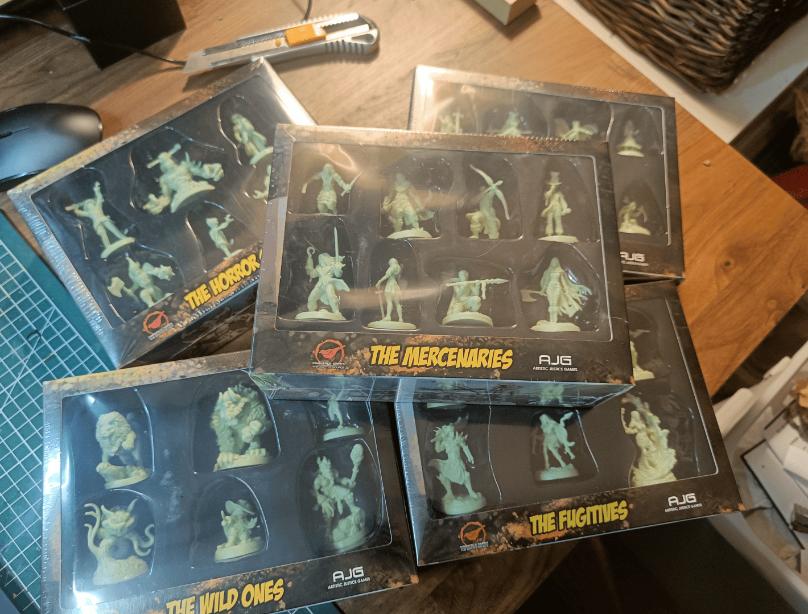
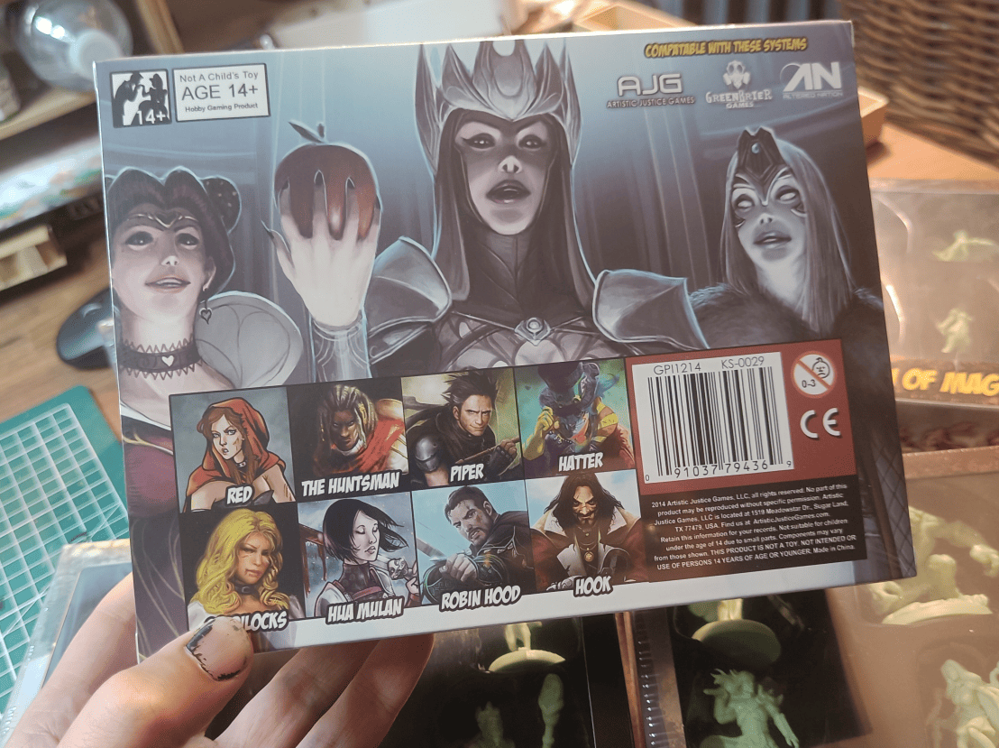
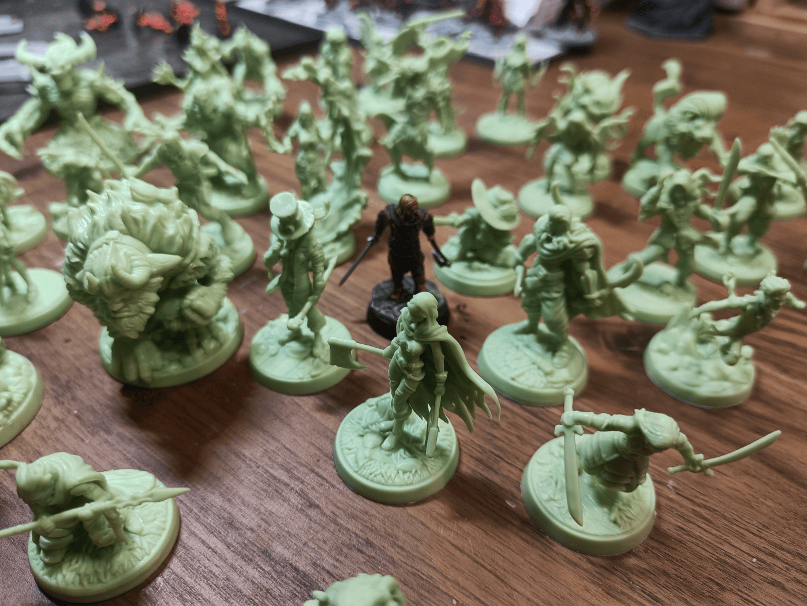
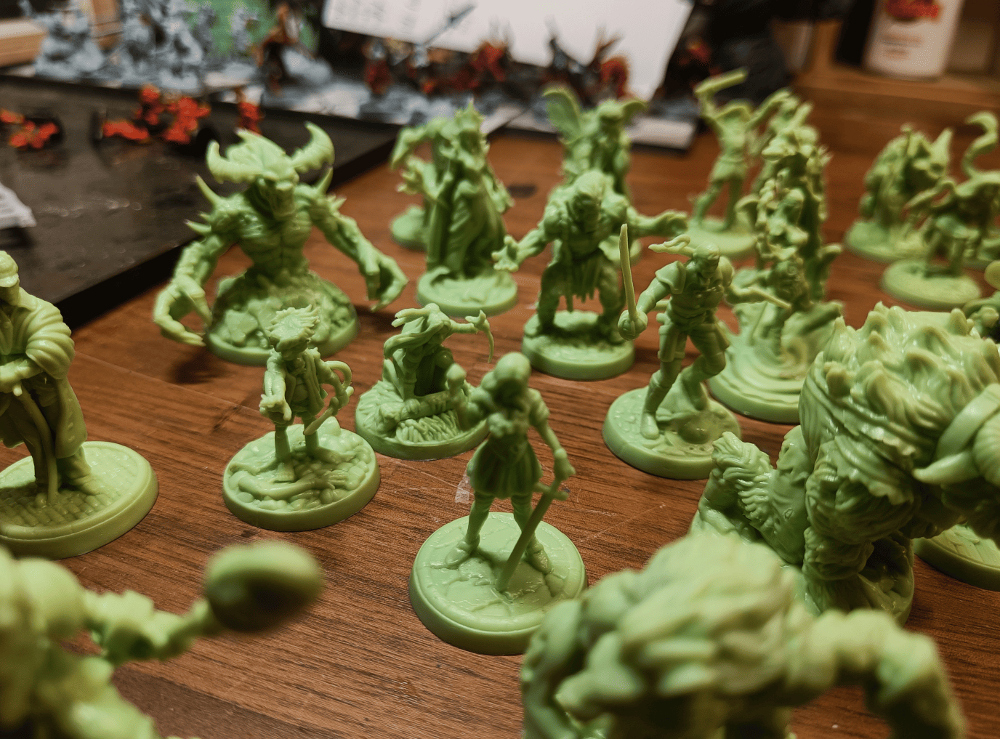
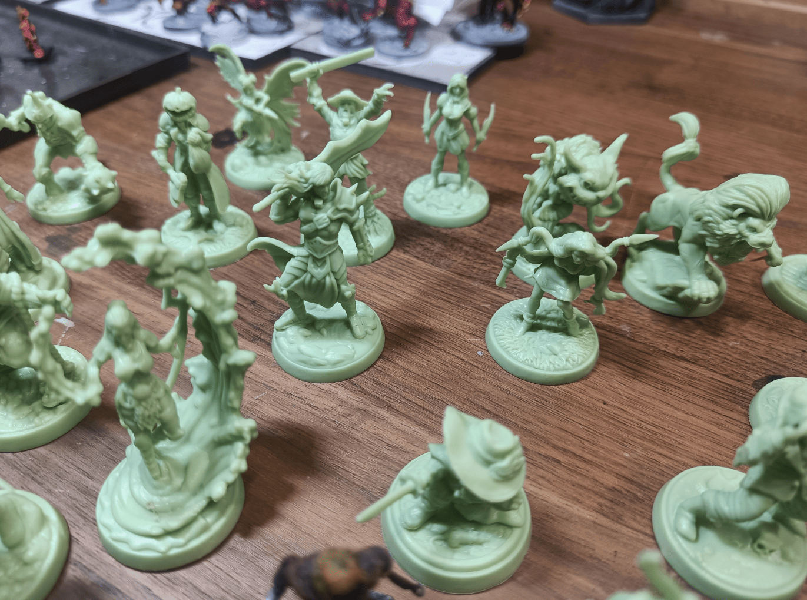
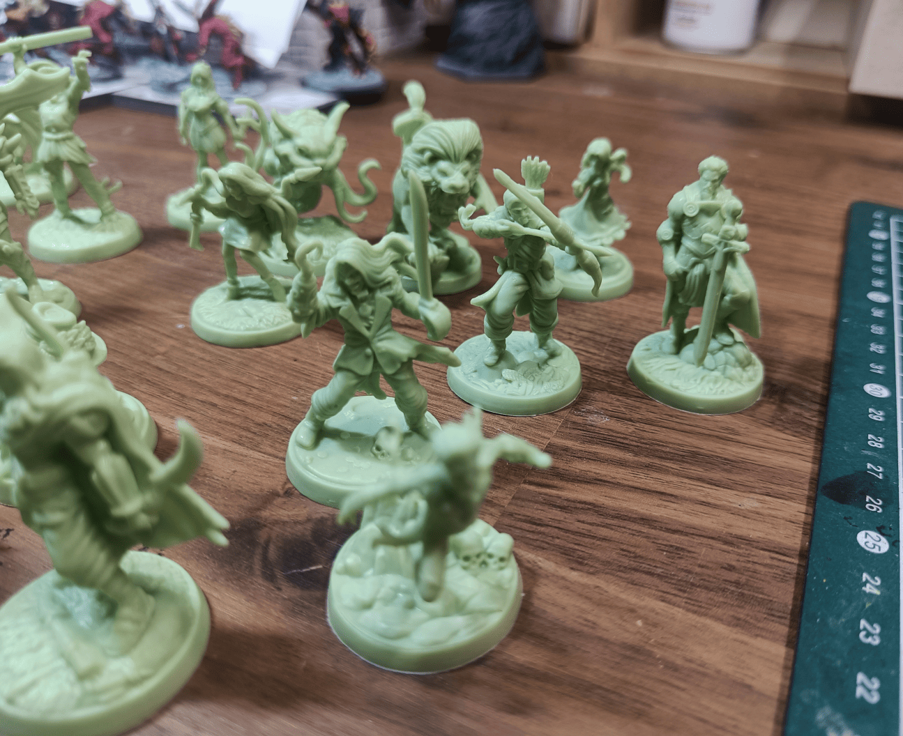

<!-- Image 1 -->

I found what seemed like a good deal on Vinted recently. Five boxes, each with 6 to 8 miniatures. I bought everything for 17 euros, so 33 miniatures for under 2 euros each. That's my usual threshold: if it costs less than 2 euros, I can indulge in *one more miniature. After buying, I saw lots of people selling them. Maybe a Kickstarter just finished delivering.

<!-- Image 2 -->

Dark fantasy versions of fairy tale characters. Pretty cool concept.

<!-- Image 3 -->

The scale is quite large though. The character in the center is from A Song of Ice and Fire, which already has large, heroic sizes. I mounted this one on a base with 3-4mm of extra height from the stones. Even next to it, which is already among my largest, the fairy tale miniatures are all a head taller. Potentially a problem.

<!-- Image 4 -->

For monsters, the size works fine. The Beast from Beauty and the Beast, demons, Frankenstein's monster. I don't mind them being larger than my heroes. An evil sorcerer or warrior can be large and epic.

<!-- Image 5 -->

For PCs though, this size is trickier. Harder to incorporate properly unless representing a Goliath or giant. Some will be easy to use, others harder.

<!-- Image 6 -->

Captain Hook would make a great pirate boss. But Robin Hood in the back is too plain and tall for a group of archers. Might keep these for epic statues instead.

