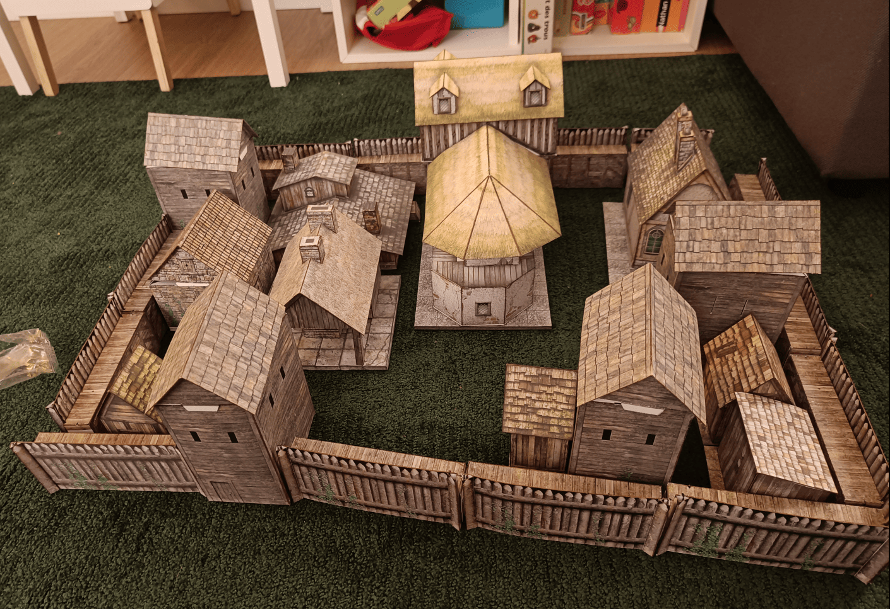
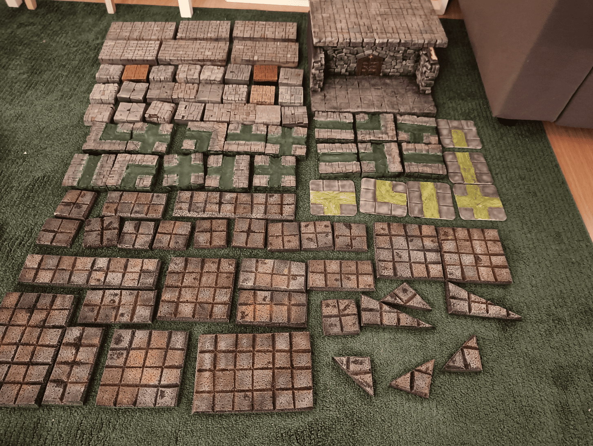

This is a short post with just two photos, but I wanted to document projects I worked on back in the day that I eventually gave away. It's a way of keeping an archive.

<!-- Image 1 -->

This is an entire village made from cardboard, I think from Fat Dragon Games. It was really enjoyable to build and looked great on the table. This was the closing scene of our Warhammer campaign that we played for years. The PCs ended up dying while defending this small village against hordes of beastmen, led by the lieutenant of the BBEG from their previous campaign who had managed to escape.

It ended exactly like a Warhammer campaign should: they saved the world, but nobody knew about it. They sacrificed themselves and got no recognition for it.

<!-- Image 2 -->

This photo shows a bunch of things I made when I first started crafting. Starting from the top, I took foam sheets and practiced carving stones to test different patterns and color schemes. I practiced making lots of things like that, but ultimately not very useful.

On the right, I wasted a lot of foam trying to make display shelves for painted miniature. At the time I had just started painting and had maybe a dozen miniature that could have fit on it. In the end it's not very useful, not very pretty, and my miniature don't fit on it anymore anyway.

Then you can see lots of sewer tiles. These actually got some use when the players went into the sewers. The ones with dark green liquid, I carved into foam and filled with spackle, but it kept cracking. I had to keep adding more spackle and it cracked again, so the pieces ended up really heavy and didn't really look like liquid.

The ones with bright green liquid are made from [coasters with cork bottoms](../coasterDungeonTiles/). I carved into them and these turned out pretty well. If I had more coasters with the same dimensions I could have made a full set that would have been interesting for representing sewers, since sewers always have that layout with a passage in the middle and narrow walkways on the sides. But I didn't have enough, so I stopped there.

The rest of the tiles are made from [cork](../corkTiles/) that I had to cut with a cutter. Cork dulls blades so quickly that I went through dozens of blades just to make the grooves separating the different squares. I painted them and tried to add little piles of sand and debris by putting down glue and sprinkling gravel on top, but I didn't use enough glue. Every time we played it got sand everywhere.

In the end I gave all of this to a friend's son who had fun with it, which is good because I didn't need it anymore.
