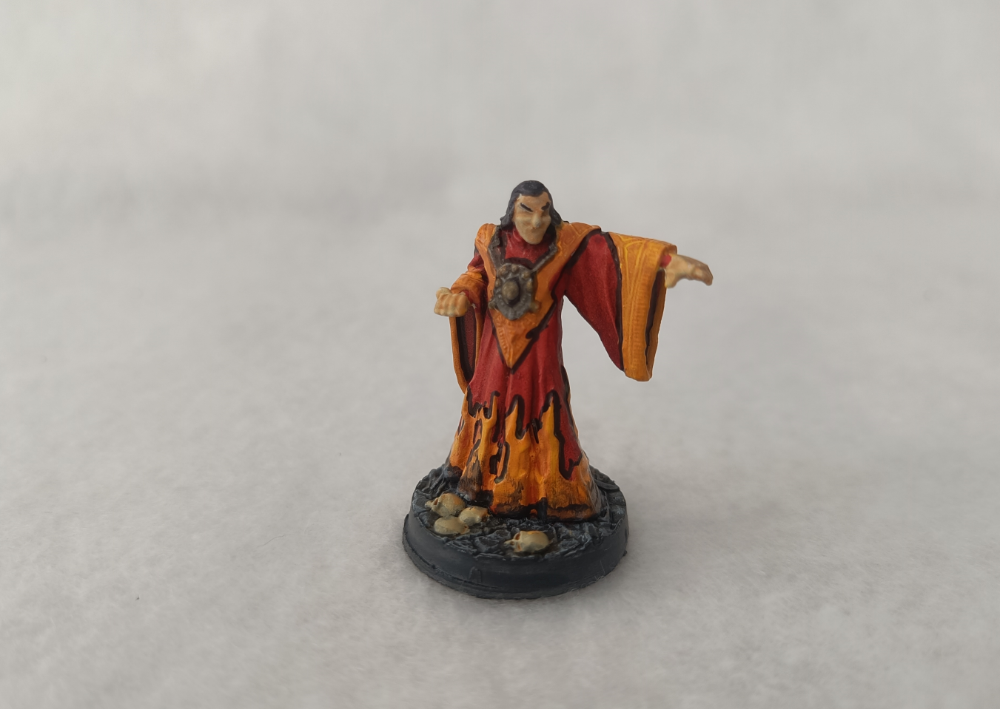
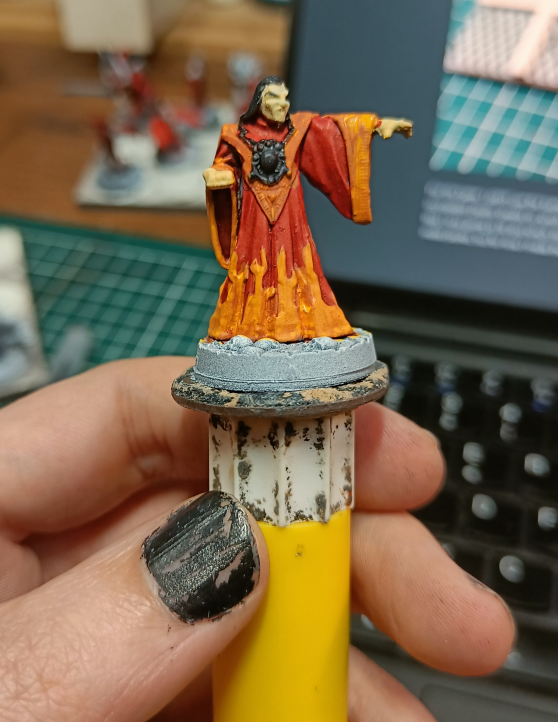
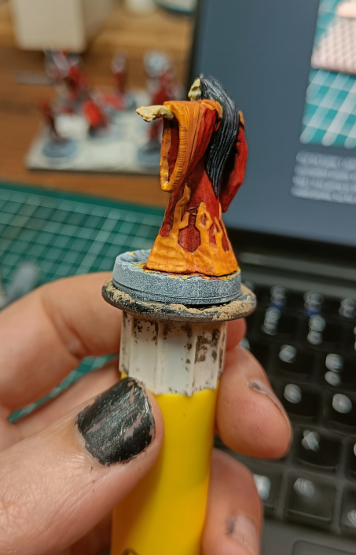
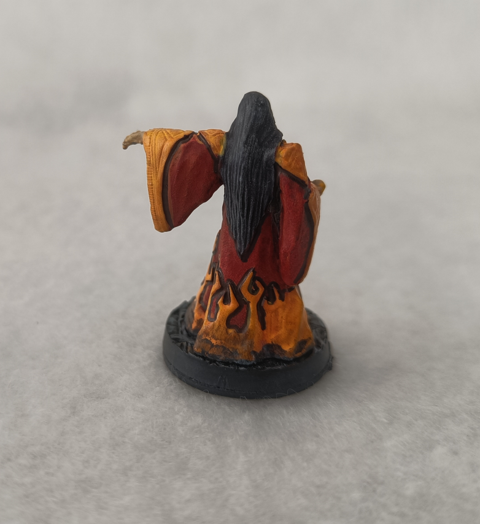
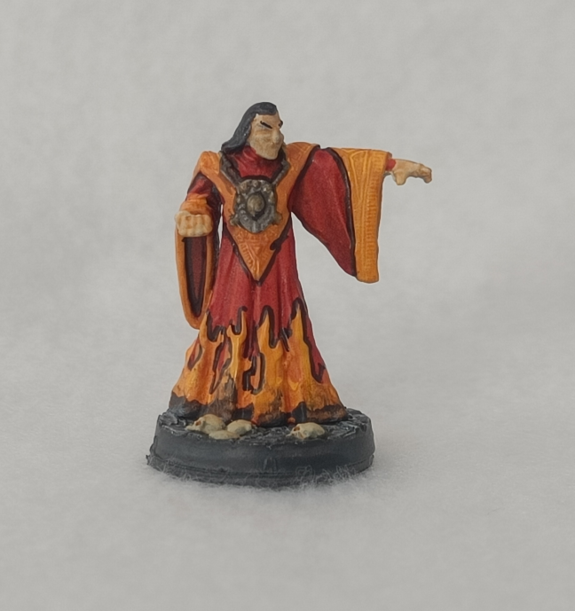
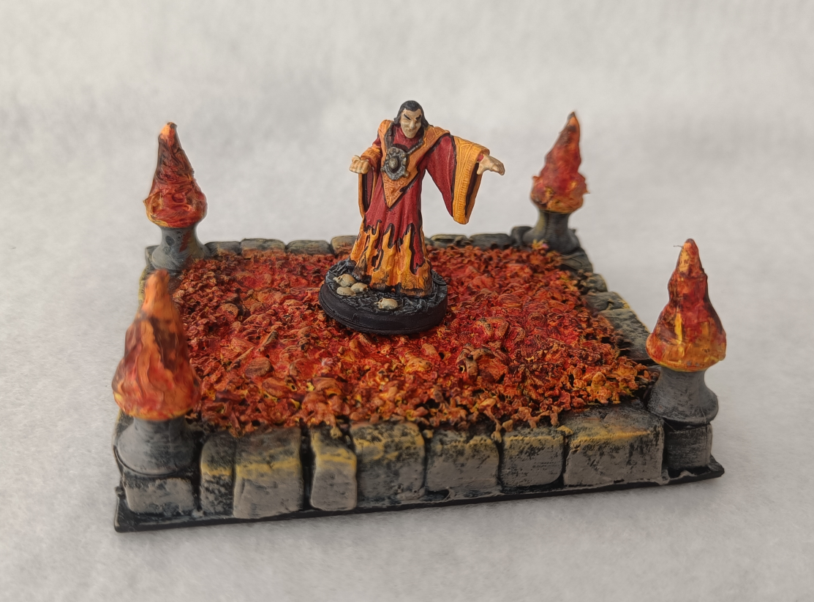

<!-- Image 1 -->

This is a BBEG my players fought: a fire mage in the desert trying to raise a buried citadel from beneath the sands. They battled him in his manor and barely escaped alive. I reused a Heroclix miniature I'd painted a long time ago, but the paint job wasn't very good, so I decided to repaint it. Up close and zoomed in like this, it doesn't look great, but it was good enough on the game table.

<!-- Image 2 -->

What I wanted to show here is my color approach. Since I knew I wanted a red and yellow robe, I painted everything red first, planning to go back over the details in yellow. The problem is yellow has terrible coverage, so it took many layers. I tried using the AK yellow marker, and it still took about ten coats to get something that looked more orange than red.

<!-- Image 3 -->

The back view. I really should have done a white primer, painted the details yellow, then filled in the rest with red.

<!-- Image 4 -->

I tried something with a black Staedtler Lumocolor permanent marker, outlining the different contours and emphasizing the separation lines between sections. It has an interesting effect. When zoomed in like this photo, it looks a bit too much, but when the miniature is on the game table, it improves a paint job that otherwise wasn't great.

<!-- Image 5 -->

The front view showing what it looks like. I think it works well for flames.

<!-- Image 6 -->

Set up on the [flame terrain](../burningCoals/). A fairly quick paint job. The base Heroclix sculpt quality isn't bad, but since I repainted over something I'd already painted without stripping the paint first, it lost some detail. I'm not an excellent painter either, and I also got the color order wrong.

This was a quick repaint for a specific encounter. If I had to do it again, I'd prime white, paint yellow details first, then fill in with red for better coverage. The black marker lining technique worked well enough for tabletop distance.

