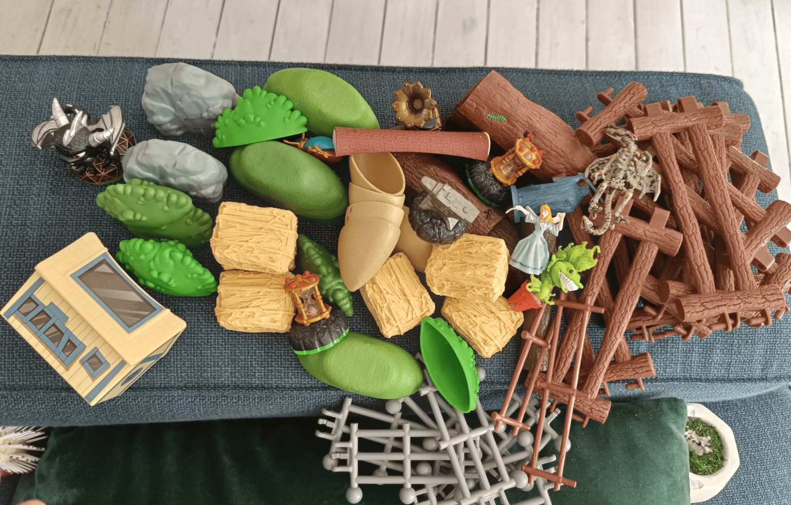
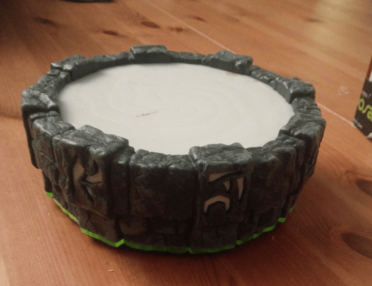
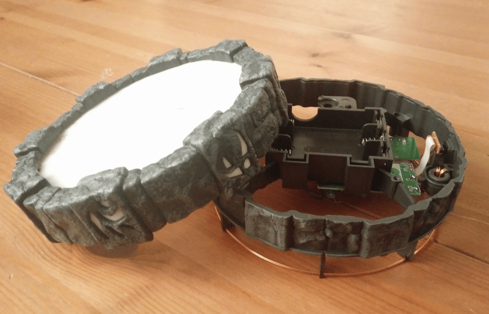
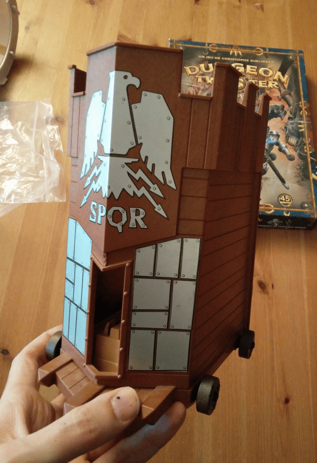
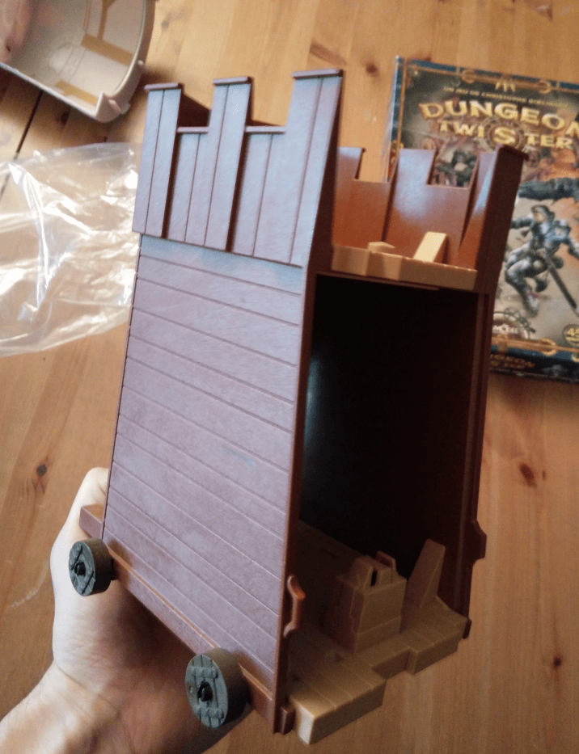

I wanted to document the stuff I find at flea markets. All of these are things I found and have either reused or plan to reuse in projects.

There are Skylanders figurines with interesting shapes, including a dragon one that I repainted. I also picked up plastic shapes like fake rocks, mounds, bushes, and logs. Some I used almost as is (the rocks and logs worked great).

I found barriers too. The small ones I mounted on cardboard to make fences, which turned out well. The big ones I sometimes cut up to salvage the textures for making wood pieces.

The different figurines got turned into statues or I painted them directly. The herbivore became its own figurine. And that little house in the bottom left? I covered it with fake planks and turned it into a cottage.

I keep finding this Skylanders bases as well. You know, the portal thing where you put the figurines? It's basically already a perfect summoning circle. Wouldn't take much to turn it into something awesome. Pretty sure there's space underneath for LEDs too, so I could add some cool colored lighting effects. It's been sitting in my box for years. Really need to convert it into a proper summoning circle with lights one of these days.

When I saw this Roman assault chariot from Playmobil I immediately thought it would be perfect for a conversion project. I'm thinking either a goblin assault chariot or a static goblin tower.

I'm picturing wooden protection panels where each plank is a different size - really messy and chaotic looking. This could totally work as a goblin piece.