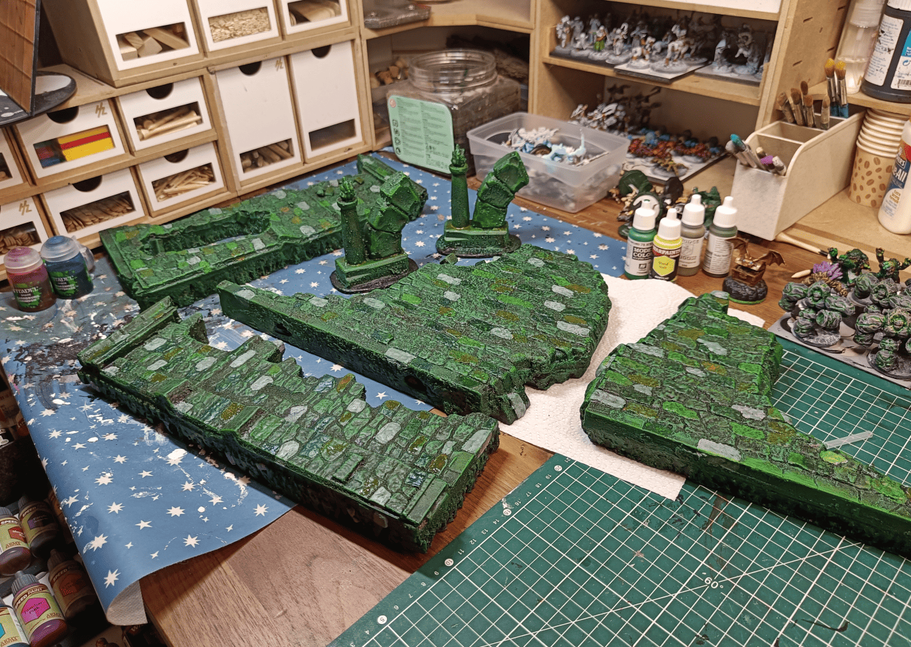
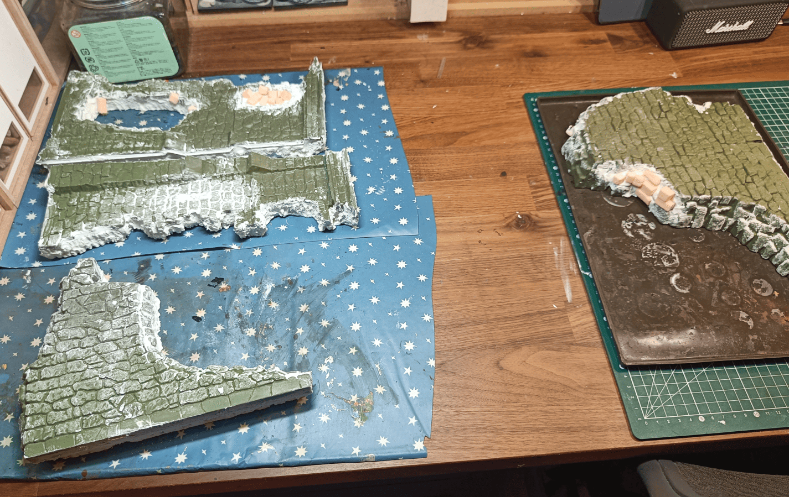
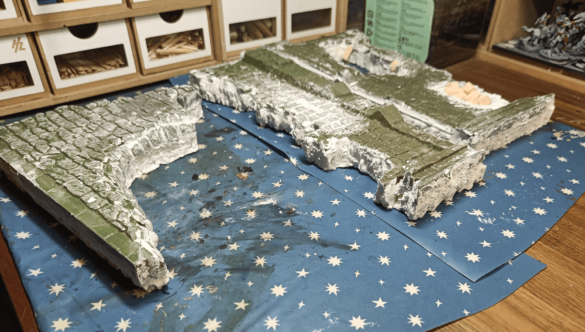
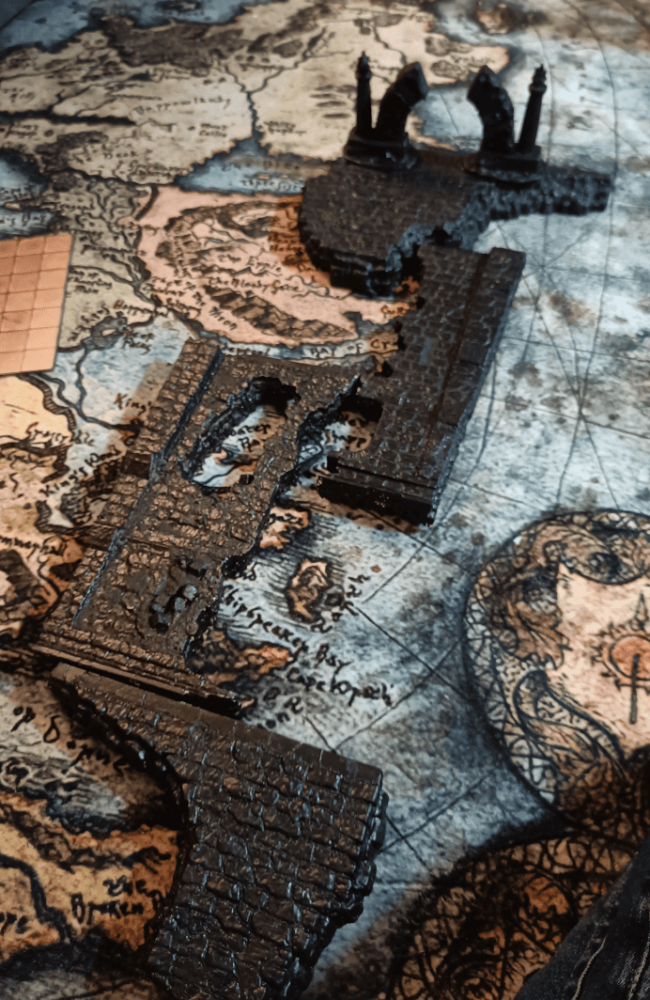
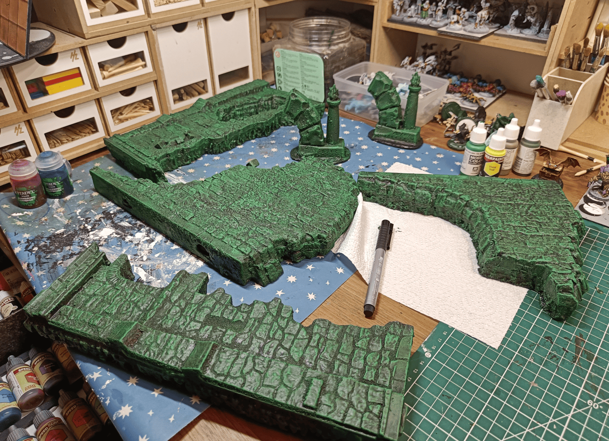
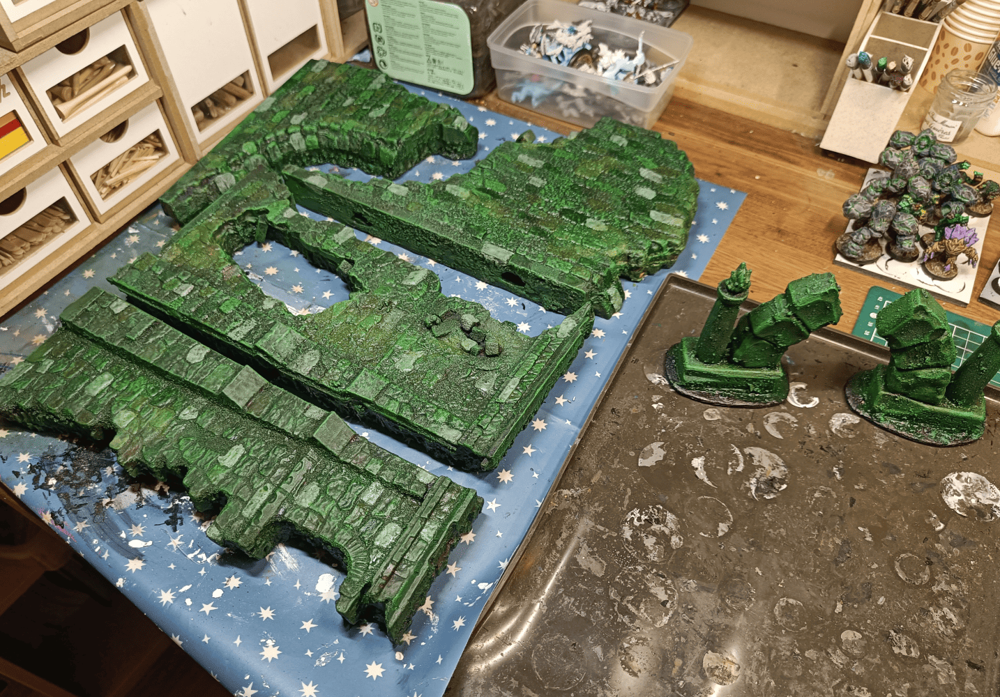

<!-- Image 1 -->

I made this project because my players were about to reach a decisive moment in their journey through the Feywild. They needed to rescue the Warlock's patron, an archfey who had taken refuge in a strange place and was being attacked by one of the BBEG's minions, a soldier in black armor with his demon army. The encounter would take place on a half-destroyed bridge over the void in space, with a portal at the far end. The players arrive at one end while the villain is already in the middle and their objective is at the other end.

<!-- Image 2 -->

The pieces come from a Pirates of the Caribbean toy, probably the second movie. It's designed for G.I. Joe or Action Man scale miniatures and normally represents a ruined tower. I bought it at a [flea market](../fleaMarketHaul/), but the plastic was very old and broke easily.

The scale would never be right vertically for TTRPG, but the textures were great. Positioned flat, though, it could make decent ruined platforms. The one on the far right was already thick enough, but the others were much thinner, so I glued them onto foam boards to even out the thickness. I added spackle on the edges and top to create more texture and hide the plastic look. I also filled in what was obviously a window at the very top with foam stones to make it look like debris instead.

<!-- Image 3 -->

Another viewpoint shows how I used spackle to smooth out the seams where the plastic meets the foam.

<!-- Image 4 -->

I covered them completely with Mod Podge without priming, creating a glue and paint mix to hold all the small pieces in place. Here I'm doing a test fit on my mat to figure out how to arrange the bridge sections.

<!-- Image 5 -->

After one or two layers of green drybrushing, the pieces started to take shape. Green is a bold choice, but for visually striking terrain pieces, it worked well.

<!-- Image 6 -->

I painted individual stones with a darker green, a light green that's almost diluted gray, and a brown. Just three colors to add variety to the bricks. A dark green wash unified everything, then a very light yellow drybrush highlighted the edges. The process wasn't complicated, and it worked perfectly for the encounter. We even reused these pieces a year later for a desert canyon scenario. Our imagination filled in the gaps even though the canyon definitely wasn't green.

The biggest downside is storage. These large pieces take up a lot of space. If I were to do it again, I'd focus more on modularity and replayability, making pieces that stack or work in different contexts. This project was more opportunistic, [like the Hello Kitty house](../helloKittyRuinedHouse/), taking something I'd bought years ago at a flea market and finally putting it to use.
