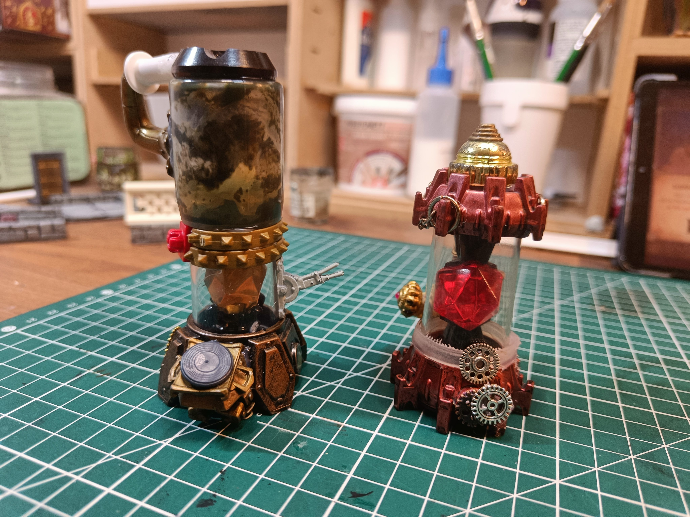

These are furnaces (or boilers), I needed for the basement of the first Strange Aeons adventure.

I made the base using a Skylander toy and added lots of small elements to give it a steampunk look. There are tons of little gears that come from steampunk beads, plus bits of toys I found here and there. On the left side, the top is a Games Workshop paint pot (I think it's a Nuln Oil) turned upside down and added on top to serve as a reservoir.

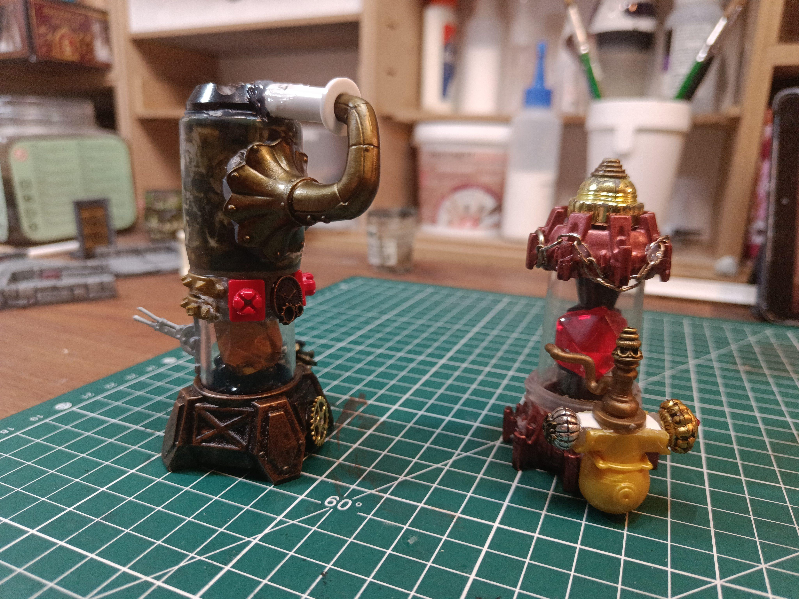

Here's the view from the other side!

The large pipe is made with a gramophone mouthpiece that I salvaged from another Skylander toy - turned upside down and glued with a syringe tip on top of a button.

The small red pieces are tips from Playmobil toys.

On the right one, I salvaged a diving helmet head from another toy that I put upside down at the bottom.

There are small beads placed on the sides and different elements. I think there are pieces that come from other Playmobil toys that I "borrowed" from my daughter.

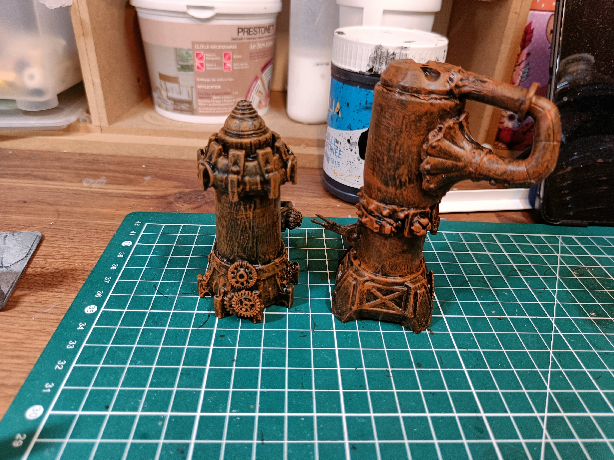

I used my usual mix of Mod Podge and black paint to help stick all the elements together properly. I didn't mind if there was a bit of texture on top since it was supposed to look like old, weathered stuff.

Then for the dry brushing, I think I went straight to orange. I have Ryza Rust (the technical paint from Games Workshop) but honestly I don't really see the difference between that and regular orange paint. So yeah, just did a dry brushing with orange there.

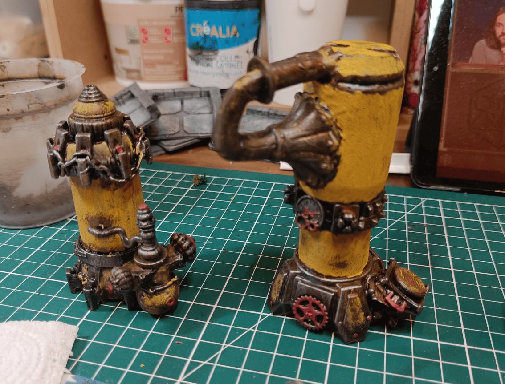

I added a bit of color, and I really went for the yellow side because the King in Yellow is an important character in the scenario.

To create an effect like rusted paint that you can see through, I dabbed the paint on with my brush instead of covering everything smoothly. I also added little red elements to break up the uniformity.

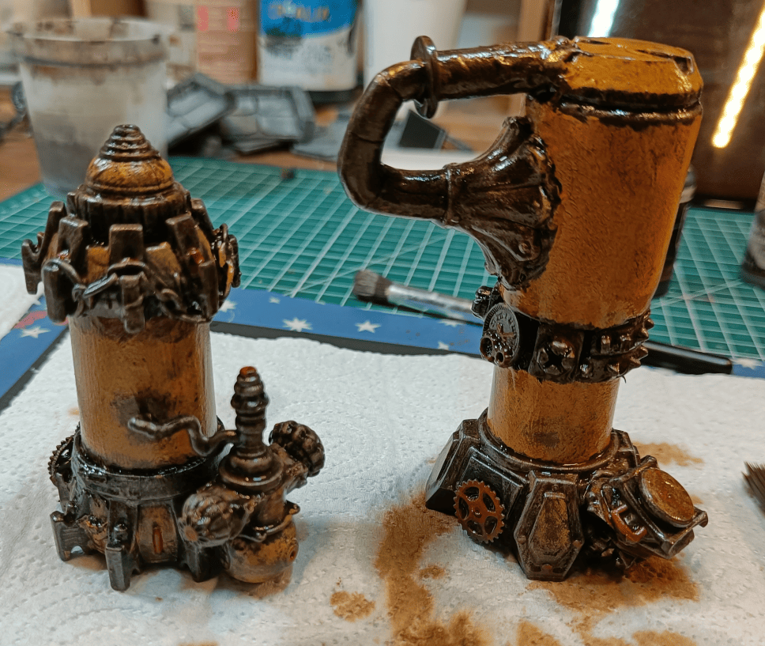

I then added a good thick oil wash, a bit brown, to make it all a little more grungy.

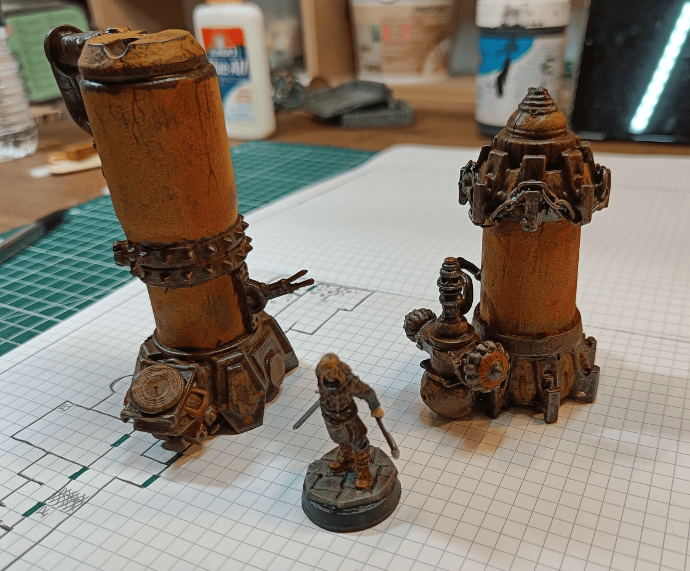

And here's what it looks like once painted. These are sets I'm quite happy with in the end because they're pretty original. We don't really know what they are but we can tell they're somewhat mechanical. You can sense it's something for conducting strange experiments. But it remains quite solid because the base of the toy is a Skylander toy. So I like those ones.

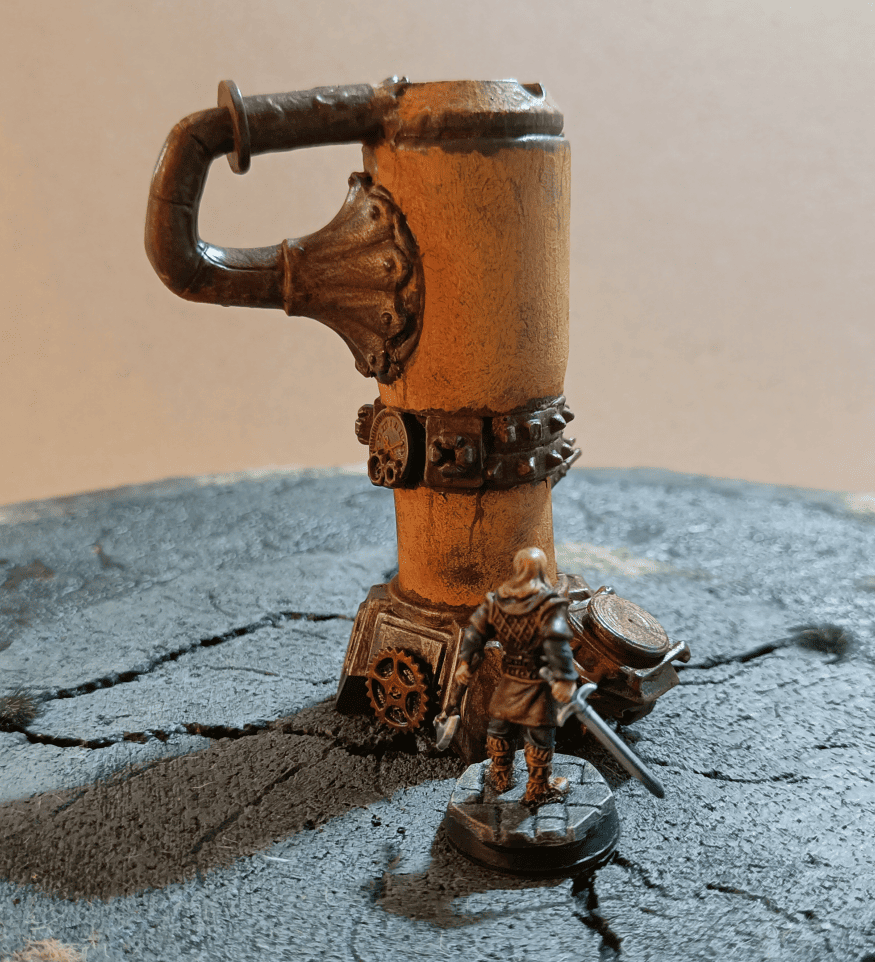

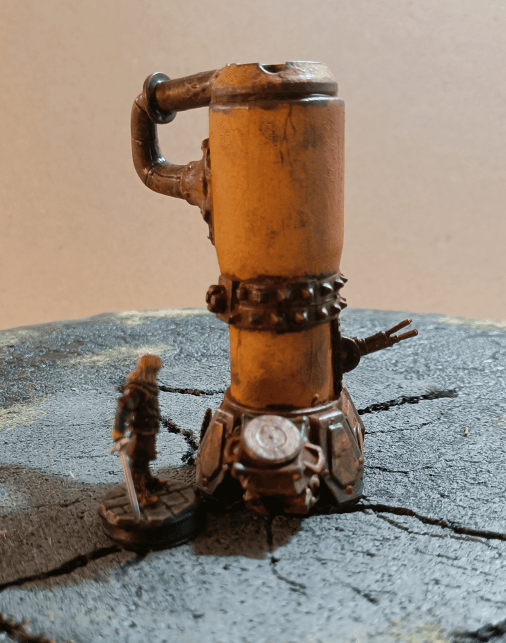

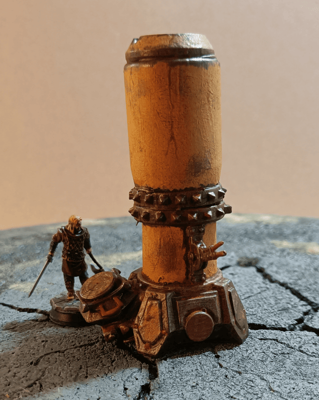

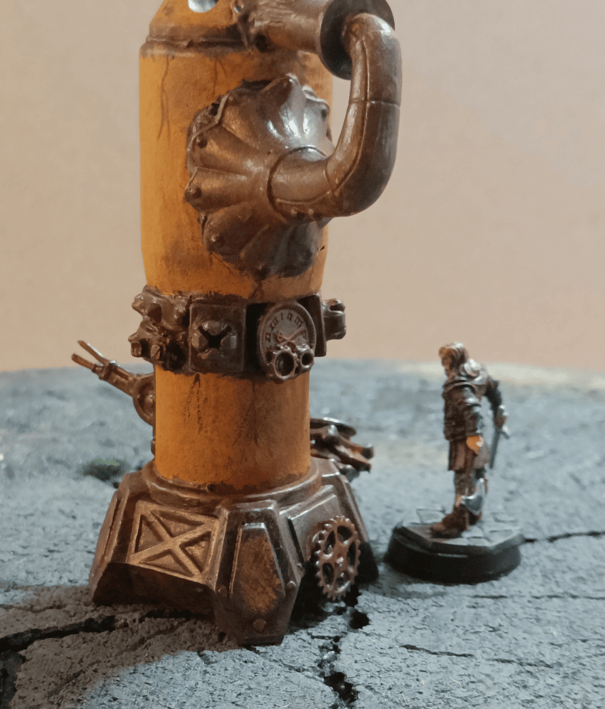

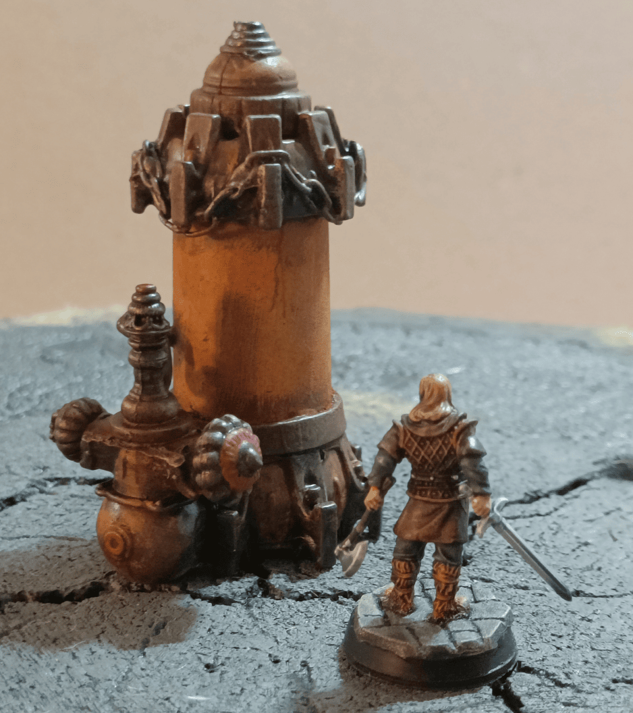

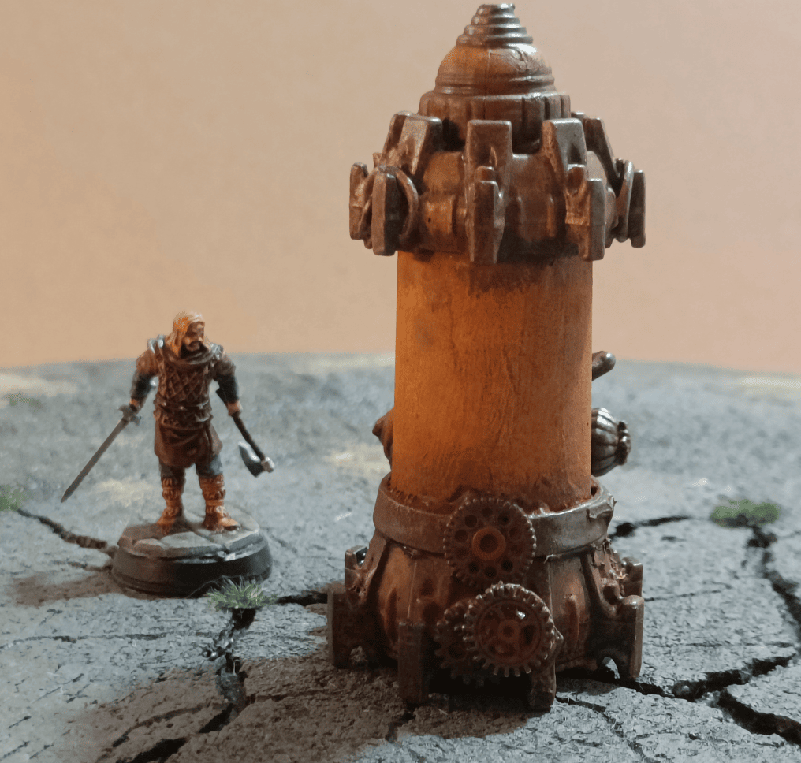

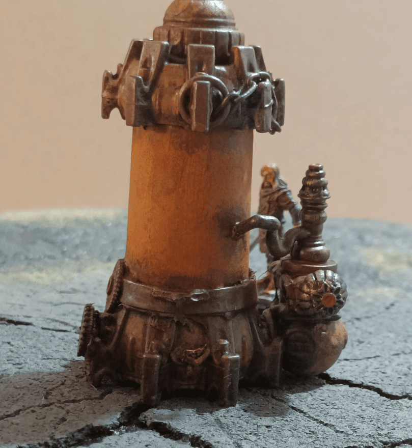
