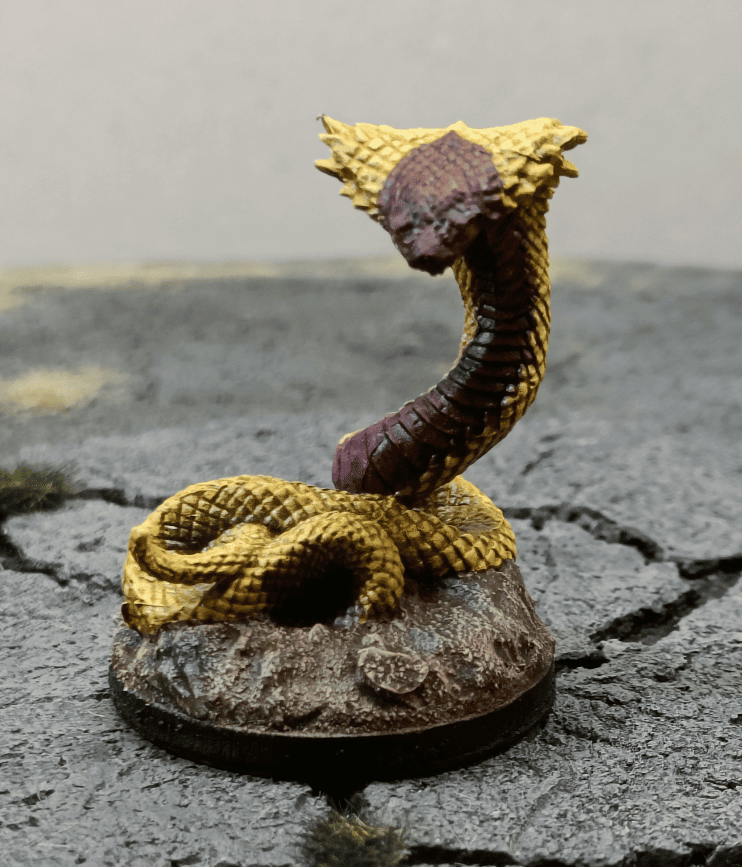
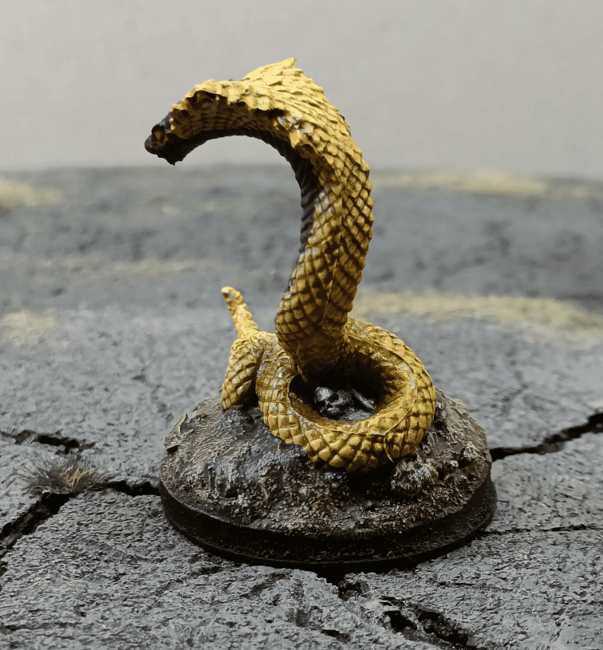
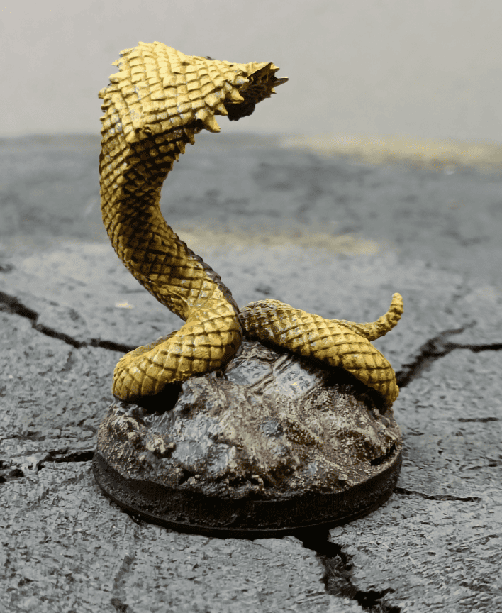

<!-- Image 1 -->

This is a small post because I found some old photos of this giant cobra miniature I had painted. I'm not particularly happy with the color scheme I chose. The front color is way too dark, and I probably should have used a much brighter red to give it a more threatening look.

<!-- Image 2 -->

From this angle you can clearly see all the mold lines I didn't bother removing. I just [speedpainted](../coralGolem/) it without any cleanup work.

<!-- Image 3 -->

This is probably the best angle, where the flaws aren't too visible.

This isn't my best paint job or color choice, and the miniature itself isn't particularly interesting. But at least it's something usable on the battlefield, better than having nothing at all. If you're looking for other [snake miniatures](../happyMealToyIntoSerpents/), I've painted a few over the years.

