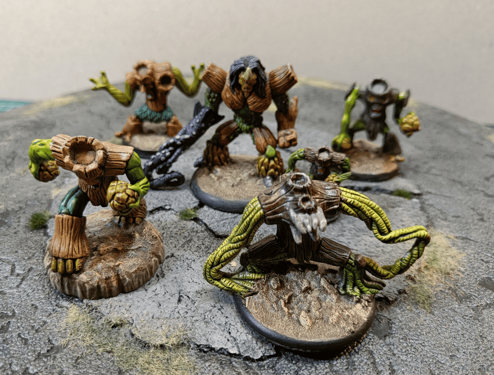
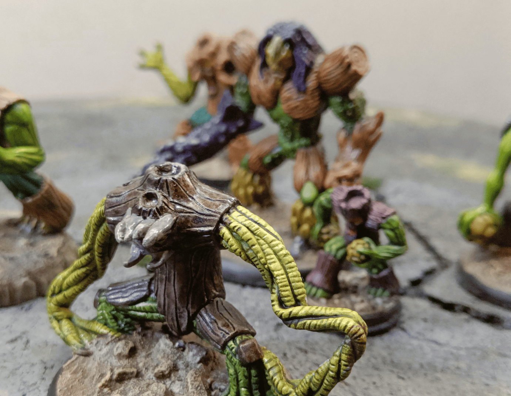
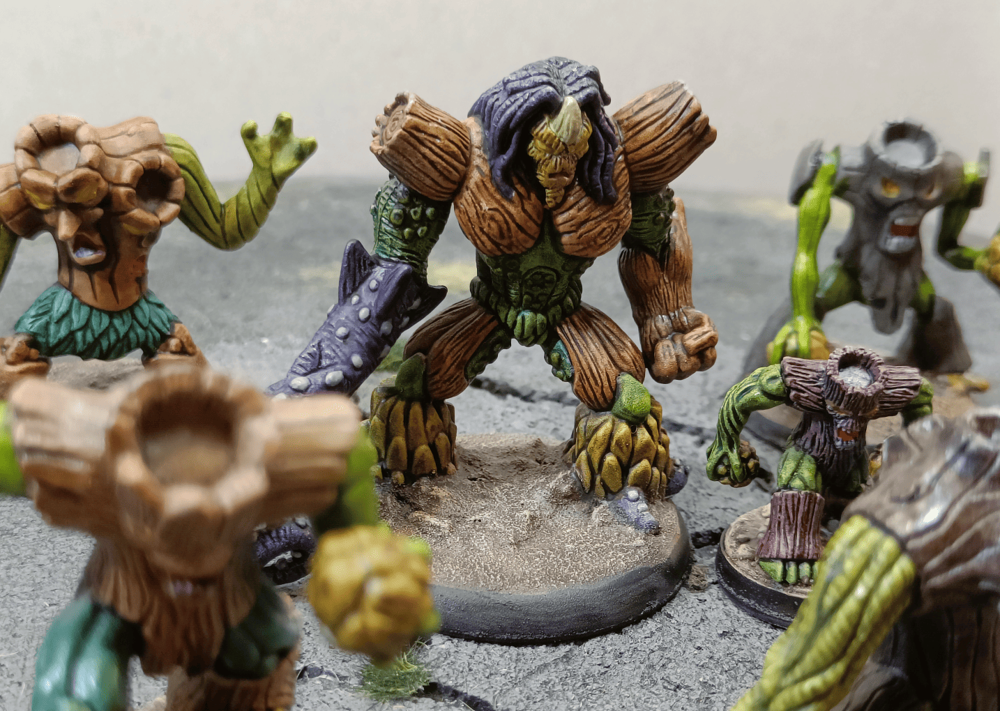
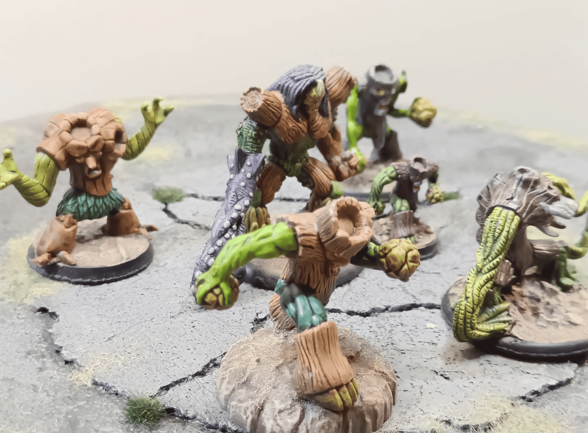
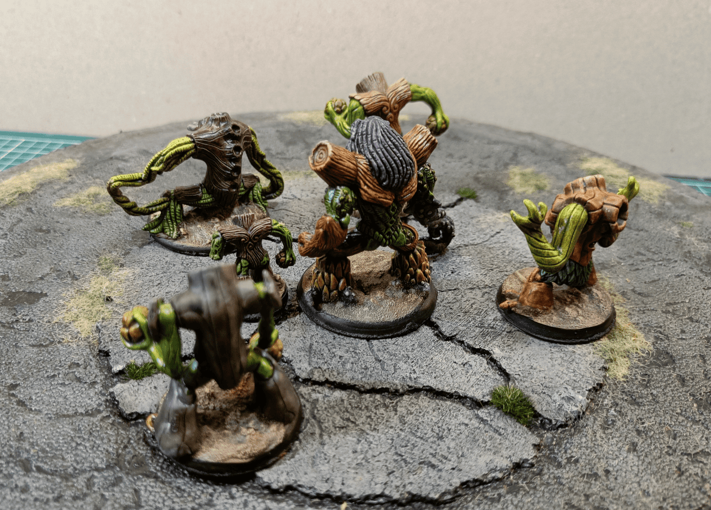

<!-- Image 1 -->

This is a quick documentation post for a few miniature. These are originally [Gormiti miniature](../gormitiPaintingPractice/) that you can find for around 1€ each at garage sales. While some have a bit of a cartoonish look, the sculpting quality for certain models is quite good. They make good treemen, even though the scale is a bit large. They're wide creatures, so in this case it works well.

<!-- Image 2 -->

Here's a close-up of a creature made of a trunk and branches with vine-like arms. Everything is [painted with speedpaints](../speedpaintTestBulkPainting/), and it does the job! It's not extraordinary, but it's really quite cheap as a miniature, and it works well for that.

<!-- Image 3 -->

Here you can see some of the different sculpts available. The one on the left, I like the fact that it has two heads on the trunk, but the problem is it looks like it's wearing a little leaf skirt, which kind of breaks the scary effect. The one on the right is nice, it looks a bit more menacing. I think they would have been even better if I had glued on some flocking, if I had attached real leaves or something like that on top.

The big one in the middle is a bit strange because it's both tree and has some kind of tentacles. I think if I had painted it differently, it would make a very good deep sea monster, where the wood parts would be driftwood, and the rest would be algae. It would have worked well that way. Here I made it too much of a forest creature, and so it's a bit odd.

The small one next to it is great. I really have a hard time finding miniature of that size, but it's perfectly scaled to make a medium-sized creature, and I would love to have more of that size, but I can't find them.

<!-- Image 4 -->

This is a view from another side where you can maybe see the sculpts a bit better.

<!-- Image 5 -->

And this is the back view.

You also have to be careful with these miniature. I haven't fully figured out why yet, but some of them, after I applied the varnish spray, became sticky. Not all of them, only some, so I haven't been able to properly identify whether it's potentially the type of paint I used, the type of varnish I used, or the type of plastic the miniature are made of, but they become sticky, and even years later, they remain sticky. And that's quite unpleasant.
