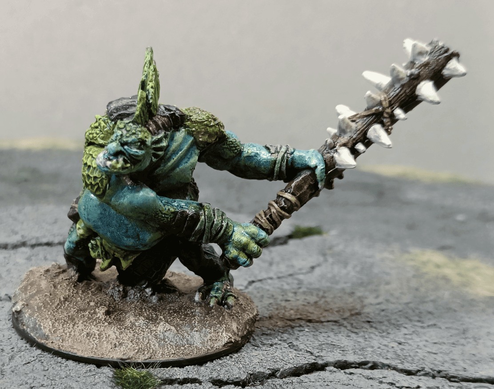
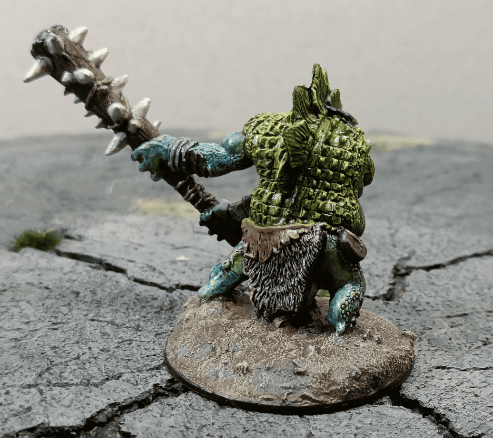

This is Hargulka. She's a troll, I think I based her on one of the encounters that are in the Kingmaker Adventure Path.

The miniature comes from Reaper Bones. I think I painted it before I knew about Speedpaints. There was a strange reaction with the paint or with the Reaper Bones, but once I applied the varnish it became a little bit sticky. I don't know exactly why.

