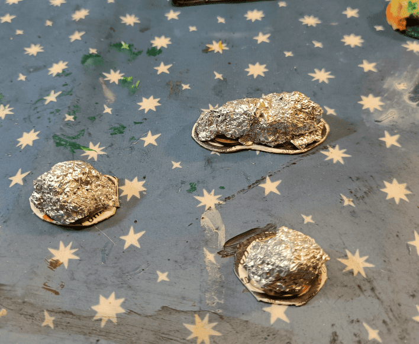
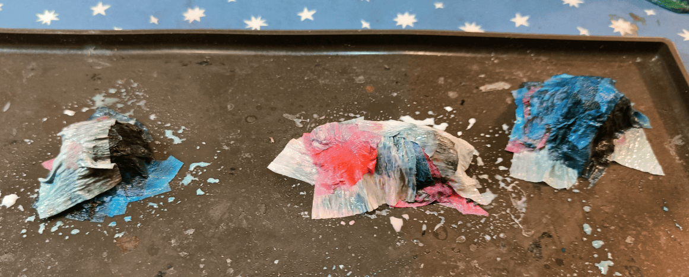
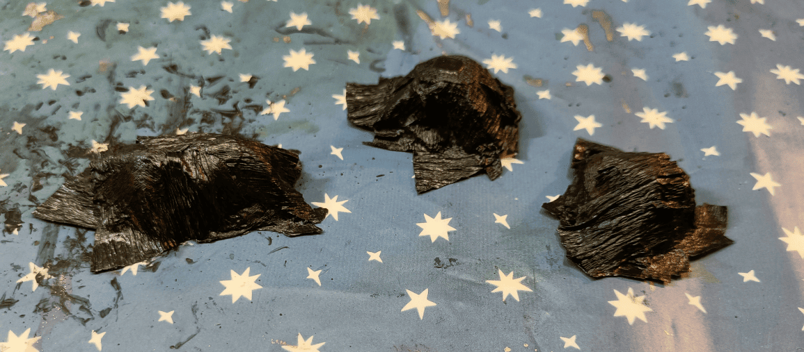

Another scatter terrain for the asylum scenario. Players start in an old laundry room where staff used to wash everyone's clothes. I needed to create some piles of laundry for the scene, so here's what I did: I glued crumpled aluminum foil onto cardboard bases to give it some volume and height. Next step is to add material on top that actually looks like clothing to finish it off.

I cut pieces of crepe paper in different colors and glued them onto the main form with a hot glue gun. The issue was that crepe paper is pretty stiff, so I sprayed a water and PVA glue mixture on them to make the paper conform better to the aluminum shape underneath.

The downside is that all the colors completely discolored and bled into each other, creating a big mixed mess of colors. So looking back, cutting different colored sheets wasn't really worth the effort since they all blended together anyway.

This is even more true since the next step is to cover everything with black modpodge, so my choice of different colors at the start was completely pointless.