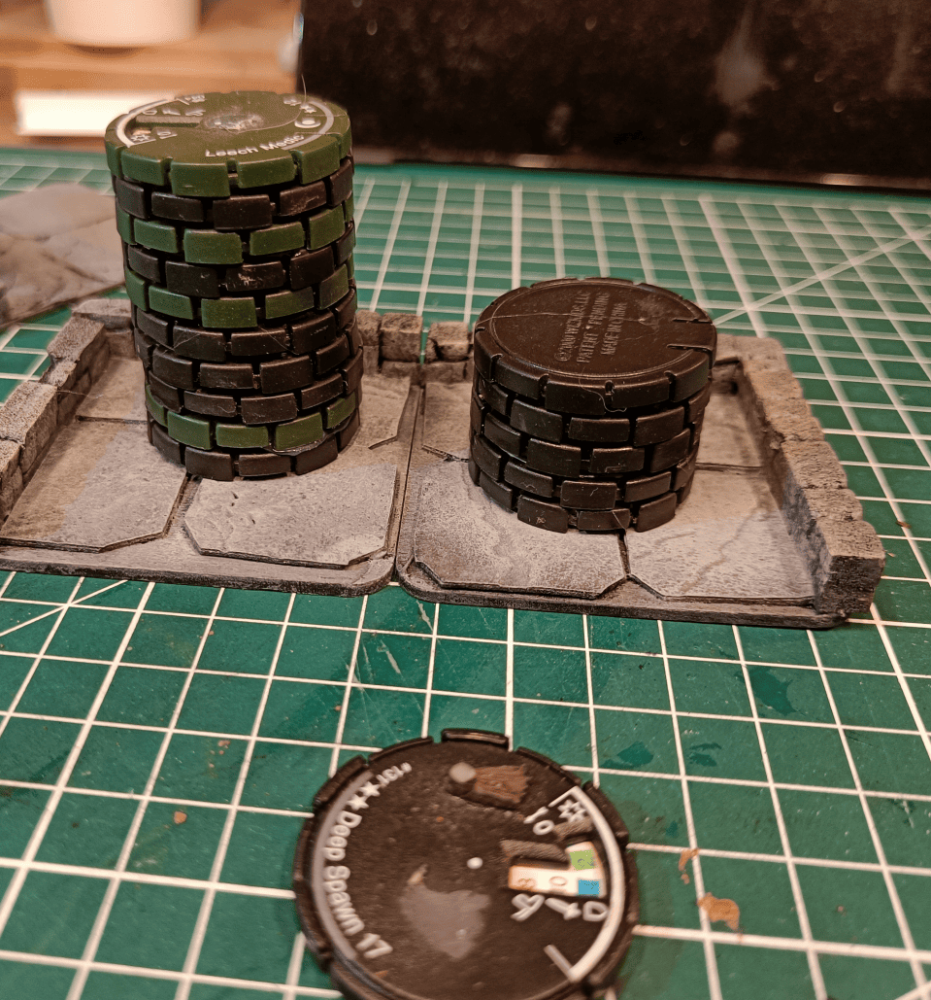
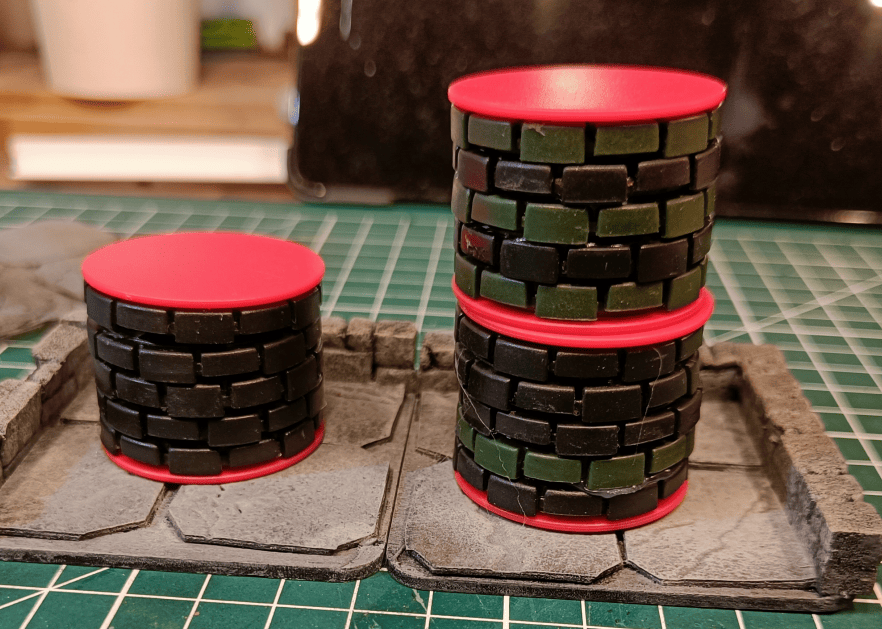
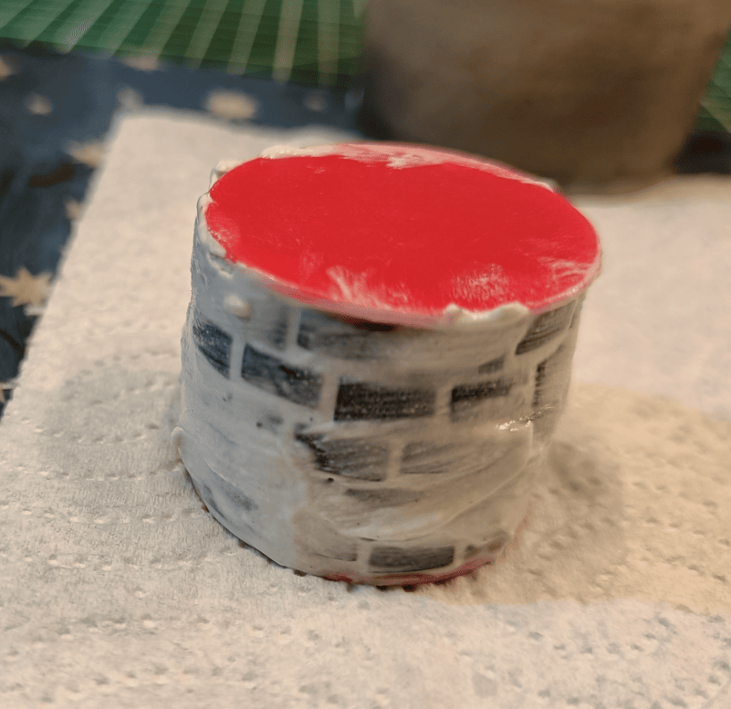
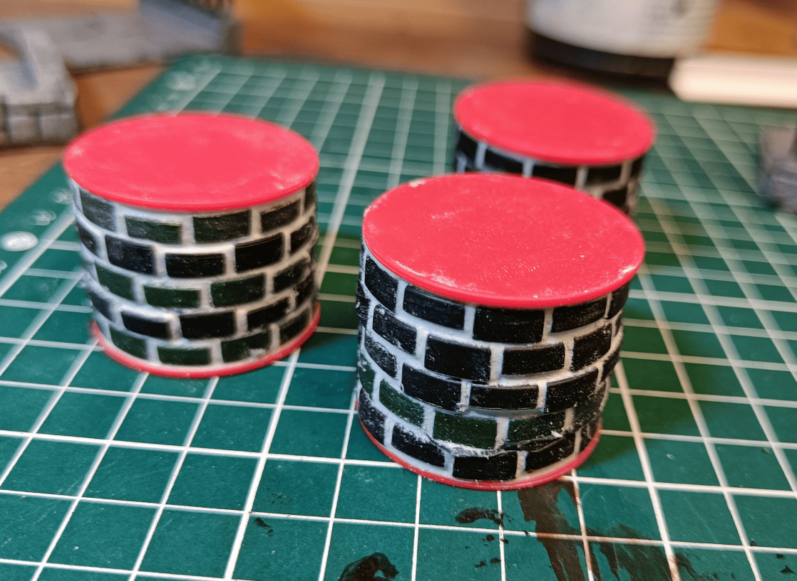
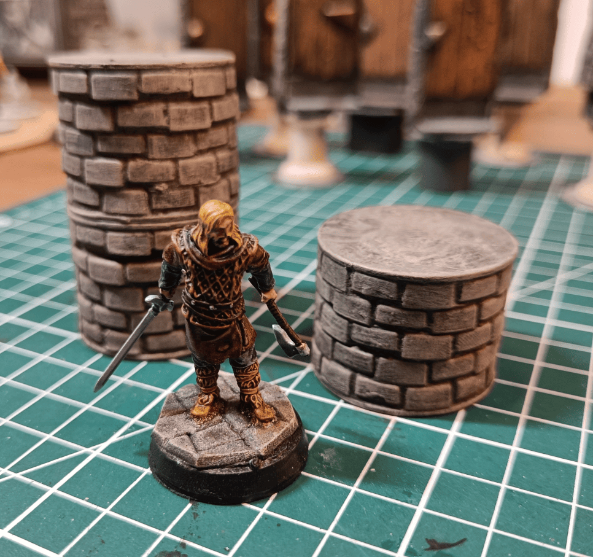

This is one of the builds I'm most proud of! It has all the characteristics of what I love about terrain creation:

- The build is very simple to make
- Doesn't require much cutting
- It's quite pretty
- Represents well what it's supposed to represent
- Super solid to handle

And as a bonus, we're reusing materials that would normally go to the trash for something very useful.

The main idea is to reuse Heroclix bases. You can stack them on top of each other to make pillars. If you offset them slightly, the little notches on the sides make them look like stacked stones.

Heroclix minis are great but the bases are massive, so I've got tons of them lying around. This turned out to be a pretty good way to give them a second life.

At first I wondered if I should make pillars that were 5 bases high or bigger ones that were 10 bases high. The small ones weren't at the right scale compared to the characters, and with the big ones I thought they might block the lines of sight a bit too much.

So what I ended up doing was making pillars that are all 5 high. If I ever want to make a tall pillar, I can just stack 2 of them.

I added plastic circles at the top and bottom that I found, which were exactly the right size. But if you don't have any, you can replace them with cardboard cut to the right size - that works very well too. This ensures the top and bottom are completely flat and makes it much easier to stack them on top of each other.

I take some filling compound and moisten it slightly. Then I spread it around the pillar and wet my finger to smooth it out everywhere, making sure it gets into all the holes.

Then with a dry paper towel, before the filler dries, I wipe all around the pillar. This leaves the filler only in the gaps between bricks (to look like mortar), while completely removing it from the brick surfaces.

Here's what it looks like after a quick coat of paint - first black undercoat and then a light dry brushing.