<!-- Image 1 -->
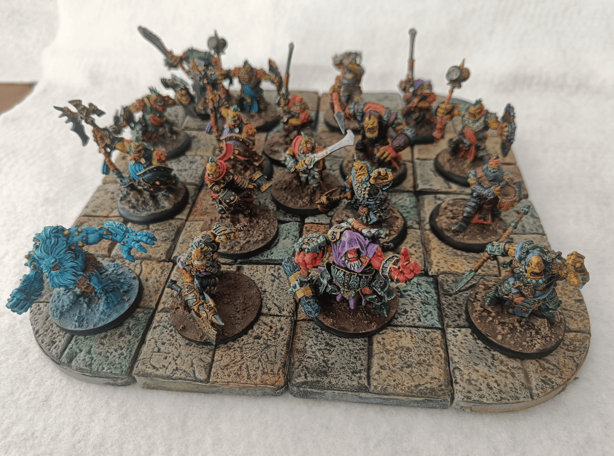

Hobgoblins appear frequently in RPG scenarios. They're a step above orcs and goblins, with the ferocity of orcs but the military discipline of a well-organized army, without the tribal savagery. They're the main antagonists in Red Hand of Doom, an excellent D&D 3.5 campaign I've read and would like to run someday, and they're also major antagonists in Kobold Press's Scarlet Citadel megadungeon. Since I might run that one day too, I painted them with those campaigns in mind. I know these aren't hobgoblin miniatures at all, but I figured they could work well as hobgoblins in my world.

<!-- Image 2 -->
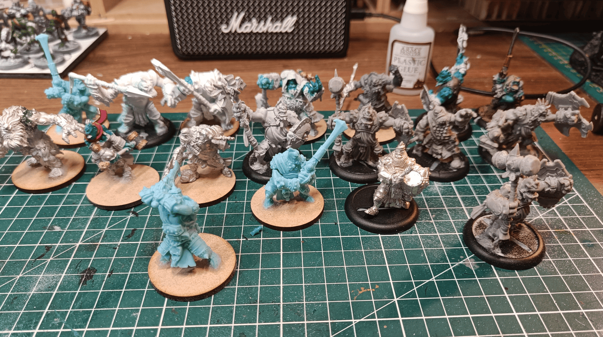

The base miniatures are a mix of gray plastic, blue plastic, and metal figures I found at a flea market. I'm not exactly sure what game they're from, maybe from Rackham? They're clearly very large and don't look like typical fantasy hobgoblins, but I figured they could still work for what I wanted.

<!-- Image 3 -->
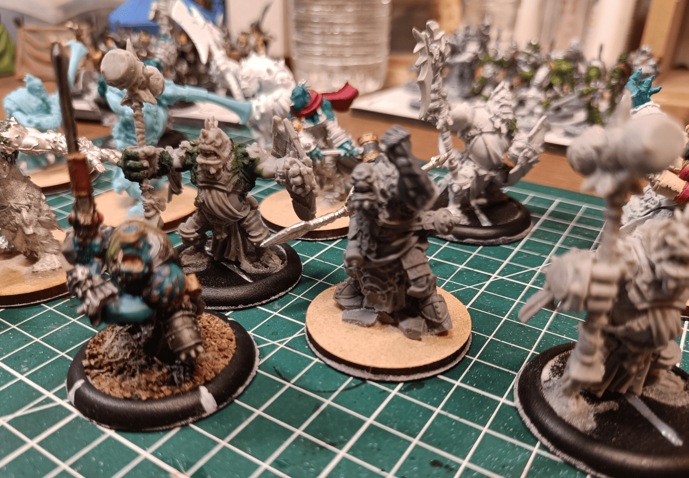

I glued them on bases and tried to repair the various broken pieces as much as possible. Some were already painted, some were broken, and I tried to salvage what I could.

<!-- Image 4 -->
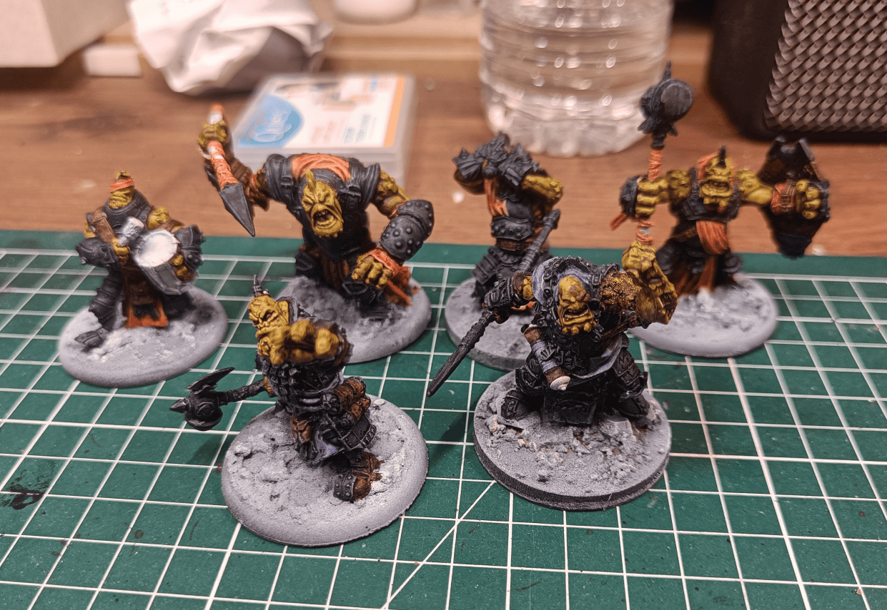

I started painting them and decided to put them on large bases so they'd be considered large creatures that take up 2x2 squares. That's their defining characteristic: there aren't many of them, but they're individually tough. I had a lot and didn't want to do a full painting pipeline where I'd paint the same color on 20 miniatures at once, so I grouped them into batches of about 6. If I discovered a good painting technique, I could apply it to the next batch.

<!-- Image 5 -->
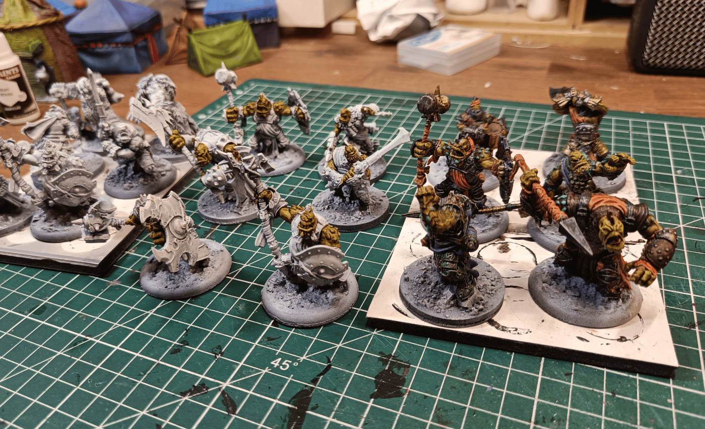

I have three different batches here. On the far left, they've just been primed. In the middle, I've started the skin. I think I used Ochre Clay, a kind of yellow that leans toward green. Since they live underground in Scarlet Citadel, I wanted them to have a skin color that wasn't a flashy green like I imagine orcs who live outdoors would have. I wanted them to have a darker color. On the group all the way to the right, I've started adding more painting details.

<!-- Image 6 -->
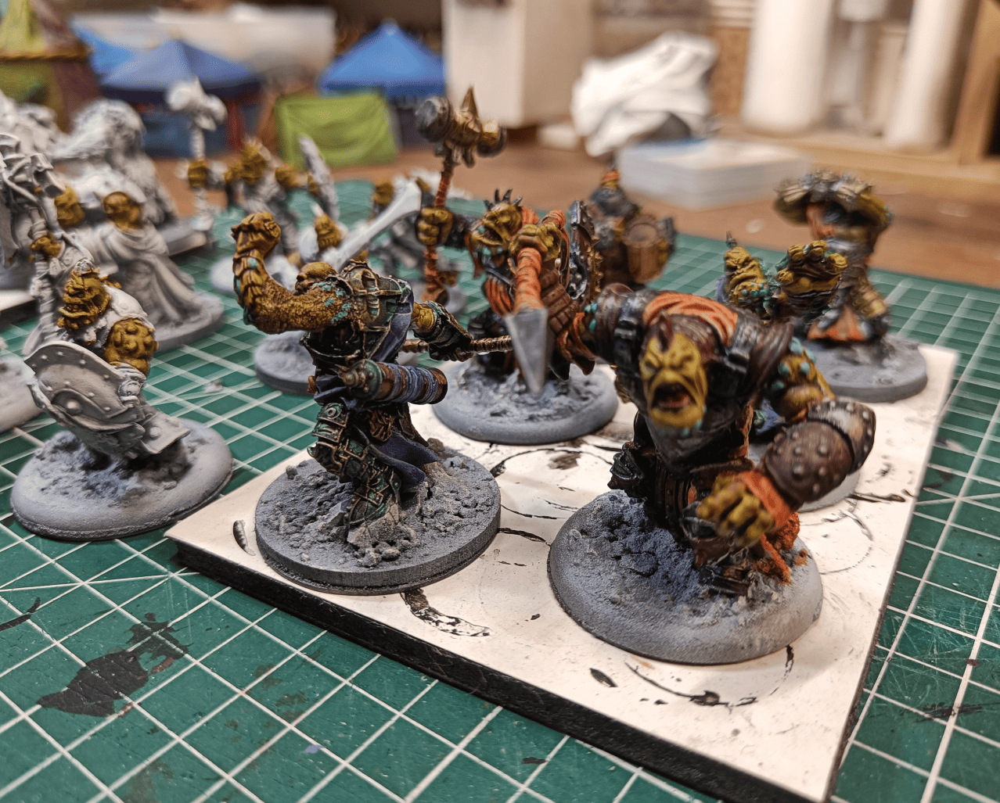

A close-up. Since a large part of the miniature is armor, I tried different things on the armor. I tried to make armor that wasn't just gray metal. I tried different metal colors to see what would work well or not.

<!-- Image 7 -->
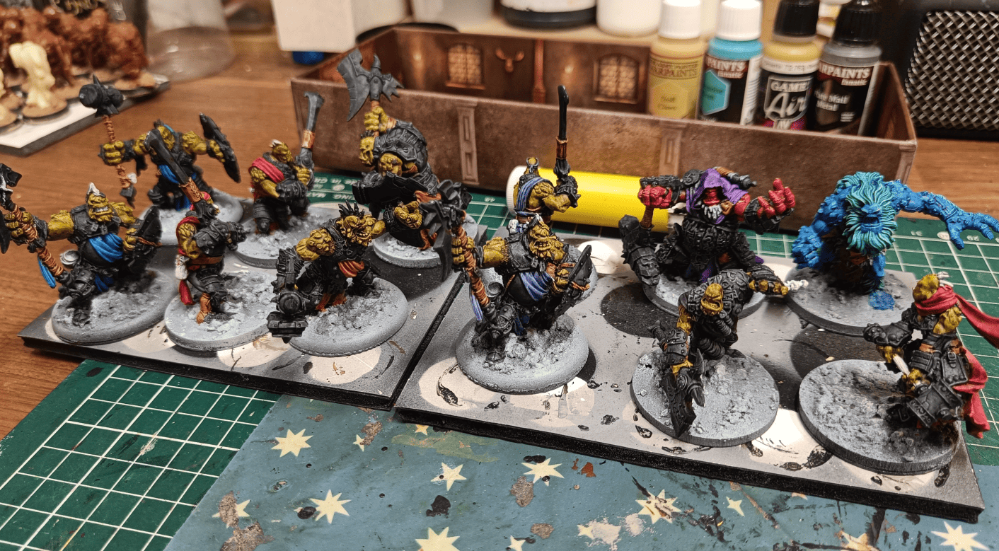

The different layers. For all the metal parts, I found it much easier and more enjoyable to put black over them first. I use Grim Black speedpaint. Even though I could have used regular black, I really like how speedpaint gets into all the crevices. Even if I didn't paint it further, it could already look very good. So for all the metal parts, I did Grim Black speedpaint.

<!-- Image 8 -->
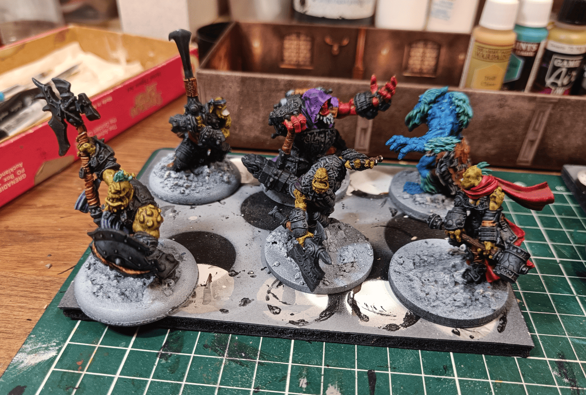

A little close-up. I tried to make the more important characters have different skin colors: the shaman in red, the yeti in blue.

<!-- Image 9 -->
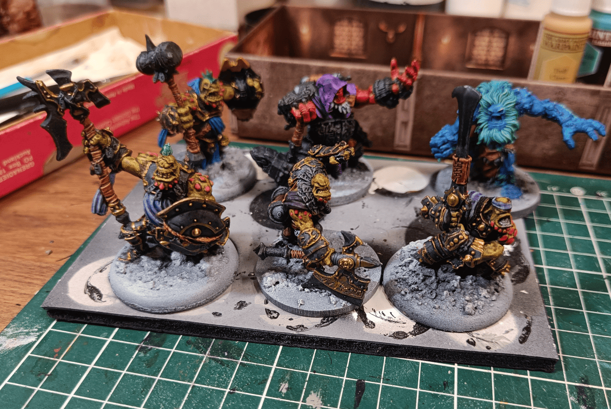

Same thing, but here I just went over the different armor parts in gold. I left the armor in Grim Black without even putting silver over it. The highlights I did with a Faber-Castell gold pen.

<!-- Image 10 -->
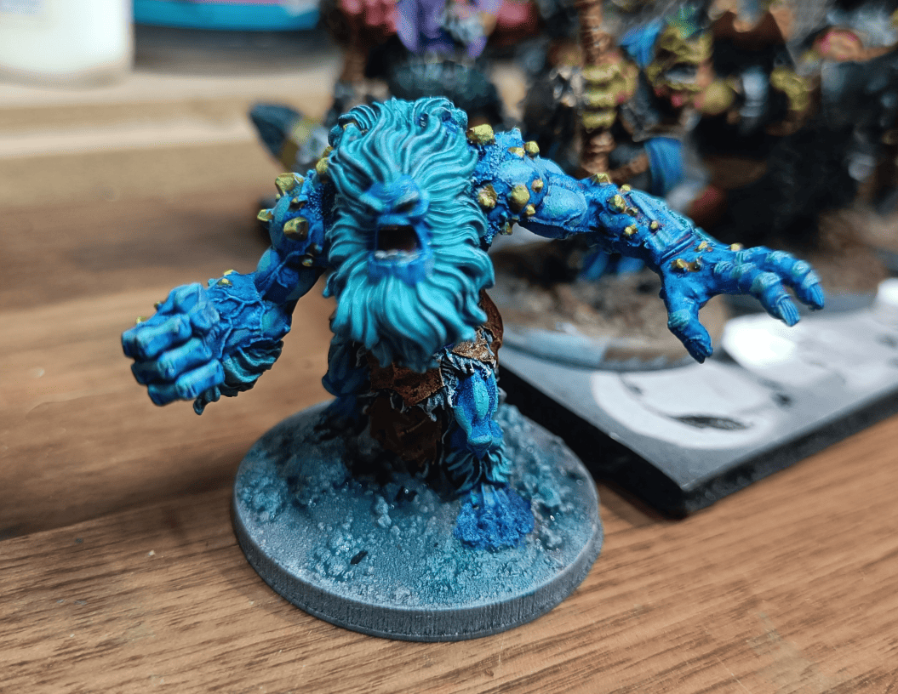

My yeti. I tried to paint all the little stone shards sticking out of him in yellow, but since I'd already put down a layer of blue and yellow isn't very well pigmented, it wasn't easy to do.

<!-- Image 11 -->
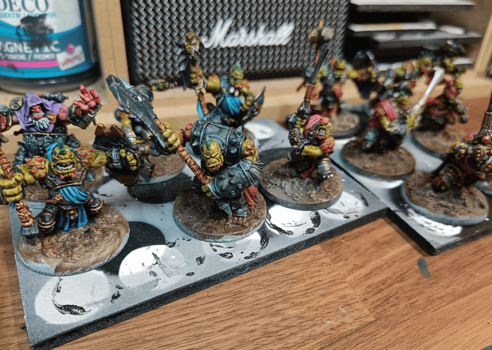

Something a bit more finished. You can see the different armor colors I did. On some armor, like the one you see with the big axe at the beginning, I did the armor in silver and then added a green speedpaint over it to try to see if it gave an interesting green armor tint.

<!-- Image 12 -->
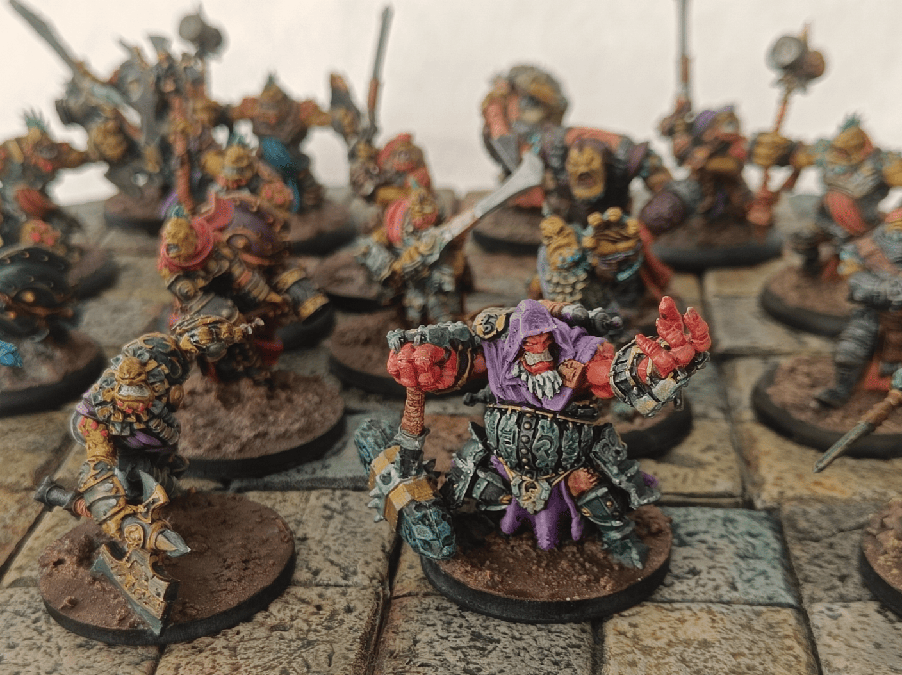

I tried to do highlights on the shaman. The edges of his hood and robe, I did them with a lighter pink. I rarely do this, I never do this. I've always seen in books that you should do this and I've never managed to do it well, but here I tried.

<!-- Image 13 -->
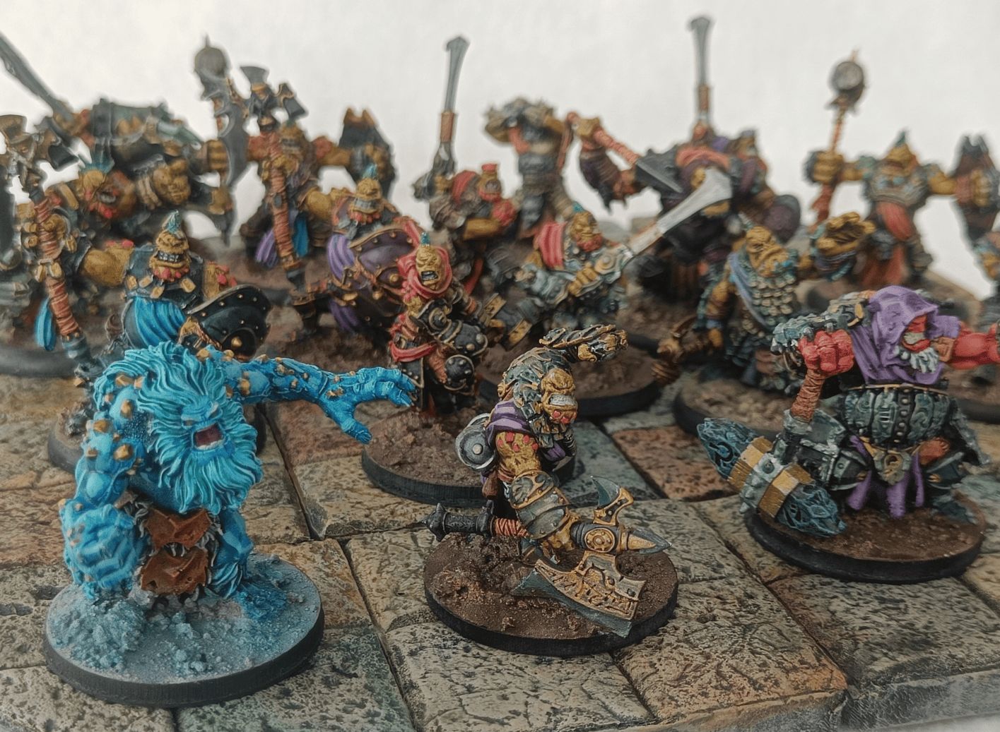

Different armor colors again. I think I achieved something good with this group: they have uniformity because their skin color is the same, but still diversity through different robe colors (red, orange, blue, purple). It's not a patchwork where everyone has a different color, but there's some variation. I made sure their crests were almost always green, and the armor color varies a bit too. That gives uniformity while keeping quite a bit of diversity.

<!-- Image 14 -->
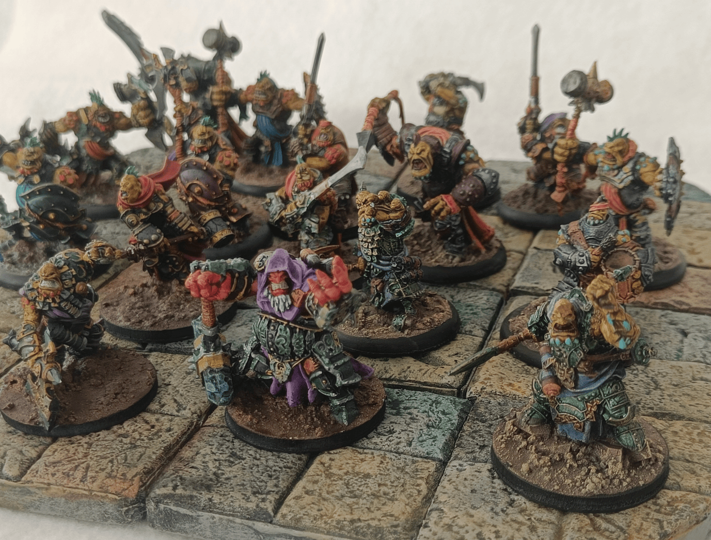

Another beauty shot from a different angle. In the end, the big mollusk in the back with the reddish armor doesn't look too bad, even though the contrast between the red and his orange cloth is quite low. Maybe if I'd given him blue cloth with red armor, it would have worked better. In the front, though, you can see on the far right the warrior who has samurai-style green armor with gold highlights. That doesn't look too bad.

<!-- Image 15 -->
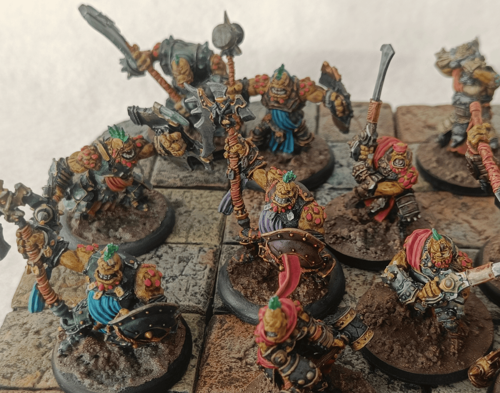

Another group shot. I think they'll work well as hobgoblins, where you know it's going to be tough to encounter one around a corner, and it's going to be even worse when you hear more of them coming from behind.

<!-- Image 16 -->
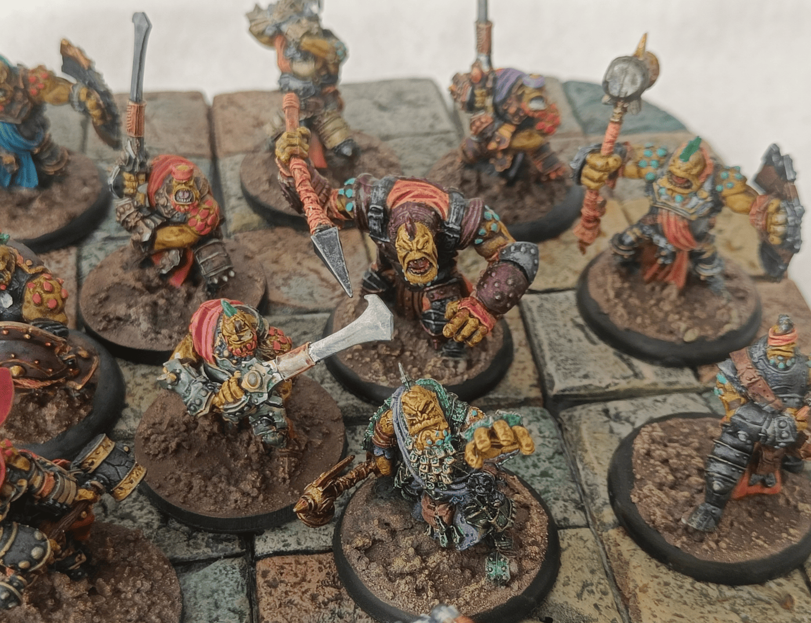

A final beauty shot.

I have a lot of them, probably way more than I'd need for a typical RPG session where heroes encounter them one or two at a time. Almost twenty is probably too many. I'm wondering if I should have only painted ten and kept the other ten for a different color scheme to represent other monsters later. Maybe that's a lesson for the future: even with a bunch of miniatures with the same sculpt, I don't need to paint all twenty. Painting ten or twelve might be enough, keeping the rest for other projects later.

