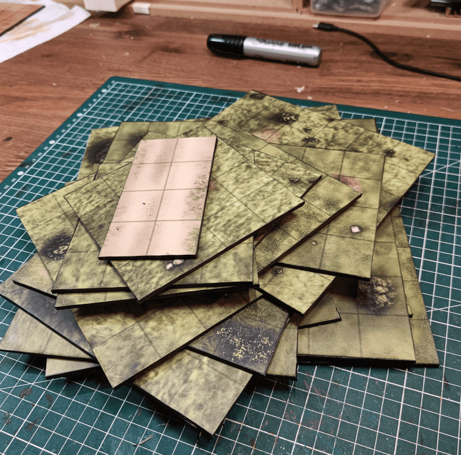
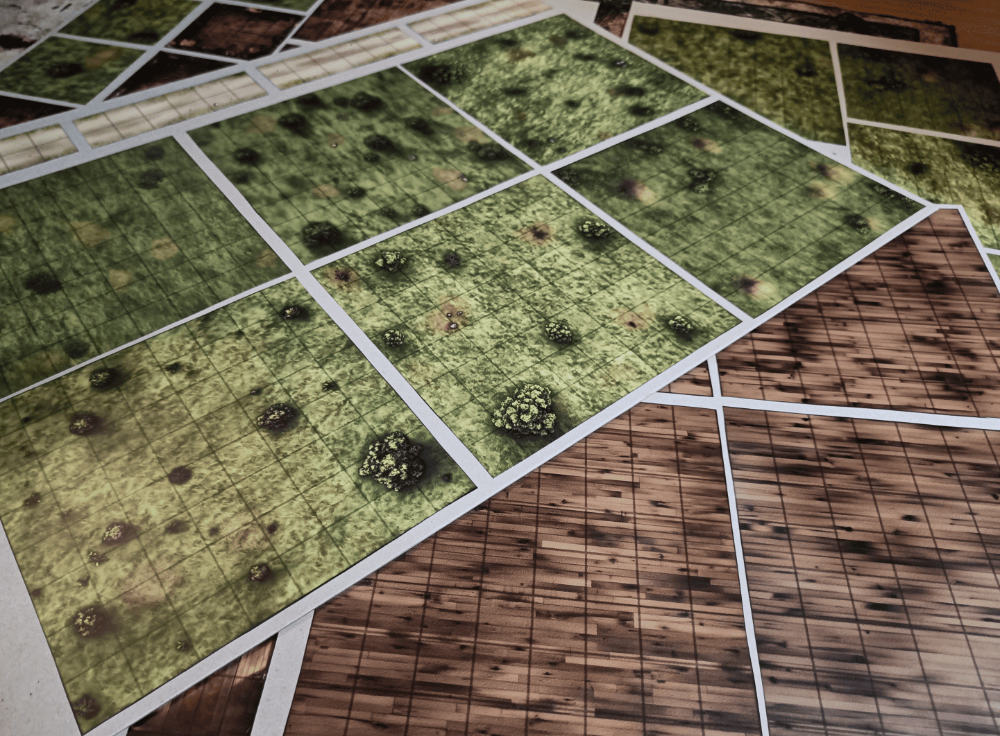
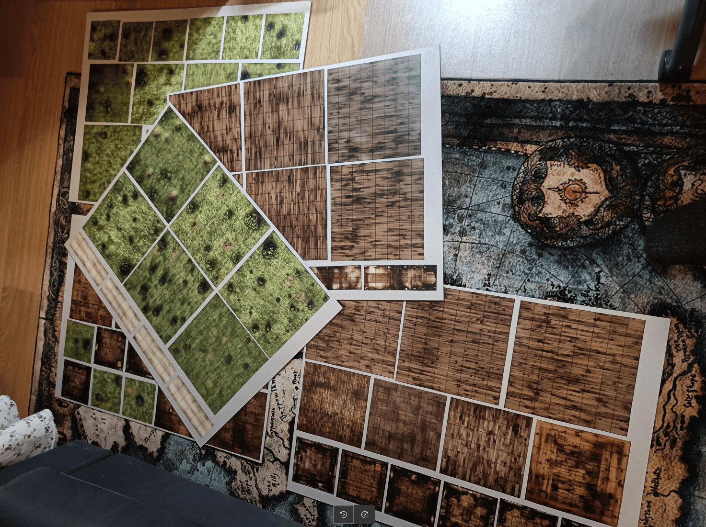

<!-- Image 1 -->

This is one of the simplest crafts I've done, but also one that works the best. I've already created dozens, maybe hundreds of tiles for RPG sessions. It takes time, it's not always pretty, sometimes terrain makes it difficult to place miniatures, it takes up storage space, and you can't write area effects on top. So I made a solution using laminated printable scenery.

<!-- Image 2 -->

This is a cardboard sheet with a sticker that represents woods, floorboards, etc. I ordered them from a print shop where you can send a PDF file and they print it on a large roll. This is the roll I cut into several sheets. I spent a few hours (Photoshop and PDFs aren't really my thing) making sure it was the right dimensions and resolution. I made sure each square was 3cm on a side and created different tile sizes.

<!-- Image 3 -->

I made squares for outdoors and indoors in a parquet style (I had already made stone tile squares for classic dungeons in the past).

I tried making 4x4 ones for small rooms and 6x6 for slightly larger ones. The main ones we use almost all the time, at least outdoors, are the 8x8. You put 4 side by side and it makes a playing field that's interesting to play on. 

All the images were generated by Midjourney. I generated an image and asked for variations, which gave me things that work well. I asked for large enough images, then used Gimp to add the lines to separate the different tiles. 

This is one of the most versatile scenery pieces I have. It's solid because it's thick cardboard, and I painted the sides with a black marker so they show up well. The print shop can print on adhesive paper, so it sticks directly and holds well. Since it's laminated, you can write with an erasable dry-erase marker on top to mark traps, holes, etc. It's light, takes up no space and is versatile. 

I'll probably make more. It also lets you use detailed images for interesting set-pieces in dungeons. If I know I'm running a cool dungeon, I can pay to have that printed. I think it cost me around 40 euros for the roll to make all of this, but the time saved and the quality are worth it.
