<!-- Image 1 -->
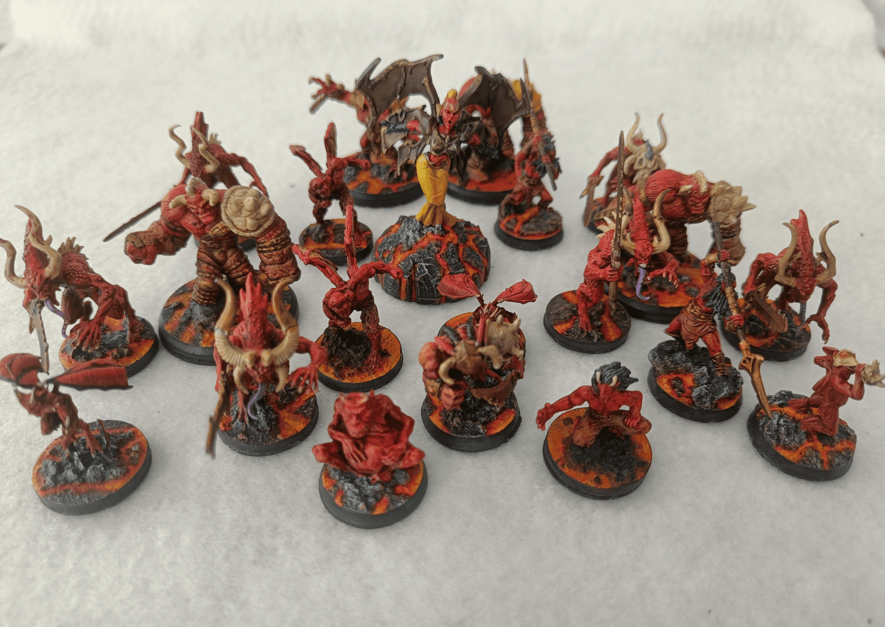

This is the first time I made lava bases and I think it turned out well, so I want to document the process for future reference.

I started by making my bases as usual with a mixture of filler paste, gravel, and glue that looks a bit like mud. Originally I had planned to make normal bases, so I started like that.

<!-- Image 2 -->
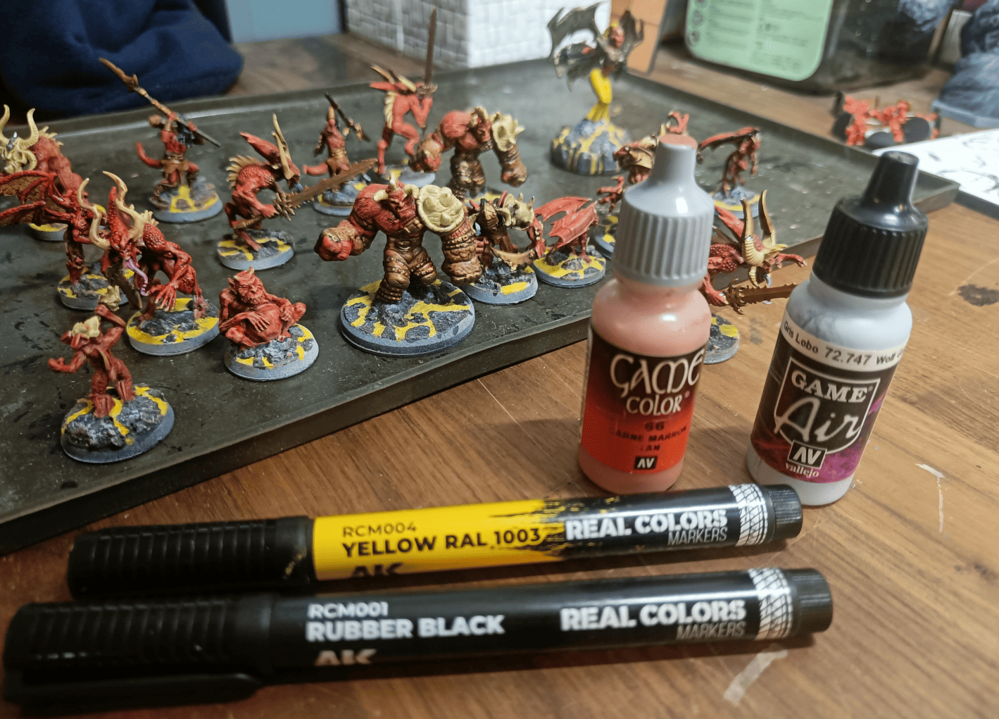

I'm working with Real Colors Markers from AK brand. I have two colors: a yellow one (reference RCM004) and a very dark gray, almost black anthracite one (reference RCM001).

<!-- Image 3 -->
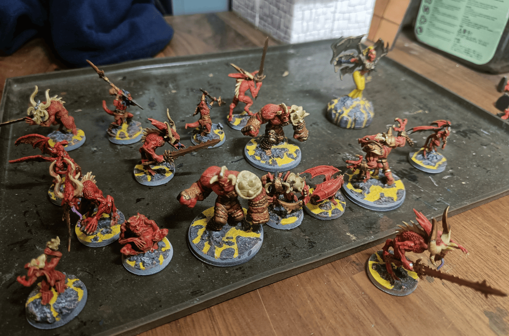

With the yellow marker, I traced where the lava would be. I generally follow the contours of the central island where my character stands, then make lines going to the edge, trying to avoid leaving the character sitting on an island in the middle. While I mostly follow the relief, I sometimes add small islands of earth even when there's no particular relief to get that lava effect.

I do all of that in pure yellow, then fill everything else that's supposed to be stone with the black marker.

From a distance, the lava effect already worked well even before the first drybrush or adding orange. Just the yellow lines and brown contours were enough, then it was about adding more detail progressively.

<!-- Image 4 -->
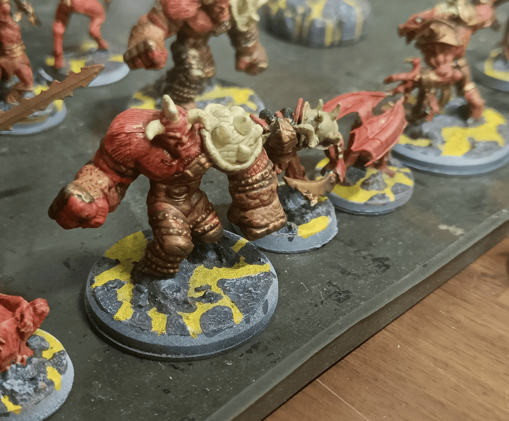

Next step: I took Wolf Grey from Vallejo and did a fairly light drybrushing on all the stone parts, which gives a slightly ashy appearance. I applied that to all the stone areas.

<!-- Image 5 -->
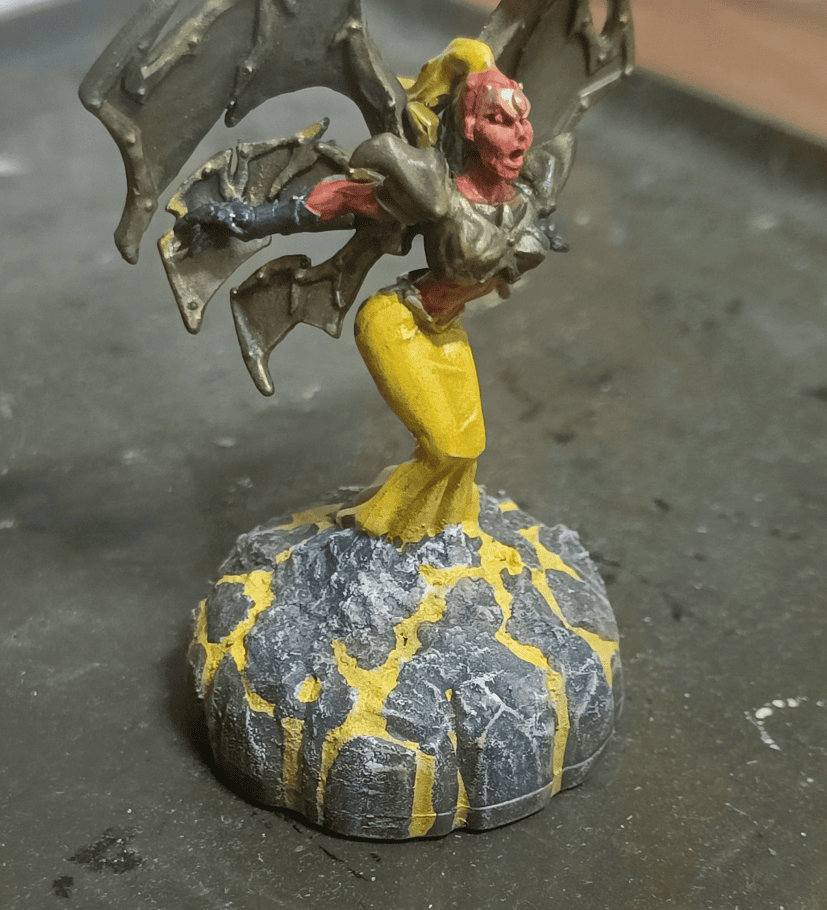

Then I grabbed Game Color Carne Marron, a slightly reddish brown that looks like reddish mud. The important thing is that it leans more towards brown than red (I tried a deeper red initially and the drybrush just turned pink). I drybrushed from the bottom of the islands upward, starting from where the lava is. This gives the effect of glowing lava illuminating the stone blocks.

I also applied it on all the flat stone surfaces with a quick brushing from the outside towards the inside on the edges, so that on large stone blocks, the center stays with just the grey drybrushing.

<!-- Image 6 -->
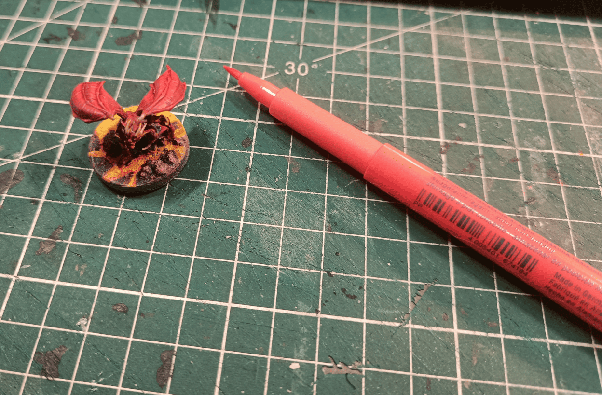

At that point I started using some less orthodox techniques. I grabbed a Faber-Castell Pitt Artist Pen Brush in Scarlet Red (kind of orange) and followed all the outlines of the stone islands on the yellow parts.

<!-- Image 7 -->
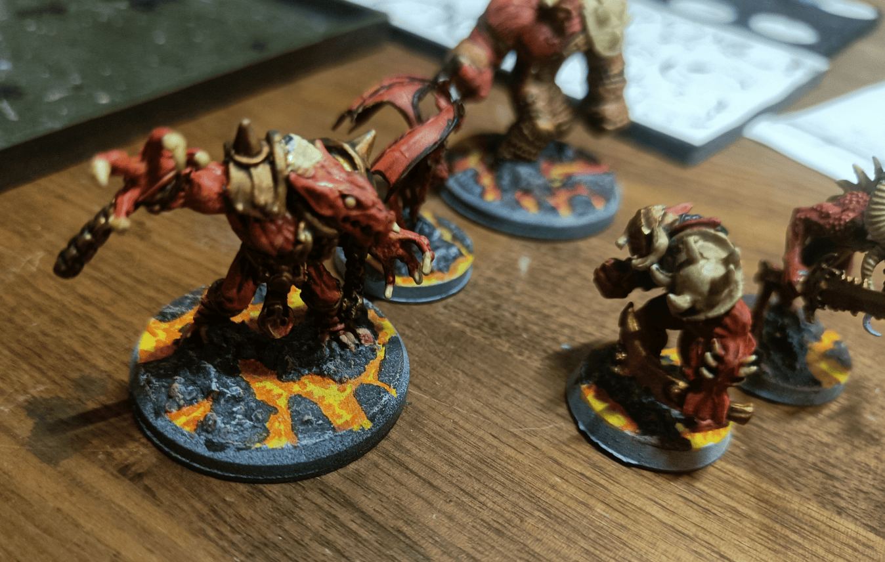

I pushed the orange towards the center because from what I've noticed about lava, there are rarely large expanses of yellow. The yellow seems to only be in the super hot center, so I had the orange advance further in. For this part I didn't do a straight line along the edges, but rather lots of small lines perpendicular to the edge to make it more natural.

<!-- Image 8 -->
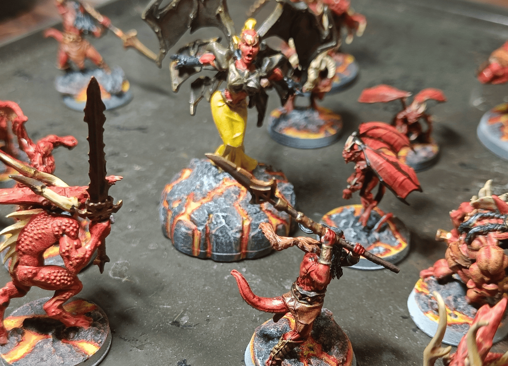

For the next phase, I took another marker, a STAEDTLER from their Lumo Color Permanent range. I went with red this time.

<!-- Image 9 -->
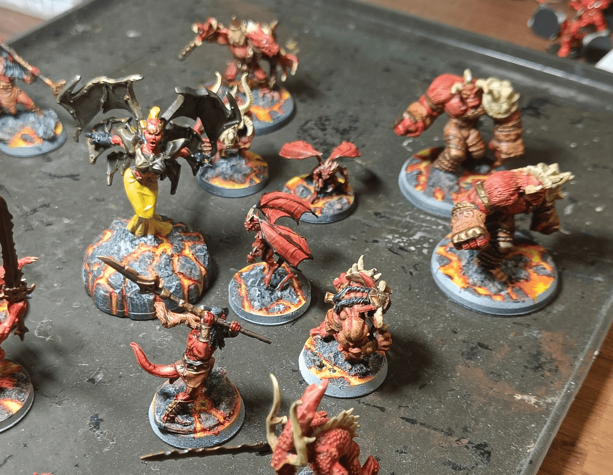

<!-- Image 10 -->
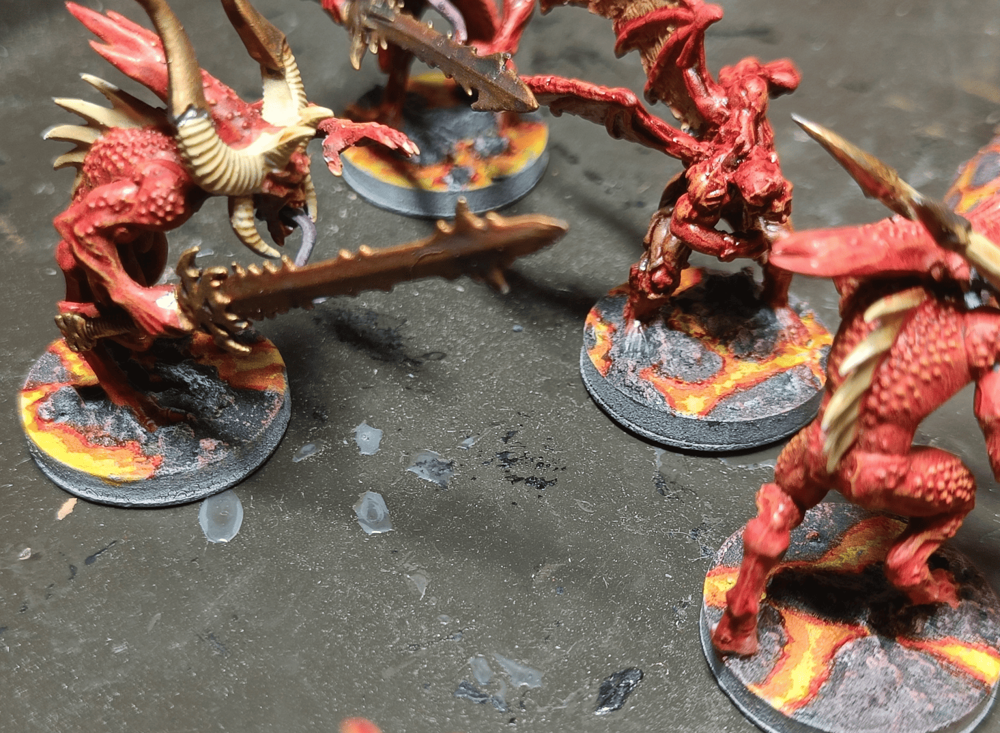

I used it to retrace the outline exactly where the stone and lava meet. This adds a red edge right at the point where the two surfaces touch.

<!-- Image 11 -->
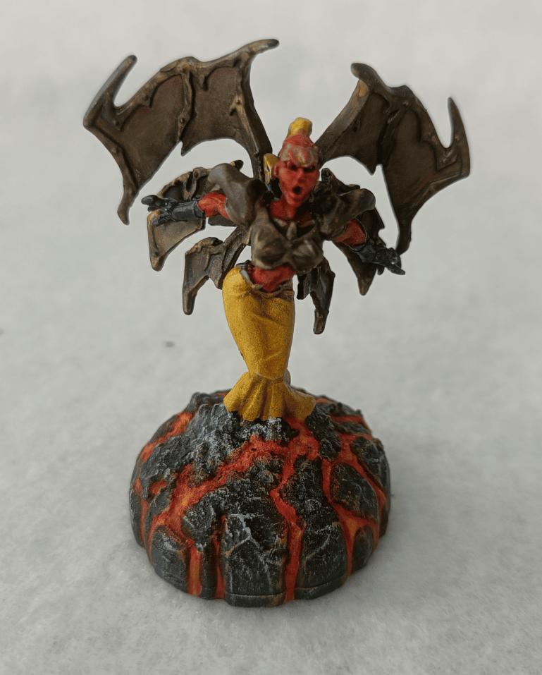

Then I covered all the lava with Zealot Yellow speedpaint. It gives it a slightly orange tint but you can still see through it. The Zealot Yellow Speed Paint helps unify everything and softens the rough layers nicely.

<!-- Image 12 -->
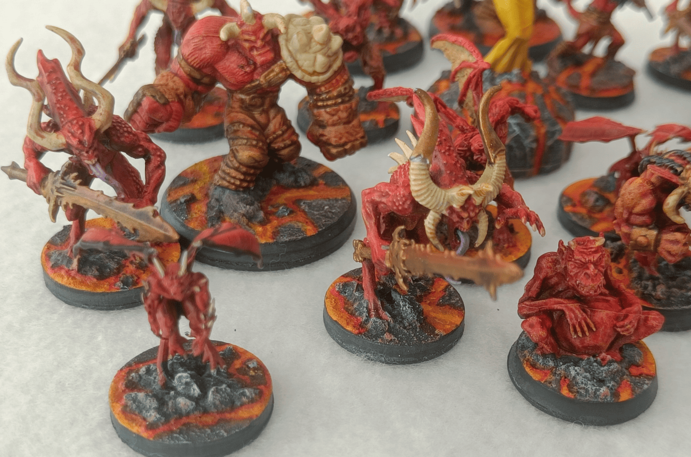

Final phase: since the Zealot Yellow tones down the yellow areas, I grab my AK Marker yellow again. In the spots where there are large lava expanses that got toned down, I make tiny pencil strokes to create small dots in the center.

A few seconds later, working base by base, I take a brush and just wet it (no ink, no paint). Then I spread out what I did with the marker so those visible splotches get softened. This brings out the yellow in the center of the lava and gives it that molten look.

The trickiest part is working super fast. Sometimes I don't even do a whole base at once, just small bits at a time. Right after applying each bit, I spread it with a wet brush because the marker dries incredibly fast and the effect doesn't work as well if you wait.

<!-- Image 13 -->
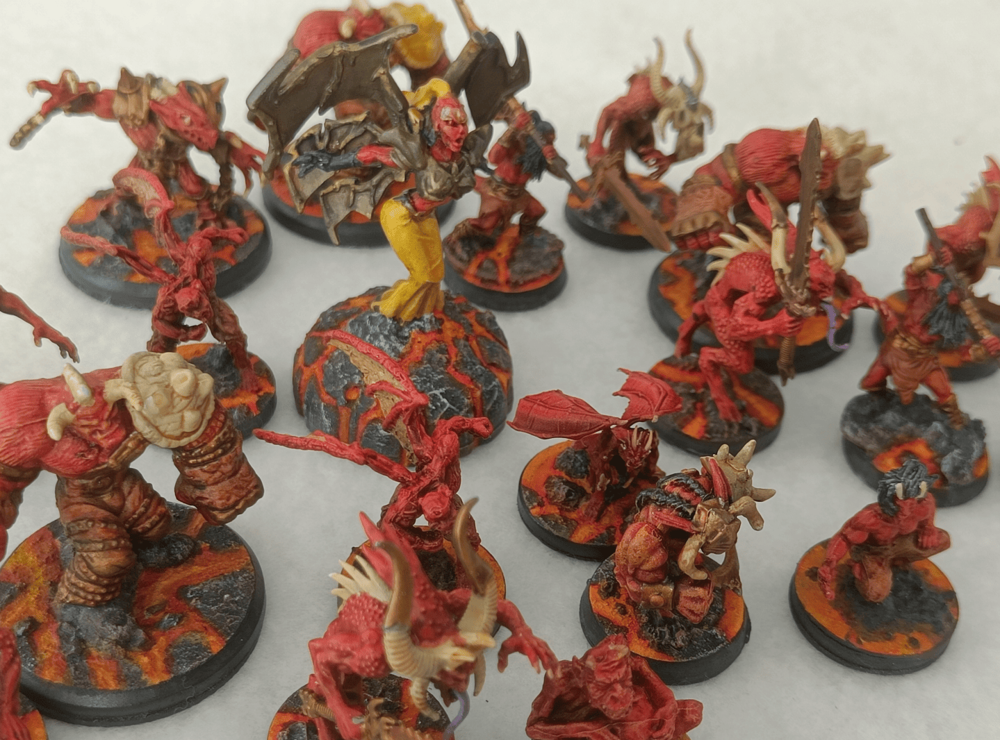

Finally finished painting the contours of the bases in black. Pretty happy with how these turned out, especially since it's my first time trying this technique.

<!-- Image 14 -->
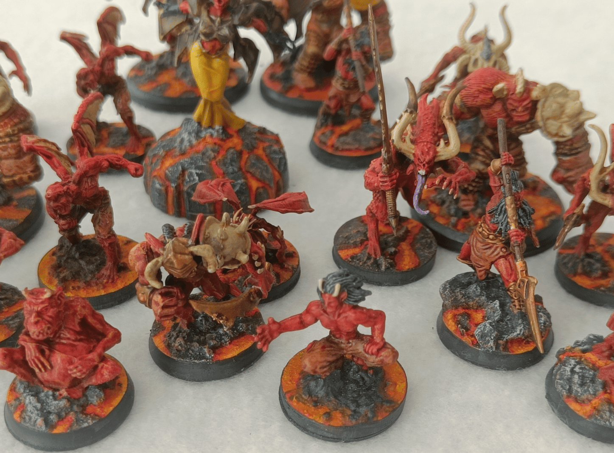

The key is thinking about it like this: the closer to the center of the lava areas, the more yellow. The closer to the stone edges, the more red. The strong contrast between the black stone and the lava makes it work well.

What's nice is that most of the painting work is done with AK markers. I can work on it bit by bit without pulling out all my painting gear. My work desk is also my hobby painting workspace, so when I'm on calls with colleagues, I can make progress on the parts that can be done with a marker. It doesn't require focus from me, so I can do it while discussing work on regular calls. I don't need to set up equipment, I just cap the marker when done, put the miniature aside, and that's it. About 90% of the project can be done this way.

<!-- Image 15 -->
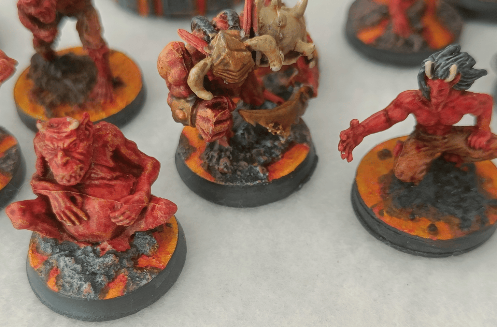

<!-- Image 16 -->
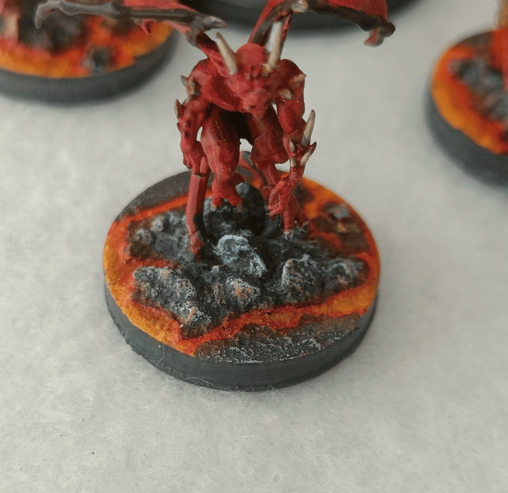
