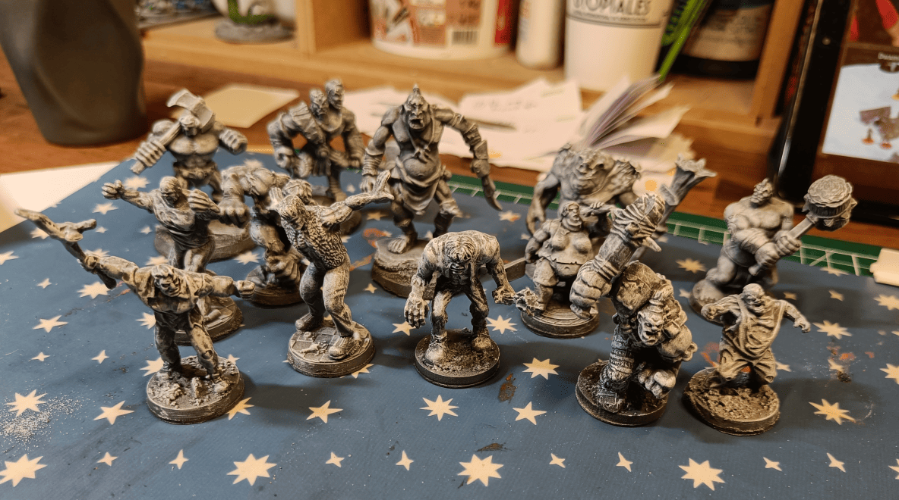
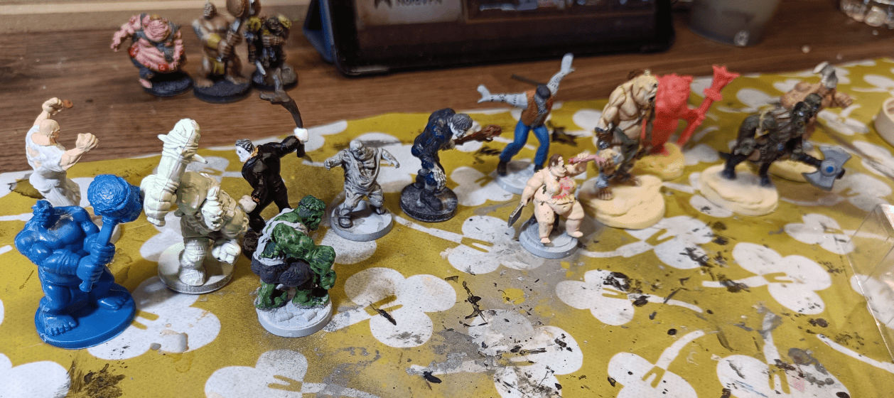

There is an amazing scenario in Rise of the Runelords, in the Hook Mountain Massacre book. Players have to rescue some rangers who've been captured by a family of hill giants (or maybe ogres, I can't quite remember) led by a matriarch. The whole family is hilariously dumb, but also morbidly grim, which makes for such a fun atmosphere.

I've never managed to get my players far enough in this adventure path to actually run this encounter, but I really want to use it somehow. I'm thinking of dropping it into another campaign.

To prep for that, I wanted to create a full roster of all the members of the Graul family that appear in that scenario. So I dug through my collection of ogre and hill giant miniature to see what I have available to represent the whole family.

The first figurine you see at the top is a Heroclix figurine with its arms raised in the air. I believe it's supposed to represent a brute that escaped from psychiatric ward. The second one in blue is an ogre figurine that comes from the World of Warcraft board game.

The next three minis also come from Heroclix. The pale green one is from their fantasy range with the somewhat deformed characters. The one carrying a piece of wood comes from their horror range. And the big green one is obviously Hulk.

The gray one is a zombie from some board game similar to Zombicide, but not actually Zombicide. The next one holding a staff is a Frankenstein-type figure from the Heroclix Horror range. The one behind with arms outstretched, looking like it's about to fly, is also a Frankenstein from Heroclix, though I can't remember which specific range.

The obese figurine sitting down eating an arm with a cleaver in hand comes from the Heroclix Horror range. It's the perfect representation of the matriarch of the group.

The Cyclops behind her is a plastic toy, that one can buy in regular toy shop. The red one is also coming from a board game, but I can't remember the name (I have other such miniature, in other colors).

Finally, the green double headed thing is coming from Heroclix as well. And the one at the very far end is probably worth a fortune as it's a metal miniature of Thrudd the Barbarian, a very early (1982, I wasn't even born!) Games Workshop mini.