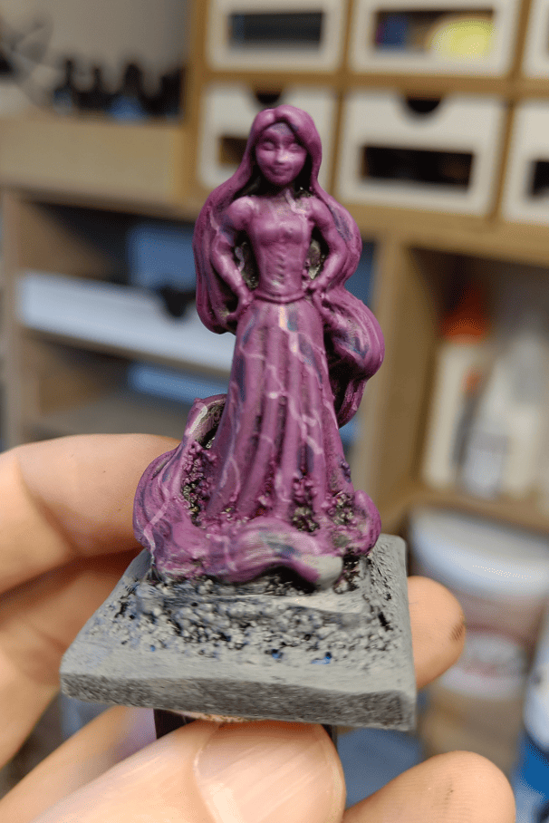
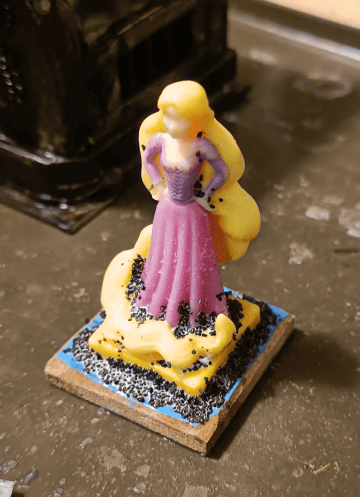

Yeah, it's a repurposed Kinder figurine! I glued it on a wooden square with a plastic square on top to make a pedestal. Added some quick texture and then painted it.

I tried to do a marble effect and it turned out pretty well from a distance. Painted the whole thing purple, then added little white strokes. On top of those I added a light blue wash. Good enough marble effect.

I needed to make a statue of Desna and that worked pretty well. You can totally see it's marble.