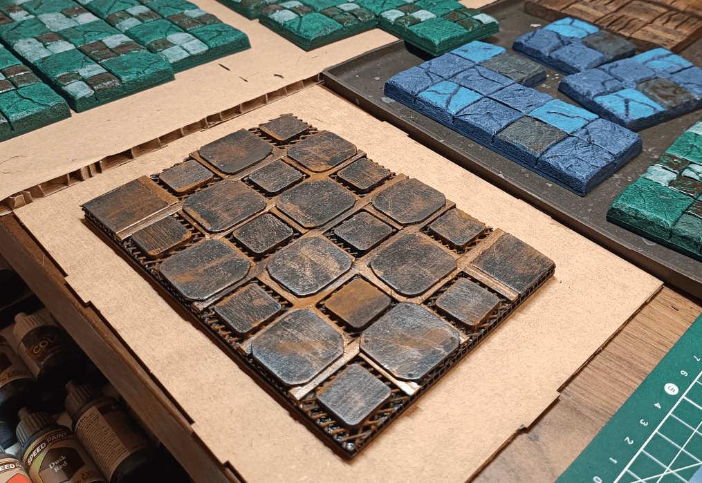
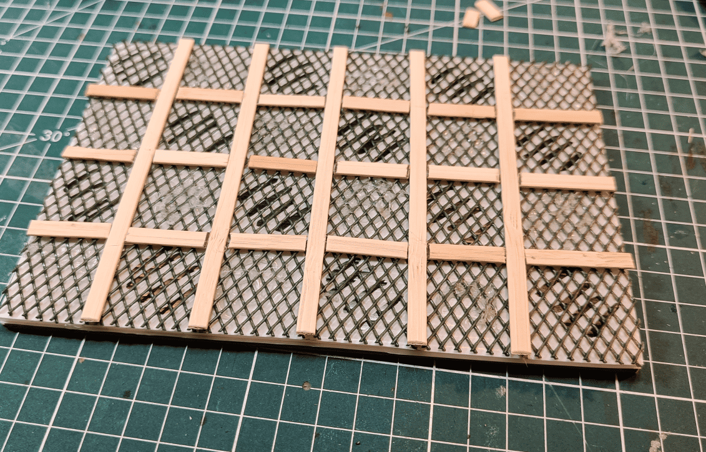
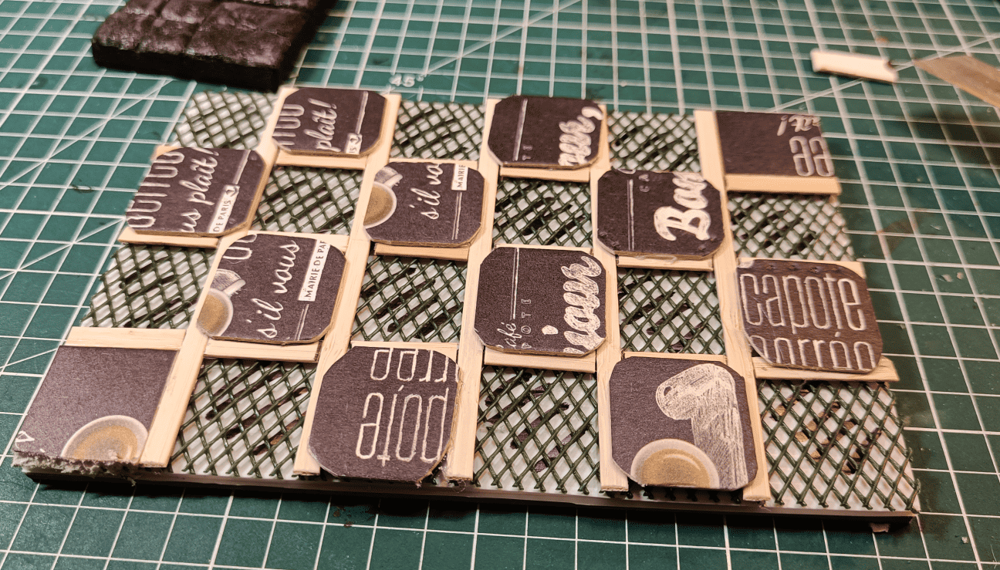
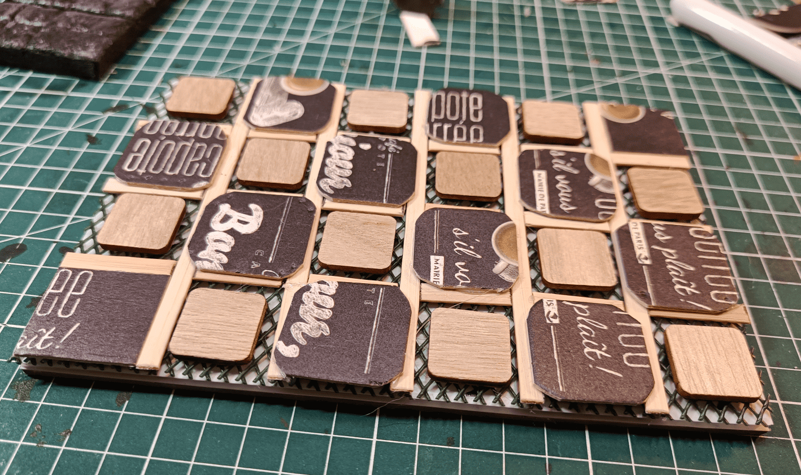
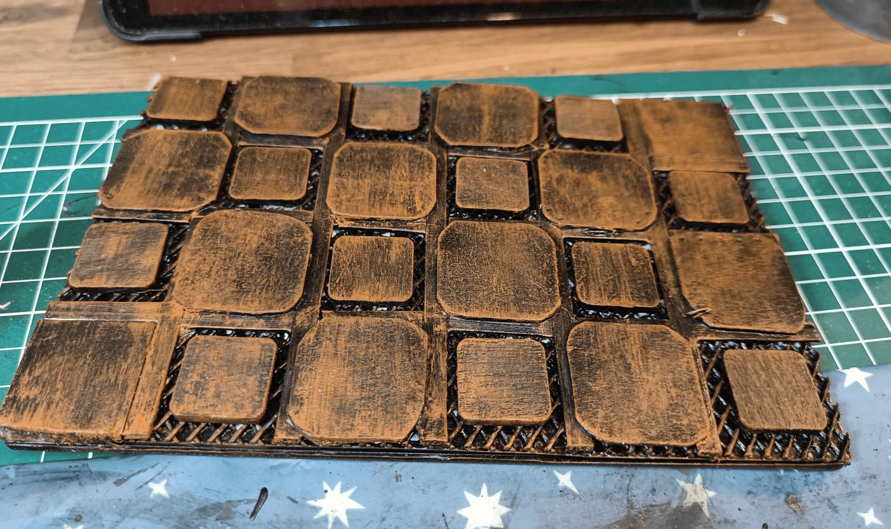

In the Strange Aeons asylum map, there's this machine room where the floor is made of metal. It makes noise when you walk on it, so I wanted to create a tile that represented that feeling.

In the end, I think my players never actually went there, but I had fun experimenting with how to make a tile that gives you the sensation of walking on metal.

For the base, I didn't use the same cardboard as for the other tiles because I wanted them to have similar thicknesses. Instead, I used corrugated plastic sheets on which I glued a large sheet of chicken wire. I colored the different squares to have an indication of which tiles I was going to fill and which tiles I planned to leave the wire mesh as is. I also made walkways and pathways, which will become metal planks, but for now I made them with small pieces of wood.

I stuck cardboard tiles in a somewhat checkerboard pattern at different places so there would be tiles at different heights.

And in the others I put smaller tiles. The idea for me was to manage to create something where we can continue to see the mesh underneath.

And then black and an orange dry brush to create the rust effect. I think I added another silver drybrush after this one.