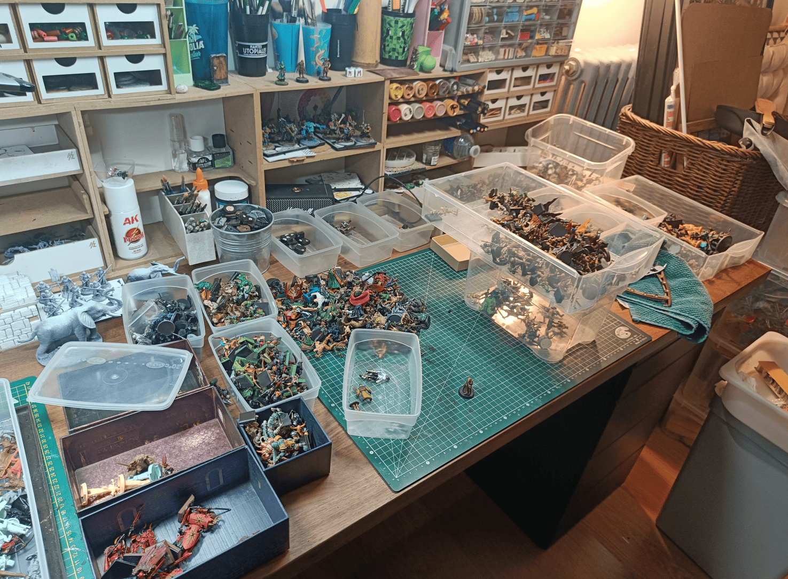

This is a photo I wanted to take at one point because I had to tidy up my workshop to make space and sort things out. I had miniature to paint, what's called the *pile of shame*, in lots of different places, so I decided I'd sort them once and for all.

I managed to create a sort of system. I sorted my miniature not by type, but by whether I want to paint them or not. I have a drawer of miniature I call high quality, meaning I really want to paint them. Most of these come from A Song of Ice and Fire, which makes really good stuff, or certain Reaper Bones that are very cool. I have another drawer that's explicitly for monsters and another drawer for large monsters. These are monsters I want to paint but in different sizes, because if I put all the large monsters with the regular monsters in one drawer, I won't have enough space.

Then I have other drawers in descending order of quality. Basically I have one that I called worst quality, like I don't even want to paint them. These are miniature that might come from really ugly board games or things I got a long time ago. It pains me to throw them away because I know I can always try to salvage heads, arms, things like that, but clearly, I know these are miniature I'll be able to cut up to recover pieces if I need them, but not miniature I'll want to paint directly.

And then I have a few other levels. There are miniature I know I'll never use because they're science fiction miniature, or miniature that have sentimental value because I painted them when I was 15 and they're very ugly but I don't want to touch them anyway. 

I also took the opportunity to remove the bases from all the miniature. If I have miniature in drawers, they don't have bases because otherwise I have bases of different sizes, different shapes all over the place. I removed them all from the bases and I have boxes full of bases if I ever need them. 

In the drawers I have baseless miniature which makes them much easier to identify. And basically, from the moment I put them on a base, it means I want to paint them and they start entering my painting pipeline. If they're not on a base, they're loose and that doesn't bother me, but it allowed me to keep a bit of logic among all the miniature I have.
