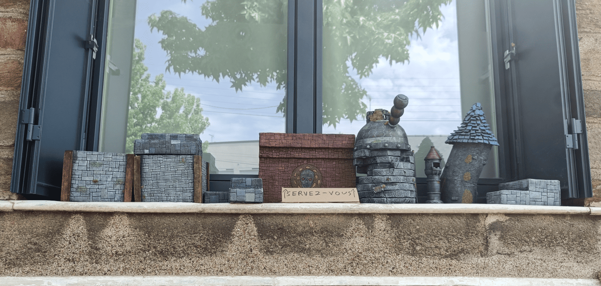
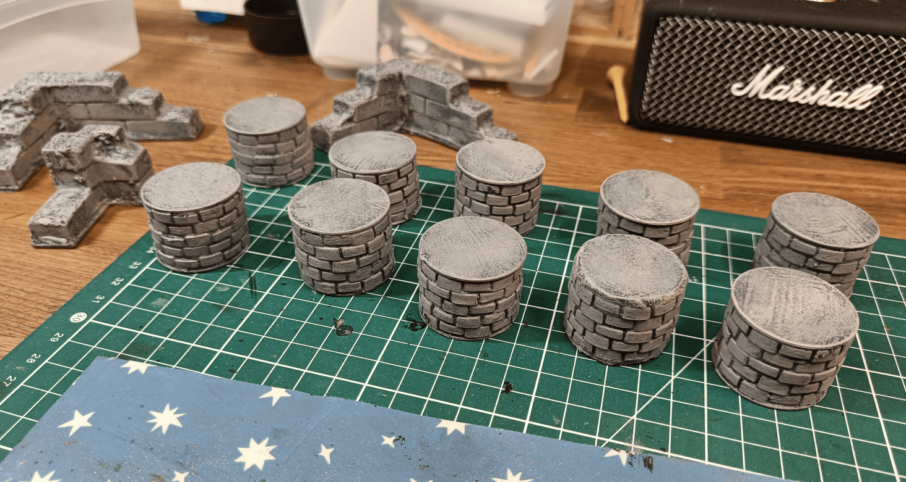
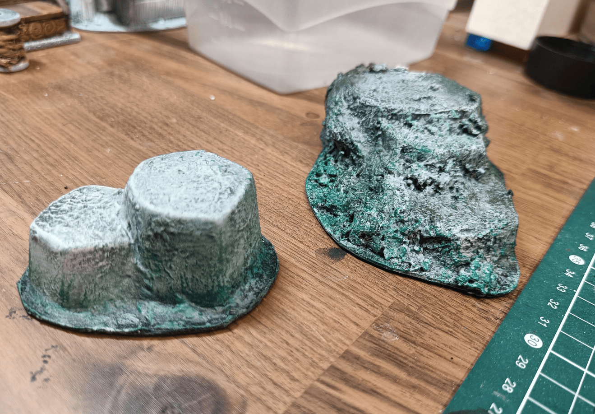
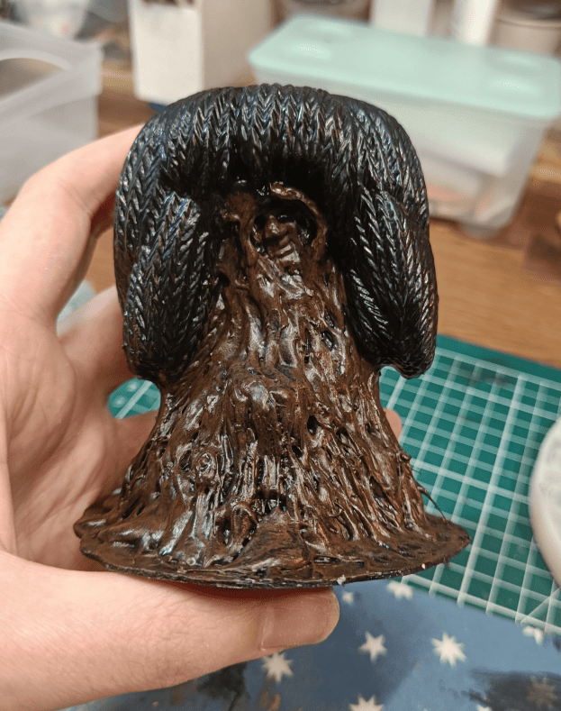
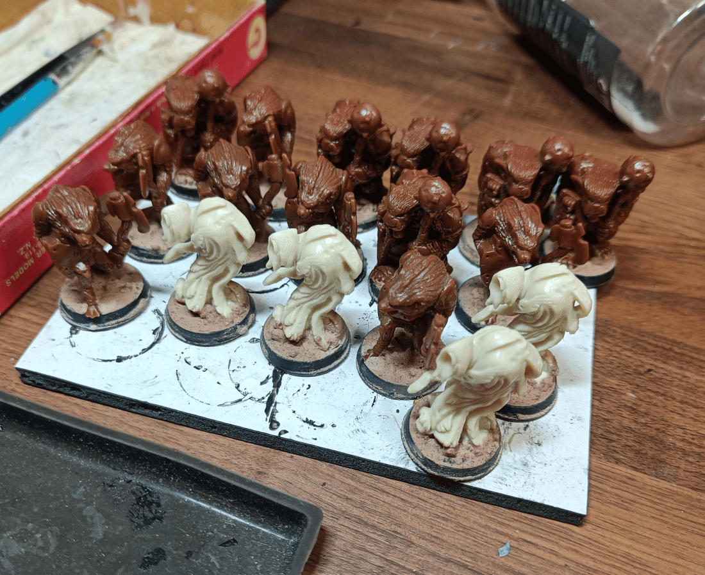

<!-- Image 1 -->

This is a recap of various small projects from 2025 that didn't warrant their own dedicated posts, [similar to last year's misc post](../misc2024/). Some terrain pieces got donated, some new scatter terrain was built, and I tracked my painting progress over the years.

I got rid of a lot of old terrain pieces I made years ago. What they had in common was that I was discovering techniques and practicing, and in a frenzy of being able to transform foam into stone, I made tons of them. But in reality they're not very practical in a game session because they lack versatility or they're way too imposing and take up a lot of storage space. So I ended up putting them on my windowsill by the street. People helped themselves and believe it or not, everything went except the plaque with the Baldur's Gate symbol. That's the only one that stayed. Everything else was taken.

<!-- Image 2 -->

This is a good example of what I consider my favorite terrain pieces: they have a lot of versatility and you can use them in many different places. 

Plus, these particular ones are very solid and cost almost nothing. The walls are Lego or Megablocks bricks stacked on top of each other with a bit of spackle added. I cut the top of the studs and glued them onto a cardboard plate. Since it's Lego, it interlocks very well, won't break, and does exactly what you ask of it. 

The columns are [Heroclix bases](../2020Wip/) stacked on top of each other, slightly offset, with a round piece on top. Once painted, they're also super solid. Columns are needed all the time, so these terrain pieces check all my boxes: very simple to make, inexpensive, solid, and highly versatile.

<!-- Image 3 -->

This is something similar. It's outdoor scatter terrain with rocks I made from Playmobil blocks. They're literally rocks as they exist in Playmobil, but I glued them onto cardboard. To avoid recognizing the somewhat rough Playmobil edges too much, I added spackle on top to give a bit of texture. On the one on the right, I added some gravel as well so you can see less of the very straight version of the steps that were on it. But again, very solid, very easy to make, and very useful.

<!-- Image 4 -->

I think this is a McDonald's Happy Meal toy, Grandmother Willow from Pocahontas. I just added a bit of texture to it and it'll make a nice interesting tree.

<!-- Image 5 -->

This is interesting because I managed to find a pack of miniatures that come from the Dungeons & Dragons board game. I had already gotten a pack like this a long time ago when I got back into painting after not doing it since my teenage years. I wanted to paint them now with my current painting level to compare how I painted several years ago to what I'm capable of doing today. Painting exactly the same miniatures felt like a good way to measure the progress.
