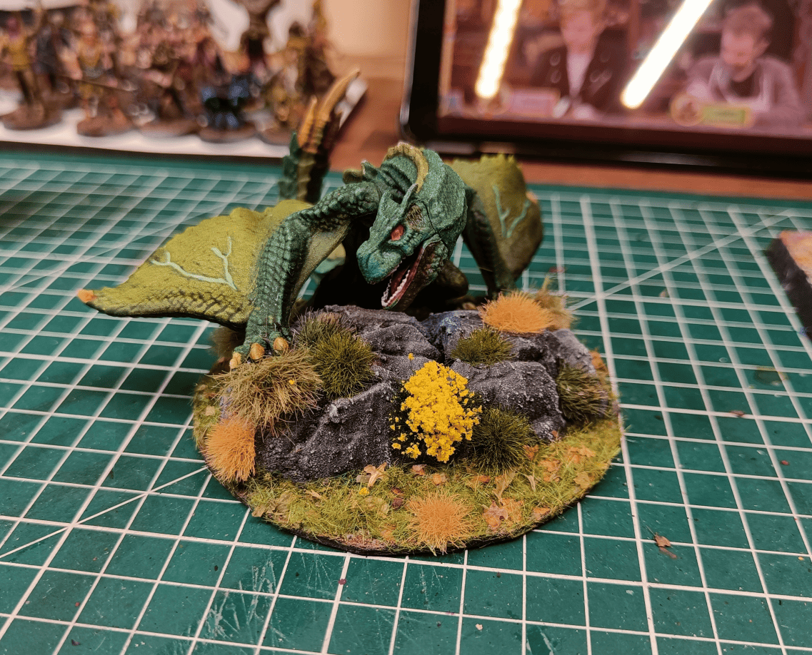
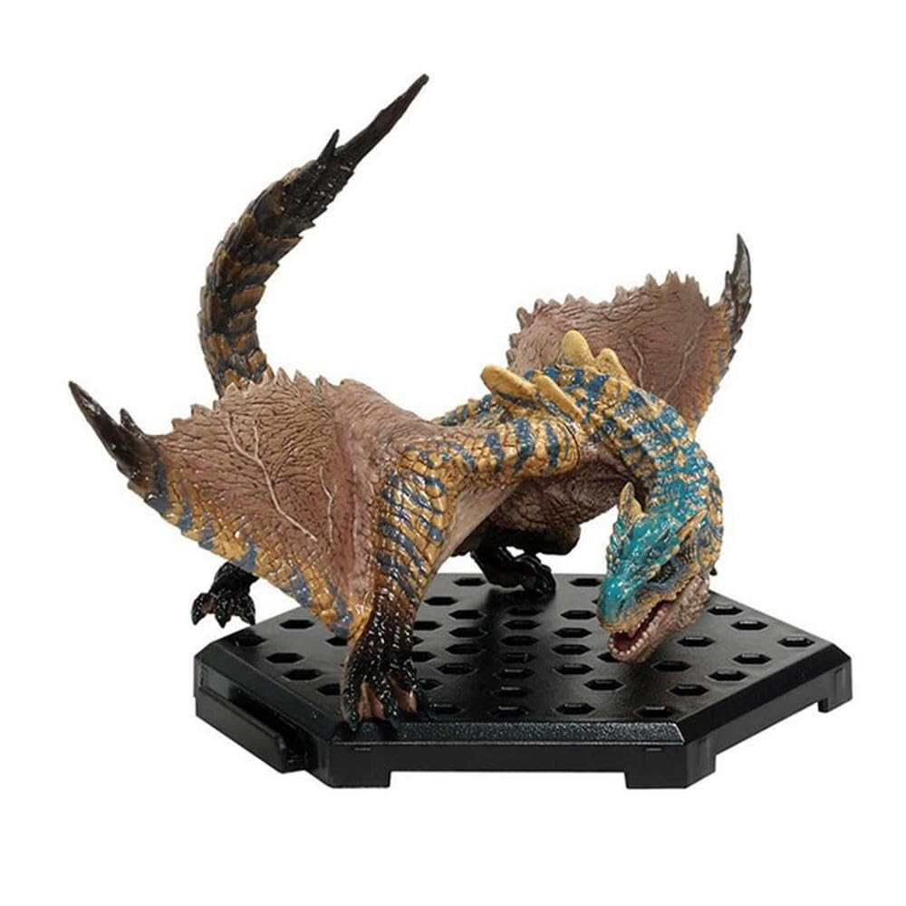
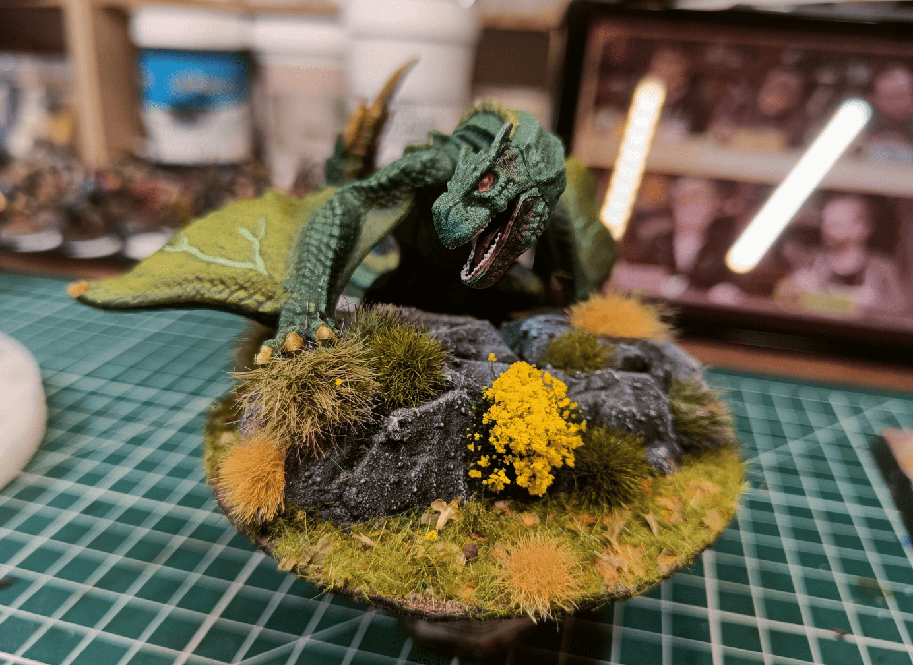
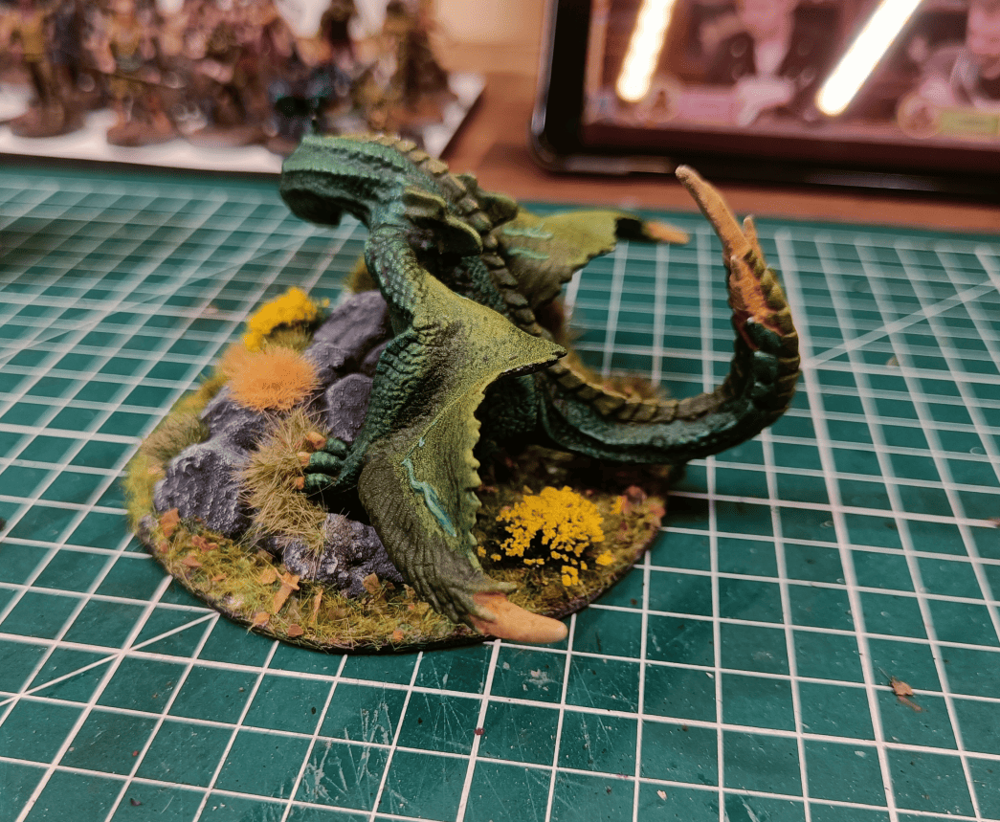
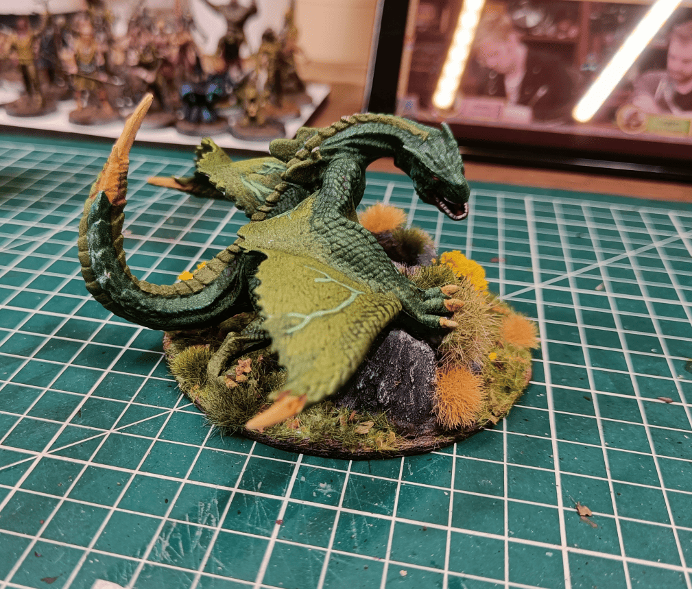

<!-- Image 1 -->

This is a miniature I'm quite proud of. It's a wyvern made from a Monster Hunter plastic toy. I found a private sale of Monster Hunter toys at a really good price, mostly dragons and other creatures. The sculpts had lots of detail, so I picked one up.

<!-- Image 2 -->

This is what you get. Its official name is a Tigrex Dragon.

<!-- Image 3 -->

I thought its position would be much more impressive if I made it stand on a rock, so I took a plastic rock from another toy, glued it on, and painted it. I added lots of flocking to give the impression that it's in a plains or forest environment, walking around and ready to take flight. My players saw it fly overhead, land, eat a horse, and fly away again, but they never actually fought it.

<!-- Image 4 -->

Here you can see it from behind. The colors I used are basically two different shades of green for the wings and scales, and different colors for the rest of its spine. But since I painted it with a black primer using drybrushing, it gives an effect where even on the relatively flat parts, some areas are darker than others.

<!-- Image 5 -->

Here it is from another angle. 

Monster Hunter miniature make good proxies for all kinds of draconic creatures. The sculpt quality is solid, they're in athletic and energetic poses with lots of movement, and they're always big. For making a wyvern, it worked really well. I'm quite happy with how it turned out.

