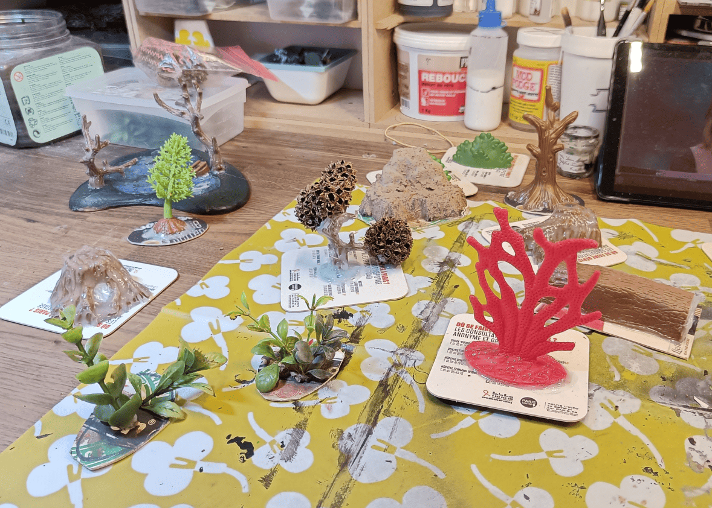
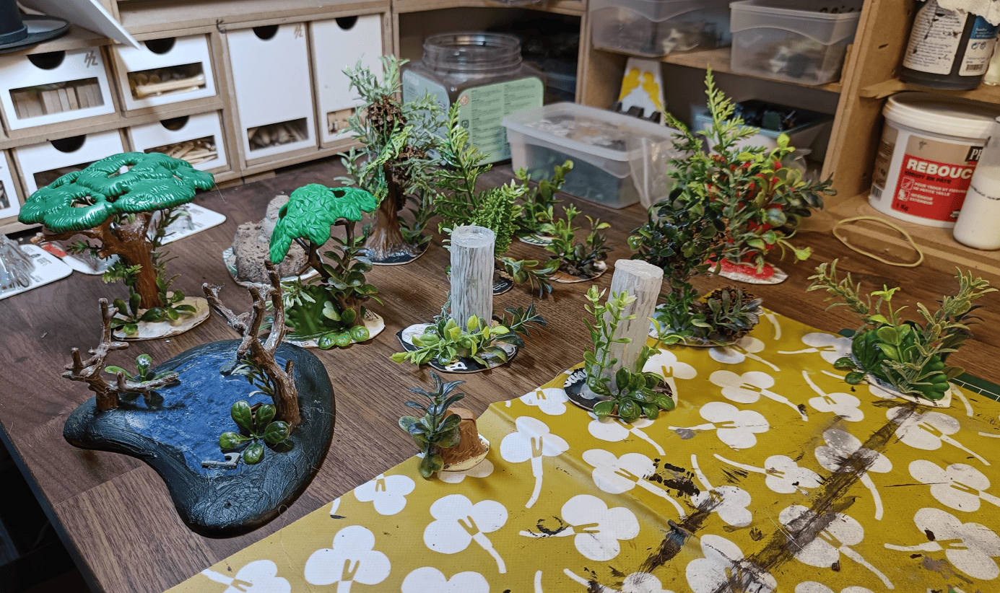
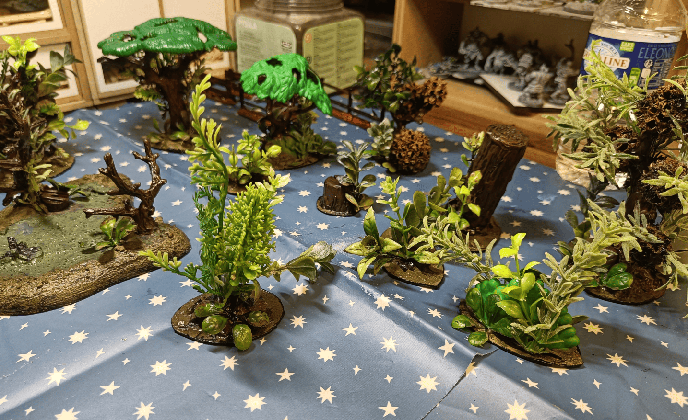
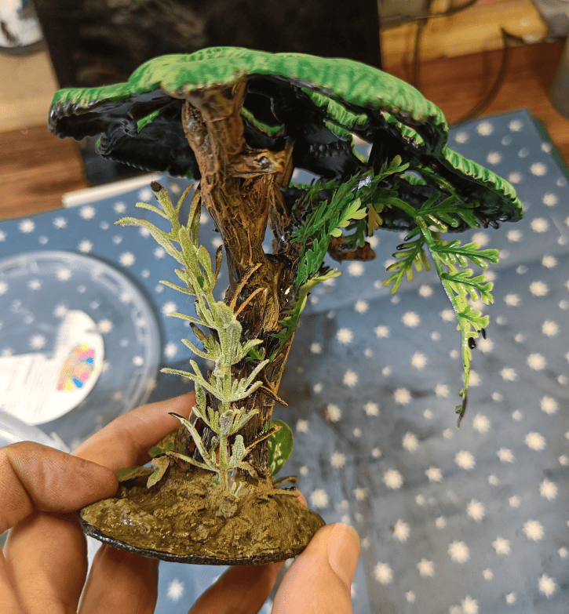
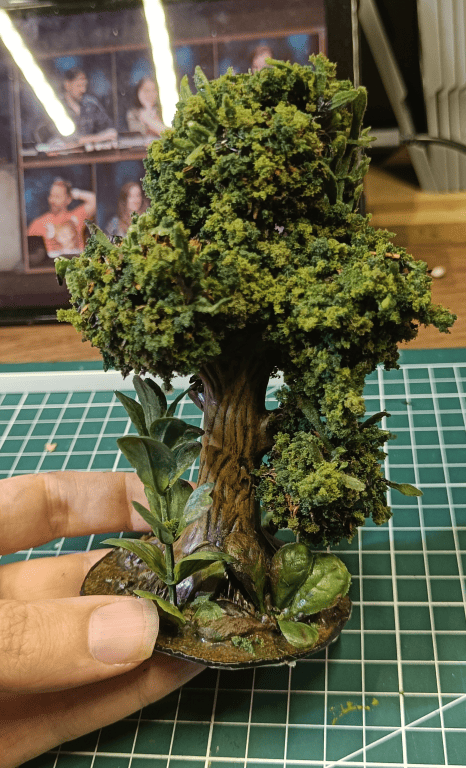
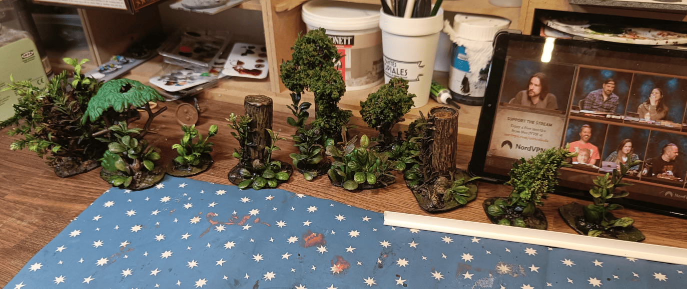
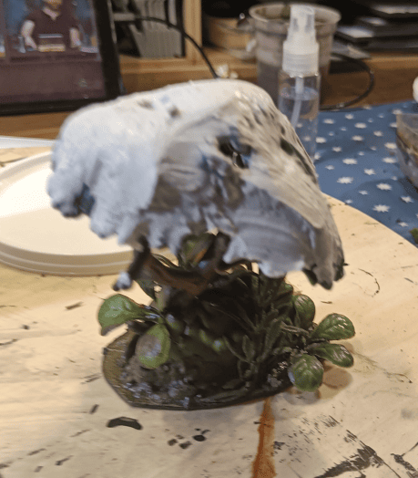
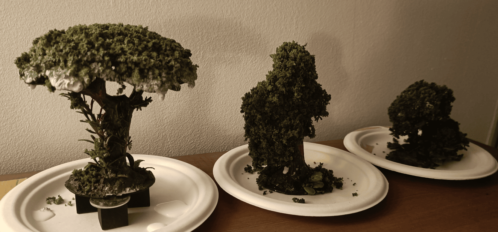

I had zero trees for terrain, so I started an adventure trying to make some with whatever materials I had on hand. Not sure what the best approach is, but I figured it'd be good to have some scatter terrain for forest scenes.

I ran a bunch of tests with different materials:
- Mobile trees I already had
- Various toy trees I recovered
- Aquarium toys and plants
- Real branches from outside
- Basically anything I could find

This is my documentation of what I tried, what worked well, and what flopped.

Here you can see I tried to glue some aquarium plants around different shapes. 

In the middle, the two white things are plastic tubes. I think they were originally tubes for texture rollers. I covered them with "bark" made with a hot glue gun, and glued different aquarium plants next to and on top of them.

My idea at that stage was to see if the plants, once painted, would look good enough, or if I'd need to cover them with additional textures.

I started painting the wood of the trunks and the ground. It wasn't super easy because I had to avoid painting the plants directly.

At this stage we have something that's not bad. The basic framework is a plastic toy on which I added bark myself with a glue gun and it looks good - the color is right, the base is good.

The issue is that the plastic plants are obviously plastic and they stand out from the rest. Even the canopy as it's made, you can tell it's plastic. I need to do a bit better than that.

Here, I started doing something interesting on another one of these trees. I actually started gluing flocking over all the visible areas on top. Here's the process I followed:

- Put loads of glue down
- Applied flocking over it
- Then reapplied a mixture of water, glue and flow aid so it absorbs completely and stays stuck

Working pretty well so far!

Here's a later progress shot. I also tried something interesting - applying extremely diluted black paint to the plastic plants to tone down their artificial look. 

I don't remember the exact details anymore (was it black ink? dark green ink? did I dip them or brush it on?), but I know it really helped. It softened that obvious plastic appearance and made the trees blend together much more naturally.

For applying flocking on large areas, what worked best for me was to completely cover the surface with spackling paste first, then press the flocking by hand on top so it has something to grip onto. After that, I spray it with water and glue. Super messy and gets everywhere, but the final effect really gives that nice mass of flocking look.

I tried gluing it directly onto plastic plants, thinking the branches going in different directions would create a more natural effect, but honestly it's even messier and not really worth it.

If I had to do it again, I'd take balls of aluminum foil, cover them with the texture, and flatten the flocking on top. The key is really the shape itself more than having it go in all different directions.