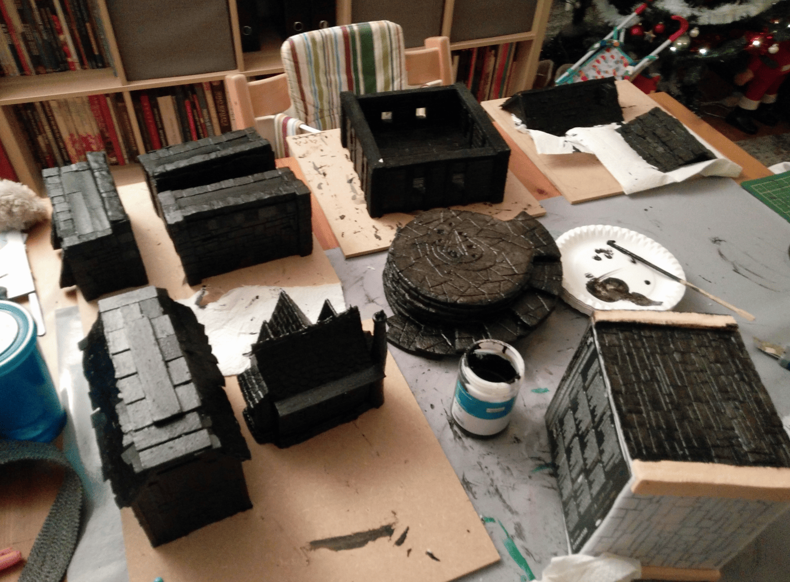
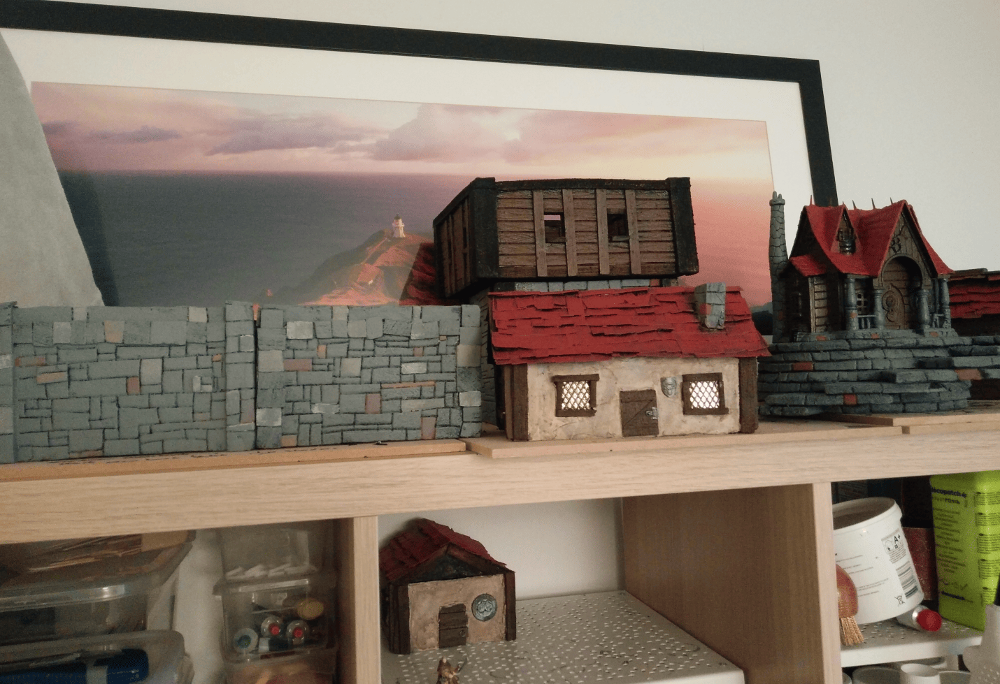
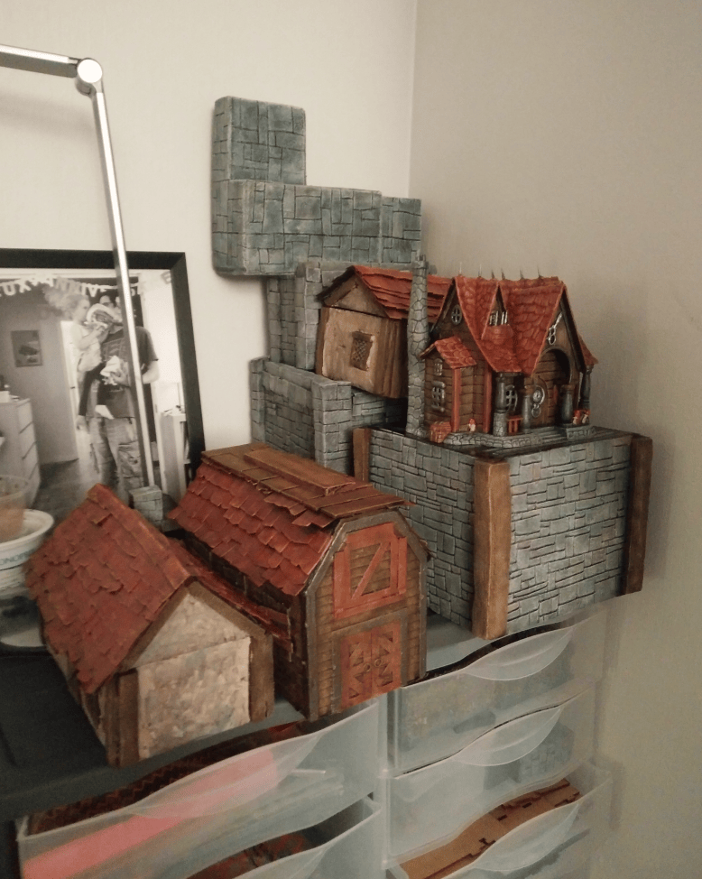
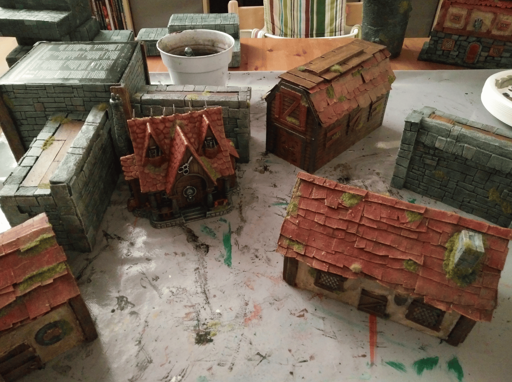
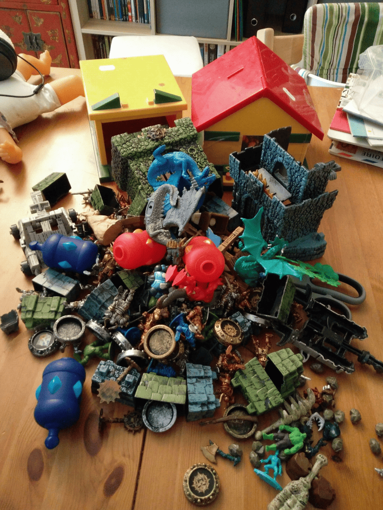
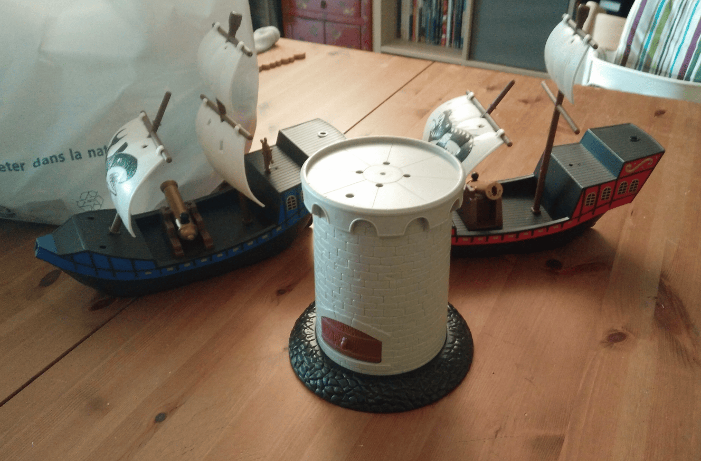
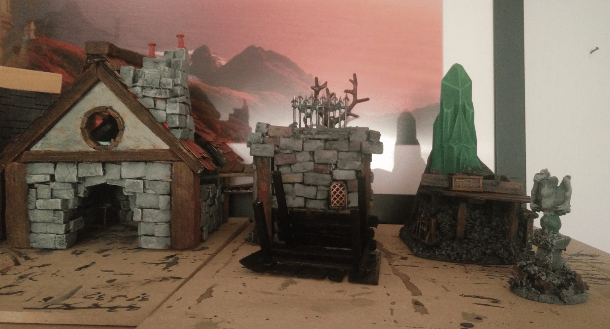
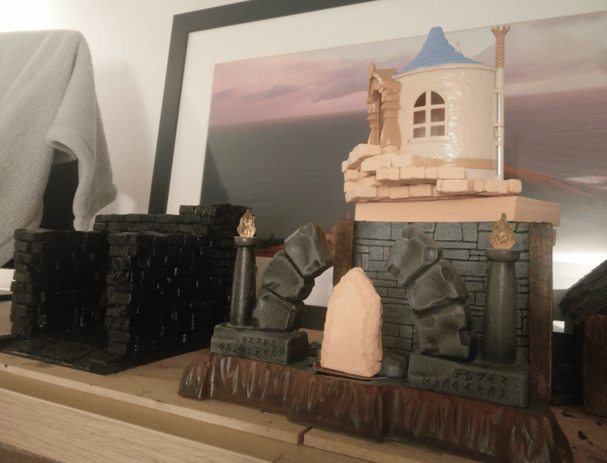
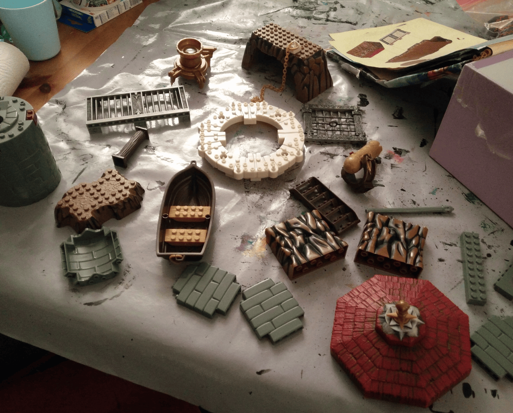
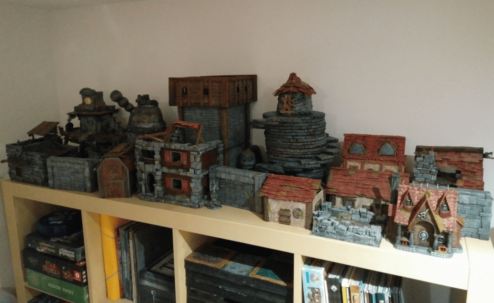

This post is going to be about some photos I took when I first started crafting. It was already a few years ago, back in 2021. I remember thinking at the time, "I've wanted to do this since I was a teenager, and now I'm finally going to do it for real." So I followed tutorials and started making stuff.

These are photos of the very first things I made. I was super proud of them back then, but honestly, they look a bit cheap to me today.

Here's my table from back then. I didn't really have a dedicated space, so I had to use the living room table. Every evening when I wanted to work on stuff, I'd put down a tablecloth and paint. I did everything in batches, so all the pieces I had built got batched with Mod Podge and black paint together.

Back when I first started with this hobby, I stored all my constructions in the living room. I had requisitioned some shelves and squares of our IKEA furniture to organize everything. I kept my things in boxes and took them out one by one to work on them, which was a lot of effort.

Once I finished with the projects, I would stack them in a corner of my desk (actually still in the living room corner). Now I finally have a dedicated workshop space for this, and it's so much more pleasant to work with.

During this time I discovered that flocking is actually a secret weapon for creating scenery. First, it helps fill in gaps and hide spots where we didn't do the work properly. But on top of that, just adding a bit of grass or a few leaves instantly gives an impression of scale and makes everything feel alive. The transformation between without flocking and with flocking was magical to me.

This is a bunch of stuff I picked at a yard sale! Let me tell you what I did with it all.

- Starting with the red-roofed house: honestly couldn't do much with it since it was already in pretty rough shape and didn't hold together well. Pretty sure I just ended up trashing it.
- The yellow-roofed house was actually a garage, and I turned that into a forge! Used the base and added a bunch of bricks around it. Came out pretty cool.
- All those dragon pieces you see? I reassembled them into complete dragons and painted them.
- For the green and blue building parts, I used one to make my necromancer tower. The other one is still sitting in a box waiting for a project.
- The blue and red cylindrical pieces became boilers and various other things.
- There are some figurines that I might have repainted. Everything else is still sitting in my bits box.

That all came from a board game. I recovered everything because the sculpt on the tower is really quite good, and it's already a tower without much effort. 

I recovered the boats thinking that one day I could use them as a framework to make my own boat myself, which has still never happened. I still have those pieces years later.

The thing is, I only do role playing games and not really wargaming, so having a tower isn't that useful. But I don't give up hope of one day finding a group to do wargaming and being able to use it.

Here are a few photos of work in progress projects. In the second photo, you can clearly see the black garage I mentioned earlier that I managed to transform into a forge. 

Then the house with the stairs running around it, I never ended up doing anything with it in the end. I'm even not sure if I kept the piece. 

And for the arch, I initially wanted to make a large scene with an arch and a menhir in the middle. I ended up just putting the two parts of the arch on individual bases and it's much more useful that way.

Here's a potentially useful set of pieces I recovered from a Megablocks game, I think. There are some things I have used to make bases, and others that I kept because I found the texture interesting.

And here is my complete collection of scenery at the end of 2021, when I moved into my new house where I had more space to display them.

