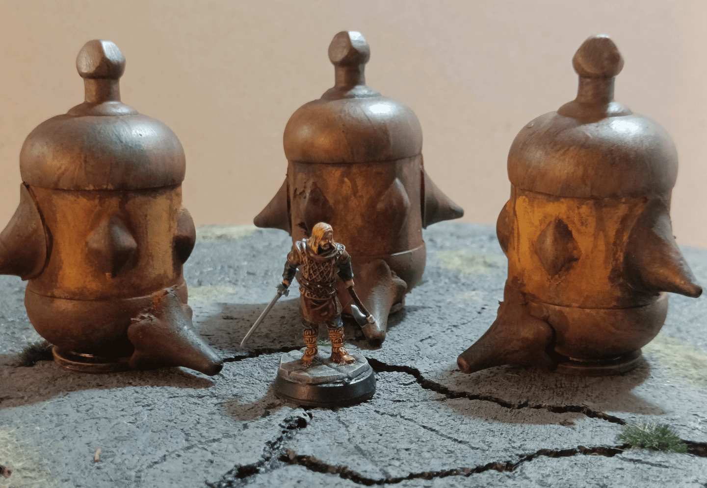
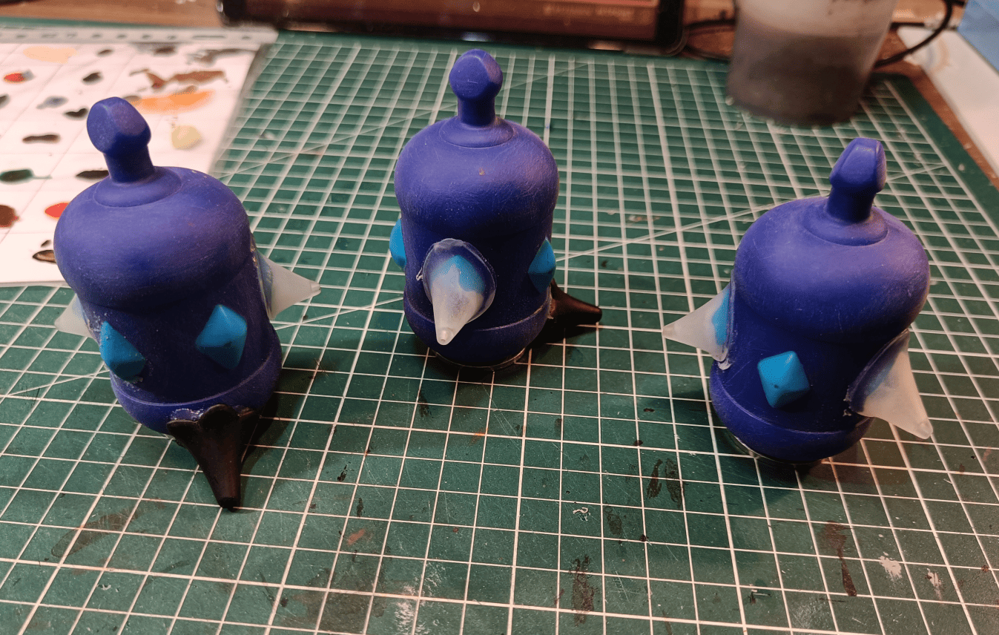
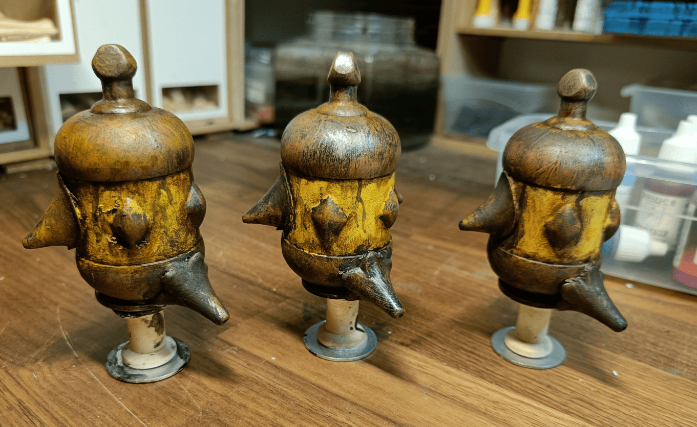
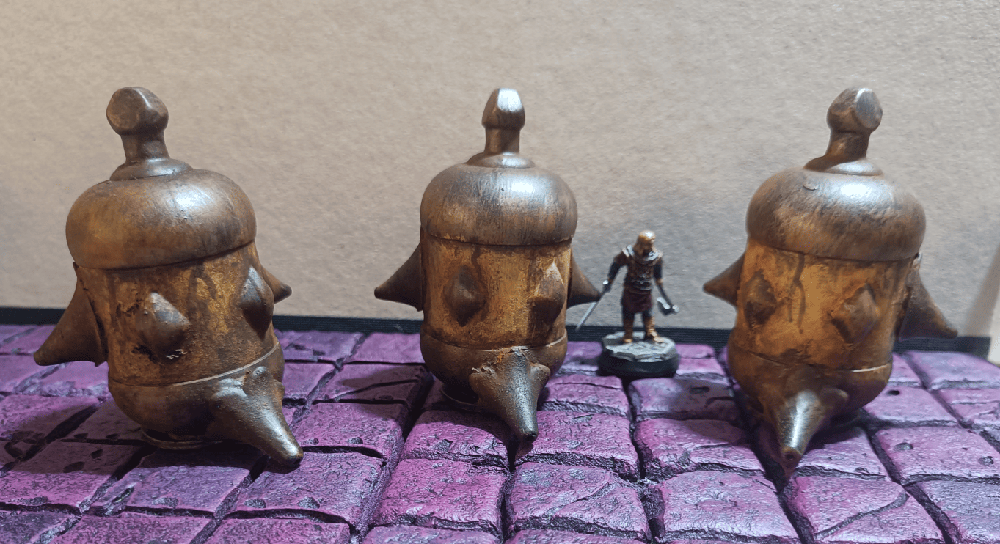
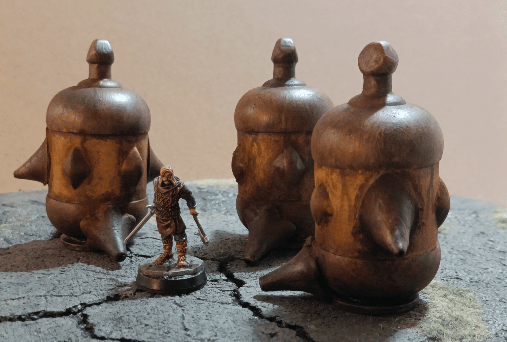
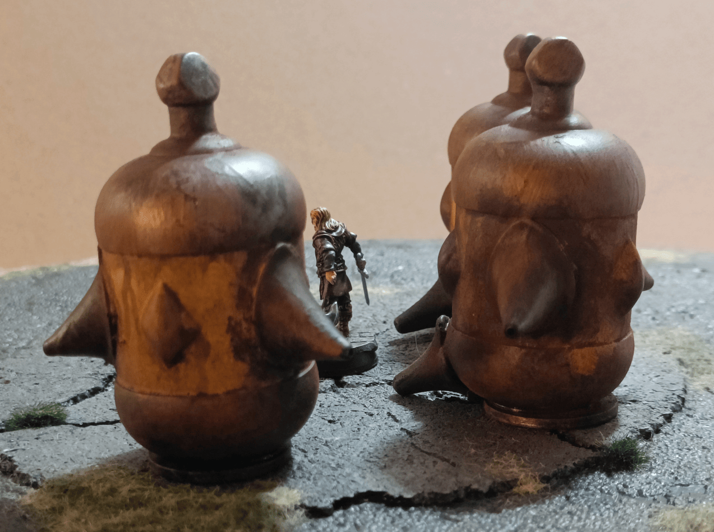
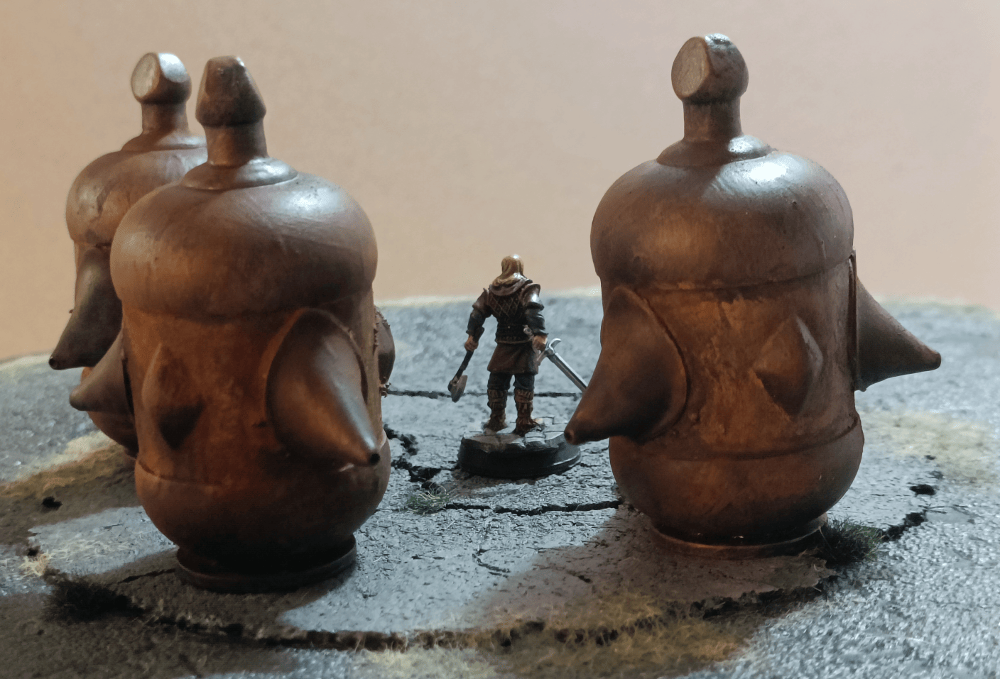
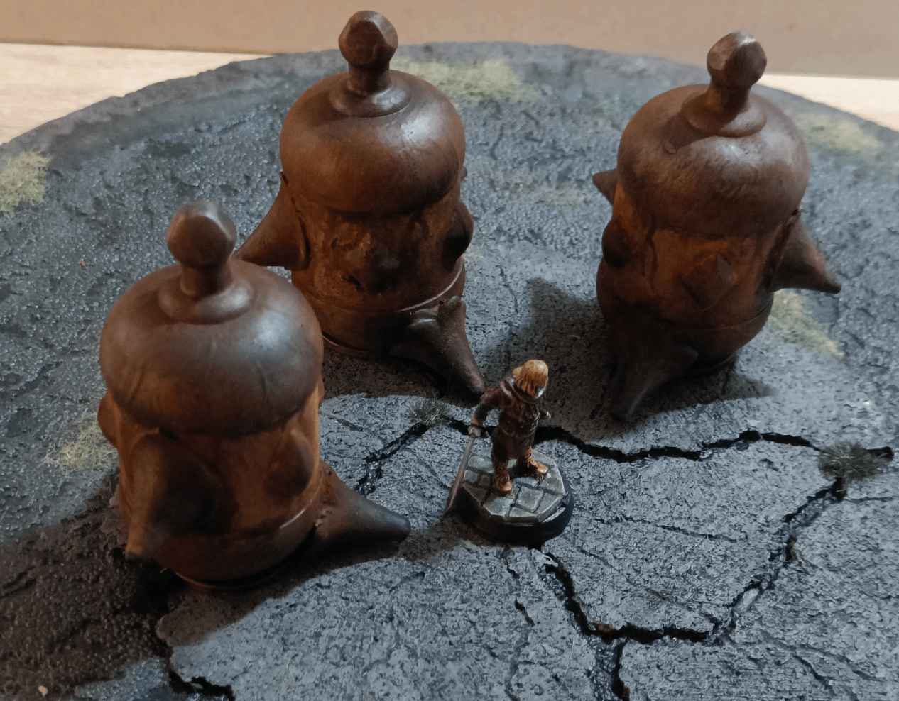

I've already posted articles on this blog about how I made different types of furnaces, like a large rectangular one and some other somewhat strange devices. I've made a few others too, and this is another attempt to document that process.

Not much to say really. The main structure is plastic baby toys, the kind that fit into each other and babies can chew on. They have an interesting shape though. I glued them onto heavy metal washers so they stand upright, then added plastic flower pieces on the edges and bottom to make them look like drainage pipes.

And here they are, the same ones after going through the painting process. I started with a black undercoat on everything, then did a metallic dry brush on the metal parts, and an orange dry brush on everything for that rusty look. 

After that I dabbed yellow paint on the parts where paint is supposed to be, but I deliberately didn't follow it perfectly. I think I also manually added a few rust lines with very diluted black paint, and finished with a thick brown wash over the top for that extra rusty effect.

And there you have it, my rusty baby toys!

