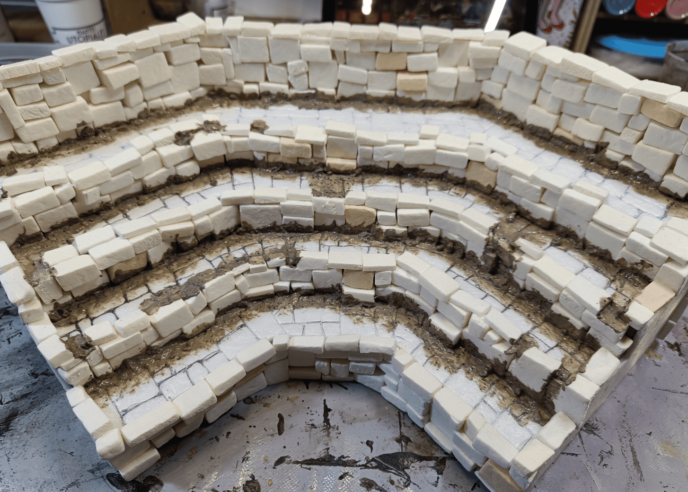
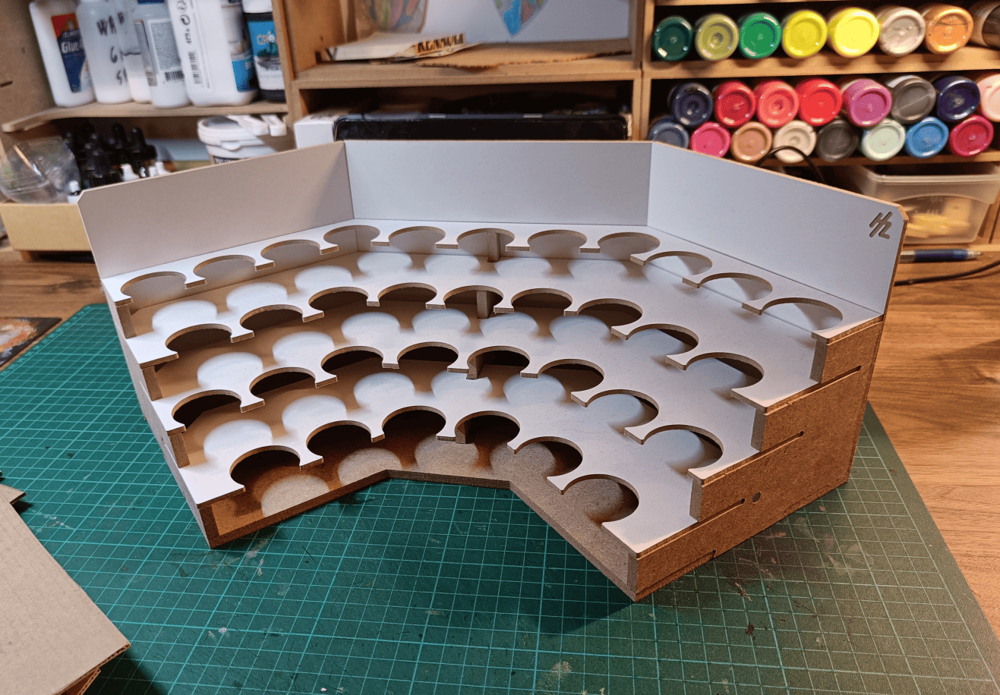
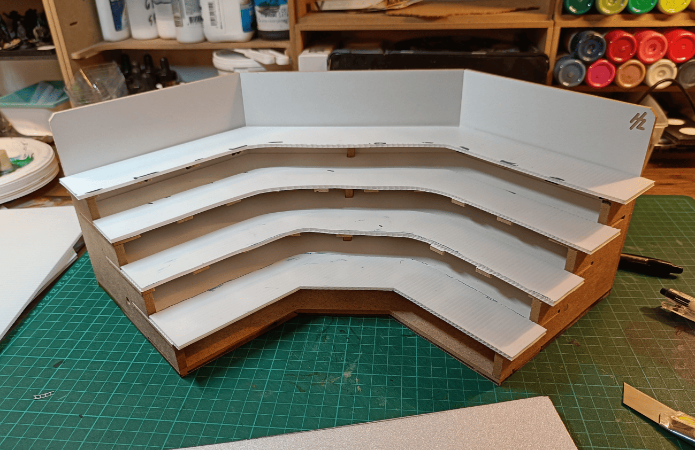
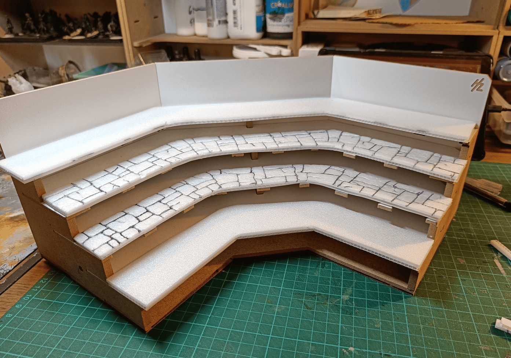
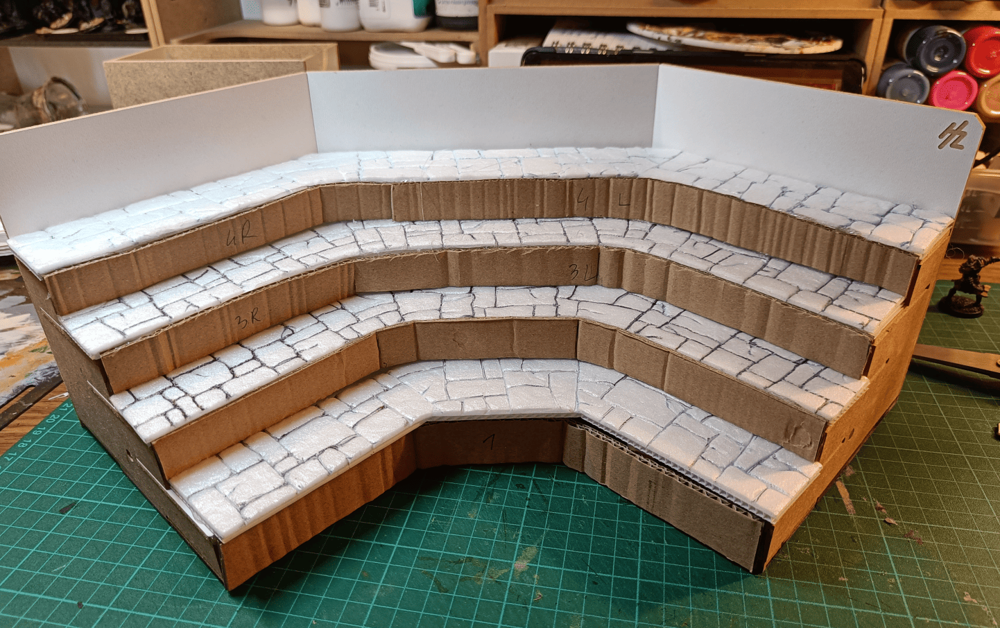
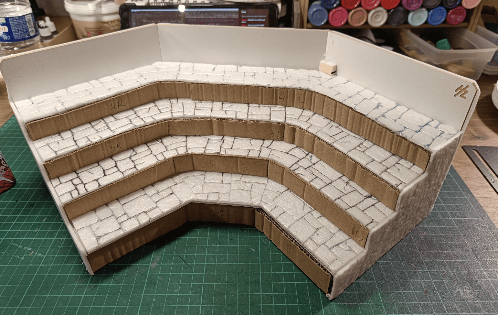
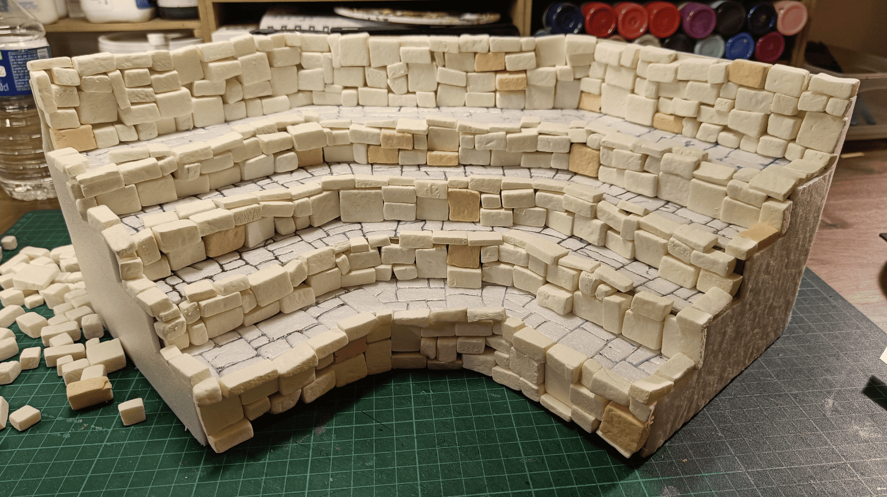

<!-- Image 1 -->

This is a project where I converted an old paint rack into tiered display stairs. The piece has been sitting in this state for about two years now. I never quite got around to finishing it completely. I don't have much space and no real place to display miniatures, which is why the project stalled. I've already done [a similar post with a smaller version](../paintRackStoneStairs/) of this concept. This post is a way to at least document the current state.

<!-- Image 2 -->

This is what it's supposed to look like normally, a paint rack. It can be quite handy if you have plenty of space and need to store lots of paints, but I have way more paints than that, and honestly this tiered design wasn't very useful for me. I prefer storing my paints in a drawer where I can see them all at once.

<!-- Image 3 -->

I cut strips of plastic. I think it's called plasticard, the kind of material used for making sale signs on houses. It's plastic, kind of like cardboard but made of plastic. I had some lying around, so I cut it up. It's quite lightweight and sturdy, and I used it to build the different tiers.

<!-- Image 4 -->

I covered each tier with a foam sheet cut to the exact same dimensions and started carving it using the usual technique for making stone texture.

<!-- Image 5 -->

I added cardboard to the front to block off the edges.

<!-- Image 6 -->

I also added foam to the sides to close it off completely and started building the walls with bricks.

<!-- Image 7 -->

The walls are finished. I glued all the bricks properly. The next step will be to fill in the gaps between the different bricks with spackle to make it more uniform. I haven't finished it yet, but I wanted to share where I'm at currently even though the project isn't completely done.

This project is still unfinished, but I wanted to share the work in progress anyway. I'll need to get back to it one of these days and actually finish what I started. Writing the blog post actually did motivate me to keep working on it.

