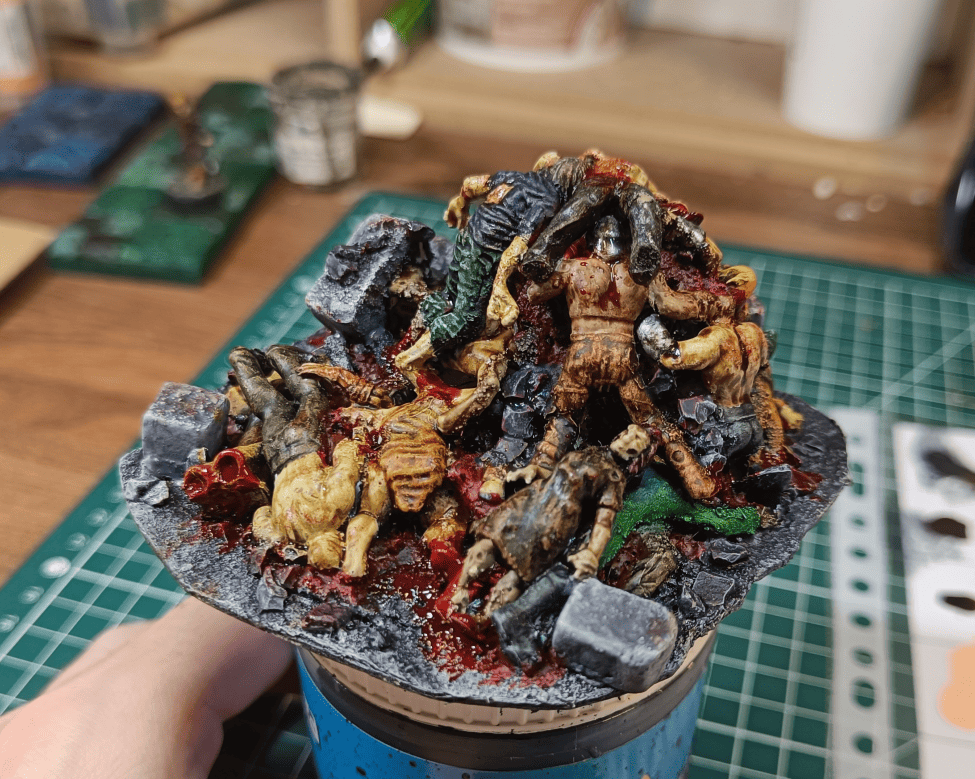
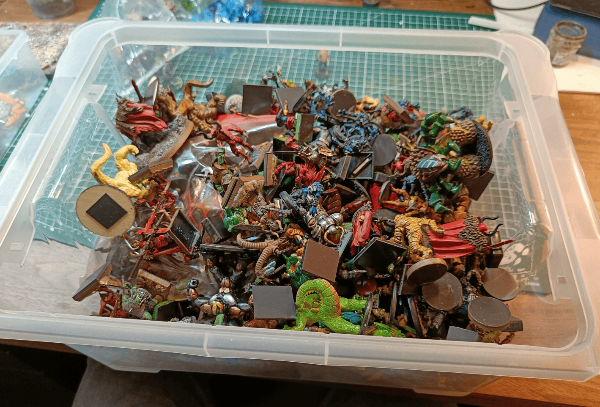
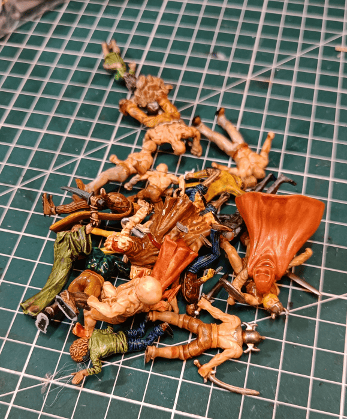
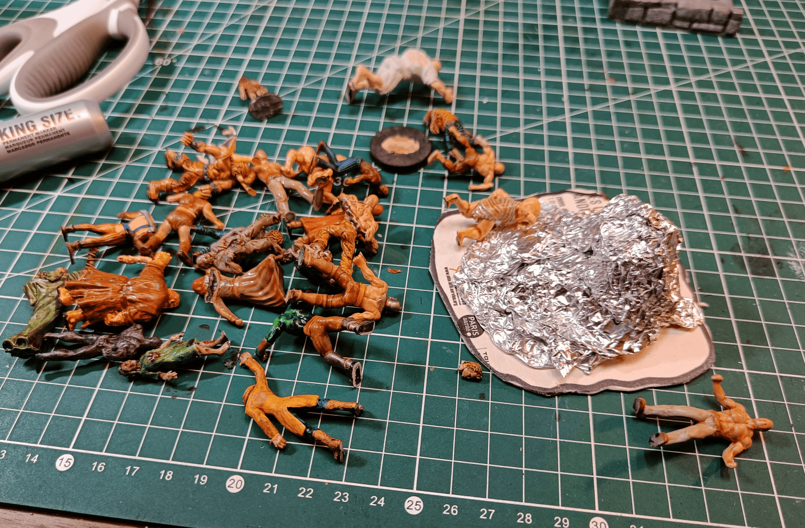
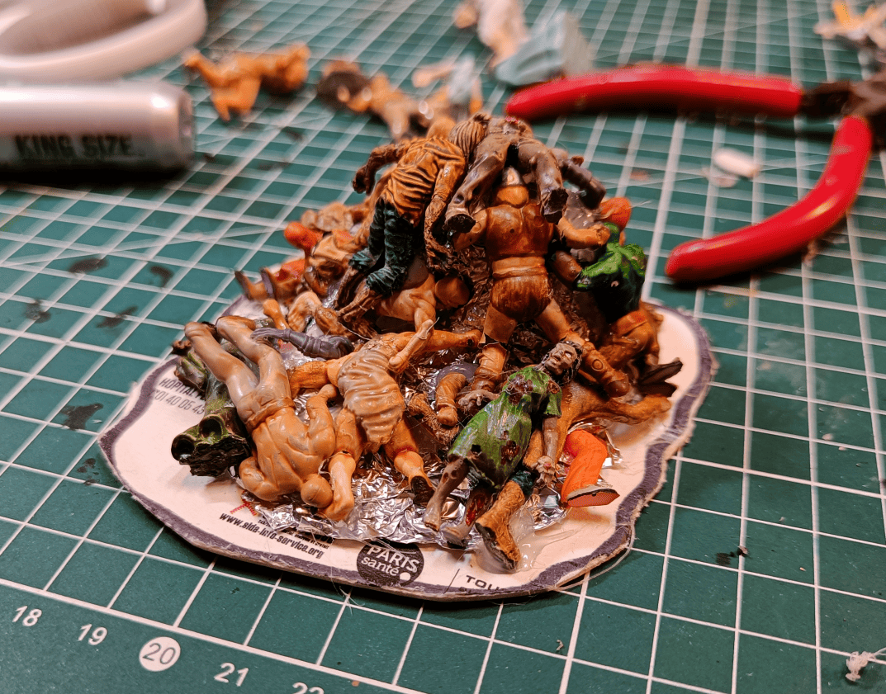
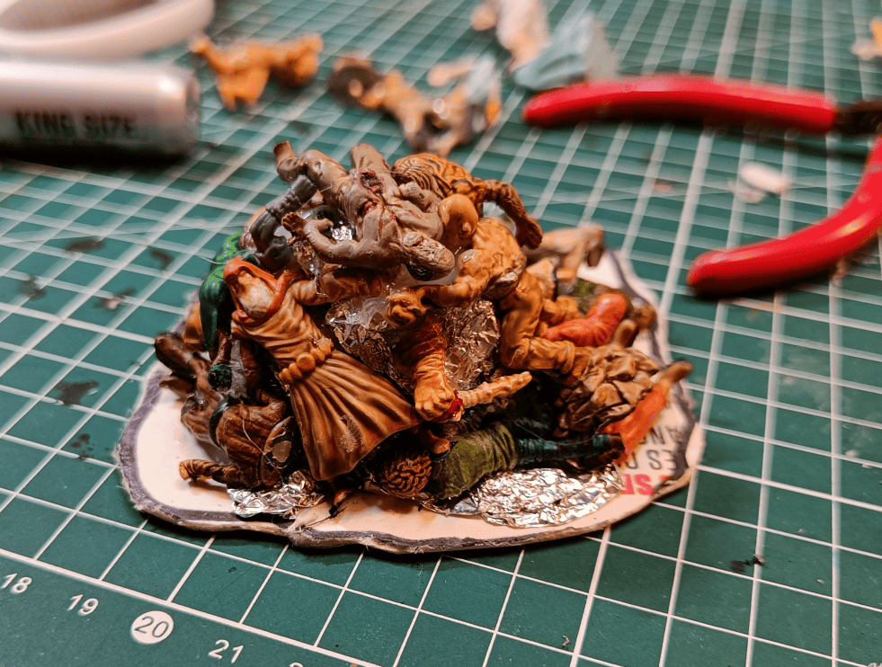
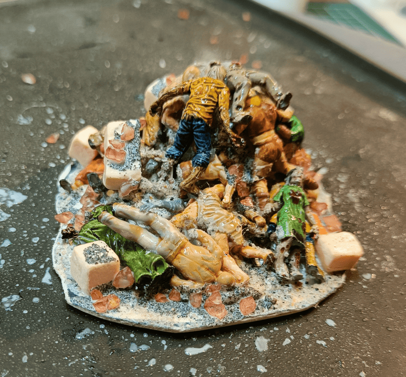
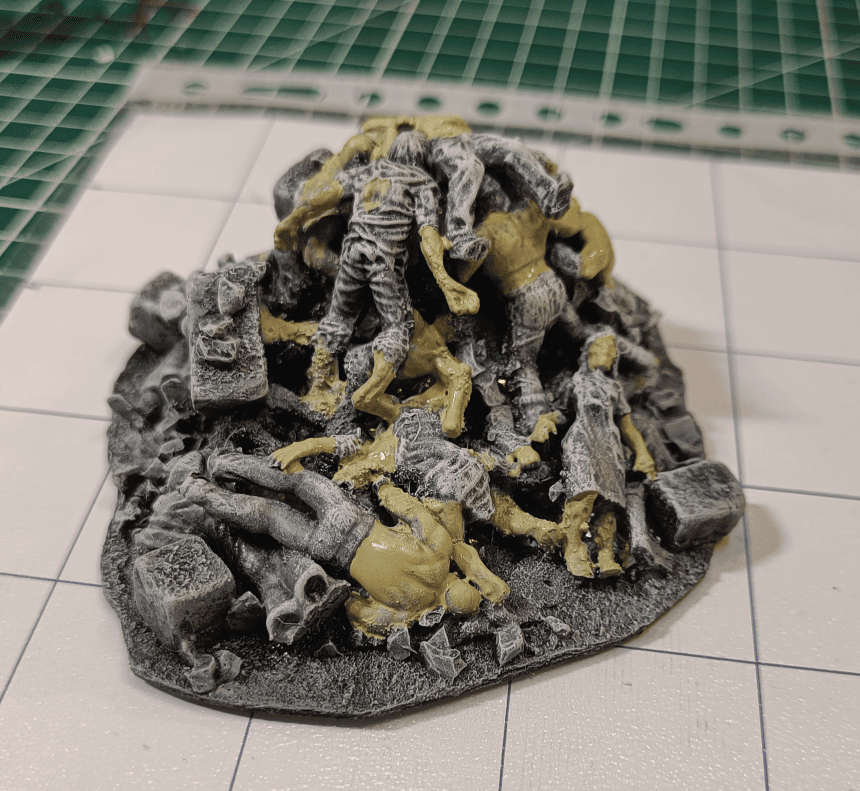
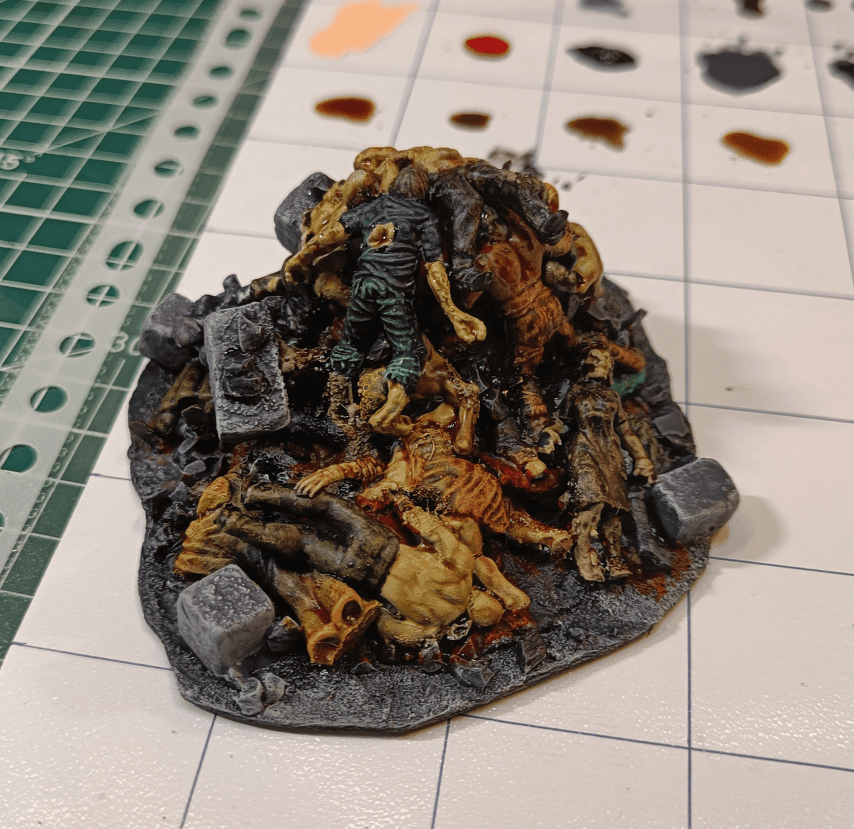
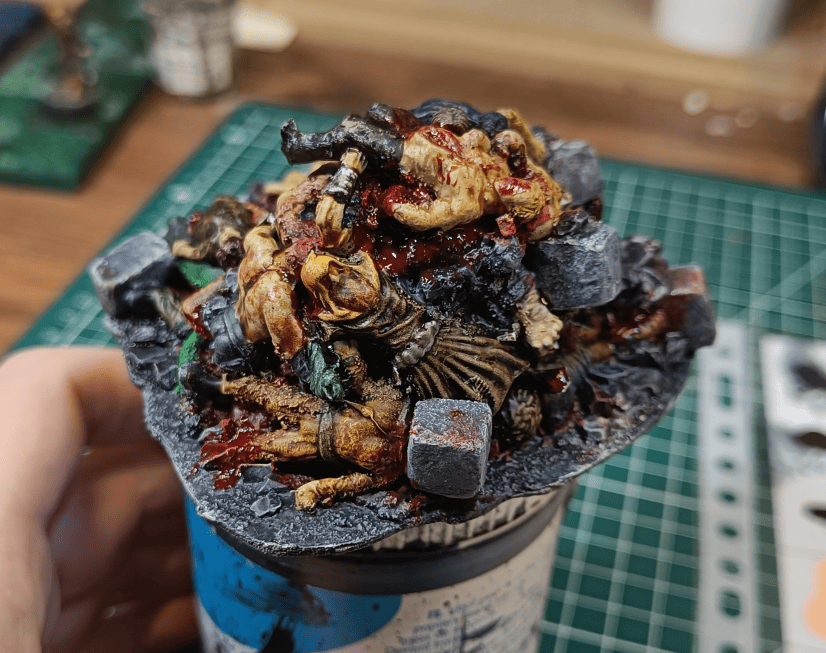

Here is one of the most disgusting terrains I've probably ever had to make, but it's for the introduction scene of the scenario in Briarstone.

The players have to climb a pile of corpses to be able to get out of the basement, and I wanted to make that element. So I gathered a bunch of old miniatures that I don't use and tried to make a pile out of them.

So I started digging through my pile of old useless miniatures. It's a mix of stuff I bought already painted at flea markets (which I don't really like since I prefer painting my own), things I painted myself ages ago, plastic miniatures like Heroclix with pretty rough sculpting, and random little plastic toys that might be the right scale but with ugly sculpts. I was looking to see if I could find enough pieces large enough to use and roughly the right scale.

And there you have it, that's what I managed to find. It's not a huge pile but I figured it would probably be enough for what I wanted to do.

To save on miniatures, I started making the majority of the pile with just a ball of aluminum foil and glued the miniatures on top. To get them to bend enough so they'd conform to the shape and not be too rigid, I used a hair dryer to heat the plastic. This let me twist the miniatures slightly before gluing them in place.

I cut off protruding arms and legs to keep the idea of a big shapeless mass of corpses, and then I glued those cut off pieces back in other places.

I added glue on the areas where there were no bodies and sprinkled sand and slightly larger pebbles. I added plenty of glue and water mixture on top to keep it all in place, and it helps show the impression of having a rockfall with bodies emerging from it.

I started with the flesh parts using Necrotic Flesh. For everything else, I'll be using speedpaints.

