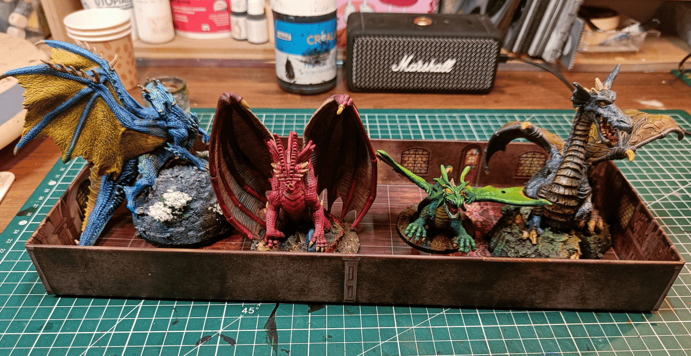
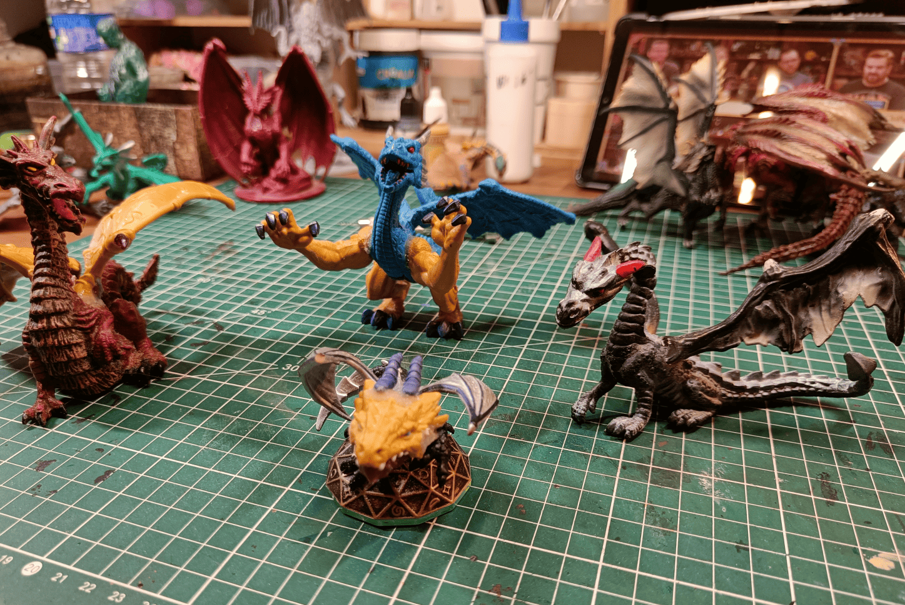
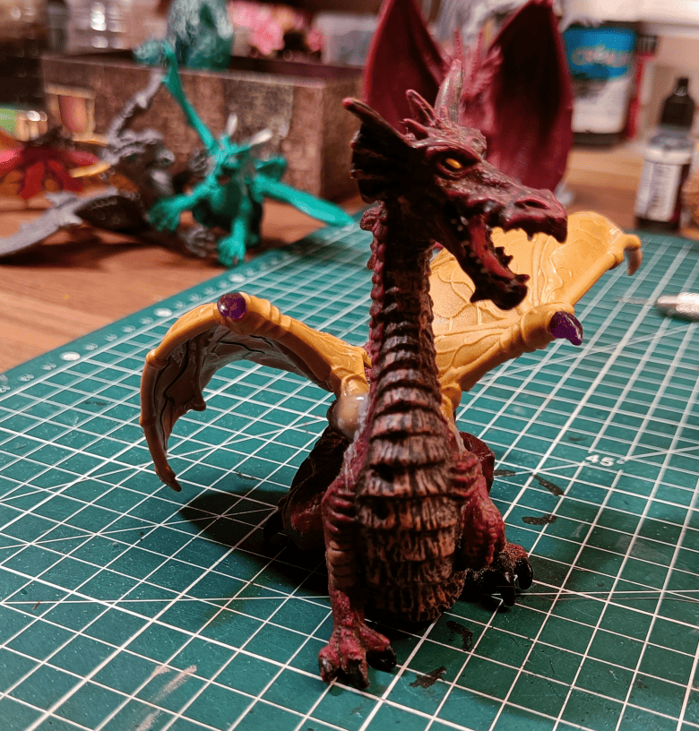
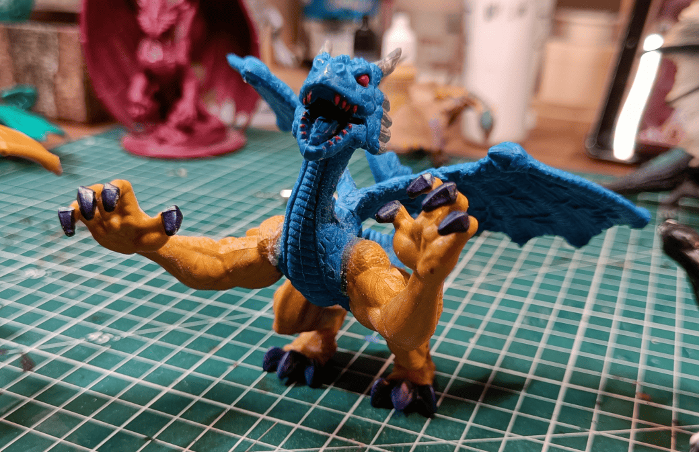
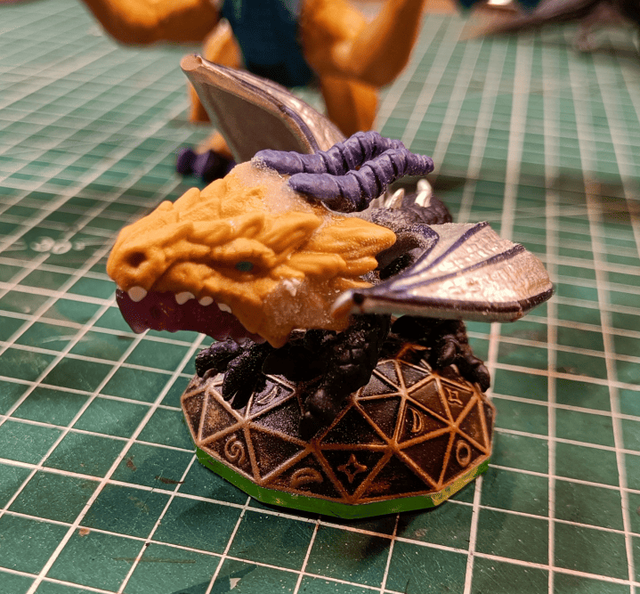
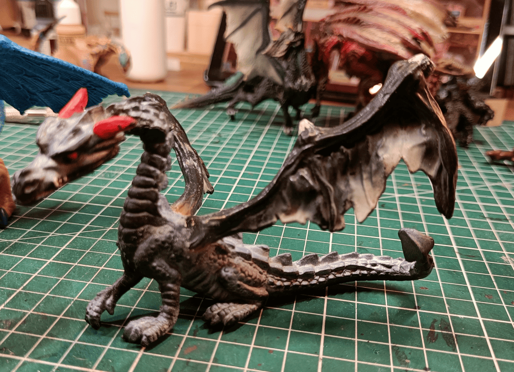
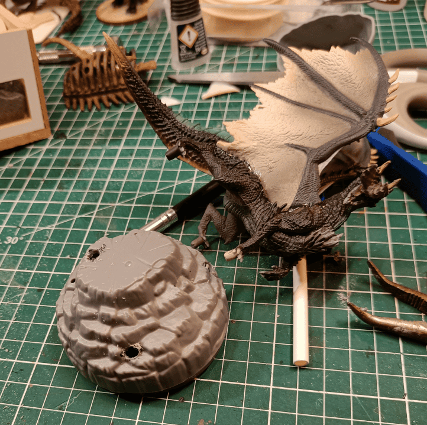
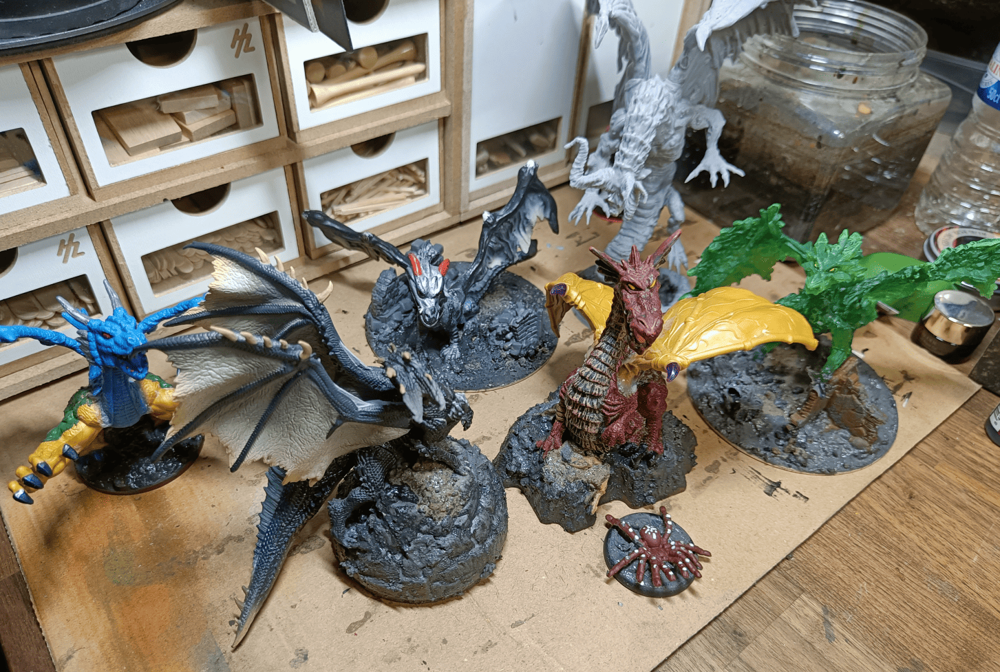
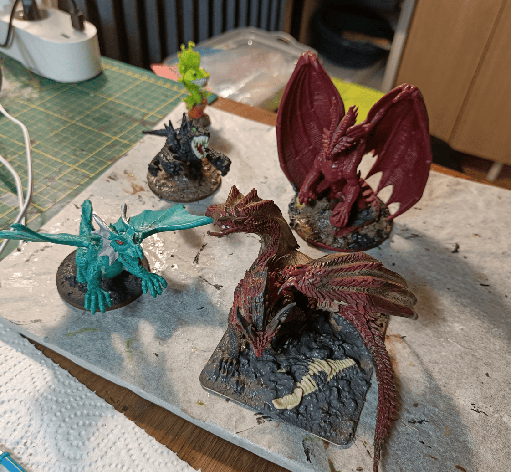
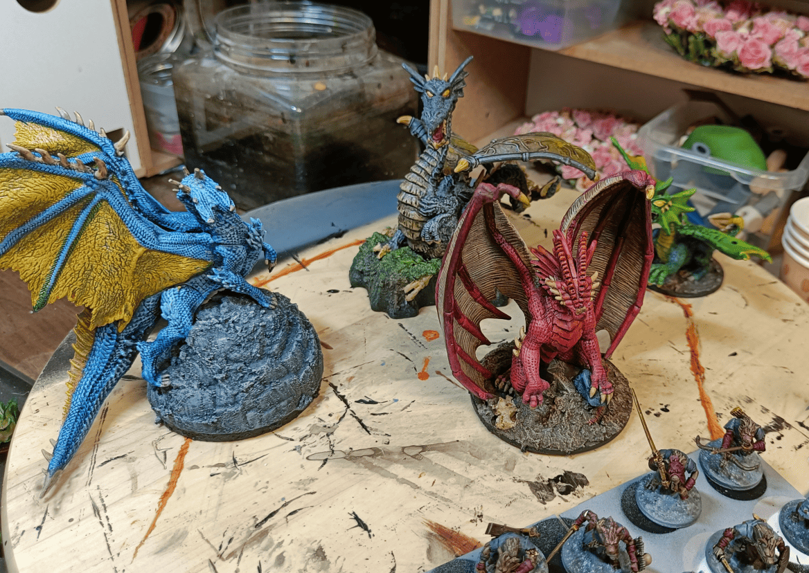

Quick documentation of a batch of dragons I once painted. I figured it would be good to have a dragon miniature of each color in case my players ever encounter one. 

To be honest, in over 10 years as a game master, I've never actually had my players face off against a dragon. But I still think it's such an iconic and mythical creature, so I wanted to try painting them according to the different color schemes that exist, and tell myself I have a miniature for each of the dragon types.

Collecting dragon figurines can get pretty expensive. Most of mine are actually secondhand. I usually find broken ones, missing a leg or wing or something, but after buying enough of them over time, I've accumulated spare parts to frankenstein together my own creations. Kind of like Sid from Toy Story.

The red dragon is apparently a pretty common plastic figurine (I've found more than one), but the wings are always broken. So I grabbed wings from another toy I found cheap at a junk store. It was a Lego knockoff where all the pieces come apart, so I salvaged the wings and glued them onto the poor red dragon.

The blue dragon you see in the middle had a similar fate. It was a toy that was missing the legs and I think it was missing an arm, so there too I glued arms and legs from the same fake Lego figurine that I had already used on the red dragon. It gives it a somewhat hyper-muscular look as a dragon. It's not my most successful creation. 

This one was originally a Skylander figurine, it was a Spyro the dragon figurine. I cut off Spyro's head because it was way too recognizable and way too cute and instead I glued on again the head of that dragon as a spare part.

Finally, the black dragon is a fairly cheap plastic dragon. It was complete but the wings looked really ugly so I think I cut them off. Instead, I glued on some shriveled wings that I had salvaged from another toy. I really like these because they have a look as if they were really old and damaged.

I also got this black dragon figurine from Monster Hunter in a really dynamic pose with excellent sculpt quality. I picked it up on AliExpress for pretty cheap, thinking I could easily mod it into something even better. Since the pose is so dynamic, I mounted it on a special plastic base I had that already has a mountain sculpted on it.

Here is a small family photo once the bases were made. There are a few others in the pile you can see in the background. There's a zombie dragon that comes from the Zombicide board game that I've had for a long time, and I thought it would be a good opportunity to paint it too. 

The green dragon on the side is actually an emerald dragon. The sculpture is really cool because there are actually pieces of emerald pretty much everywhere. I mounted it on a base where I wanted to make it look like it was walking on a partially destroyed city.

A few others. The Green Dragon is a recovered toy. I didn't make too many modifications on it. I just glued the arms in a fixed position because otherwise they could move.

The mini tarrasque in the back, I don't remember where it comes from, but same, it's a cheap little plastic toy. The red dragon in the back comes from the Dungeons and Dragons board game, and the one in front is a Monster Hunter figurine.

As you can see, I totally went off the original colors! The blue one was my black dragon from Monster Hunter, but I really love the blue and yellow contrast, it looks amazing.

The black dragon in the back was originally red. It's the one that was missing wings and where I glued new ones on. With the slightly greenish base, it looks like it comes from a swamp, which I really like. Very thematic for a Black Dragon.

The red dragon from the Dungeon & Dragons board game, I stuck with the traditional red color and it works really well.

And then there's the little plastic toy that I turned into a green dragon. 

Everything was painted with speedpaints. They're incredible for transforming cheap plastic toys into something that looks impressive on the table or building a nice collection of dragon miniatures.

