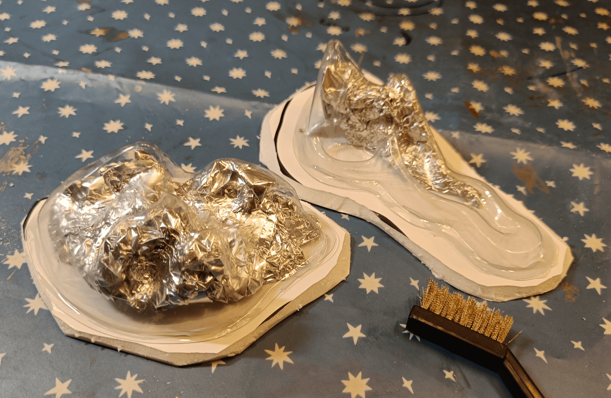
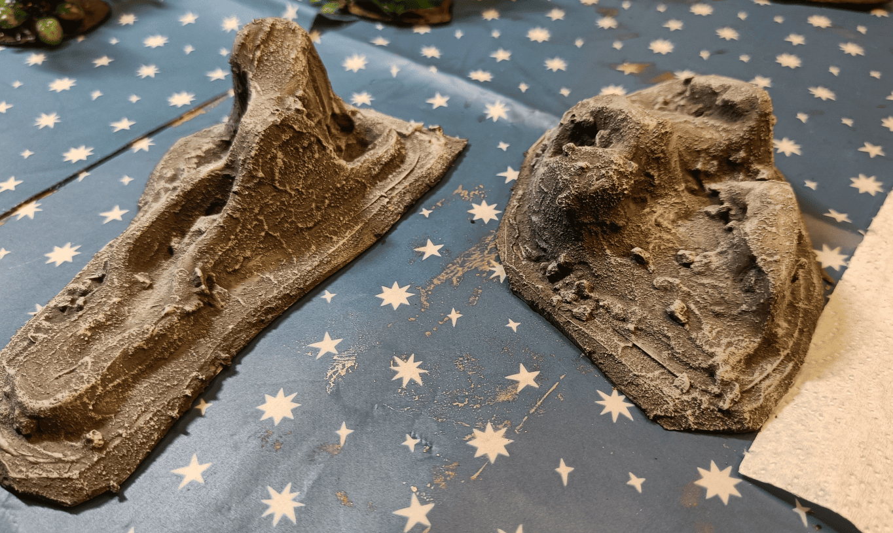
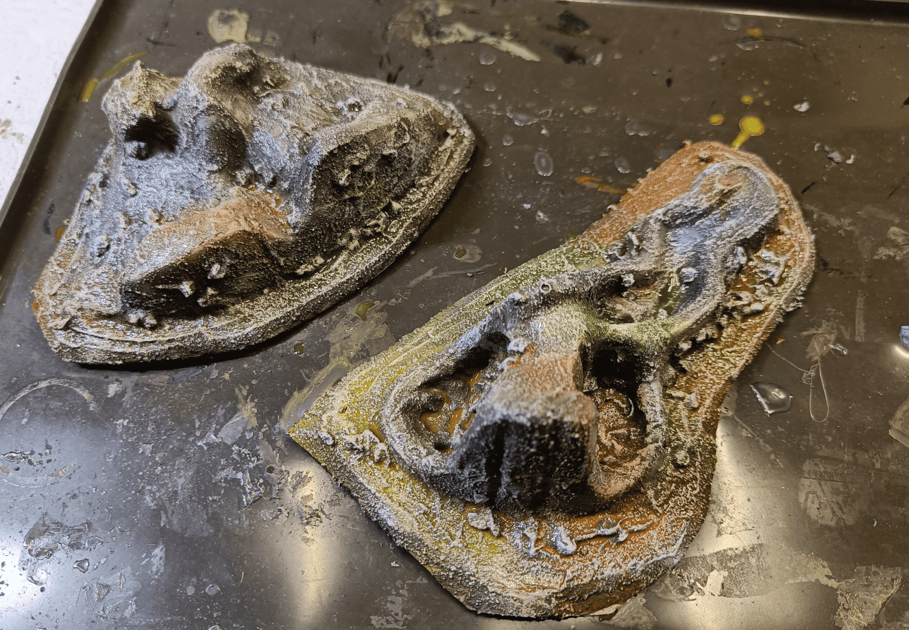
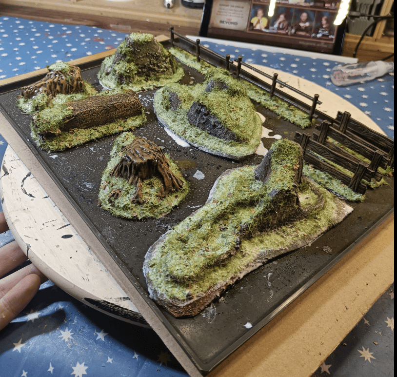

I wanted to make some rock formation scatter terrain, and I had this idea. I could use those small pieces of plastic from some packaging I saved. I don't even remember what I ordered, but the shapes were pretty interesting, kind of irregular and going in all directions. So I figured, why not use those as a base and turn them into rocks?

And there you have it! This is what it looks like once you've added a bit of filling compound on top, mixed with a few pebbles, and applied a light dry brush over it. It's starting to look like rock formations.

I applied different colored inks on top to add some color variation to the rock underneath. Rocks in nature are never completely gray, so I used organic colors like brown and green, plus a bit of yellow and blue to break up the monotony.

Here they are drying with a few other scenery pieces I made along the way. I added plenty of flocking on top and completely soaked them with water mixed with paint and flow aid. 

The flow aid helps everything absorb well everywhere, and when it dries, everything will be stuck on properly. My flocking won't come off.