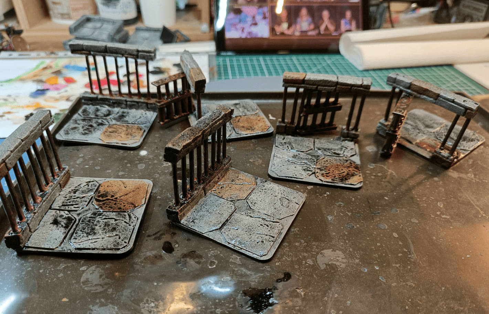
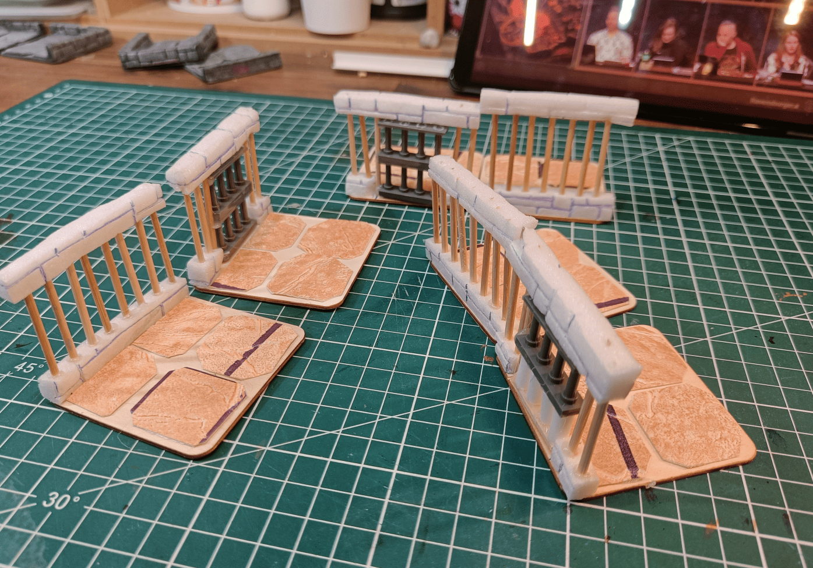
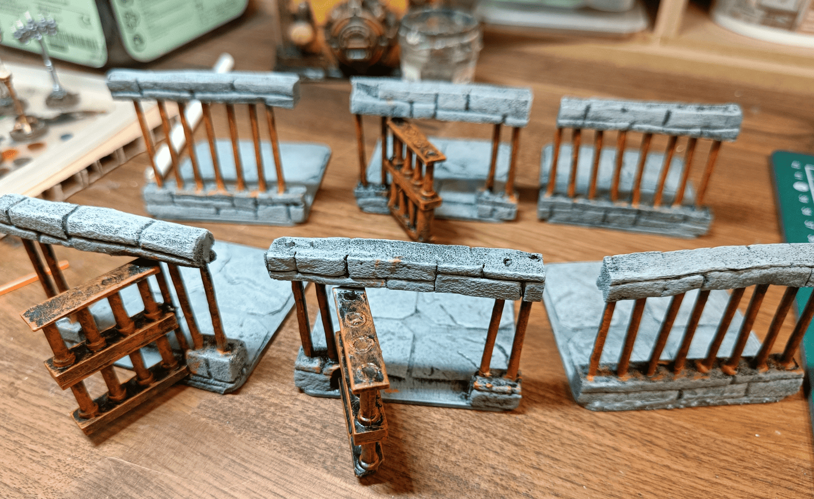

Once again, for my scenario in the asylum where the character starts locked in prisons in the basement, I obviously needed prisons for that. At that time, I thought doing everything with tiles was a good idea so I followed that format, I made tiles that contain prison bars.

In hindsight, I realize they're not the easiest things to work with. I'd prefer now to just have a wall prop with bars that I can position wherever I want. That's not what I did though. I integrated them directly onto the tile and we'll see how I made that.

Here's what the foundation looks like. The structure is made of square wood pieces that I ordered by the hundreds on Aliexpress. The advantage is they all have exactly the same dimensions, so I don't have to worry about measuring, and it lets me make tiles where each square is 3cm x 3cm.

On top, I'm using textured wallpaper that I cut into squares and glue down. For the bars themselves, I take a strip of polystyrene, stick toothpicks into it, and put another strip of polystyrene on top.

Some of them have working doors. You can see the gray ones are actually made with Lego pieces stacked on each other. I trimmed off the little studs on top and only glued them on one side to one of the toothpicks, so the door can actually open.

And there you have it! After a first coat of classic stone paint on the floor and on the top and bottom of the bars, and rust made with orange on the bars themselves.