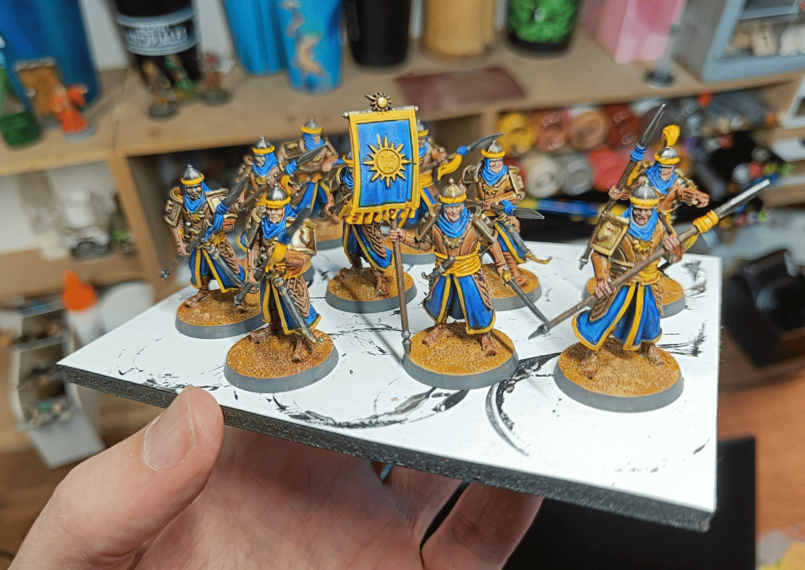
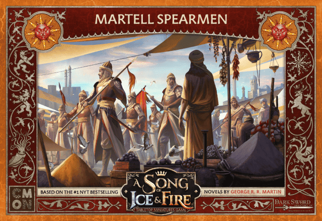
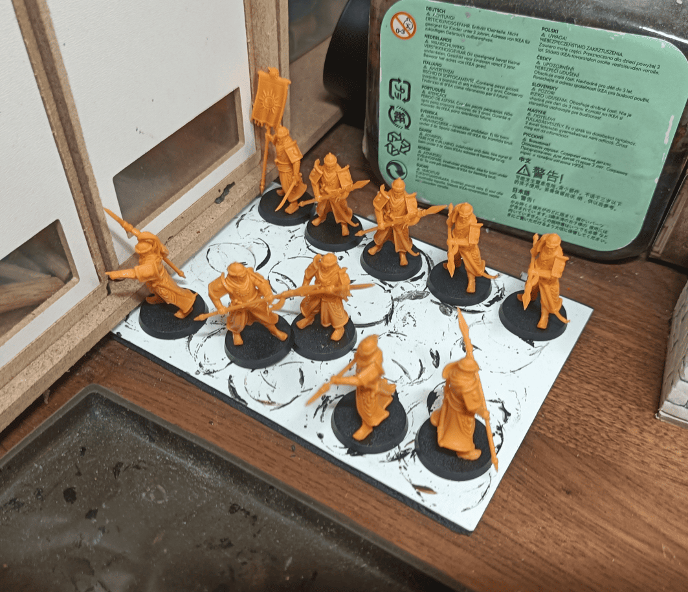
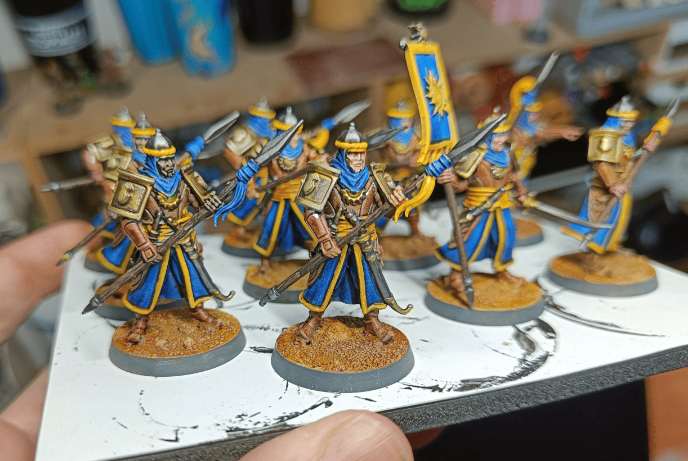
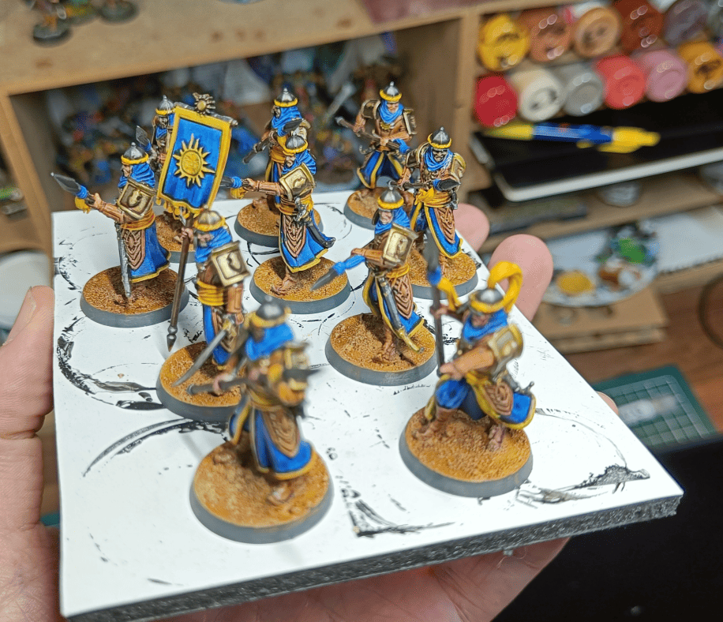

<!-- Image 1 -->

This post is about Qadira guards, from the fictional nation in the Pathfinder universe where my players currently are. 

<!-- Image 2 -->

This is what I used as base miniature. They come from the A Song of Ice and Fire battle game, technically the Martell Spearmen.

<!-- Image 3 -->

Here's what the miniature look like. I didn't use all the miniature from the box, there are even more than this, but I figured having 10 was enough. No point painting too many if I wasn't going to use them.

<!-- Image 4 -->

Here's what it looks like once the painting is done. What I did on these was go really fast, [using Speedpaint markers like with my devils](../devils/). I used strong colors since they're kind of the good guys in my campaign. Since they're quite connected to Sarenrae in the universe, I used her colors: blue and yellow. I used a Speedpaint marker for the blue, for all the leather, for the weapon handles, and to do black initially everywhere I was going to paint metal.

<!-- Image 5 -->

For all the yellow parts, I started by highlighting with a yellow AK marker for flat color, then added Ancient Honey Speedpaint on top, which gives that slightly orange tone and settles nicely into the recesses. Then I used metallic Speedpaint for their armor, and a metallic pen for details on their armor elements. 

Only at the end did I apply Nuln Oil on all the metal pieces. I think it took me two evenings to paint all this, maybe even just one. This Speedpaint and markers technique works really well. It's not an extraordinary paint job, I wouldn't win any competitions with this, but on the game table, I think it looks good. At least, teenage me would have been proud to have an army with miniature painted this well.

